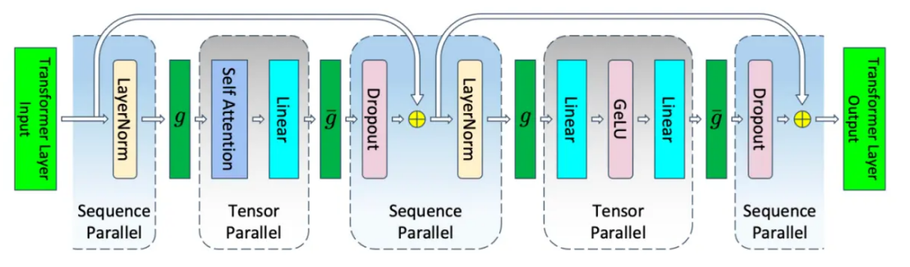
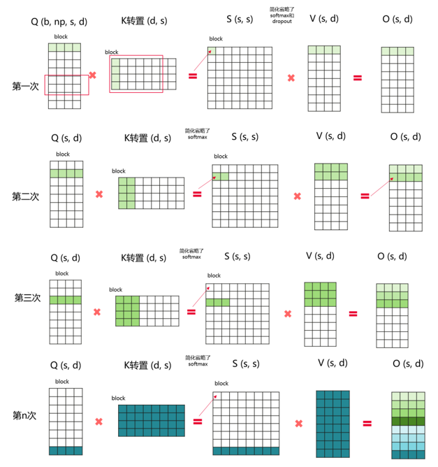
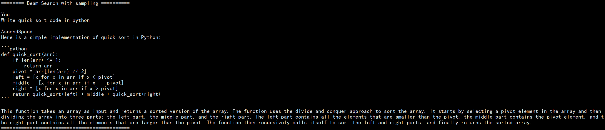

# <center> <font face="黑体" size=10 > <u> *AscendSpeed* </u> </font> </center>

AscendSpeed provides end-to-end test scripts for large language models on [Ascend](https://open.codehub.huawei.com/OpenBaize/Ascend/ascendspeed/files?ref=master&filePath=examples%2Fbaichuan%2Fpretrain_baichuan_zero_7B.sh&isFile=true) chips, including pretrained models, parallel algorithms, fused kernels, and downstream tasks. The repository is jointly contributed by Ascend Computing Product Unit, Algorithm Unit, Research Unit, and OCK of Huawei Corporation.

## Why AscendSpeed? 

---
### Prepared Models
Currently, the pre-training of the following models has been supported: 

* <a href="https://github.com/baichuan-inc" style="color:green">Baichuan</a>-[[README: 7B/13B]](examples/baichuan/README.md)
* <a href="https://arxiv.org/pdf/2108.12409.pdf" style="color:green">Bloom</a>-[[README: 7B/176B]](examples/bloom/README.md)
* <a href="https://internlm.intern-ai.org.cn/" style="color:green">InternLM</a>-[[README: 7B]](examples/intern/README.md)
* <a href="https://huggingface.co/docs/transformers/main/model_doc/llama" style="color:green">LLaMA</a>-[[README: 7B/13B/65B]](examples/llama/README.md)
* <a href="https://huggingface.co/docs/transformers/main/model_doc/llama2" style="color:green">LLaMA2</a>-[[README: 7B]](examples/llama2/README.md)

LLaMA-33B, LLaMA2-13B/70B, Aquila-7B are coming soon ...

### Acceleration Features
Currently, the following acceleration features for LLMs have been supported:


* [Tensor parallelism](#jump1)
* [Pipeline parallelism](#jump2)
* [Virtual pipeline parallelism](#jump2)
* [Optimized pipeline parallelism](#jump2)
* [Fold-3D](#jump3)
* [Recomputation](#jump4)
* [Selective recomputation](#jump4)
* [Sequence parallelism](#jump5)
* [ZeRO-1/2/3](#jump6)
* [Inverted triangle acceleration](#jump7)
* [Fused kernels and optimizers for LLMs](#jump8)
* [Merged feed-forward network](#jump9)
* [Gradient accumulation](#jump9)

More novel and useful features are developing for LLMs training on Ascend ...

### Downstream Tasks
Currently, the following downstream tasks have been supported:
* [Data-processing](#jump11)
* [Fine-tuning](#jump12)
* [Inference](#jump13)
* [Evaluation](#jump14)

The plan for more tasks, like RLHF, is under way ...


## Quick Start For Pretraining

---

### Model Performance
<table>
  <thead>
    <tr>
      <th>Model</th>
      <th>Size</th>
      <th>Servers</th>
      <th>Mode</th>
      <th>NPU Throughput</th>
      <th>Reference Throughput</th>
      <th>Loss Compare</th>
      <th>Scripts</th>
    </tr>
  </thead>
  <tbody>
    <tr>
      <td rowspan="2">Baichaun</td>
      <td>7B</td>
      <td> 1x8</td>
      <td> FP16 </td>
      <td> 1914 tokens/p/s </td>
      <td> 2068 tokens/p/s </td>
      <td> <a href="./sources/images/baichuan/7B_loss_compare.png">Loss</a> </td>
      <td> <a href="examples/baichuan/pretrain_baichuan_zero_7B.sh">Train</a> </td>
    </tr>
    <tr>
      <td>13B</td>
      <td> 1x8</td>
      <td> FP16 </td>
      <td> 1024 tokens/p/s </td>
      <td> 824 tokens/p/s </td>
      <td> <a href="./sources/images/baichuan/13B-loss-compare.png">Loss</a> </td>
      <td> <a href="examples/baichuan/pretrain_baichuan_ptd_13B.sh">Train</a> </td>
    </tr>
    <tr>
      <td rowspan="2"><a href="examples/bloom/README.md">Bloom</a></td>
      <td>7B1</td>
      <td> 1x8</td>
      <td> FP16 </td>
      <td> 2611 tokens/p/s </td>
      <td> 2525 tokens/p/s </td>
      <td>  <a href="sources/images/bloom7B1_loss.png">Loss</a> </td>
      <td> <a href="examples/bloom/pretrain_bloom_7b1.sh">Train</a> </td>
    </tr>
    <tr>
      <td >176B</td>
      <td >12x8</td>
      <td> BF16 </td>
      <td> 100 tokens/p/s </td>
      <td> 107 tokens/p/s </td>
      <td> <a href="examples/bloom/images/bloom176b_lm_loss_compare.PNG">Loss</a> </td>
      <td> <a href="examples/bloom/pretrain_bloom_176b.sh">Train</a> </td>
    </tr>
    <tr>
      <td><a href="examples/intern/README.md">InternLM</td>
      <td>7B</td>
      <td>1x8</td>
      <td>FP16</td>
      <td> 2777 tokens/p/s </td>
      <td> 2800 tokens/p/s </td>
      <td>  <a href="sources/images/intern7b_loss.png">Loss</a>  </td>
      <td> <a href="examples/intern/pretrain_internlm_7b_zero.sh">Train</a> </td>
    </tr>
    <tr>
      <td rowspan="4"><a href="examples/llama/README.md">LLaMA</td>
      <td>7B</td>
      <td>1x8</td>
      <td>FP16</td>
      <td> 2862 tokens/p/s </td>
      <td> 2859 tokens/p/s </td>
      <td> <a href="sources/images/llama7b_loss.png">Loss</a> </td>
      <td> <a href="examples/llama/pretrain_llama_7B_zero_8p.sh">Train</a> </td>
    </tr>
    <tr>
      <td>13B</td>
      <td>1x8</td>
      <td>FP16</td>
      <td> 1800 tokens/p/s </td>
      <td> 1734 tokens/p/s </td>
      <td> <a href="sources/images/llama13b_loss.png">Loss</a> </td>
      <td> <a href="examples/llama/pretrain_llama_13B_zero_8p.sh">Train</a> </td>
    </tr>
    <tr>
      <td rowspan="2">65B</td>
      <td rowspan="2">4x8</td>
    </tr>
    <tr>
      <td>BF16 </td>
      <td> 234 tokens/p/s </td>
      <td> 260 tokens/p/s </td>
      <td> <a href="sources/images/llama65b_bf_loss.png">Loss</a> </td>
      <td> <a href="examples/llama/pretrain_llama_65B_ptd_32p.sh">Train</a> </td>
    </tr>
    <tr>
      <td><a href="examples/llama2/README.md">LLaMA2</td>
      <td>7B</td>
      <td>1x8</td>
      <td>FP16 </td>
      <td> 2460 tokens/p/s </td>
      <td> 2348 tokens/p/s </td>
      <td> <a href="sources/images/llama2/llama2_7b_shape_fp16_layer32_loss_with_weights.png">Loss</a> </td>
      <td> <a href="examples/llama2/pretrain_llama2_7b_zero_8p.sh">Train</a> </td>
    </tr>
  </tbody>
</table>


### Model Training
This is an example of model training with AscendSpeed, and the detailed guideline for each model could be found in the `examples/modelname` folder.
Note that we use AscendSpeed with scripts currently, and would not provide `.whl` package for public 

1. Clone the repository to your local server:

```bash
git clone https://gitee.com/ascend/AscendSpeed.git 
cd AscendSpeed 
mkdir logs
mkdir ckpt
```

2. Build environment

```bash
# python3.7
conda create -n test python=3.7
conda activate test

# install torch and torch_npu
# ARM
wget https://download.pytorch.org/whl/torch-1.11.0-cp37-cp37m-manylinux2014_aarch64.whl
wget https://gitee.com/ascend/pytorch/releases/download/v5.0.rc2.2-pytorch1.11.0/torch_npu-1.11.0.post3-cp37-cp37m-linux_aarch64.whl
# X86
pip install torch==1.11 -i https://pypi.tuna.tsinghua.edu.cn/simple
wget https://gitee.com/ascend/pytorch/releases/download/v5.0.rc2.2-pytorch1.11.0/torch_npu-1.11.0.post3-cp37-cp37m-linux_x86_64.whl

pip install torch-1.11.0-cp37-cp37m-manylinux2014_aarch64.whl (ARM)
pip install torch_npu-1.11.0.post3-cp37-cp37m-linux_XXXXXX.whl

# install megatron-core
pip3 install -e git+https://github.com/NVIDIA/Megatron-LM.git@23.05#egg=megatron-core

# install deepspeed and deepspeed_npu
pip install deepspeed==0.9.2
git clone https://gitee.com/ascend/DeepSpeed.git -b v0.9.2 deepspeed_npu
cd deepspeed_npu
pip3 install -e ./

# install other packages
pip install -r requirements.txt -i https://pypi.tuna.tsinghua.edu.cn/simple
```


3. Prepare dataset (download tokenizer configs from [here](https://huggingface.co/decapoda-research/llama-7b-hf/tree/main)):
```bash
# for llama, download alpaca dataset, like
wget https://raw.githubusercontent.com/tatsu-lab/stanford_alpaca/main/alpaca_data.json

# revise "LLaMATokenizer" as "LlamaTokenizer" in tokenizer_config.json (This is a bug of huggingface)
mkdir dataset
python tools/preprocess_data.py --input alpaca_data.json \
                                --output-prefix dataset/alpaca \
                                --tokenizer-type PretrainedFromHF \
                                --tokenizer-name-or-path llama-7b-hf \
                                --tokenizer-not-use-fast \
                                --handler-name GeneralInstructionHandler
```

4. (Selective) Prepare pretrained weights (download weights from [here](https://huggingface.co/decapoda-research/llama-7b-hf/tree/main)):
```bash
python tools/ckpt_convert/llama/convert_weights_from_huggingface.py --input-model-dir ../llama-7b-hf \
                                                                    --output-model-dir ckpt \
                                                                    --tensor-model-parallel-size 1 \
                                                                    --pipeline-model-parallel-size 1 \
                                                                    --type 7B

# if you want to change the parallel strategy, the pretrained weights should also be sharded
# by setting `tensor-model-parallel-size` and `pipeline-model-parallel-size`.
# The script: tools/ckpt_convert/llama/convert_weights_when_tp_pp_change.py is helpful for weights merge in inference.
```

5. Start your task

```bash
# set your data path / weight path / tokenizer path etc.   
sh examples/llama/pretrain_llama_7B_zero_8p.sh
```

## Introduction For Acceleration Features

---

### <span id="jump1"> Tensor Parallelism </span>
Tensor parallelism (TP) is a kind of model parallelism strategy, which splits execution of a single transformer module over multiple devices. 
The basic principle of PP is:<div align=center>

</div>
To use tensor model parallelism in Ascendspeed, add the `--tensor-model-parallel-size` flag to specify the number of GPUs among which to split the model.

### <span id="jump2">  (Virtual & Optimized) Pipeline Parallelism  </span>
Pipeline parallelism (PP) is a kind of model parallelism strategy, which shards the transformer modules into stages
with an equal number of transformer modules on each stage and then pipelines execution by breaking the batch into
smaller microbatches. Virtual pipeline (VP) parallelism optimizes PP by add virtual stages to reduce pipeline bubble time. Optimized Pipline Parallelism (OPP) is an enhanced version of VP, which further reduces the bubble time by reasonably setting the size of each microbatch. The basic principle of PP and VP is:<div align=center>
</div>

To enable pipeline model parallelism, use the `--pipeline-model-parallel-size` flag to specify the number of stages to split the model into (e.g., splitting a model with 24 transformer layers across 4 stages would mean each stage gets 6 transformer layers each).
To enable virtual pipeline parallelism, additionally use `--num-layers-per-virtual-pipeline-stage` flag to decide number of layers per virtual stage. 
To enable optimized pipeline parallelism, additionally use `--optimized-pipeline` and `--manual-mbs example-config-1` flag based on PP. Note that both VP and OPP reduce bubble time, but increase communication time.

### <span id="jump3"> Fold3D </span>
Fold3D hides the commutation time of data parallelism in VP. The basic principle of Fold3D is:<div align=center>
</div>
To enable pipeline model parallelism, use the `--fold-mode "aiao"` flag to choose strategy.

### <span id="jump4"> (Selective) Recomputation </span>
To reduce NPU memory usage so deploy a large model to a training system, we support activation checkpointing and recomputation. 
We support two levels of recompute granularity: full and selective. To enable full recomputation, please use `--checkpoint-activations` flag, and to enable selective recomputation, please use `--checkpoint-policy` flag to 
decide the strategy of selective recomputation. Note that the selective strategy is customized and optimized for Ascend chips.

### <span id="jump5"> Sequence Parallelism </span>
Sequence parallelism (SP) is a kind of model parallelism strategy, which splits the sequence axis in dropout and layernorm layers. SP depends on TP in our implementation. 
The allreduce operation in TP is split to reduce-scatter and allgather by SP, which reduces the memory occupation in model training. The basic principle of SP is:<div align=center>
</div>
To enable sequence parallelism (SP), `--tensor-model-parallel-size` flag should be lager than 1, and set `--sequence-parallel` flag.

### <span id="jump6"> ZeRO-1/2/3 </span>
Zero Redundancy Optimizer (ZeRO) is a kind of memory-optimization strategy in data parallelism proposed by MicroSoft. 
AscendSpeed supports ZeRO-1/2/3 by adding a deepspeed branch. The basic principle of ZeRO is:<div align=center>
</div>
To enable ZeRO-1/2/3, a deepspeed config is required and an [example](examples/llama/pretrain_llama_7B_zero_8p.sh) could be referred. 
Notably, if only the ZeRO-1 is supposed, deepspeed is not necessary, and simply set the `--use-distributed-optimizer` flag.

### <span id="jump7"> Inverted Triangle Acceleration </span>

Inverted triangle acceleration is an acceleration module for attention calculation, which implements flash attention with python. Basically, the calculation of self-attention takes all of the attention mask into consideration. For this scenario, inverted triangle attention acceleration algorithm is used to avoid
blocks that do not need to be calculated in the upper triangle position in the attention mask, thereby reducing the amount of calculation. The calculation process is:<div align=center>
</div>
To enable inverted triangle acceleration, set `--triangle-attn` flag.

### <span id="jump8"> Fused Kernels & Optimizer </span>
For LLMs, Ascend chips support various fused kernels, such as `scaled_masked_softmax` and `rotary_pos_emb`. The related examples can be found by searching in this project, and more detailed information is coming soon.
For fused optimizer, two kinds of fused adam optimizers are provided by `--optimizer`. Specifically, the choice `--optimizer adam` saves more memory, and the choice `--optimizer fused_adam` trains faster.

### <span id="jump9">  Merged Feed-Forward Network & Gradient Accumulation </span>
For llama and other LLMs without bias in FFN, the linear transformation in FFN could be merged to save communication in tensor parallelism. To enable this feature, please set `--mlp-layer-fusion` flag. Gradient accumulation uses gradient of N rounds to make an optimizer step and update parameters. Here, N = global batchsize / micro batchsize / DP, and DP = device nums / tp / pp.

## Downstream Tasks

---

### Content List
<table>
  <thead>
    <tr>
      <th>Model</th>
      <th>Size</th>
      <th>Fine-tuning</th>
      <th>Inference</th>
      <th>Evaluation</th>
      <th>Dataset Support</th>
    </tr>
  </thead>
  <tbody>
    <tr>
      <td> Baichaun </td>
      <td> 7B </td>
      <td> -- </td>
      <td> -- </td>
      <td> -- </td>
      <td> -- </td>
    </tr>
    <tr>
      <td rowspan="2"><a href="examples/bloom/README.md">Bloom</a></td>
      <td> 7B1 </td>
      <td> -- </td>
      <td> <a href="https://gitee.com/ascend/AscendSpeed/tree/master/examples/bloom/generate_bloom_7B_tp8_pp1.sh">inference</a> </td>
      <td> -- </td>
      <td> -- </td>
    </tr>
    <tr>
      <td> 176B </td>
      <td> -- </td>
      <td> <a href="https://gitee.com/ascend/AscendSpeed/tree/master/examples/bloom/generate_176b_2nodes.sh">inference</a> </td>
      <td> -- </td>
      <td> -- </td>
    </tr>
    <tr>
      <td>InternLM</td>
      <td>7B</td>
      <td> -- </td>
      <td> -- </td>
      <td> -- </td>
      <td> -- </td>
    </tr>
    <tr>
      <td rowspan="4">LLaMA</td>
      <td>7B</td>
      <td> <a href="https://gitee.com/ascend/AscendSpeed/tree/master/examples/alpaca/finetune_chinese_llama_alpaca_7_13_33b_tp4_pp2.sh">lora</a> </td>
      <td> -- </td>
      <td> -- </td>
      <td> <a href="https://github.com/tatsu-lab/stanford_alpaca/blob/main/alpaca_data.json">alpaca_data.json</a> </td>
    </tr>
    <tr>
      <td>13B</td>
      <td> <a href="https://gitee.com/ascend/AscendSpeed/tree/master/examples/alpaca/finetune_chinese_llama_alpaca_7_13_33b_tp4_pp2.sh">lora</a> </td>
      <td> -- </td>
      <td> -- </td>
      <td> <a href="https://github.com/tatsu-lab/stanford_alpaca/blob/main/alpaca_data.json">alpaca_data.json</a> </td>
    </tr>
    <tr>
      <td>33B</td>
      <td> <a href="https://gitee.com/ascend/AscendSpeed/tree/master/examples/alpaca/finetune_chinese_llama_alpaca_7_13_33b_tp4_pp2.sh">lora</a> </td>
      <td> -- </td>
      <td> -- </td>
      <td> <a href="https://github.com/tatsu-lab/stanford_alpaca/blob/main/alpaca_data.json">alpaca_data.json</a> </td>
    </tr>
    <tr>
      <td > 65B </td>
      <td > -- </td>
      <td> -- </td>
      <td> -- </td>
      <td> -- </td>
    </tr>
    <tr>
      <td>LLaMA2</td>
      <td>7B</td>
      <td> -- </td>
      <td> -- </td>
      <td> -- </td>
      <td> -- </td>
    </tr>
  </tbody>
</table>


### <span id="jump11"> Dataset Processing </span>
#### Quick Start

```bash
# for llama, download alpaca dataset, like
wget https://huggingface.co/datasets/tatsu-lab/alpaca/resolve/main/data/train-00000-of-00001-a09b74b3ef9c3b56.parquet

# download tokenizer configs and (selective) weights from 
# https://huggingface.co/decapoda-research/llama-7b-hf/tree/main
# revise "LLaMATokenizer" as "LlamaTokenizer" in tokenizer_config.json (This is a bug of huggingface)
mkdir dataset
python tools/preprocess_data.py --input train-00000-of-00001-a09b74b3ef9c3b56.parquet \
                                --output-prefix dataset/alpaca \
                                --tokenizer-type PretrainedFromHF \
                                --tokenizer-name-or-path llama-7b-hf \
                                --tokenizer-not-use-fast \
                                --handler-name GeneralInstructionHandler
```

#### Preprocessing pretraining dataset

##### wikipedia dataset 

+ download [wikipedia data](https://huggingface.co/datasets/wikipedia/tree/main) from huggingface to WORKSPACE/wikipedia
+ download [llama tokenizer model and config](https://huggingface.co/decapoda-research/llama-7b-hf/tree/main) from huggingface to WORKSPACE/llama-7b-hf
+ use preprocessing script to preprocess wikipedia data

```shell
# We assume that data and tokenizer has already been downloaded to WORKSPACE.
cd WORKSPACE
mkdir wikipedia_preprocessed

# specify huggingface load_dataset parameters.(--input param will be ignored)
# these params will just be feed into datasets.load_dataset function 
hf_config_json="./hf_config_json.json"
cat <<EOT > $hf_config_json
{
    "path": "WORKSPACE/wikipedia",
    "name": "20220301.en",
    "streaming: True,
    "split": "train"
}
EOT

python tools/preprocess_data.py \
    --input "WORKSPACE/wikipedia" \
    --hf-datasets-params ${hf_config_json} \
    --output-prefix WORKSPACE/wikipedia_preprocessed/wikipedia \
    --dataset-impl mmap \
    --tokenizer-type PretrainedFromHF \
    --tokenizer-name-or-path WORKSPACE/llama-7b-hf \
    --tokenizer-not-use-fast \
    --streaming \
    --workers 8
```

After preprocessing, there will be a `wikipedia_text_document.bin` and a `wikipedia_text_document.idx` in the `WORKSPACE/wikipedia_preprocessed` dictionary.
Then, We can train a model with `--data-path WORKSPACE/wikipedia_preprocessed/wikipedia_text_document` flag.

Note that datasets in huggingface have a format like [this](https://huggingface.co/datasets/wikipedia/viewer/20220301.en/train). The name of the text field of the dataset can be changed by using the `--json-key` flag which default is `text`.
In wikipedia dataset, it has four columns which are `id`, `url`, `title` and `text`. 
Then we can specify `--json-key` flag to choose a column used to train.

##### alpaca dataset

Besides, we can also use alpaca dataset to pretrain like below.

Download dataset form [alpaca](https://huggingface.co/datasets/tatsu-lab/alpaca/resolve/main/data/train-00000-of-00001-a09b74b3ef9c3b56.parquet) which has a `text` column.

```shell
python tools/preprocess_data.py --input WORKSPACE/train-00000-of-00001-a09b74b3ef9c3b56.parquet \
                                --output-prefix WORKSPACE/alpaca_preprocessed/alpaca \
                                --tokenizer-type PretrainedFromHF \
                                --tokenizer-name-or-path WORKSPACE/llama-7b-hf \
                                --tokenizer-not-use-fast \
                                --json-key text
```


#### Preprocessing instruction dataset
##### alpaca dataset
```bash
# for llama, download alpaca dataset, like
# wget https://huggingface.co/datasets/tatsu-lab/alpaca/resolve/main/data/train-00000-of-00001-a09b74b3ef9c3b56.parquet

# download tokenizer configs and (selective) weights from 
# https://huggingface.co/decapoda-research/llama-7b-hf/tree/main
# revise "LLaMATokenizer" as "LlamaTokenizer" in tokenizer_config.json (This is a bug of huggingface)

cd WORKSPACE
mkdir alpaca_preprocessed
python tools/preprocess_data.py --input WORKSPACE/alpaca/train-00000-of-00001-a09b74b3ef9c3b56.parquet \
                                --output-prefix WORKSPACE/alpaca_preprocessed/alpaca \
                                --tokenizer-type PretrainedFromHF \
                                --tokenizer-name-or-path WORKSPACE/llama-7b-hf \
                                --tokenizer-not-use-fast \
                                --handler-name GeneralInstructionHandler
```

After preprocessing, there will be three `bin` files and three `idx` files in the `WORKSPACE/alpaca_preprocessed` dictionary.
Then, We can train a model with `--data-path WORKSPACE/alpaca_preprocessed/alpaca` and `--is-instruction-dataset` flags.

Note that instruction dataset has a `--handler-name GeneralInstructionHandler` flag which will choose `GeneralInstructionHandler` class to create prompt in `ascendspeed/data/data_handler.py`.
If you have an alpaca-style dataset which have `instruction`, `input` and `output` columns, just use `GeneralInstructionHandler`.
In addition, `BelleMultiTurnInstructionHandler` is used to handle [belle dataset](https://huggingface.co/datasets/BelleGroup/multiturn_chat_0.8M),
`MOSSInstructionHandler` is used to handle [MOSS dataset](https://huggingface.co/datasets/fnlp/moss-003-sft-data) and `LeetcodePythonInstructionHandler` is used to handle [Leetcode dataset](https://huggingface.co/datasets/mhhmm/leetcode-solutions-python).


### <span id="jump12"> Finetune </span>
#### Lora

Now, we support Lora to fine-tune your models. You just need to add this argument in your script to open Lora:

```shell
# Llama example
--lora-target-modules query_key_value dense gate_proj up_proj down_proj \
```

There are other Lora related arguments here, you can find their definitions in the [PEFT](https://github.com/huggingface/peft) library.

```shell
# Llama example
--lora-r 64 \
--lora-alpha 128 \
--lora-modules-to-save word_embeddings lm_head.lm_head \
--lora-register-forward-hook word_embeddings input_layernorm \
```

Among them, the argument `--lora-register-forward-hook` is used to repair the gradient chain break caused by PP. It only needs to be set to the input layer of each PP stage, and the repair will not increase the trainable parameters.

Finally, only Lora's parameters are saved after turning on Lora. Similarly, when loading a model, you need to specify the original model weight path and the Lora weight path. Parameters such as the optimizer are subject to those in the Lora weight path.

```shell
--load ${ORIGIN_CHECKPOINT} \
--lora-load ${LORA_CHECKPOINT} \
```

There is an [example](examples/llama/tune_llama_ptd_13b.sh) could be referred. 

After using Lora to fine-tune the Llama model, the instruction dialogue effect is as follows:

```shell
You >> Give three tips for staying healthy.

AscendSpeed:

- Start exercising regularly and eat healthy food.
- Get a good eight hours of sleep each night.
- Take medications regularly.
```

### <span id="jump13"> Inference </span>
Currently, we support the following four strategies for inference:
- PTD only
- Deepspeed ZeRO only
- Deepspeed ZeRO in PIPELINE with TP
- Model fine-tuned with lora

#### Quick Start
Here are some example scripts in different mode mentioned above for you to launch directly.

***Please Note that:***
1. If you want to use the weight from huggingface, please run the weight conversion script first. 
Take Llama-7B, for example:
    ```bash
    python tools/ckpt_convert/llama/convert_weights_from_huggingface.py --input-model-dir llama-7b-hf \
                                                                        --output-model-dir llama-7b-tp2-pp2 \
                                                                        --tensor-model-parallel-size 2 \
                                                                        --pipeline-model-parallel-size 2 \
                                                                        --type 7B
    ```
    Here are some open source model weights available for download:
    - [Llama-7B](https://huggingface.co/yahma/llama-7b-hf/tree/main)
    - [Llama-13B](https://huggingface.co/yahma/llama-13b-hf/tree/main)

2. You need to modify some variables in the shell script such as **model weight path** and **vocab path**.

    - **PTD only:** In this mode, the model is split by pipeline parallel and tensor parallel mode in megatron ways.
    ```bash
    sh examples/llama/generate_llama_7B_tp2_pp2.sh
    ```
    - **Deepspeed ZeRO only:** In this mode, the model uses DeepSpeed ZeRO 1, 2 or 3 definition with tp=1, pp=1.
    ```bash
    sh examples/llama/generate_alpaca_13B_deepspeed.sh
    ```
    - **Deepspeed ZeRO in Pipe with TP:** In this mode, the model uses pipe model definition in DeepSpeed ZeRO 1, 2 or 3 with tp>1, pp=1.
    ```bash
    sh examples/llama/generate_llama_7B_deepspeed_pipeline.sh
    ```
    - **If you want to use lora model**, for details, refer to:
    ```bash
    sh examples/llama/generate_alpaca_13B_lora_deepspeed.sh
    ```
***Some examples with [Chinese-LLaMA-Alpaca-13B weights](https://github.com/ymcui/Chinese-LLaMA-Alpaca) is see [here](#case1)***


#### Usage Guide
Follow these steps to write your own inference code:

##### Initializing the Distributed Environment
```python
initialize_megatron(args_defaults={'no_load_rng': True, 'no_load_optim': True})
```
##### Initializing model and loading weights
```python
from ascendspeed import get_args
from ascendspeed.model import LlamaModel
from ascendspeed.arguments import core_transformer_config_from_args

def model_provider(pre_process=True, post_process=True):
    """Build the model."""
    config = core_transformer_config_from_args(get_args())
    init_model = LlamaModel(
        config,
        parallel_output=False,
        add_pooler=False,
        pre_process=pre_process,
        post_process=post_process
    )
    return init_model


model = LlamaModel.from_pretrained(
    model_provider=model_provider,
    pretrained_model_name_or_path="your model weight path"
)

"""
This is an API for initializing model and loading weight.

Parameters:
----------
model_provider(`func`):
    Function used to generate model objects which is similar to the training define.
pretrained_model_name_or_path(`str`, *optional*, defaults to None):
    File path of Model weight in megatron format (TP, PP may be used).
    If it is None, the random initialized weights will be used.
"""
```
##### <span id="case1"> Generate text in HuggingFace-like ways </span>

###### Greedy
```python
responses = model.generate(
    "Write quick sort code in python",
    max_new_tokens=512
)
```


###### Do sample with Top-k and Top-p
```python
responses = model.generate(
    "Write quick sort code in python",
    do_sample=True,
    temperature=1.0,
    top_k=50,
    top_p=0.95,
    max_new_tokens=512
)
```


###### Beam search with Top-k and Top-p
```python
responses = model.generate(
    "Write quick sort code in python",
    num_beams=4,
    top_k=50,
    top_p=0.95,
    max_new_tokens=512
)
```


###### Beam search with Top-k and Top-p sampling
```python
responses = model.generate(
    "Write quick sort code in python",
    do_sample=True,
    temperature=0.6,
    num_beams=4,
    top_k=50,
    top_p=0.95,
    max_new_tokens=512
)
```


## <span id="jump14"> Evaluation with Benchmarks </span>
### Quick Show

<table>
  <thead>
    <tr>
      <th>Task</th>
      <th>Subset</th>
      <th>Model</th>
      <th>AscendSpeed+NPU</th>
      <th>Reference</th>
      <th>Benchmark</th>
    </tr>
  </thead>

  <tbody>
    <tr>
      <td><a href="https://huggingface.co/datasets/lukaemon/bbh">BBH</a></td>
      <td>Test</td>
      <th>Llama7b</th>
      <td>0.334</td>
      <td>0.333</td>
      <td><a href="https://opencompass.org.cn/dataset-detail/BBH">0.335</a></td>
    </tr>
    <tr>
      <td><a href="https://huggingface.co/datasets/lighteval/agi_eval_en">AGIEval</a></td>
      <td>Test</td>
      <th>Llama7b</th>
      <td>0.210</td>
      <td>0.210</td>
      <td><a href="https://opencompass.org.cn/dataset-detail/AGIEval">0.206</a></td>
    </tr>
    <tr>
      <td><a href="https://huggingface.co/datasets/openai_humaneval">HumanEval</a></td>
      <td>Test</td>
      <th>Llama7b</th>
      <td>0.116</td>
      <td>0.115</td>
      <td><a href="https://opencompass.org.cn/dataset-detail/HumanEval">0.112</a></td>
    </tr>
    <tr>
      <td><a href="https://huggingface.co/datasets/boolq">BoolQ</a></td>
      <td>test</td>
      <th>Llama7b</th>
      <td>0.742</td>
      <td>0.742</td>
      <td><a href="https://opencompass.org.cn/dataset-detail/BoolQ">0.754</a></td>
    </tr>
    <tr>
      <td><a href="https://huggingface.co/datasets/gsm8k">GSM8K</a></td>
      <td>Test</td>
      <th>Llama7b</th>
      <td>0.102</td>
      <td>0.103</td>
      <td><a href="https://opencompass.org.cn/dataset-detail/GSM8K">0.100</a></td>
    </tr>
    <tr>
      <td><a href="https://huggingface.co/datasets/ceval/ceval-exam">CEval</a></td>
      <td>Validation</td>
      <th>Llama7b</th>
      <td>0.408</td>
      <td>0.404</td>
      <td>/</td>
    </tr>
    <tr>
      <td><a href="https://huggingface.co/datasets/cais/mmlu">MMLU</a></td>
      <td>test</td>
      <th>Llama7b</th>
      <td>0.333</td>
      <td>0.324</td>
      <td><a href="https://browse.arxiv.org/pdf/2302.13971v1.pdf">0.351</a></td>
    </tr>
  </tbody>
</table>

### Quick Start
```bash
# Configure model path and vocab_file path
# Vocab file can be downloaded from https://huggingface.co/decapoda-research/llama-7b-hf
CHECKPOINT=../models/llama-7b-tp2-pp4/
VOCAB_FILE=../models/llama7b-hf/
# configure task and data path
DATA_PATH="dataset/boolq/test"
TASK="boolq"
# configure generation parameters 
python -m torch.distributed.launch $DISTRIBUTED_ARGS evaluation.py   \
       --task-data-path $DATA_PATH \
       --task $TASK\
       --seq-length 512 \
       --max-new-tokens 1 \
       --max-position-embeddings 512 \
       --tensor-model-parallel-size 2  \
       --pipeline-model-parallel-size 4  \
       --num-layers 32  \
       --hidden-size 4096  \
       --ffn-hidden-size 11008 \
       --load ${CHECKPOINT[images](sources%2Fimages)}  \
       --num-attention-heads 32  \
       --tokenizer-type PretrainedFromHF  \
       --tokenizer-name-or-path $VOCAB_FILE \
       --tokenizer-not-use-fast \
       --fp16  \
       --micro-batch-size 1  \
       --seed 42 | tee logs/train.log
# start evaluation
bash tasks/evaluation/eval.sh
```

### Task Introduction
The most important evaluation parameters must be `--max-new-tokens`, which means the output length of model generation. For example, multiple-choice
questions' output length is obviously shorter than coding tasks. Besides, this parameter largely influences the speed of model generation.
```bash
python -m torch.distributed.launch $DISTRIBUTED_ARGS evaluation.py   \
       --task-data-path $DATA_PATH \
       --task $TASK\
       --seq-length 512 \
       --max-new-tokens 1 \
       --max-position-embeddings 512 \
       --tensor-model-parallel-size 2  \
       --pipeline-model-parallel-size 4  \
       --num-layers 32  \
       --hidden-size 4096  \
       --ffn-hidden-size 11008 \
       --load ${CHECKPOINT}  \
       --num-attention-heads 32  \
       --tokenizer-type PretrainedFromHF  \
       --tokenizer-name-or-path $VOCAB_FILE \
       --tokenizer-not-use-fast \
       --fp16  \
       --micro-batch-size 1  \
       --seed 42 | tee logs/train.log
```
#### BoolQ 
BoolQ is a question answering dataset for yes/no questions. Each question contains a triplet of (question, passage, answer), with the title of the page as optional additional context.
The evaluation of the BoolQ data set is relatively simple, just configure `TASK="boolq"`, `--seq-length=512`, `--max-position-embeddings=512`, `--max-new-token=2`.
The zero-shot results usually affected by the given prompt, and a higher score can be obtained by a suitable prompt. 
The prompt can be modified in `tasks/evaluation/evaluation.py`
```bash
# Update new prompt by changing the template
template = {instruction}
```

#### MMLU 
Since MMLU is a multidisciplinary task and 5 shots are performed, the length of each subject question varies greatly. If you want to run 57 subjects at the same time, you need to set `TASK="mmlu"`, `--seq-length=2048`, `--max-position-embeddings=2048`, `--max-new-token=2`. (`--max-new-tokens` can be set to between 2-4).
On many websites, the accuracy of the MMLU is evaluated according to disciplines. The 57 categories of single subjects belong to four main categories. Therefore, the statistics should be summarized according to the major categories of the subjects. The [website](https://github.com/hendrycks/test/blob/master/categories.py) gives the major categories of subjects for 57 categories of subjects.


#### GSM8K 
GSM8K is a dataset of 8.5K high quality linguistically diverse grade school math word problems created by human problem writers. The answer of each question is a specific number. Since few shots are performed,  the question length is relatively long in GSM8K, and the output answer contains a chain of thoughts, it is necessary to configure `TASK="gsm8k"`, `--seq-length=2048`, `--max-position-embeddings=2048`, `--max-new-token=128`. (`--max-new-tokens` can be set between 256-512).

#### HumanEval 
HumanEval dataset is a handcrafted set of 164 programming problems designed to challenge code generation models. The problems include a function signature, docstring, body, and several unit tests, all handwritten to ensure they're not included in the training set of code generation models. 
Since the answer of HumanEval dataset contains long codes, it is necessary to configure `TASK="human_eval"`, `--seq-length=2048`, `--max-position-embeddings=2048`, `--max-new-token=1024`.

#### AGIEval
AGIEval is a human-centric benchmark specifically designed to evaluate the general 
abilities of foundation models in tasks pertinent to human cognition and problem-solving. This benchmark is derived from 20 official, public, and high-standard admission and qualification exams intended for general human test-takers, such as general college admission tests (e.g., Chinese College Entrance Exam (Gaokao) and American SAT), law school admission tests, math competitions, lawyer qualification tests, and national civil service exams.Since the length of answers to different type of questions varies, we have to configure `TASK="agieval"`, `--seq-length=2048`, `--max-position-embeddings=2048`, `--max-new-token=1024` to fit the longest answer. 

#### Big-Bench-Hard
Big-bench-hard dataset is a subset of big bench, which is a diverse evaluation suite that focuses on a suite of 23 challenging BIG-Bench tasks. These are the task for which prior language model evaluations did not outperform the average human-rater. This dataset covers multiple areas including text understanding, reasoning, logical reasoning, mathematical reasoning, and common sense reasoning.
Except word_sorting, all datasets are multiple-choice questions. So we can set `TASK="bbh"`, `--seq-length=2048`, `--max-position-embeddings=2048`, `--max-new-token=32`. (`--max-new-tokens` can be set between 32-64).

#### CEval
As [C-Eval](https://cevalbenchmark.com/) shows, C-Eval is a comprehensive Chinese evaluation suite for foundation models. It consists of 13948 multi-choice questions spanning 52 diverse disciplines and four difficulty levels, as shown below. You may explore our dataset examples at Explore, or check our paper for more details. The dataset contains validation and test data, however, only validation data has label for auto-evaluation. If 
you want to evaluate on test data, you should email your results to [C-Eval](https://cevalbenchmark.com/). 


### Configuration of models and datasets
As the example shown below, we want to use llama7b model for BoolQ dataset evaluation, so the model path and vocab file should correspond to llama7b model. Model can be segmented with suitable segmentation parameters: the following example set tensor-model-parallel-size(tp) = 2 and pipeline-model-parallel-size(pp) = 4. Segmentation example shows as followed:
```bash
python convert_weights_from_huggingface.py \
        --input-model-dir /home/w425040/models/llama-7b-hf \
        --output-model-dir /home/w425040/models/llama-7b-tp2-pp4 \
        --type 7B \
        --tensor-model-parallel-size 2 \
        --pipeline-model-parallel-size 4 
```
Then, configure dataset path and task.  Note: since the evaluation parameters of different datasets are not totally same, it is not recommended to evaluate two or more different datasets together. Evaluation parameters such as `--seq-length`, `--max-new-tokens` and `--max-position-embeddings` need to be adjusted to datasets. The recommended parameters for each dataset will be given in the following instruction.

```bash
# configure model path and vocab_file path
CHECKPOINT=../models/llama-7b-tp2-pp4/
VOCAB_FILE=../models/llama7b-hf/
# configure task and data path
DATA_PATH="dataset/boolq/test"
TASK="boolq"
# configure generation parameters 
```
\
\
<font size=1>If the download of the file fails using 'wget' , you can download it manually while ensuring network security.</font>