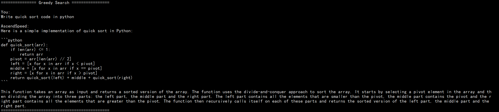
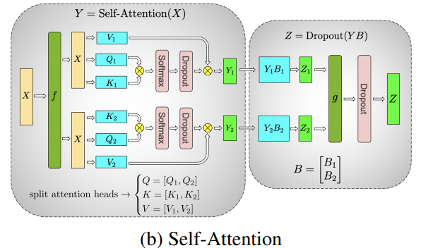

<p align="center">  </p>

<p align="center">
    <a>
        
    </a>
    <a href="https://gitee.com/ascend/AscendSpeed/blob/master/LICENSE">
        
    </a>
    <a href="https://gitee.com/ascend/AscendSpeed">
        
    </a>
    <a>
        
    </a>
</p>
<p align="center">
        <b>简体中文</b> |
        <b><a href="https://gitee.com/fengliangjun66/AscendSpeed/blob/master/README_en.md">English</a> </b>
    </p>
</p>

AscendSpeed旨在为华为 [昇腾芯片](https://open.codehub.huawei.com/OpenBaize/Ascend/ascendspeed/files?ref=master&filePath=examples%2Fbaichuan%2Fpretrain_baichuan_zero_7B.sh&isFile=true) 上的大语言模型提供端到端的解决方案, 包含模型，算法，算子，以及下游任务。

## AscendSpeed解决方案概览

---
### 大语言模型
当前AscendSpeed支持下列模型的预训练以及全参微调:
* <a href="https://huggingface.co/BAAI/Aquila-7B/tree/main" style="color:green">Aquila</a>-[[使用说明: 7B]](examples/aquila/README.md)
* <a href="https://github.com/baichuan-inc" style="color:green">Baichuan</a>-[[使用说明: 7B/13B]](examples/baichuan/README.md)
* <a href="https://arxiv.org/pdf/2108.12409.pdf" style="color:green">Bloom</a>-[[使用说明: 7B/176B]](examples/bloom/README.md)
* <a href="https://internlm.intern-ai.org.cn/" style="color:green">InternLM</a>-[[使用说明: 7B/65B]](examples/intern/README.md)
* <a href="https://huggingface.co/docs/transformers/main/model_doc/llama" style="color:green">LLaMA</a>-[[使用说明: 7B/13B/33B/65B]](examples/llama/README.md)
* <a href="https://huggingface.co/docs/transformers/main/model_doc/llama2" style="color:green">LLaMA2</a>-[[使用说明: 7B/13B/70B]](examples/llama2/README.md)

LLaMA2-34B, Baichuan2-7B/13B 等模型即将上线...

### 下游任务
当前AscendSpeed为大模型提供以下周边应用:
* [指令/预训练数据集](#jump11)
* [低参微调方法](#jump12)
* [推理：人机对话](#jump13)
* [基线数据集评估](#jump14)

强化学习，多专家网络等特性持续研发中....

### 加速算法
当前AscendSpeed支持以下分布式加速算法:

* [张量并行](#jump1)
* [(虚拟 & 动态) 流水并行](#jump2)
* [Fold-3D](#jump3)
* [重计算策略](#jump4)
* [序列并行](#jump5)
* [ZeRO-1/2](#jump6)
* [倒三角加速](#jump7)
* [高性能优化器](#jump8)
* [前向网络合并](#jump9)
* [梯度累积](#jump9)
* [混精内存复用](#jump10)

更多高效的加速算法正在为昇腾芯片上的大语言模型研发中...

### 融合算子
即将上线 ...


## 大语言模型

---

### 模型性能
<table>
  <thead>
    <tr>
      <th>模型</th>
      <th>参数</th>
      <th>节点</th>
      <th>模式</th>
      <th>昇腾 </th>
      <th>参考 </th>
      <th>Loss</th>
      <th>脚本</th>
    </tr>
  </thead>
  <tbody>
    <tr>
      <td rowspan="1"><a href="examples/aquila/README.md">Aquila</a></td>
      <td>7B</td>
      <td> 1x8</td>
      <td> FP16 </td>
      <td> 3644 </td>
      <td> 4078 </td>
      <td> <a href="./sources/images/aquila/aquila_comp1130.png">Loss</a> </td>
      <td> <a href="examples/aquila/pretrain_aquila_7B.sh">训练</a> </td>
    </tr>
    <tr>
      <td rowspan="2"><a href="examples/baichuan/README.md">Baichaun</a></td>
      <td>7B</td>
      <td> 1x8</td>
      <td> FP16 </td>
      <td> 1905 </td>
      <td> 2036 </td>
      <td> <a href="./sources/images/baichuan/7B_loss_compare.png">Loss</a> </td>
      <td> <a href="examples/baichuan/pretrain_baichuan_zero_7B.sh">训练</a> </td>
    </tr>
    <tr>
      <td>13B</td>
      <td> 1x8</td>
      <td> FP16 </td>
      <td> 1024 </td>
      <td> 824 </td>
      <td> <a href="./sources/images/baichuan/13B-loss-compare.png">Loss</a> </td>
      <td> <a href="examples/baichuan/pretrain_baichuan_ptd_13B.sh">训练</a> </td>
    </tr>
    <tr>
      <td rowspan="2"><a href="examples/bloom/README.md">Bloom</a></td>
      <td>7B1</td>
      <td> 1x8</td>
      <td> FP16 </td>
      <td> 2611 </td>
      <td> 2525 </td>
      <td>  <a href="sources/images/bloom7B1_loss.png">Loss</a> </td>
      <td> <a href="examples/bloom/pretrain_bloom_7b1.sh">训练</a> </td>
    </tr>
    <tr>
      <td >176B</td>
      <td >12x8</td>
      <td> BF16 </td>
      <td> 112 </td>
      <td> 107 </td>
      <td> <a href="examples/bloom/images/bloom176b_lm_loss_compare.PNG">Loss</a> </td>
      <td> <a href="examples/bloom/pretrain_bloom_176b.sh">训练</a> </td>
    </tr>
    <tr>
      <td rowspan="2"><a href="examples/intern/README.md">InternLM</a></td>
      <td>7B</td>
      <td>1x8</td>
      <td>BF16</td>
      <td> 3328 </td>
      <td> 4078 </td>
      <td>  <a href="sources/images/intern7b_loss.png">Loss</a>  </td>
      <td> <a href="examples/intern/pretrain_internlm_7b_zero.sh">训练</a> </td>
    </tr>
    <tr>
      <td >65B</td>
      <td >4x8</td>
      <td> BF16 </td>
      <td> 342 </td>
      <td> 414 </td>
      <td> <a href="sources/images/intern65b_loss.png">Loss</a> </td>
      <td> <a href="examples/intern/pretrain_internlm_65b_ptd_32p.sh">训练</a> </td>
    </tr>
    <tr>
      <td rowspan="5"><a href="examples/llama/README.md">LLaMA</td>
      <td>7B</td>
      <td>1x8</td>
      <td>FP16</td>
      <td> 3763 </td>
      <td> 3804 </td>
      <td> <a href="sources/images/llama7b-loss-with-weight.png">Loss</a> </td>
      <td> <a href="examples/llama/pretrain_llama_7B_zero_8p.sh">训练</a> </td>
    </tr>
    <tr>
      <td>13B</td>
      <td>1x8</td>
      <td>FP16</td>
      <td> 1894 </td>
      <td> 2012 </td>
      <td> <a href="sources/images/llama13b-loss-with-weight.png">Loss</a> </td>
      <td> <a href="examples/llama/pretrain_llama_13B_ptd_8p.sh">训练</a> </td>
    </tr>
    <tr>
        <td>33B</td>
        <td>4x8</td>
        <td>FP16</td>
        <td>621</td>
        <td>776</td>
        <td>
        <a href="sources/images/llama/llama33b-layer20-loss-with-weight.png">Loss</a> </td>
        <td><a href="examples/llama/pretrain_llama_33B_ptd_32p.sh">训练</a> </td>
    </tr>
    <tr>
      <td rowspan="2">65B</td>
      <td rowspan="2">4x8</td>
    </tr>
    <tr>
      <td>BF16 </td>
      <td> 309 </td>
      <td> 260 </td>
      <td> <a href="sources/images/llama65b_bf_loss.png">Loss</a> </td>
      <td> <a href="examples/llama/pretrain_llama_65B_ptd_32p.sh">训练</a> </td>
    </tr>
    <tr>
      <td rowspan="3"><a href="examples/llama2/README.md">LLaMA2</td>
      <td>7B</td>
      <td>1x8</td>
      <td>BF16 </td>
      <td> 2662 </td>
      <td> 2884 </td>
      <td> <a href="sources/images/llama2/llama2-7b-tp8pp1mbs4gbs16-cann1115-Megatron-GPU-loss-releative.png">Loss</a> </td>
      <td> <a href="examples/llama2/pretrain_llama2_7b_ptd.sh">训练</a> </td>
    </tr>
    <tr>
      <td>13B</td>
      <td>1x8</td>
      <td>BF16 </td>
      <td> 1468 </td>
      <td> 1750 </td>
      <td> <a href="/sources/images/llama2/llama2_13b_bf16_loss_absolute.png">Loss</a> </td>
      <td> <a href="examples/llama2/pretrain_llama2_13B_ptd_8p.sh">训练</a> </td>
    </tr>
    <tr>
      <td>70B</td>
      <td>8x8</td>
      <td>BF16 </td>
      <td> 350 </td>
      <td> 339 </td>
      <td> <a href="sources/images/llama2/llama2_70b_bf16_loss_compare.png">Loss</a> </td>
      <td> <a href="examples/llama2/pretrain_llama2_70B_ptd.sh">训练</a> </td>
    </tr>
  </tbody>
</table>


### 模型训练
这里展示了一个使用AscendSpeed进行模型训练的例子，针对每一个模型具体的操作指导可以在 `examples/modelname` 文件夹下看到

1. 拷贝仓库到你的个人服务器:

```bash
git clone https://gitee.com/ascend/AscendSpeed.git
cd AscendSpeed
mkdir logs
mkdir ckpt
```

2. 构建运行环境

```bash
# python3.7
conda create -n test python=3.7
conda activate test

# 安装 torch 和 torch_npu
# ARM
wget https://download.pytorch.org/whl/torch-1.11.0-cp37-cp37m-manylinux2014_aarch64.whl
wget https://gitee.com/ascend/pytorch/releases/download/v5.0.rc2.2-pytorch1.11.0/torch_npu-1.11.0.post3-cp37-cp37m-linux_aarch64.whl
# X86
pip install torch==1.11 -i https://pypi.tuna.tsinghua.edu.cn/simple
wget https://gitee.com/ascend/pytorch/releases/download/v5.0.rc2.2-pytorch1.11.0/torch_npu-1.11.0.post3-cp37-cp37m-linux_x86_64.whl
# 如果使用 'wget' 下载失败, 可以在确保网站安全的情况下点击网站直接下载

pip install torch-1.11.0-cp37-cp37m-manylinux2014_aarch64.whl (ARM)
pip install torch_npu-1.11.0.post3-cp37-cp37m-linux_XXXXXX.whl

# 安装 apex
pip install apex-0.1_ascend_XXXXX-cp37-cp37m-linux_x86_64.whl
pip install apex-0.1-ascend_XXXXX-cp37-cp37m-linux_aarch64.whl (ARM)

# 安装 megatron-core
pip3 install --no-use-pep517 -e git+https://github.com/NVIDIA/Megatron-LM.git@23.05#egg=megatron-core

# 安装 deepspeed 和 deepspeed_npu
pip install deepspeed==0.9.2
git clone https://gitee.com/ascend/DeepSpeed.git -b v0.9.2 deepspeed_npu
cd deepspeed_npu
pip3 install -e ./

# 安装其他的依赖
pip install -r requirements.txt -i https://pypi.tuna.tsinghua.edu.cn/simple
```


3. 准备数据集 (点击 [这里](https://huggingface.co/yahma/llama-7b-hf/tree/main) 下载tokenizer配置文件):
```bash
# 对于 llama, 可以下载 alpaca 数据集, 比如：
wget https://raw.githubusercontent.com/tatsu-lab/stanford_alpaca/main/alpaca_data.json

# 这里要将tokenizer_config.json中的"LLaMATokenizer"修改为"LlamaTokenizer"（这是huggingface的一个bug）
mkdir dataset
python tools/preprocess_data.py --input alpaca_data.json \
                                --output-prefix dataset/alpaca \
                                --tokenizer-type PretrainedFromHF \
                                --tokenizer-name-or-path llama-7b-hf \
                                --tokenizer-not-use-fast \
                                --handler-name GeneralInstructionHandler
```

4. (可选的) 准备预训练权重 (点击 [这里](https://huggingface.co/yahma/llama-7b-hf/tree/main) 下载权重文件):
```bash
python tools/ckpt_convert/llama/convert_weights_from_huggingface.py --input-model-dir ../llama-7b-hf \
                                                                    --output-model-dir ckpt \
                                                                    --tensor-model-parallel-size 1 \
                                                                    --pipeline-model-parallel-size 1 \
                                                                    --type 7B

# 如果你想要改变并行策略，可以通过设置 `tensor-model-parallel-size` 和 `pipeline-model-parallel-size` 标志，实现预训练权重的切分
# 脚本: tools/ckpt_convert/llama/convert_weights_when_tp_pp_change.py 对于推理时的权重合并也是有帮助的.
```

5. 启动训练

```bash
# 在脚本中设置你自己的数据/权重/tokenizer等路径
sh examples/llama/pretrain_llama_7B_zero_8p.sh
```


## 下游任务

---

### 内容列表
<table>
  <thead>
    <tr>
      <th>模型</th>
      <th>参数</th>
      <th>微调</th>
      <th>推理</th>
      <th>评估</th>
      <th>数据集</th>
    </tr>
  </thead>
  <tbody>
    <tr>
      <td> <a href="examples/baichuan/README.md">Baichuan</a> </td>
      <td> 13B </td>
      <td> -- </td>
      <td> <a href="https://gitee.com/ascend/AscendSpeed/tree/master/examples/baichuan/generate_baichuan_13B_tp8_pp1.sh">对话</a> </td>
      <td> -- </td>
      <td> -- </td>
    </tr>
    <tr>
      <td rowspan="2"><a href="examples/bloom/README.md">Bloom</a></td>
      <td> 7B1 </td>
      <td> -- </td>
      <td> <a href="https://gitee.com/ascend/AscendSpeed/tree/master/examples/bloom/generate_bloom_7B_tp8_pp1.sh">对话</a> </td>
      <td> -- </td>
      <td> -- </td>
    </tr>
    <tr>
      <td> 176B </td>
      <td> -- </td>
      <td> <a href="https://gitee.com/ascend/AscendSpeed/tree/master/examples/bloom/generate_176b_2nodes.sh">对话</a> </td>
      <td> -- </td>
      <td> -- </td>
    </tr>
    <tr>
      <td><a href="examples/intern/README.md">InternLM</a></td>
      <td>7B</td>
      <td> -- </td>
      <td> -- </td>
      <td> -- </td>
      <td> -- </td>
    </tr>
    <tr>
      <td rowspan="4"><a href="examples/llama/README.md">LLaMA</a></td>
      <td>7B</td>
      <td> <a href="https://gitee.com/ascend/AscendSpeed/tree/master/examples/alpaca/finetune_chinese_llama_alpaca_7_13_33b_tp4_pp2.sh">lora</a> </td>
      <td> <a href="https://gitee.com/ascend/AscendSpeed/tree/master/examples/llama/generate_llama_7B_tp2_pp2.sh">对话 </a> </td>
      <td> -- </td>
      <td> <a href="https://github.com/tatsu-lab/stanford_alpaca/blob/main/alpaca_data.json">alpaca_data.json</a> </td>
    </tr>
    <tr>
      <td>13B</td>
      <td> <a href="https://gitee.com/ascend/AscendSpeed/tree/master/examples/alpaca/finetune_chinese_llama_alpaca_7_13_33b_tp4_pp2.sh">lora</a> </td>
      <td> <a href="https://gitee.com/ascend/AscendSpeed/tree/master/examples/llama/generate_llama_13B_tp8_pp1.sh">对话 </a> </td>
      <td> -- </td>
      <td> <a href="https://github.com/tatsu-lab/stanford_alpaca/blob/main/alpaca_data.json">alpaca_data.json</a> </td>
    </tr>
    <tr>
      <td>33B</td>
      <td> <a href="https://gitee.com/ascend/AscendSpeed/tree/master/examples/alpaca/finetune_chinese_llama_alpaca_7_13_33b_tp4_pp2.sh">lora</a> </td>
      <td> <a href="https://gitee.com/ascend/AscendSpeed/tree/master/examples/llama/generate_llama_33B_ptd.sh">对话 </a> </td>
      <td> <a href="https://gitee.com/ascend/AscendSpeed/tree/master/examples/llama/evaluate_llama_33B_ptd.sh">评估 </a> </td>
      <td> <a href="https://github.com/tatsu-lab/stanford_alpaca/blob/main/alpaca_data.json">alpaca_data.json</a> </td>
    </tr>
    <tr>
      <td > 65B </td>
      <td > -- </td>
      <td> <a href="https://gitee.com/ascend/AscendSpeed/tree/master/examples/llama/generate_llama_65B_tp8_pp1.sh">对话 </a> </td>
      <td> -- </td>
      <td> -- </td>
    </tr>
    <tr>
      <td><a href="examples/llama2/README.md">LLaMA2</a></td>
      <td>7B</td>
      <td> <a href="https://gitee.com/ascend/AscendSpeed/tree/master/examples/llama2/tune_llama2_7b_ptd.sh">lora</a> </td>
      <td> <a href="https://gitee.com/ascend/AscendSpeed/tree/master/examples/llama2/generate_llama2_7b_ptd.sh">对话 </a> </td>
      <td> -- </td>
      <td> <a href="https://github.com/tatsu-lab/stanford_alpaca/blob/main/alpaca_data.json">alpaca_data.json </td>
    </tr>
  </tbody>
</table>


### <span id="jump11"> 指令/预训练数据集 </span>
#### 快速开始

```bash
# 对于llama, 可以下载alpaca数据集, 比如
wget https://huggingface.co/datasets/tatsu-lab/alpaca/resolve/main/data/train-00000-of-00001-a09b74b3ef9c3b56.parquet

# 下载 tokenizer 配置， 地址：
# https://huggingface.co/yahma/llama-7b-hf/tree/main
# 这里要将tokenizer_config.json中的"LLaMATokenizer"修改为"LlamaTokenizer"（这是huggingface的一个bug）
mkdir dataset
python tools/preprocess_data.py --input train-00000-of-00001-a09b74b3ef9c3b56.parquet \
                                --output-prefix dataset/alpaca \
                                --tokenizer-type PretrainedFromHF \
                                --tokenizer-name-or-path llama-7b-hf \
                                --tokenizer-not-use-fast \
                                --handler-name GeneralInstructionHandler
```

#### 处理预训练数据集

##### wikipedia 数据集

+ 下载 [wikipedia](https://huggingface.co/datasets/wikipedia/tree/main) 数据集到 WORKSPACE/wikipedia 目录
+ 下载 [llama tokenizer](https://huggingface.co/yahma/llama-7b-hf/tree/main) 配置到 WORKSPACE/llama-7b-hf 目录
+ 再使用如下脚本处理数据集

```shell
# 这里认为 数据集 和 tokenizer 已经下载放到了 WORKSPACE.
cd WORKSPACE
mkdir wikipedia_preprocessed

hf_config_json="./hf_config_json.json"
cat <<EOT > $hf_config_json
{
    "path": "WORKSPACE/wikipedia",
    "name": "20220301.en",
    "streaming: True,
    "split": "train"
}
EOT

python tools/preprocess_data.py \
    --input "WORKSPACE/wikipedia" \
    --hf-datasets-params ${hf_config_json} \
    --output-prefix WORKSPACE/wikipedia_preprocessed/wikipedia \
    --dataset-impl mmap \
    --tokenizer-type PretrainedFromHF \
    --tokenizer-name-or-path WORKSPACE/llama-7b-hf \
    --tokenizer-not-use-fast \
    --streaming \
    --workers 8
```

处理完后, `WORKSPACE/wikipedia_preprocessed` 文件夹下会有 `wikipedia_text_document.bin` 和 `wikipedia_text_document.idx` 文件， 我们便可以使用 `--data-path WORKSPACE/wikipedia_preprocessed/wikipedia_text_document` 标志训练模型了

请注意huggingface中的数据集格式是[这样](https://huggingface.co/datasets/wikipedia/viewer/20220301.en/train)的. 我们处理数据时利用的数据列可以通过 `--json-key` 标志设置，默认为 `text`，
比如，wikipedia数据集有四列, 包括 `id`, `url`, `title` 和 `text`, 我们就可以通过 `--json-key` 标志选择一列处理该数据集

##### alpaca 数据集

此外, 我们也可以使用 [alpaca](https://huggingface.co/datasets/tatsu-lab/alpaca/resolve/main/data/train-00000-of-00001-a09b74b3ef9c3b56.parquet) 数据集用于预训练如下：

```shell
python tools/preprocess_data.py --input WORKSPACE/train-00000-of-00001-a09b74b3ef9c3b56.parquet \
                                --output-prefix WORKSPACE/alpaca_preprocessed/alpaca \
                                --tokenizer-type PretrainedFromHF \
                                --tokenizer-name-or-path WORKSPACE/llama-7b-hf \
                                --tokenizer-not-use-fast \
                                --json-key text
```


#### 处理指令微调数据集
##### alpaca 数据集
```bash
# 数据集：wget https://huggingface.co/datasets/tatsu-lab/alpaca/resolve/main/data/train-00000-of-00001-a09b74b3ef9c3b56.parquet

cd WORKSPACE
mkdir alpaca_preprocessed
python tools/preprocess_data.py --input WORKSPACE/alpaca/train-00000-of-00001-a09b74b3ef9c3b56.parquet \
                                --output-prefix WORKSPACE/alpaca_preprocessed/alpaca \
                                --tokenizer-type PretrainedFromHF \
                                --tokenizer-name-or-path WORKSPACE/llama-7b-hf \
                                --tokenizer-not-use-fast \
                                --handler-name GeneralInstructionHandler
```

在处理后，`WORKSPACE/alpaca_preprocessed` 文件夹下会有3个 `bin` 文件 和 3个 `idx` 文件，我们便可以通过添加 `--data-path WORKSPACE/alpaca_preprocessed/alpaca` 和 `--is-instruction-dataset` 标志来进行指令微调。
此外，基于指令数据集，我们还可以通过加上 `--variable-seq-lengths` 标志使用动态序列长度训练模型。

请注意，使用 `--handler-name GeneralInstructionHandler` 标志的指令数据集，在处理时会从 `ascendspeed/data/data_handler.py` 中选择 `GeneralInstructionHandler` 类来制作prompt。如果你处理的是 alpaca 格式风格的数据集，即包含 `instruction`, `input` 和 `output` 列的数据集，可以直接使用 `--handler-name GeneralInstructionHandler` 标志。
此外，`BelleMultiTurnInstructionHandler` 可以被用于处理 [belle](https://huggingface.co/datasets/BelleGroup/multiturn_chat_0.8M) 格式的数据集，`MOSSInstructionHandler` 可以被用于处理 [MOSS](https://huggingface.co/datasets/fnlp/moss-003-sft-data) 格式的数据集，`LeetcodePythonInstructionHandler` 可以被用于处理 [Leetcode](https://huggingface.co/datasets/mhhmm/leetcode-solutions-python) 风格的数据集

### <span id="jump12"> 低参微调 </span>
#### Lora

当前 AscendSpeed基于 peft 仓库支持对大模型的 Lora 微调功能：

```shell
pip install peft==0.4.0
```
你也可以选择直接从它Github仓库的 [源码安装](https://github.com/huggingface/peft/archive/refs/tags/v0.4.0.tar.gz)， 通过修改它的setup.py文件来回避一些依赖问题。

之后，你仅仅只需要在启动脚本中使能如下标志便可以启动lora微调训练:

```shell
# Llama example
--lora-target-modules query_key_value dense gate_proj up_proj down_proj \
```

Lora有一些相关参数，在 [PEFT](https://github.com/huggingface/peft) 仓库中有详细介绍，比如：

```shell
# Llama example
--lora-r 64 \
--lora-alpha 128 \
--lora-modules-to-save word_embeddings output_layer \
--lora-register-forward-hook word_embeddings input_layernorm \
```

在这些参数中，标志 `--lora-register-forward-hook` 被用于修复由PP造成的梯度链中断，它仅仅只需要在每一个PP阶段的输入层设置，并不会增加训练参数。 标志 `--lora-modules-to-save` 被用于扩展词表时的微调，若没此需求则无需传入此参数。

最后，Lora微调后保存的权重仅仅只会包含新增的Lora权重。相似的，当你加载一个Lora模型时，除了原始权重路径需要设置，还需要设置一个加载Lora权重的路径，如下：

```shell
--load ${ORIGIN_CHECKPOINT} \
--lora-load ${LORA_CHECKPOINT} \
```

这个 [例子](examples/llama/tune_llama_ptd_13b.sh) 可以用于参考。

在使用 Lora 微调 Llama 模型以后，指令对话的效果如下：

```shell
You >> Give three tips for staying healthy.

AscendSpeed:

- Start exercising regularly and eat healthy food.
- Get a good eight hours of sleep each night.
- Take medications regularly.
```

如果在完成lora微调后，需要一个不带lora结构的模型，那么我们只需运行这个 [脚本](tools/lora/merge_lora_llama_ptd_13B.sh)，即可将`--load`和`--lora-load`这两个模型文件合并，生成的不带lora结构的新权重模型文件存在`--save`路径里。

### <span id="jump13"> 推理: 人机对话 </span>
当前，我们支持使用如下并行策略训练的模型进行推理:
- 仅仅使用 PTD 策略训练的模型
- 仅仅使用 DeepSpeed 中 ZeRO 策略训练的模型
- 基于 DeepSpeed 拉起的带 TP 策略的模型
- 使用 Lora 策略微调的模型

#### 快速开始

这里有一些使用不同模式的样例脚本可以尝试运行，***请注意：***
1. 如果你尝试使用 huggingface 的模型权重，请首先进行权重转换， 以 Llama-7B 为例:

      - PTD 策略的转换

           ```bash
           python tools/ckpt_convert/llama/convert_weights_from_huggingface.py --input-model-dir llama-7b-hf \
                                                                               --output-model-dir llama-7b-tp2-pp2 \
                                                                               --tensor-model-parallel-size 2 \
                                                                               --pipeline-model-parallel-size 2 \
                                                                               --type 7B
           ```

      - ZeRO 策略的转换
          ```bash
          python tools/ckpt_convert/llama/convert_weights_from_huggingface.py --input-model-dir llama-7b-hf \
                                                                              --output-model-dir llama-7b-deepspeed \
                                                                              --type 7B \
                                                                              --deepspeed
          ```

5. 下面脚本中的一些路径需要修改，比如：模型权重路径 和 词表路径.

    - 仅仅使用 PTD 策略训练的模型：在这种模式下，模型以 Megatron-LM 的风格被 流水并行 和 张量并行 切分
        ```bash
        sh examples/llama/generate_llama_7B_tp2_pp2.sh
        ```
    - 仅仅使用 DeepSpeed 中 ZeRO 策略训练的模型：在这种模式下，模型使用 DeepSpeed 的 ZeRO 1, 2 or 3 策略训练，并且 tp=1, pp=1
        ```bash
        sh examples/alpaca/generate_alpaca_13B_deepspeed.sh
        ```
    - 基于 DeepSpeed 拉起的带 TP 策略的模型：在这种模式下，模型使用 DeepSpeed 的 ZeRO 1, 2 or 3 策略训练，并且 tp>1, pp=1
        ```bash
        sh examples/llama/generate_llama_7B_deepspeed_pipeline.sh
        ```
    - 如果你仅仅使用 Lora, 可以参考:
        ```bash
        sh examples/alpaca/generate_alpaca_13B_lora_deepspeed.sh
        ```

#### 使用手册
这里列举了一些使用 [Chinese-LLaMA-Alpaca-13B](https://github.com/ymcui/Chinese-LLaMA-Alpaca) 权重进行推理的例子，
同时依据下列步骤可以写出你自己的推理例子:

##### 初始化分布式环境
```python
initialize_megatron(args_defaults={'no_load_rng': True, 'no_load_optim': True})
```
##### 初始化模型和权重
```python
from ascendspeed import get_args
from ascendspeed.model import LlamaModel
from ascendspeed.arguments import core_transformer_config_from_args

def model_provider(pre_process=True, post_process=True):
    """Build the model."""
    config = core_transformer_config_from_args(get_args())
    init_model = LlamaModel(
        config,
        parallel_output=False,
        add_pooler=False,
        pre_process=pre_process,
        post_process=post_process
    )
    return init_model


model = LlamaModel.from_pretrained(
    model_provider=model_provider,
    pretrained_model_name_or_path="your model weight path"
)

"""
This is an API for initializing model and loading weight.

Parameters:
----------
model_provider(`func`):
    Function used to generate model objects which is similar to the training define.
pretrained_model_name_or_path(`str`, *optional*, defaults to None):
    File path of Model weight in megatron format (TP, PP may be used).
    If it is None, the random initialized weights will be used.
"""
```
##### <span id="case1"> 以 HuggingFace 的风格生成文本 </span>

- Greedy Search
    ```python
    responses = model.generate(
        "Write quick sort code in python",
        max_new_tokens=512
    )
    ```
    

- Do sample with top-k and top-p
    ```python
    responses = model.generate(
        "Write quick sort code in python",
        do_sample=True,
        temperature=1.0,
        top_k=50,
        top_p=0.95,
        max_new_tokens=512
    )
    ```
    

- Beam search with top-k and top-p
    ```python
    responses = model.generate(
        "Write quick sort code in python",
        num_beams=4,
        top_k=50,
        top_p=0.95,
        max_new_tokens=512
    )
    ```
    

- Beam search with top-k and top-p sampling
    ```python
    responses = model.generate(
        "Write quick sort code in python",
        do_sample=True,
        temperature=0.6,
        num_beams=4,
        top_k=50,
        top_p=0.95,
        max_new_tokens=512
    )
    ```
    

### <span id="jump14"> 使用基线数据集进行评估 </span>
#### 评估样例

<table>
  <thead>
    <tr>
      <th>任务</th>
      <th>验证集</th>
      <th>模型</th>
      <th>昇腾值</th>
      <th>参考值</th>
      <th>社区值</th>
    </tr>
  </thead>

  <tbody>
    <tr>
      <td><a href="https://huggingface.co/datasets/lukaemon/bbh">BBH</a></td>
      <td>Test</td>
      <th>Llama7b</th>
      <td>0.334</td>
      <td>0.333</td>
      <td><a href="https://opencompass.org.cn/dataset-detail/BBH">0.335</a></td>
    </tr>
    <tr>
      <td><a href="https://huggingface.co/datasets/lighteval/agi_eval_en">AGIEval</a></td>
      <td>Test</td>
      <th>Llama7b</th>
      <td>0.210</td>
      <td>0.210</td>
      <td><a href="https://opencompass.org.cn/dataset-detail/AGIEval">0.206</a></td>
    </tr>
    <tr>
      <td><a href="https://huggingface.co/datasets/openai_humaneval">HumanEval</a></td>
      <td>Test</td>
      <th>Llama7b</th>
      <td>0.128</td>
      <td>0.128</td>
      <td><a href="https://opencompass.org.cn/dataset-detail/HumanEval">0.128</a></td>
    </tr>
    <tr>
      <td><a href="https://huggingface.co/datasets/boolq">BoolQ</a></td>
      <td>test</td>
      <th>Llama7b</th>
      <td>0.742</td>
      <td>0.742</td>
      <td><a href="https://opencompass.org.cn/dataset-detail/BoolQ">0.754</a></td>
    </tr>
    <tr>
      <td><a href="https://huggingface.co/datasets/gsm8k">GSM8K</a></td>
      <td>Test</td>
      <th>Llama7b</th>
      <td>0.102</td>
      <td>0.103</td>
      <td><a href="https://opencompass.org.cn/dataset-detail/GSM8K">0.100</a></td>
    </tr>
    <tr>
      <td><a href="https://huggingface.co/datasets/ceval/ceval-exam">CEval</a></td>
      <td>Validation</td>
      <th>Llama7b</th>
      <td>0.408</td>
      <td>0.404</td>
      <td>/</td>
    </tr>
    <tr>
      <td><a href="https://huggingface.co/datasets/cais/mmlu">MMLU</a></td>
      <td>test</td>
      <th>Llama7b</th>
      <td>0.333</td>
      <td>0.324</td>
      <td><a href="https://browse.arxiv.org/pdf/2302.13971v1.pdf">0.351</a></td>
    </tr>
  </tbody>
</table>

#### 快速开始
```bash
# 配置模型和词表路径
# 词表路径地址：https://huggingface.co/yahma/llama-7b-hf
CHECKPOINT=../models/llama-7b-tp2-pp4/
VOCAB_FILE=../models/llama7b-hf/
# 配置任务和数据路径
DATA_PATH="dataset/boolq/test"
TASK="boolq"
# 配置生成参数
python -m torch.distributed.launch $DISTRIBUTED_ARGS evaluation_llama.py   \
       --task-data-path $DATA_PATH \
       --task $TASK\
       --seq-length 512 \
       --max-new-tokens 1 \
       --max-position-embeddings 512 \
       --tensor-model-parallel-size 2  \
       --pipeline-model-parallel-size 4  \
       --num-layers 32  \
       --hidden-size 4096  \
       --ffn-hidden-size 11008 \
       --load ${CHECKPOINT[images](sources%2Fimages)}  \
       --num-attention-heads 32  \
       --tokenizer-type PretrainedFromHF  \
       --tokenizer-name-or-path $VOCAB_FILE \
       --tokenizer-not-use-fast \
       --fp16  \
       --micro-batch-size 1  \
       --seed 42 | tee logs/train.log
# 开启评估
bash tasks/evaluation/eval_llama.sh
```

#### 任务介绍
最重要的评估参数是 `--max-new-tokens`, 它表示模型输出的生成长度，比如，多项选择问题的输出长度就会明显比编码任务的输出长度小，该参数也很大程度上影响了模型的生成速度。

```bash
python -m torch.distributed.launch $DISTRIBUTED_ARGS evaluation_llama.py   \
       --task-data-path $DATA_PATH \
       --task $TASK\
       --seq-length 512 \
       --max-new-tokens 1 \
       --max-position-embeddings 512 \
       --tensor-model-parallel-size 2  \
       --pipeline-model-parallel-size 4  \
       --num-layers 32  \
       --hidden-size 4096  \
       --ffn-hidden-size 11008 \
       --load ${CHECKPOINT}  \
       --num-attention-heads 32  \
       --tokenizer-type PretrainedFromHF  \
       --tokenizer-name-or-path $VOCAB_FILE \
       --tokenizer-not-use-fast \
       --fp16  \
       --micro-batch-size 1  \
       --seed 42 | tee logs/train.log
```
##### BoolQ
BoolQ 是一个 yes/no 的问答数据集， 每一个问题包含了一个（问题，文章，答案）三元组，同时有文章的标题作为额外的选择性输入。BoolQ 数据集的评估相对简单，只需要配置 `TASK="boolq"`, `--seq-length=512`, `--max-position-embeddings=512`, `--max-new-token=2`。
零样本评估的结果通常会被给定的 prompt 影响，可以尝试通过在 `tasks/evaluation/evaluation.py` 中设置合适的 prompt 得到更高的分数，

```bash
# 通过修改 template 更新prompt
template = {instruction}
```

##### MMLU
由于 MMLU 是一项多学科任务，并且需要进行 5-shot 评估，因此每个学科问题的长度差异很大。如果你想同时跑57个学科任务，可以尝试设置 `TASK="mmlu"`, `--seq-length=2048`, `--max-position-embeddings=2048`, `--max-new-token=2` (`--max-new-tokens` 可以在 2-4 取值)。
在很多网站，MMLU 的精度会依据学科进行评估，57个学科主要属于四个大类， 因此该数据集也可以基于四个大类进行打分，[网站](https://github.com/hendrycks/test/blob/master/categories.py) 给出了具体的57个类别。


##### GSM8K
GSM8K 是一个有8.5k高质量小学数学应用题文本的数据集，每一个问题的回答是具体的数字。由于该数据集通常采用 few-shot 的形式进行评估，GSM8K的问题长度相对是比较长的，输出答案包含一整个思维链路，相关入参应该设置为 `TASK="gsm8k"`, `--seq-length=2048`, `--max-position-embeddings=2048`, `--max-new-token=128` (`--max-new-tokens` 可以是 256-512).

##### HumanEval
HumanEval 是一个用于挑战代码生成问题的数据集，具有164个编程问题，包含函数签名，文档，函数主体和单元测试等。该数据的所有问题都是手写的，以确保它们不在训练集中，由于答案包含长代码，相关参数可以设置为 `TASK="human_eval"`, `--seq-length=2048`,
`--max-position-embeddings=2048`, `--max-new-token=1024`。

##### AGIEval
AGIEval 是一个用于评估大模型在人类认知和问题解决能力方面生成能力的基准数据集，它源于20个面向普通考生的官方、公开和高标准的入学和资格考试，相关参数可以设置为 `TASK="agieval"`, `--seq-length=2048`, `--max-position-embeddings=2048`, `--max-new-token=1024`。

##### Big-Bench-Hard
Big-bench-hard 数据集是 BIG-Bench 的一个子集，专注于有挑战性的23个 BIG-Bench 任务， 涵盖文本理解、推理、逻辑推理、数学推理和常识推理等多个领域，相关参数可以设置为 `TASK="bbh"`, `--seq-length=2048`, `--max-position-embeddings=2048`, `--max-new-token=32` (`--max-new-tokens` 可以是 32-64)。

##### CEval
如 [C-Eval](https://cevalbenchmark.com/) 展示的, C-Eval 是一个针对大模型的综合中文评估数据集， 它由13948道多项选择题组成，涵盖52个不同学科和4个难度级别，划分为验证和测试集，验证集包含标签用于个人评估，测试集合的标签没有公开，如果想要知道模型得分，需要将结果 邮件发送给 [C-Eval](https://cevalbenchmark.com/)。

## 加速算法介绍

---

### <span id="jump1"> 张量并行 </span>
张量并行（Tensor Parallelism，TP）是一种模型并行策略，它将单个Transformer模块的执行拆分到多个设备上，以均分内存消耗。TP的基本原理如下：<div align=center>

</div>
在 AscendSpeed 中使用张量并行， 可以在启动脚本中增加  `--tensor-model-parallel-size` 标志， 来明确用于拆分模型的GPU数量。

### <span id="jump2">  (虚拟 & 动态) 流水并行  </span>
流水并行（Pipeline Parallelism (PP)）是一种将模型所有的Transformer模块划分为多个stage放在不同卡上训练的模型并行技术。
在PP中，每一个stage都有相等数量的Transformer，同时通过将 全局的 （global） batchsize 拆分为多个 微 （micro） batchsize，在stage间流水化训练这些微 batchsize，以达到训练整个模型的目的。
虚拟流水并行 （Virtual Pipeline (VP) Parallelism），通过增加虚拟的 stage 来减少 PP 运行时的空泡时间， 动态流水并行 （Dynamic Pipline Parallelism，DPP） 则是增强版本的 VP， 通过合理的设置每个微 batchsize的大小进一步降低空泡时间。
PP 和 VP的基本原理如下：<div align=center>  </div>

在AscendSpeed中，可以通过使能`--pipeline-model-parallel-size` 标志来明确PP要将模型划分为多少个 stage，比如，该参数设置为4，就是将一个具有24层transformer的模型划分为4个stage，每个stage有6层transformer。
为了使用VP，需要额外添加 `--num-layers-per-virtual-pipeline-stage` 标志，来决定每个虚拟stage的层数；为了使用DPP，则需要在PP的基础上添加 `--optimized-pipeline` 和 `--manual-mbs example-config-1` 标志。需要说明的是，虽然VP和DPP可以减少空泡时间，但是会增加通讯时间。


### <span id="jump3"> Fold3D </span>
Fold3D 隐藏了 PP 中数据并行的通信时间，其基本原理如下：<div align=center>
</div>
在AscendSpeed中，使用 `--fold-mode "aiao"` 标志可以打开该功能。

### <span id="jump4"> (选择性) 重计算 </span>
为了使用有限的显存来训练更大的模型，AscendSpeed 支持完全重计算以及选择性重计算策略，为了使能完全重计算，可以使用 `--checkpoint-activations` 标志，
至于选择性重计算，则可以通过添加 `--checkpoint-policy` 标志来决定选择性重计算的策略。

为了最大限度地利用NPU内存，同时提高模型训练的性能，我们支持通过调整训练内存大小的方式，自动获取选择重计算策略，这一特性称为[自适应选择重计算](https://gitee.com/ascend/AscendSpeed/wikis/Algorithm%20Introduction/Auto%20Selective%20Recomputing)。
启用自适应选择重计算，请使用`--auto-recompute-device-size`标志指定自适应选择重计算策略的训练内存大小（单位：MB）。请注意，如果要使用`--auto-recompute-device-size`标志，请删除标志`--checkpoint-activations`。
如果发生OOM，您需要重新选择一个内存值来重启模型训练。您也可以通过[二分法](https://gitee.com/ascend/AscendSpeed/wikis/Algorithm%20Introduction/Auto%20Selective%20Recomputing)的方式获得最优解。
自适应选择重计算根据profiling前N步的训练内存信息进行策略选择，您可以通过使用`--auto-recompute-profiling-step`标志设置[停止profiling](https://gitee.com/ascend/AscendSpeed/wikis/Algorithm%20Introduction/Auto%20Selective%20Recomputing)的步数。
默认在第10步停止profiling，最小设置为5步，建议在训练内存平稳后停止profiling，这样可以获得更佳的选择重计算策略。

### <span id="jump5"> 序列并行 </span>
序列并行（Sequence Parallelism，SP）是一种模型并行策略，它依赖TP的实现，沿着序列轴按照TP的维度拆分了dropout层和layernorm层。
SP将TP中的allreduce操作拆分为了reduce-scatter和allgather操作，这降低了模型训练中的内存占用。

</div>

为了使能SP, `--tensor-model-parallel-size` 标志应该大于1，同时设置 `--sequence-parallel` 标志。

### <span id="jump6"> ZeRO-1/2/3 </span>
无冗余优化器（Zero Redundancy Optimizer，ZeRO）是微软提出的一种在数据并行中优化内存的并行策略。AscendSpeed通过增加deepspeed分支，支持了ZeRO-1/2，其基本原理如下：
<div align=center>
</div>

为了使能ZeRO-1/2, 我们需要配置一个如 [例子](examples/llama/pretrain_llama_7B_zero_8p.sh) 所示的deepspeed config。
值得一提的是，如果仅仅是需要ZeRO-1，那么deepspeed不是必须的，只需要设置 `--use-distributed-optimizer` 标志就可以了。

### <span id="jump7"> 倒三角加速 </span>
倒三角在python层面实现了flash attention，是一种针对attention模块的加速算法。基本的，self-attention在计算attention值的时候会把整个attention mask纳入计算，
而倒三角加速算法仅仅会计算必要的部分，从而降低计算量，计算过程如下：
<div align=center>
</div>

在AscendSpeed中可以通过使能 `--triangle-attn` 标志打开倒三角加速。


### <span id="jump8"> 高性能优化器 </span>
融合优化器通过减小算子下发降低计算时间，在AscendSpeed中，通过 `--optimizer` 可以选择不同的优化器，具体的，选择 `--optimizer adam` 可以节省更多内存，选择 `--optimizer fused_adam` 则可以运行的更快。

除此之外，我们还提供一些自研的低内存优化器。如：

Cadam是基于谷歌提出的[Lion优化器](https://arxiv.org/abs/2302.06675)，并采用与其beta参数相同的极简形式。这样在去掉二阶动量的同时，可以得到类似于Adam的参数更新效果。然后对一阶动量进行量化和逐行压缩，采用昇腾亲和的FP16进行计算，同时结合Scale和clip操作防止溢出。

<div align=center>
</div>

欲使用Cadam优化器，需要在脚本中指定如下参数`--optimizer cadam`，并将能够用Adam正常平稳训练的模型的学习率`lr`和最小学习率`min-lr`缩小3-10倍，`weight_decay`同步放大3-10倍，`--adam-beta1 0.965`。

部分大模型的测试结果如下表所示：

<table>
  <thead>
    <tr>
      <th>模型</th>
      <th>优化器</th>
      <th>性能</th>
      <th>平均压缩HBM</th>
      <th>BoolQ</th>
      <th>PIQA</th>
      <th>HellaSwag</th>
    </tr>
  </thead>
  <tbody>
    <tr>
      <td rowspan="2"> LLama-7B </td>
      <td> Adam </td>
      <td> 5.65s/iteration </td>
      <td> -- </td>
      <td> 38.78% </td>
      <td> 52.88% </td>
      <td> 26.69% </td>
    </tr>
    <tr>
      <td>  Cadam </td>
      <td> 5.68s/iteration </td>
      <td> ↓ 21.8% </td>
      <td> 41.50% </td>
      <td> 55.11% </td>
      <td> 26.59% </td>
    </tr>
    <tr>
      <td rowspan="2"> LLama2-7B </td>
      <td> Adam </td>
      <td> 7.09s/iteration </td>
      <td> -- </td>
      <td> 40.36% </td>
      <td> 51.20% </td>
      <td> 25.13% </td>
    </tr>
    <tr>
      <td>  Cadam </td>
      <td> 7.12s/iteration </td>
      <td> ↓ 17.4% </td>
      <td> 44.16% </td>
      <td> 51.20% </td>
      <td> 26.29% </td>
    </tr>
    <tr>
      <td rowspan="2"> Bloom-7B </td>
      <td> Adam </td>
      <td> 4.10s/iteration </td>
      <td> -- </td>
      <td> 37.83% </td>
      <td> 49.24% </td>
      <td> 25.31% </td>
    </tr>
    <tr>
      <td>  Cadam </td>
      <td> 4.25s/iteration </td>
      <td> ↓ 10.1% </td>
      <td> 37.83% </td>
      <td> 51.16% </td>
      <td> 25.25% </td>
    </tr>
  </tbody>
</table>


### <span id="jump9">  前向网络合并 </span>
对于llama以及一些在FFN中没有bias的模型，FFN中的线性层可以合并计算以减少TP中的通信量，通过设置 `--mlp-layer-fusion` 标志，可以使用该特性。


### <span id="jump9">  梯度累积 </span>
梯度累积基于 N 轮梯度更新一次参数，这里的 N = global batchsize / micro batchsize / DP，DP = device nums / tp / pp。

### <span id="jump10"> 混精内存复用 </span>
混合精度训练中，需要保存参数副本、梯度副本、优化器状态等多种状态张量，占据了大量的静态内存（16N，N为参数量），而实际参与前反向计算的参数和梯度（4N，N为参数量）相比之下占比很小，优化以上状态张量可以带来极大的显存收益。本算法希望通过深入分析每部分状态张量的实际使用实现机制的显存复用，最终得到一个集成多个算法模块的多级优化器内存优化方案。
- 内存复用O1——梯度副本去冗余
  - 优势：完全等价、支持多种优化器、性能无损
  - 算法原理：将原本需要持久保存的FP32梯度副本的静态内存，复用FP16梯度的内存，在需要时通过`Foreach`+`Cast`操作转换成FP32的形式，可节省4N的空间。
  - 使用方式：该等价算法对所有优化器适用，可在脚本中通过指定`--release-fp32-grad`触发。
  - 使用限制：当前仅适配Adam优化器，其余优化器可参考Adam实现。

原始混合精度训练流程：

<div align=center>
</div>

内存复用O1训练流程：

<div align=center>
</div>

部分模型测试结果如下表：

| Model    | Algorithm            | Performance     | Compress HBM | Performance Error | Precision Error | Hardware |
|----------|----------------------|-----------------|---------------|-------------------|-----------------|----------|
| LLama-7B | baseline             | 5.39s/iteration | --            | --                | --              | 910B*8P  |
|          | O1 algorithm         | 5.40s/iteration | ↓ 13.5%       | ↓ 0.17%           | < 0.05%         | 910B*8P  |
| LLama-13B| baseline             | 8.95s/iteration | --            | --                | --              | 910B*8P  |
|          | O1 algorithm         | 8.92s/iteration | ↓ 14.90%      | ↑ 0.34%           | < 0.2%          | 910B*8P  |
| LLama2-7B| baseline             | 6.48s/iteration | --            | --                | --              | 910B*8P  |
|          | O1 algorithm         | 6.48s/iteration | ↓ 10.87%      | ↓ 0.00%           | < 0.2%          | 910B*8P  |
| Bloom-7B | baseline             | 5.45s/iteration | --            | --                | --              | 910B*8P  |
|          | O1 algorithm         | 5.49s/iteration | ↓ 12.68%      | ↓ 0.7%            | < 0.01%         | 910B*8P  |
| LLama-32B| baseline             | 5.23s/iteration | --            | --                | --              | 910B*16P |
|          | O1 argorithm         | 5.28s/iteration | ↓ 15.93%      | ↓ 0.95%           | < 0.02%         | 910B*16P |
| LLama-7B | distributed baseline | 5.18s/iteration | --            | --                | --              | 910B*8P  |
|          | O1 distributed algorithm | 5.19s/iteration | ↓ 9.50%       | ↓ 0.2%            | < 0.1%          | 910B*8P  |


## 致谢

---

AscendSpeed由华为公司的下列部门联合贡献
：
- 昇腾计算产品线
- 计算算法部
- 计算研究部
- 开源计算工具部
- 公共开发部
- 全球技术服务部

感谢来自社区的每一个PR，欢迎贡献 AscendSpeed

## 备注

---
- 内部函数说明:  [内部函数](https://gitee.com/ascend/AscendSpeed/wikis/Inner%20API%20Description/Some%20inner%20interface%20description?sort_id=8824096)
- 参数说明: [参数说明](https://gitee.com/ascend/AscendSpeed/wikis/Home)
- 许可描述: 在运行程序之前，建议您对训练所需的文件（如ckpt、日志等）采取权限控制（普通用户而不是root权限）等安全措施
- 路径描述: 当你使用 `torch.load` 接口时，除非 weights_only 参数被设置为 True， 否则请隐式的使用 pickle 模块，我们不建议您加载和使用任何来源未知或不可信任的数据
- 通信矩阵: [通信矩阵](https://gitee.com/ascend/AscendSpeed/wikis/Communition%20Matrix/AscendSpeed%20Communication%20Matrix?sort_id=8855822)
