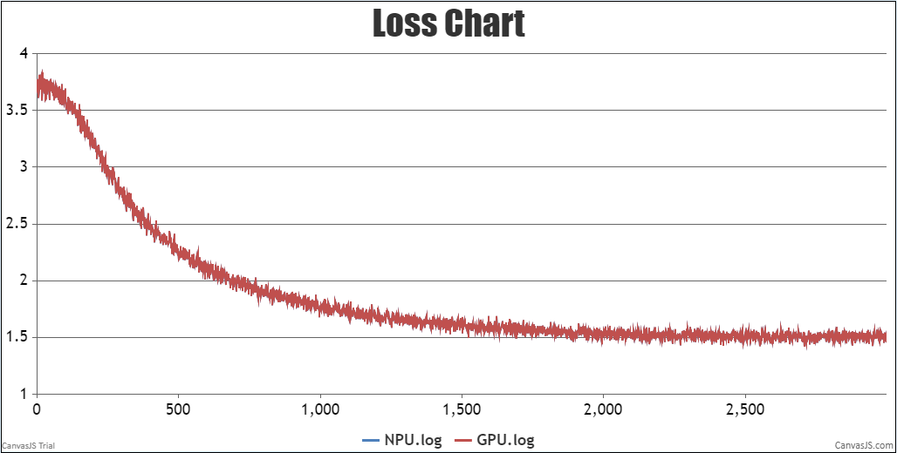

# Chinese-LLaMA-Alpaca

This directory contains scripts used to produce the results of Chinese-LLaMA-Alpaca in AscendSpeed.

Chinese-LLaMA-Alpaca model is from: [Efficient and Effective Text Encoding for Chinese LLaMA and Alpaca](https://arxiv.org/abs/2304.08177)

> Cui, Yang, and Yao, et al. "Efficient and Effective Text Encoding for Chinese LLaMA and Alpaca." arXiv preprint arXiv:2304.08177 (2023).


# Contents

- [Contents](#contents)

- [Model Weights](#model-Weights)

- [Merge Model](#merge-Model)

- [Fine-tune](#fine-tune)

  - [Training](#training)
  - [Script](#script)
  - [Performance](#performance)

    - [Machine performance](#machine-performance)
    - [Accuracy of the loss](#accuracy-of-the-loss)

  - [Inference](#Inference)
    - [Script](#script)

  - [Example](#example)

- [Citation](#citation)

  

# Model Weights


First download the [original LLaMA model](https://github.com/facebookresearch/llama) weights, then download the [Chinese-LLaMA-Alpaca model](https://github.com/ymcui/Chinese-LLaMA-Alpaca) LoRA weight, which can be understood as a "patch" on the original LLaMA model. And then merge the original LLaMA model with it to obtain a complete weight.

# Merge Weights

Before merging weights, please ensure that the machine has enough memory to load the complete model weights (for example, 7B model requires 13-15G) for the merge model operation. And confirm the integrity of the base model and the downloaded LoRA model, and check whether they are consistent with the values ​​shown in SHA256.md, otherwise the merge operation cannot be performed. The original LLaMA includes: tokenizer.model, tokenizer_checklist.chk, consolidated.*.pth, params.json. 

#### Step 1: [Convert the original LLaMA model to HF format.](https://github.com/ymcui/Chinese-LLaMA-Alpaca/wiki/%E6%89%8B%E5%8A%A8%E6%A8%A1%E5%9E%8B%E5%90%88%E5%B9%B6%E4%B8%8E%E8%BD%AC%E6%8D%A2#step-1-%E5%B0%86%E5%8E%9F%E7%89%88llama%E6%A8%A1%E5%9E%8B%E8%BD%AC%E6%8D%A2%E4%B8%BAhf%E6%A0%BC%E5%BC%8F)
Please use the script [convert_llama_weights_to_hf.py](https://github.com/huggingface/transformers/blob/main/src/transformers/models/llama/convert_llama_weights_to_hf.py) provided by Transformers to convert the original LLAMA model to `huggingFace` format. 
```
python convert_llama_weights_to_hf.py \
    --input_dir path_to_original_llama_root_dir \
    --model_size 7B \
    --output_dir path_to_original_llama_hf_dir
```

Model files in HF format will be generated in the `--output_dir` directory, such as:

```
config.json
generation_config.json
pytorch_model-00001-of-00002.bin
pytorch_model-00002-of-00002.bin
pytorch_model.bin.index.json
special_tokens_map.json
tokenizer_config.json
tokenizer.json
tokenizer.model
```

#### Step 2: [Combine LoRA weights to generate full model weights.](https://github.com/ymcui/Chinese-LLaMA-Alpaca/wiki/%E6%89%8B%E5%8A%A8%E6%A8%A1%E5%9E%8B%E5%90%88%E5%B9%B6%E4%B8%8E%E8%BD%AC%E6%8D%A2#step-2-%E5%90%88%E5%B9%B6lora%E6%9D%83%E9%87%8D%E7%94%9F%E6%88%90%E5%85%A8%E9%87%8F%E6%A8%A1%E5%9E%8B%E6%9D%83%E9%87%8D)

This step will expand the Chinese vocabulary of the original LLaMA model (HF format), merge the LoRA weights and generate the full model weights. Here you can choose to output the PyTorch version weight (.pth file) or HuggingFace version weight (.bin file). Please convert it to pth file first, compare the SHA256 of the merged model and then convert it to HF format as needed. 

**Single LoRA weight merging** (applicable to Chinese-LLaMA, Chinese-LLaMA-Plus, Chinese-Alpaca). 
Download the script [merge_llama_with_chinese_lora.py](https://github.com/ymcui/Chinese-LLaMA-Alpaca/blob/main/scripts/merge_llama_with_chinese_lora.py), and execute the following command:
```
python merge_llama_with_chinese_lora.py \
    --base_model path_to_original_llama_hf_dir \
    --lora_model path_to_chinese_llama_or_alpaca_lora \
    --output_type huggingface \
    --output_dir path_to_merged_hf_dir 
```
Parameter Description:

- `--base_model`：Directory to store LLAMA model weights and configuration files in HF format (STEP 1 generation).
- `--lora_model`：Directory where the Chinese LLAMA/Alpaca LoRA decompressed files are located. 
- `--output_type`: Specify the output format, which can be `pth` or `huggingface`. If it is not specified, the default is `pth`.
- `--output_dir`：Specify the directory of saving full model weight, default `./`.
- (Optional)`--offload_dir`(Only valid for old script `scripts/merge_llama_with_chinese_lora.py`)：For low memory users, you need to specify an Office cache path.
- (Optional)`--verbose`(Only valid for new script `scripts/merge_llama_with_chinese_lora_low_mem.py`)：Display the detailed information during the merge process.


**Multi-LoRA weight merging** (applicable to Chinese-Alpaca-Plus and Chinese-Alpaca-Pro). 
Download the script [merge_llama_with_chinese_lora.py](https://github.com/ymcui/Chinese-LLaMA-Alpaca/blob/main/scripts/merge_llama_with_chinese_lora.py), and execute the following command:
```
python merge_llama_with_chinese_lora.py \
    --base_model path_to_original_llama_hf_dir \
    --lora_model path_to_chinese_llama_plus_lora,path_to_chinese_alpaca_plus_lora \
    --output_type huggingface \
    --output_dir path_to_merged_hf_dir 
```

#### Step 3: Check SHA256 after merge.

 Be sure to check [SHA256](https://github.com/ymcui/Chinese-LLaMA-Alpaca/blob/main/SHA256.md) after the merge is complete. It is recommended to convert to pth format first, and after comparing the SHA256 is correct, then convert to HF format if necessary, because the model SHA256 corresponding to the HF format often changes (meta information changes).

#### Step 4: Convert ckpt from huggingface format to model parallel format. 

Based on megatron launcher, execute the following command:

```
python tools/ckpt_convert/llama/convert_weights_from_huggingface.py \
    --input-model-dir path_to_merged_hf_dir \
    --output-model-dir path_to_merged_ascendspeed_dir \
    --tensor-model-parallel-size 4 \
    --pipeline-model-parallel-size 2 \
    --type 7B                                                                    
```
Based on deepspeed launcher, execute the following command:

```
python tools/ckpt_convert/llama/convert_weights_from_huggingface.py \
    --input-model-dir path_to_merged_hf_dir \
    --output-model-dir path_to_merged_ascendspeed_dir \
    --tensor-model-parallel-size 1 \
    --pipeline-model-parallel-size 1 \
    --type 7B  \ 
    --deepspeed                                                                 
```


# Fine-tune
## Training
Here's a hardware summary of fine-tuning Chinese LLaMA Alpaca-13B:

| Hardware |                      Value                      |
| :------: | :---------------------------------------------: |
|   CPU    | 4xKunPeng920@3.0GHz，64 Core Pre Socket 256CPUS |
|   RAM    |                  32x64 GB DDR4                  |
|   NPU    |               8 x Ascend910 64G                |

Here's a software summary of fine-tuning Chinese LLaMA Alpaca-13B:
|         Software          |                Version                 |                                                                                      link                                                                                       |
| :-----------------------: |:--------------------------------------:|:-------------------------------------------------------------------------------------------------------------------------------------------------------------------------------:|
|          Python           |                 3.8.18                 |                                                                                        -                                                                                        |
|          driver           |             23.0.RC3.B070              | [link](https://support.huawei.com/enterprise/zh/ascend-computing/ascend-hdk-pid-252764743/software/261159048?idAbsPath=fixnode01%7C23710424%7C251366513%7C22892968%7C252764743) |
|         firmware          |              6.4.0.3.220               | [link](https://support.huawei.com/enterprise/zh/ascend-computing/ascend-hdk-pid-252764743/software/261159048?idAbsPath=fixnode01%7C23710424%7C251366513%7C22892968%7C252764743) |
|           CANN            |              7.0.RC1.B070              |    [link](https://support.huawei.com/enterprise/zh/ascend-computing/cann-pid-251168373/software/261305467?idAbsPath=fixnode01%7C23710424%7C251366513%7C22892968%7C251168373)    |
| binary arithmetic package | Ascend-cann-kernels-XXXX_7.0.RC1_linux |    [link](https://support.huawei.com/enterprise/zh/ascend-computing/cann-pid-251168373/software/261305467?idAbsPath=fixnode01%7C23710424%7C251366513%7C22892968%7C251168373)    |
|           torch           |                 2.0.1                  |                                                                                        -                                                                                        |
|         torch_npu         |                 2.0.1                  |                                                   [link](https://gitee.com/ascend/pytorch/releases/tag/v5.0.rc3-pytorch2.0.1)                                                   | 


## Script


1. Clone the repository to your local server

```bash
git clone https://gitee.com/ascend/AscendSpeed.git 
cd AscendSpeed 
mkdir logs
mkdir ckpt
```

2. Build environment

```bash
# python3.8
conda create -n test python=3.8
conda activate test

# install torch and torch_npu
pip install torch-2.0.1-cp38-cp38-manylinux2014_aarch64.whl
pip install torch_npu-2.0.1rc1.post_XXXXXX-cp38-cp38-linux_aarch64.whl

# install megatron-core
pip3 install -e git+https://github.com/NVIDIA/Megatron-LM.git@23.05#egg=megatron-core

# install deepspeed and deepspeed_npu
pip install deepspeed==0.9.2
git clone https://gitee.com/ascend/DeepSpeed.git -b v0.9.2 deepspeed_npu
cd deepspeed_npu
pip3 install -e ./

# install other packages
pip install -r requirements.txt -i https://pypi.tuna.tsinghua.edu.cn/simple
```
3. Prepare dataset
```bash
# for llama, download alpaca dataset and save it into $DATA_PATH, like
wget http://github.com/tatsu-lab/stanford_alpaca/blob/main/alpaca_data.json

# download tokenizer configs and (selective) weights from 
# https://huggingface.co/decapoda-research/llama-7b-hf/tree/main
# revise "LLaMATokenizer" as "LlamaTokenizer" in tokenizer_config.json (This is a bug of huggingface)
# save the downloaded tokenizer into $TOKENIZER_PATH
mkdir dataset
python tools/preprocess_data.py --input alpaca_data.json \
                                --output-prefix $DATA_PATH \
                                --tokenizer-type PretrainedFromHF \
                                --tokenizer-name-or-path $TOKENIZER_PATH \
                                --tokenizer-not-use-fast \
                                --handler-name GeneralInstructionHandler
```

4. Config Chinese-LLaMA-Alpaca fine-tune script 

Parameters of 7B/13B/33B are distinguished through `$MODEL_PATH`. For example, if `$MODEL_PATH` matches `*7b*`, then using the parameter of 7B.

* Based on PyTorch's built-in distributed launcher : [Chinese-LLaMA-Alpaca-7B/13B/33B](finetune_chinese_llama_alpaca_7_13_33b_tp4_pp2.sh)

```bash
bash examples/alpaca/finetune_chinese_llama_alpaca_7_13_33b_tp4_pp2.sh
```

* Based on Deepspeed launcher : [Chinese-LLaMA-Alpaca-7B/13B/33B](finetune_chinese_llama_alpaca_7_13_33b_tp1_pp1_deepspeed.sh)

```bash
bash examples/alpaca/finetune_chinese_llama_alpaca_7_13_33b_tp1_pp1_deepspeed.sh
```

## Performance

### Machine performance

The performance of the Chinese LLaMA Alpaca-13B in **Ascend910 NPUs** and **A100 GPUs**:

|  Device  |   Model   | total Iterations | throughput rate (samples/s/p) | throughput rate (tokens/s/p) | single-step time (s/step) | floating point operation (TFLOPs/s) |
| :------: | :-------: | :--------------: | :---------------------------: | :--------------------------: | :-----------------------: | :---------------------------------: |
|   GPUs   | Chinese LLaMA Alpaca-13B |       3000        |             5.83              |         1493.73            |           5.48           |                153.91                 |
|   NPUs   | Chinese LLaMA Alpaca-13B |       3000        |             6.08              |         1556.77            |           5.26           |                160.41                 |


### Accuracy of the loss

NPU vs GPU loss.

The NPU runs smoothly, the resource usage is stable, no errors are reported in the middle of the process, the Loss is on a decreasing trend, and the convergence speed is as expected.



NPU vs GPU loss relative error.

The relative error between NPU and GPU Loss is less than 0.02 throughout, as expected.


## Inference

We support AscendSpeed Inference for text generation with Chinese LLaMA Alpaca-13B.

### Script

We generate text samples using the `generate_alpaca` script. Inference different from pre-training, such as we need to Load pre training checkpoint and the length of the output samples:

Config Chinese LLaMA Alpaca-13B inference script: examples/alpaca/generate_alpaca_13B_tp8_pp1.sh

```shell
# modify the model weight path and tokenizer path
CHECKPOINT=<checkpoint-path>
VOCAB_FILE=<vocabfile-path>
```

```shell
bash examples/alpaca/generate_alpaca_13B_tp8_pp1.sh
```

## Example
Chinese LLaMA Alpaca-13B:


All the provided scripts are tested on 910 64GB NPUs for Chinese LLaMA Alpaca-13B(fp16). These scripts might not work for other models or a different number of NPUs.

> Note: Sometimes NPUs memory is not freed when inference deployment crashes. You can free this memory by running kill all python in terminal.


# Citation

You may also consider original work in your reference:

```
@article{chinese-llama-alpaca,
      title={Efficient and Effective Text Encoding for Chinese LLaMA and Alpaca}, 
      author={Cui, Yiming and Yang, Ziqing and Yao, Xin},
      journal={arXiv preprint arXiv:2304.08177},
      url={https://arxiv.org/abs/2304.08177},
      year={2023}
}
```