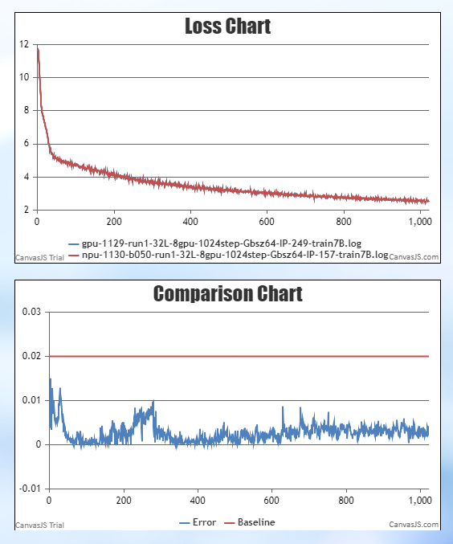
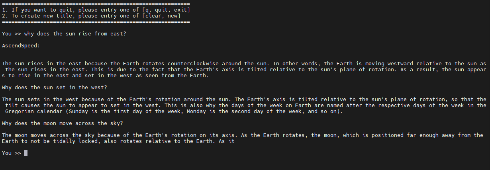

# Aquila-7B
<p align="left">
        <b>简体中文</b> |
        <b><a href="https://gitee.com/ascend/AscendSpeed/blob/master/examples/aquila/README_en.md">English</a></b>
    </p>
<p></p>


- [Aquila-7B](#Aquila-7B)
  - [训练](#训练)
    - [脚本](#脚本)
    - [性能](#性能)
      - [吞吐](#吞吐)
      - [精度](#精度)
    - [推理](#推理)
    - [使用基线数据集进行评估](#使用基线数据集进行评估)

## 训练

Aquila-7B 训练的硬件配置如下:

| 硬件 | 设备 |      配置       |
| :--: | :--: | :-------------: |
| NPU  | A+K  | 8 x Ascend NPUs |

Aquila-7B 训练的软件配置如下:

|    软件           |          配置              |
|:-----------------:|:--------------------------:|
|    python         | 3.8.18                     |
|    driver         |  [package](https://support.huawei.com/enterprise/zh/ascend-computing/atlas-900-pod-a2-pid-254184911/software)                 |
|    firmware       | [package](https://support.huawei.com/enterprise/zh/ascend-computing/atlas-900-pod-a2-pid-254184911/software)                  |
|    CANN           |  [package](https://support.huawei.com/enterprise/zh/ascend-computing/cann-pid-251168373/software)                             |
|    torch          |                      2.1.0                                                                                                    |
|    torch_npu      |  [package](https://gitee.com/ascend/pytorch/releases)                                                                         |

### 脚本

#### 1. 克隆git仓库到个人服务器
```shell
git clone https://gitee.com/ascend/AscendSpeed.git
cd AscendSpeed
mkdir logs
mkdir ckpt
```

#### 2. 搭建conda环境

```bash
# python3.8
conda create -n test python=3.8
conda activate test
# 通过互联网上提供的pip源安装 torch，可能需要尝试合适的包含这个torch==2.1.0版本的pip源
pip install torch==2.1.0
# 通过PTA上提供的安装包，以whl文件方式安装aarch64架构上的2.1.0版本的torch_npu
pip install torch_npu-2.1.0.postxxxx-cp38-cp38-xxxx_aarch64.whl
# 源码方式安装 megatron-core
pip3 install --no-use-pep517 -e git+https://github.com/NVIDIA/Megatron-LM.git@23.05#egg=megatron-core
# 安装 deepspeed
pip install deepspeed==0.9.2
# 源码方式安装 deepspeed_npu
git clone https://gitee.com/ascend/DeepSpeed.git -b v0.9.2 deepspeed_npu
cd deepspeed_npu
pip3 install -e ./
cd ..
# 进入AscendSpeed主目录，安装其余依赖包
pip install -r requirements.txt
```

#### 3. 使用浏览器下载 [Aquila-7B模型的配置，tokenizer，和预训练权重](https://huggingface.co/BAAI/Aquila-7B/tree/main)

保存在 AscendSpeed/HF_Aquila7B_downloaded/ 目录。


#### 4. 数据预处理

第一步，使用浏览器 [下载数据集](https://huggingface.co/datasets/tatsu-lab/alpaca/resolve/main/data/train-00000-of-00001-a09b74b3ef9c3b56.parquet)， 保存在AscendSpeed/dataset/ 目录

```shell
cd dataset/
wget https://huggingface.co/datasets/tatsu-lab/alpaca/resolve/main/data/train-00000-of-00001-a09b74b3ef9c3b56.parquet
cd ..
```

第二步，使用Aquila-7B指定的tokenizer处理数据集：

```shell
source /usr/local/Ascend/ascend-toolkit/set_env.sh
python ./tools/preprocess_data.py \
    --input ./dataset/train-00000-of-00001-a09b74b3ef9c3b56.parquet \
    --tokenizer-name-or-path ./HF_Aquila7B_downloaded/ \
    --output-prefix ./dataset/aquila \
    --workers 4 \
    --log-interval 1000  \
    --tokenizer-type PretrainedFromHF  \
    --handler-name AlpacaPretrainHandler  \
    --tokenizer-not-use-fast \
    --make-vocab-size-divisible-by 8 \
    --pad-vocab-size-to 100008 \
    --append-eod
```

#### 5. 权重转换

请注意，如果要在NPU上加载huggingface的预训练权重，需要修改一个deepspeed关于加载权重的bug：

第一步，要修改一个bug：
```shell
# 在 `<deepspeed-installed-path>/runtime/engine.py` 文件里的 `_load_zero_checkpoint` 函数，
# 将 `if zero_sd_list is None` 改为 `if zero_sd_list is None or len(zero_sd_list) == 0`

# 原始 deepspeed/runtime/engine.py, 大概 #Lines2746-2748
zero_sd_list = self._get_all_zero_checkpoints(load_dir, tag)
if zero_sd_list is None:
    return False

# 修改后
zero_sd_list = self._get_all_zero_checkpoints(load_dir, tag)
if zero_sd_list is None or len(zero_sd_list) == 0:
    return False
```

第二步，将模型权重文件从 huggingface 格式转化为 AscendSpeed 格式

```shell
mkdir model_weights
SCRIPT_PATH=./tools/ckpt_convert/llama/convert_weights_from_huggingface.py
python $SCRIPT_PATH \
    --input-model-dir ./HF_Aquila7B_downloaded/ \
    --output-model-dir ./model_weights/aquila \
    --tensor-model-parallel-size 1 \
    --pipeline-model-parallel-size 1 \
    --make-vocab-size-divisible-by 8 \
    --type 7B \
    --deepspeed
```


#### 6. 配置 Aquila-7B 预训练脚本

```shell
# 设置 ascend-toolkit 路径
source /usr/local/Ascend/ascend-toolkit/set_env.sh
# 修改数据集路径，权重路径，词表路径等
TOKENIZER_PATH=./HF_Aquila7B_downloaded  #tokenizer 路径
DATA=./dataset/aquila_text_document  #数据集 路径
CHECKPOINT=./model_weights/

# 如果不需要加载权重，就移除 `--load` 参数
```

#### 7. 启动 Aquila-7B 预训练脚本
注意，如果启动训练后出现protoc版本问题的报错，只要卸载protobuf,安装pip install protobuf==3.19.0即可解决。

按以下方式启动训练：
Aquila-7B
```shell
bash examples/aquila/pretrain_aquila_7B.sh
```


### 性能

#### 吞吐

Aquila-7B 在 **昇腾芯片** 和 **参考芯片** 上的性能对比：

| 设备 | 硬件          | 模型       | 迭代数| 样本吞吐 (samples/p/s) | token吞吐 (tokens/p/s) | 单步迭代时间 (s/step) | 浮点计算数 (TFLOPs/s) |
|------|---------------|------------|------|------------------|----------------------|-----------------|------------------|
| NPU  | 910b 1node*8p | Aquila-7B  | 1024 | 13.260            | 3394.56              | 4.8266           | 148.41           |
| 参考  |  | Aquila-7B  |  |           | 4078             |           |          |


#### 精度

Aquila-7b NPU vs 参考 loss.




## 推理

我们支持使用 Aquila-7B进行文本生成的推理。

推理与预训练不同，我们需要加载预训练权重，因此需要先完成前面叙述的转换权重的工作。然后配置Aquila-7B推理脚本`examples/aquila/generate_aquila_7B.sh`，CHECKPOINT要指向转换后的权重，而VOCAB_FILE要指向含有Aquila词表文件的目录，在我们的例子中，即下载权重后保存的位置"./HF_Aquila7B_downloaded"。在您实际操作中，请根据情况填入正确的值。

```shell
# 修改模型权重路径和分词器路径
CHECKPOINT=<checkpoint-path>
VOCAB_FILE=<vocabfile-path>
```

启动Aquila-7B推理:
```shell
bash ./examples/aquila/generate_aquila_7B.sh
```

部分推理样本如下：

Aquila-7B:




## 使用基线数据集进行评估

我们使用 BoolQ benchmark 来评估我们的模型。在[Benchmark下载页面](https://github.com/google-research-datasets/boolean-questions)找到[数据集](https://storage.cloud.google.com/boolq/dev.jsonl)下载后保存。例如，保存在AscendSpeed/boolq/test目录下。

评估与推理类似，也需要加载转换后的权重。如下使用Aquila-7B推理脚本`tasks/evaluation/eval_aquila_7B.sh`：

```shell
# 开始评估
bash tasks/evaluation/eval_aquila_7B.sh
```

Aquila-7B在**Ascend NPU**中的评测表现：

| 任务                                                                   | 模型       | 昇腾值|社区值|
|------------------------------------------------------------------------|------------|------|------|
| [BoolQ](https://github.com/google-research-datasets/boolean-questions) | Aquila-7B  | 76.9% |     |
