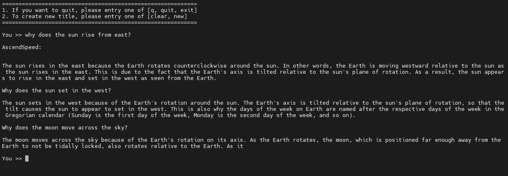

# Aquila-7B

<p align="left">
        <b><a href="https://gitee.com/ascend/AscendSpeed/blob/master/examples/aquila/README.md">简体中文</a></b> |
        <b>English</b>
    </p>
</p>


- [Aquila-7B/13B](#aquila-7b)
  - [Training](#training)
    - [Script](#script)
    - [Performance](#performance)
      - [Machine performance](#machine-performance)
      - [Accuracy of the loss](#accuracy-of-the-loss)
  - [Inference](#Inference)
  - [Evaluation with Benchmark](#Evaluation-with-Benchmark)
## Training

Here's a hardware summary of pre-training Aquila-7B:

| Hardware | Device |      Value       |
|:--------:|:------:|:----------------:|
|   NPU    |  A+K   | 8 x Ascend NPUs  |

Here's a software summary of pre-training Aquila-7B:


|  Software         |       Version              |
|:-----------------:|:--------------------------:|
|    python         | 3.8.18                     |
|    driver         |  [package](https://support.huawei.com/enterprise/zh/ascend-computing/atlas-900-pod-a2-pid-254184911/software)                 |
|    firmware       | [package](https://support.huawei.com/enterprise/zh/ascend-computing/atlas-900-pod-a2-pid-254184911/software)                  |
|    CANN           |  [package](https://support.huawei.com/enterprise/zh/ascend-computing/cann-pid-251168373/software)                             |
|    torch          |                      2.1.0                                                                                                    |
|    torch_npu      |  [package](https://gitee.com/ascend/pytorch/releases)                                                                         |

### Script

#### 1. Clone the repository to your local server:
```shell
git clone https://gitee.com/ascend/AscendSpeed.git
cd AscendSpeed
mkdir logs
mkdir ckpt
```

#### 2. Build environment

```bash
# python3.8
conda create -n test python=3.7
conda activate test
# install torch and torch_npu
pip install torch==2.1.0
pip install torch_npu-2.1.0.postxxxx-cp38-cp38-xxxx_aarch64.whl
# install megatron-core
pip3 install --no-use-pep517 -e git+https://github.com/NVIDIA/Megatron-LM.git@23.05#egg=megatron-core
# install deepspeed and deepspeed_npu
pip install deepspeed==0.9.2
git clone https://gitee.com/ascend/DeepSpeed.git -b v0.9.2 deepspeed_npu
cd deepspeed_npu
pip3 install -e ./
cd ..
# enter the AscendSpeed/ directory and install other packages
pip install -r requirements.txt
```


#### 3. Download the Aquila-7B model, config, and tokenizer from [here](https://huggingface.co/BAAI/Aquila-7B/tree/main)

save to AscendSpeed/HF_Aquila7B_downloaded/ directory.


#### 4. Prepare dataset.

step1: Download the datasets from [here](https://huggingface.co/datasets/tatsu-lab/alpaca/resolve/main/data/train-00000-of-00001-a09b74b3ef9c3b56.parquet), save to AscendSpeed/dataset/ directory.

```shell
cd dataset/
wget https://huggingface.co/datasets/tatsu-lab/alpaca/resolve/main/data/train-00000-of-00001-a09b74b3ef9c3b56.parquet
cd ..
```


step2: use Aquila-7B specified tokenizer to pre-process data:


```shell
source /usr/local/Ascend/ascend-toolkit/set_env.sh
python ./tools/preprocess_data.py \
    --input ./dataset/train-00000-of-00001-a09b74b3ef9c3b56.parquet \
    --tokenizer-name-or-path ./HF_Aquila7B_downloaded/ \
    --output-prefix ./dataset/aquila \
    --workers 4 \
    --log-interval 1000  \
    --tokenizer-type PretrainedFromHF  \
    --handler-name AlpacaPretrainHandler  \
    --tokenizer-not-use-fast \
    --make-vocab-size-divisible-by 8 \
    --pad-vocab-size-to 100008 \
    --append-eod
```

#### 5. Weights convert

Note: if you want to train with the weight from huggingface, please run fix a deepspeed loading checkpointing bug by modified `if zero_sd_list is None` as `if zero_sd_list is None or len(zero_sd_list) == 0` in the `_load_zero_checkpoint` function of `<deepspeed-installed-path>/runtime/engine.py`

step1: fix a bug:
```python
    # original deepspeed/runtime/engine.py, about #Lines2746-2748
    zero_sd_list = self._get_all_zero_checkpoints(load_dir, tag)
    if zero_sd_list is None:
        return False

    # modified
    zero_sd_list = self._get_all_zero_checkpoints(load_dir, tag)
    if zero_sd_list is None or len(zero_sd_list) == 0:
        return False
```

step2: convert the model pre-training weights.

```shell
mkdir model_weights
SCRIPT_PATH=./tools/ckpt_convert/llama/convert_weights_from_huggingface.py
python $SCRIPT_PATH \
    --input-model-dir ./HF_Aquila7B_downloaded/ \
    --output-model-dir ./model_weights/aquila \
    --tensor-model-parallel-size 1 \
    --pipeline-model-parallel-size 1 \
    --make-vocab-size-divisible-by 8 \
    --type 7B \
    --deepspeed
```


#### 6. Config Aquila-7B pre-training script.

```shell
# modify the script according to your own  ascend-toolkit path
source /usr/local/Ascend/ascend-toolkit/set_env.sh
# modify script orign dataset path according to your own dataset path
TOKENIZER_PATH=./HF_Aquila7B_downloaded    #tokenizer path
DATA=./dataset/aquila_text_document   #processed dataset
CHECKPOINT=./model_weights/
```
*Note that if you do not load weights for pre-training, remove the `--load` parameter from the training script*

#### 7. Launch Aquila-7B pre-training script.
(note: if you see protoc version error, please uninstall existing protobuf and install protobuf==3.19.0 to solve it.)

start training Aquila-7B model:
```shell
bash examples/aquila/pretrain_aquila_7B.sh
```


### Performance

#### Machine performance

The performance of Aquila-7B in **Ascend NPU** and **Reference**:

| Device    | Hardware | Model     | total Iterations | throughput rate (samples/s/p) | throughput rate (tokens/s/p) | single-step time (s/step) | floating point operation (TFLOPs/s) |
|------|---------------|------------|------|------------------|----------------------|-----------------|------------------|
| NPU  | 910b 1node*8p | Aquila-7B  | 1024 | 13.260            | 3394.56              | 4.8266           | 148.41           |
| Reference  |  | Aquila-7B  |  |          | 4078             |           |            |


#### Accuracy of the loss

Aquila-7B NPU vs Reference loss.


## Inference

We support AscendSpeed Inference for text generation with Aquila 7B model.

Inference is different from pre-training because it requires loading the pre-trained model weights. Therefore, we need to complete the aforementioned model weight conversion task first, then configure the Aquila-7B Inference shell script `examples/aquila/generate_aquila_7B.sh`. "CHECKPOINT" must point to the converted weights directory, and "VOCAB_FILE" must point to the directory which contains Aquila vocabulary files -- in our example, it is "./HF_Aquila7B_downloaded". In your operation, please fill in correct value based on your actual scenario.

```shell
# please change to actual values
CHECKPOINT=<checkpoint-path>
VOCAB_FILE=<vocabfile-path>
```

Start Aquila-7B Inference:
```shell
bash ./examples/aquila/generate_aquila_7B.sh
```

Sample results of Aquila-7B Inference:




## Evaluation with Benchmark

We use BoolQ benchmark to evaluate our model. You can [go to the BoolQ Benchmark page](https://github.com/google-research-datasets/boolean-questions) and find the [dataset](https://storage.cloud.google.com/boolq/dev.jsonl), download it and save it. For example, save to "AscendSpeed/boolq/test" directory

Evaluation task is similar to inference task，it also requires loading the pre-trained model weights. You can use the Aquila-7B evaluation script `examples/aquila/generate_aquila_7B.sh` as below:

```shell
# Start evaluation task
bash examples/aquila/eval_aquila_7B.sh
```

Sample Aquila-7B performance running in **Ascend NPU**:

| Task                                                                   | Model     | NPU | Benchmark |
|------------------------------------------------------------------------|------------|------|------|
| [BoolQ](https://github.com/google-research-datasets/boolean-questions) | Aquila-7B  | 76.9% |     |
