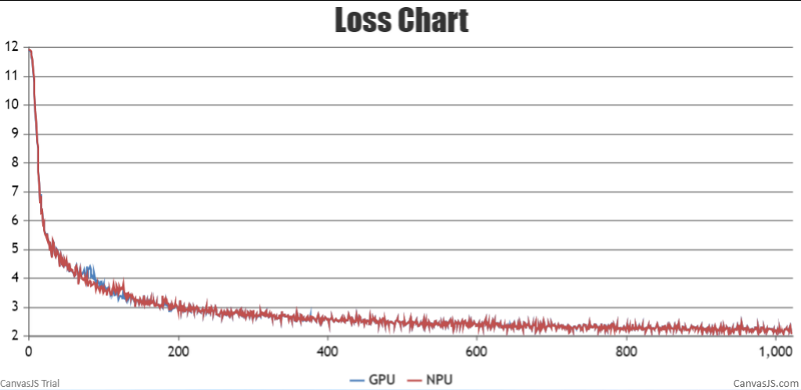
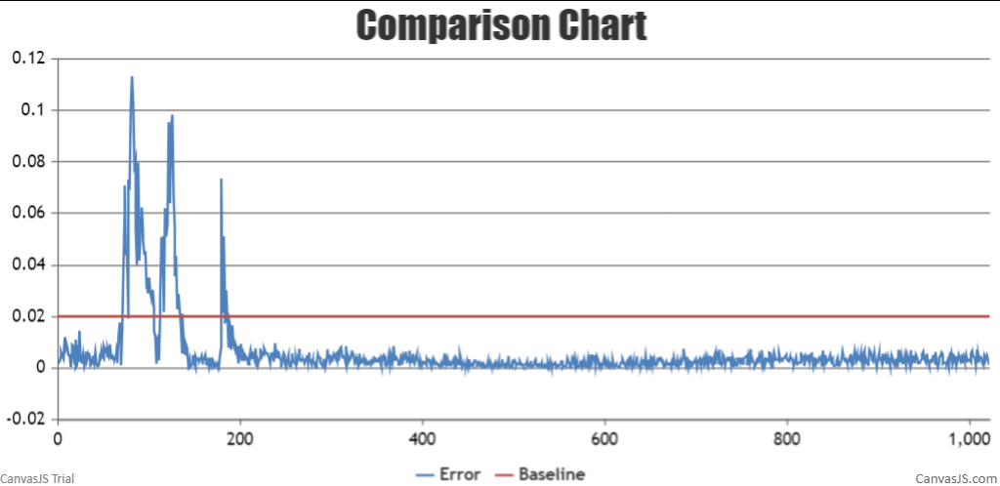
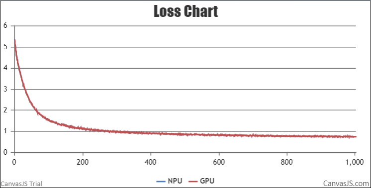

#  Contents

- [Baichuan-7B](#contents)
  - [Training](#pre-training)
  - [Script](#script)
  - [Performance](#performance)
    - [Machine performance](#machine-performance)
    - [Accuracy of the loss](#accuracy-of-the-loss)

- [Baichuan-13B](#contents)
  - [Training](#pre-training)
  - [Script](#script)
  - [Performance](#performance)
    - [Machine performance](#machine-performance)
    - [Accuracy of the loss](#accuracy-of-the-loss)

# Baichuan-7B

## Training

Here's a quick summary of training Baichuan-7B:

|          |                                               |
| -------- | --------------------------------------------- |
| Hardware | 1x8 Ascend NPUs                          |
| Software | AscendSpeed                                   |
| Dataset  | train-00000-of-00001-a09b74b3ef9c3b56.parquet |


### Script

1. Clone the repository to your local server:
```shell
git clone https://gitee.com/ascend/AscendSpeed.git 
cd AscendSpeed 
mkdir logs
mkdir ckpt
```

2. Build environment

```bash
# python3.7
conda create -n test python=3.7
conda activate test

# install torch and torch_npu
pip install torch-1.11.0-cp37-cp37m-linux_aarch64.whl
pip install torch_npu-1.11.0.post4_XXXXXX-cp37-cp37m-linux_aarch64.whl
pip install apex-0.1_ascend_XXXXXX-cp37-cp37m-linux_aarch64.whl

# install deepspeed and deepspeed_npu
pip install deepspeed==0.9.2
git clone https://gitee.com/ascend/DeepSpeed.git -b v0.9.2 deepspeed_npu
cd deepspeed_npu
pip3 install -e ./
cd ..


# install other packages
pip install -r requirements.txt 
```
3. Prepare pretrained weights
Download the Baichuan-7B checkpoint from [here](https://huggingface.co/baichuan-inc/Baichuan-7B/tree/main) 

```shell
  #!/bin/bash
  mkdir tokenizer
  cd ./tokenizer
  wget https://huggingface.co/baichuan-inc/Baichuan-7B/resolve/main/config.json
  wget https://huggingface.co/baichuan-inc/Baichuan-7B/resolve/main/generation_config.json
  wget https://huggingface.co/baichuan-inc/Baichuan-7B/resolve/main/special_tokens_map.json
  wget https://huggingface.co/baichuan-inc/Baichuan-7B/resolve/main/tokenization_baichuan.py
  wget https://huggingface.co/baichuan-inc/Baichuan-7B/resolve/main/tokenizer.model
  wget https://huggingface.co/baichuan-inc/Baichuan-7B/resolve/main/tokenizer_config.json
  cd ..
```

4. Prepare dataset

Download the Baichuan-7B datasets from [here](https://huggingface.co/datasets/tatsu-lab/alpaca/resolve/main/data/train-00000-of-00001-a09b74b3ef9c3b56.parquet) 

```shell
  # download datasets
  mkdir dataset_baichuan
  cd ./dataset_baichuan
  wget https://huggingface.co/datasets/tatsu-lab/alpaca/resolve/main/data/train-00000-of-00001-a09b74b3ef9c3b56.parquet
  cd ..

  # process datasets                              
  python ./tools/preprocess_data.py \
    --input ./dataset_baichuan/train-00000-of-00001-a09b74b3ef9c3b56.parquet \
    --tokenizer-name-or-path ./tokenizer \
    --output-prefix ./dataset_baichuan/alpaca \
    --workers 4 \
    --log-interval 1000 \
    --tokenizer-type PretrainedFromHF
```


5. Config Baichuan-7B pre-training script : examples/baichuan/pretrain_baichuan_zero_7B.sh 

```shell
# modify the script according to your own  ascend-toolkit path
source /usr/local/Ascend/ascend-toolkit/set_env.sh 

# modify script orign dataset path according to your own dataset path
TOKENIZER_PATH=./tokenizer/  #tokenizer path
DATA_PATH=./dataset_baichuan/alpaca_text_document  #processed dataset
```

6. Launch Baichuan-7B  pre-training script :examples/baichuan/pretrain_baichuan_zero_7B.sh 

```shell
bash examples/baichuan/pretrain_baichuan_zero_7B.sh 
```


### Performance

#### Machine performance

The performance of Baichuan-7B in **Ascend NPU** and **Reference**:

| Device | Model       | total Iterations | throughput rate (samples/s/p) | throughput rate (tokens/s/p) | single-step time (s/step) | floating point operation (TFLOPs/s) |
| ------ | ----------- | ---------------- | ----------------------------- | ---------------------------- | ------------------------- | ----------------------------------- |
| NPUs   | Baichuan-7B | 1024             | 3.250                         | 1914                         | 2.14                      | 102.69                              |
| Reference   | Baichuan-7B | 1024             | 3.978                         | 2068                         | 1.98                      | 125.66                              |


#### Accuracy of the loss

NPU vs GPU loss.

The NPU runs smoothly, the resource usage is stable, no errors are reported in the middle of the process, the Loss is on a decreasing trend, and the convergence speed is as expected. The relative error of the average loss is 0.01093, less than 2%, the maximum relative error is 0.1243, and the maximum absolute error is 0.4859. The precision meets the requirements.



NPU vs GPU loss relative error.




# Baichuan-13B

## Training
Here's a quick summary of training baichuan-13B:

|          |                          |
| :------: | :----------------------: |
| Hardware |   1x8 Ascend NPUs   |
| Software |       AscendSpeed        |
| Dataset  | alpaca-data-conversation |


### Script
1. Clone the repository to your local server:
```shell
git clone https://gitee.com/ascend/AscendSpeed.git 
cd AscendSpeed 
mkdir logs
mkdir ckpt
```
2. Build environment

```bash
# python3.7
conda create -n test python=3.7
conda activate test

# install torch and torch_npu
pip install torch-1.11.0-cp37-cp37m-linux_aarch64.whl
pip install torch_npu-1.11.0.post4_XXXXXX-cp37-cp37m-linux_aarch64.whl
pip install apex-0.1_ascend_XXXXXX-cp37-cp37m-linux_aarch64.whl

# install deepspeed and deepspeed_npu
pip install deepspeed==0.9.2
git clone https://gitee.com/ascend/DeepSpeed.git -b v0.9.2 deepspeed_npu
cd deepspeed_npu
pip3 install -e ./
cd ..

# install other packages
pip install -r requirements.txt -i https://pypi.tuna.tsinghua.edu.cn/simple
```

3. Prepare pretrained weights


Download the Baichuan-13B checkpoint from [here](https://huggingface.co/baichuan-inc/Baichuan-13B-Chat/tree/main) 
```shell
  mkdir tokenizer
  cd ./tokenizer
  wget https://huggingface.co/baichuan-inc/Baichuan-13B-Chat/resolve/main/config.json
  wget https://huggingface.co/baichuan-inc/Baichuan-13B-Chat/resolve/main/configuration_baichuan.py
  wget https://huggingface.co/baichuan-inc/Baichuan-13B-Chat/resolve/main/generation_config.json
  wget https://huggingface.co/baichuan-inc/Baichuan-13B-Chat/resolve/main/modeling_baichuan.py
  wget https://huggingface.co/baichuan-inc/Baichuan-13B-Chat/resolve/main/pytorch_model-00001-of-00003.bin
  wget https://huggingface.co/baichuan-inc/Baichuan-13B-Chat/resolve/main/pytorch_model-00002-of-00003.bin
  wget https://huggingface.co/baichuan-inc/Baichuan-13B-Chat/resolve/main/pytorch_model-00003-of-00003.bin
  wget https://huggingface.co/baichuan-inc/Baichuan-13B-Chat/resolve/main/pytorch_model.bin.index.json
  wget https://huggingface.co/baichuan-inc/Baichuan-13B-Chat/resolve/main/quantizer.py
  wget https://huggingface.co/baichuan-inc/Baichuan-13B-Chat/resolve/main/special_tokens_map.json
  wget https://huggingface.co/baichuan-inc/Baichuan-13B-Chat/resolve/main/tokenization_baichuan.py
  wget https://huggingface.co/baichuan-inc/Baichuan-13B-Chat/resolve/main/tokenizer_config.json
  wget https://huggingface.co/baichuan-inc/Baichuan-13B-Chat/resolve/main/tokenizer.model
  cd ..
```

In order to adapt to the baichuan-13B model, the following script is used to convert the model pre-training weights.
```shell
mkdir model_weights

SCRIPT_PATH=./tools/ckpt_convert/llama/convert_weights_from_huggingface.py
python $SCRIPT_PATH \
    --input-model-dir ./tokenizer \
    --output-model-dir ./model_weights \
    --tensor-model-parallel-size 8 \
    --pipeline-model-parallel-size 1 \
    --type 13B 
```

4. Prepare dataset
Download the Baichuan-13B datasets from [here](https://github.com/lm-sys/FastChat/blob/v0.1.10/playground/data/alpaca-data-conversation.json) 

```shell
  mkdir dataset_baichuan
  mkdir model_save
  cd ./dataset_baichuan
  wget https://github.com/lm-sys/FastChat/blob/v0.1.10/playground/data/alpaca-data-conversation.json
  cd ..

```

```shell
#!/bin/bash

SCRIPT_PATH=./tools/preprocess_data.py
python $SCRIPT_PATH \
    --llama-json-data-path ./dataset_baichuan/alpaca-data-conversation.json \
    --tokenizer-model-path ./tokenizer \
    --output-prefix internlm_eos_text \
    --workers 4 \
    --log-interval 1000 
```


5. Config Baichuan-13B pre-training script: /examples/baichuan/pretrain_baichuan_ptd_13B.sh


```shell
# modify the script according to your own  ascend-toolkit path
source /usr/local/Ascend/ascend-toolkit/set_env.sh 

# modify script orign dataset path according to your own dataset path
TOKENIZER_PATH=./tokenizer/  
DATA_PATH=./dataset_baichuan/internlm_eos_text  
LOAD_PATH=./model_weights
CHECKPOINT_PATH=./model_save
```

6. Launch Baichuan-13B pre-training script: /examples/baichuan/pretrain_baichuan_ptd_13B.sh

```bash
bash examples/baichuan/pretrain_baichuan_ptd_13B.sh
```

There is an hourly pulse checking script running that checks that the training is either running or scheduled.


### Performance

#### Machine performance

The performance of the Baichuan-13B in **Ascend NPU** and **Reference**:

| Device |    Model     | total Iterations | throughput rate (samples/s/p) | throughput rate (tokens/s/p) | single-step time (s/step) | floating point operation (TFLOPs/s) |
| :----: | :----------: | :--------------: | :---------------------------: | :--------------------------: | :-----------------------: | :---------------------------------: |
|  NPUs  | Baichuan-13B |       1000       |             1.928             |             1024             |          16.067           |                89.37                |
|  Reference  | Baichuan-13B |       1000       |             1.535             |             785              |          20.852           |                68.39                |


#### Accuracy of the loss

NPU vs GPU loss.

The NPU runs smoothly, the resource usage is stable, no errors are reported in the middle of the process, the Loss is on a decreasing trend, and the convergence speed is as expected.



NPU vs GPU loss relative error.

The relative error between NPU and GPU Loss is less than 0.02 throughout, as expected.


