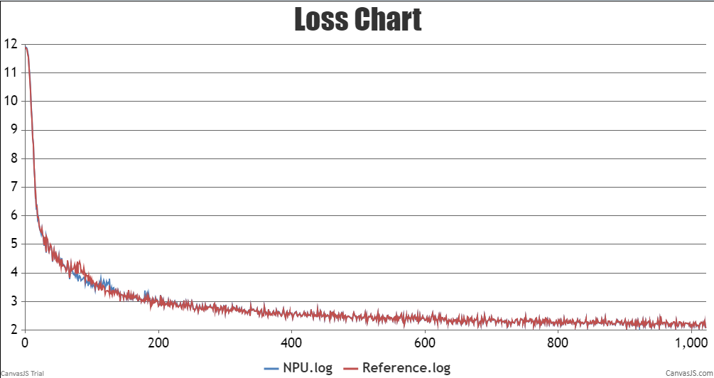
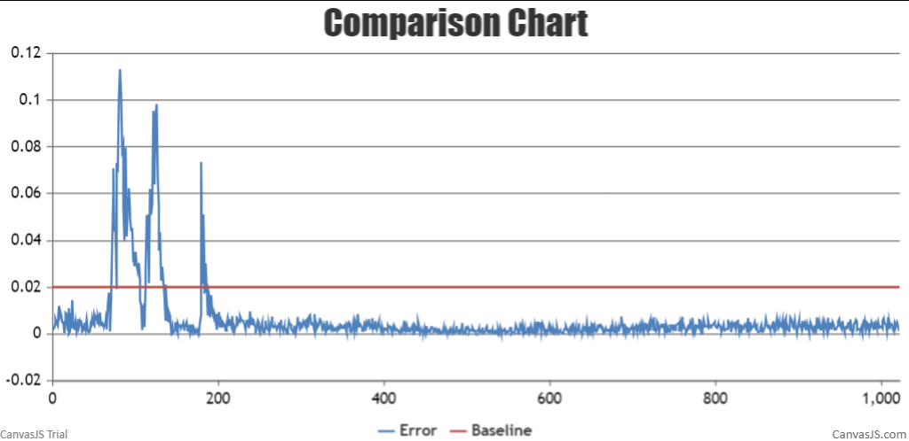
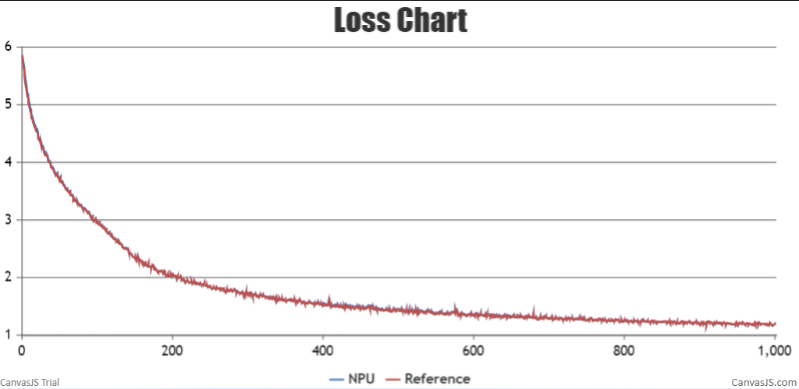
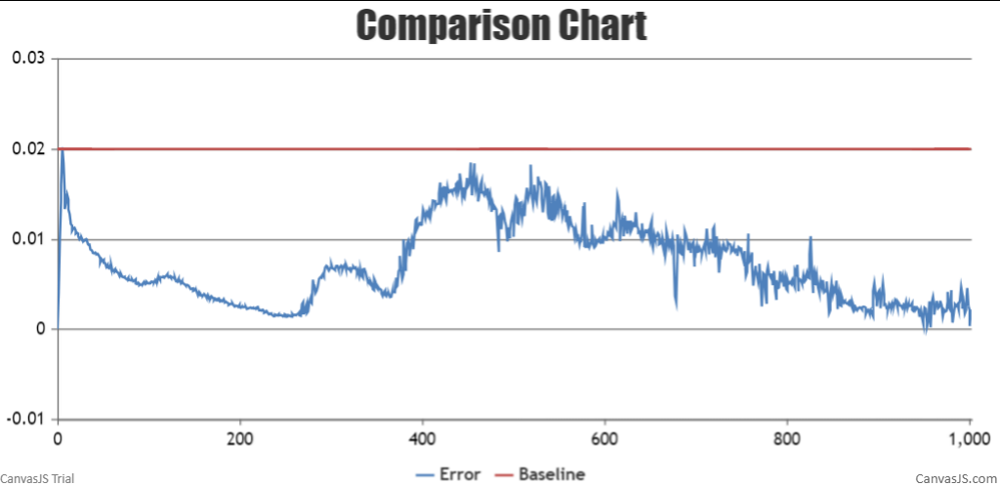
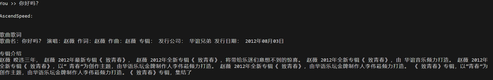
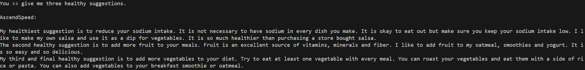

# BaiChuan
<p align="left">
        <b>简体中文</b> |
        <b><a href="https://gitee.com/ascend/AscendSpeed/blob/master/examples/baichuan/README_en.md">English</a> </b> 
    </p>
</p>


#  目录

- [Baichuan-7B](#Baichuan-7B)
  - [训练](#训练)
  - [脚本](#脚本)
  - [性能](#性能)
    - [吞吐](#吞吐)
    - [精度](#精度)

- [Baichuan-13B](#Baichuan-13B)
  - [训练](#训练)
  - [脚本](#脚本)
  - [性能](#性能)
    - [吞吐](#吞吐)
    - [精度](#精度)
  - [推理](#推理)
  - [lora微调](#lora微调)

# Baichuan-7B

## 训练
Baichuan-7B 训练的硬件配置如下：

|  硬件 |       配置        |
|:---:|:---------------:|
| NPU | 8 x Ascend NPUs |

Baichuan-7B 训练的软件配置如下： 

|            软件             |                                                              配置                                                              |
|:-------------------------:|:----------------------------------------------------------------------------------------------------------------------------:|
|          python           |                                                            3.8.18                                                            |
|          driver           |         [package](https://support.huawei.com/enterprise/zh/ascend-computing/atlas-900-pod-a2-pid-254184911/software)         |
|         firmware          |         [package](https://support.huawei.com/enterprise/zh/ascend-computing/atlas-900-pod-a2-pid-254184911/software)         |
|           CANN            |               [package](https://support.huawei.com/enterprise/zh/ascend-computing/cann-pid-251168373/software)               |
| binary arithmetic package |               [package](https://support.huawei.com/enterprise/zh/ascend-computing/cann-pid-251168373/software)               |
|           torch           |                                                            2.1.0                                                            |
|         torch_npu         |                                     [package](https://gitee.com/ascend/pytorch/releases)                                     |
|           apex            | [package](https://pytorch-package.obs.cn-north-4.myhuaweicloud.com/pta/Daily/v1.11.0/20230915.2/pytorch_v1.11.0_py37.tar.gz) |


### 脚本

1. 拷贝仓库到你的个人服务器：
```shell
git clone https://gitee.com/ascend/AscendSpeed.git 
cd AscendSpeed 
mkdir logs
mkdir ckpt
```

2. 搭建环境

```bash
# python3.8
conda create -n test python=3.8
conda activate test

# 安装 torch 和 torch_npu 
pip install torch-2.1.0-cp37-cp37m-linux_aarch64.whl
pip install torch_npu-2.1.0.XXX-cp37-cp37m-linux_aarch64.whl
pip install apex-0.1_ascend*-cp38-cp38m-linux_aarch64.whl

# 安装 megatron-core
pip3 install --no-use-pep517 -e git+https://github.com/NVIDIA/Megatron-LM.git@23.05#egg=megatron-core

# 安装 deepspeed 和 deepspeed_npu
pip install deepspeed==0.9.2
git clone https://gitee.com/ascend/DeepSpeed.git -b v0.9.2 deepspeed_npu
cd deepspeed_npu
pip3 install -e ./
cd ..


# 安装其余依赖库
pip install -r requirements.txt 
```

3. （可选）准备预训练权重

从 [huggingface](https://huggingface.co/baichuan-inc/Baichuan-7B/tree/main) 下载预训练权重：

```text
# 请注意，如果要加载huggingface的预训练权重，需要修改一个deepspeed关于加载权重的bug：
# 在 `<deepspeed-installed-path>/runtime/engine.py` 文件里的 `_load_zero_checkpoint` 函数，
# 将 `if zero_sd_list is None` 改为 `if zero_sd_list is None or len(zero_sd_list) == 0`

# 原始 deepspeed/runtime/engine.py, 大概 #Lines2746-2748
zero_sd_list = self._get_all_zero_checkpoints(load_dir, tag)
if zero_sd_list is None:
    return False

# 修改后
zero_sd_list = self._get_all_zero_checkpoints(load_dir, tag)
if zero_sd_list is None or len(zero_sd_list) == 0:
    return False
```

```shell
mkdir baichuan-7B-hf
cd ./baichuan-7B-hf
wget https://huggingface.co/baichuan-inc/Baichuan-7B/resolve/main/config.json
wget https://huggingface.co/baichuan-inc/Baichuan-7B/resolve/main/configuration_baichuan.py
wget https://huggingface.co/baichuan-inc/Baichuan-7B/resolve/main/generation_config.json
wget https://huggingface.co/baichuan-inc/Baichuan-7B/resolve/main/handler.py
wget https://huggingface.co/baichuan-inc/Baichuan-7B/resolve/main/modeling_baichuan.py
wget https://huggingface.co/baichuan-inc/Baichuan-7B/resolve/main/pytorch_model.bin
wget https://huggingface.co/baichuan-inc/Baichuan-7B/resolve/main/special_tokens_map.json
wget https://huggingface.co/baichuan-inc/Baichuan-7B/resolve/main/tokenization_baichuan.py
wget https://huggingface.co/baichuan-inc/Baichuan-7B/resolve/main/tokenizer.model
wget https://huggingface.co/baichuan-inc/Baichuan-7B/resolve/main/tokenizer_config.json
cd ..
```

接着将hf格式的权重转化为AscendSpeed可以加载的形式：
```shell
mkdir weight

SCRIPT_PATH=./tools/ckpt_convert/llama/convert_weights_from_huggingface.py
python $SCRIPT_PATH \
    --input-model-dir ./baichuan-7B-hf \
    --output-model-dir ./weight \
    --tensor-model-parallel-size 1 \
    --pipeline-model-parallel-size 1 \
    --type 7B \
    --pse \
    --deepspeed \
    --use_wpack_rotray \
    --load_weight_map   
```


4. 准备数据集

从 [这里](https://huggingface.co/datasets/tatsu-lab/alpaca/resolve/main/data/train-00000-of-00001-a09b74b3ef9c3b56.parquet) 下载 BaiChuan-7B 的数据集：

```shell
# 下载数据集
mkdir dataset_baichuan7B
cd ./dataset_baichuan7B
wget https://huggingface.co/datasets/tatsu-lab/alpaca/resolve/main/data/train-00000-of-00001-a09b74b3ef9c3b56.parquet
cd ..

# 准备数据集                              
python ./tools/preprocess_data.py \
--input ./dataset_baichuan7B/train-00000-of-00001-a09b74b3ef9c3b56.parquet \
--tokenizer-name-or-path ./baichuan-7B-hf \
--output-prefix ./dataset_baichuan7B/alpaca \
--workers 4 \
--log-interval 1000 \
--tokenizer-type PretrainedFromHF
```


5. 配置 Baichuan-7B 预训练脚本: examples/baichuan/pretrain_baichuan_zero_7B.sh 

```shell
# 修改 ascend-toolkit 路径
source /usr/local/Ascend/ascend-toolkit/set_env.sh 

# 修改数据集，权重，词表等路径
TOKENIZER_PATH=./baichuan-7B-hf/  #tokenizer 路径
DATA_PATH=./dataset_baichuan7B/alpaca_text_document  #数据集路径
# 如果要加载权重，可以增加参数 `--load ./weight`
```

6. 启动 Baichuan-7B 预训练脚本: examples/baichuan/pretrain_baichuan_zero_7B.sh 

```shell
bash examples/baichuan/pretrain_baichuan_zero_7B.sh 
```

### 性能

#### 吞吐

Baichuan-7B 使用 **昇腾芯片** 和 **参考芯片** 的吞吐对比:

| 设备 | 模型     | 迭代 | 样本吞吐 (samples/p/s) | tokens吞吐 (tokens/p/s) | 单步迭代时间 (s/step) | 浮点计算数 (TFLOPs/s) |
|----|--------|----|--------------------|-----------------------|-----------------|------------------|
| NPUs | Baichuan-7B | 1024 | 4.590              | 2350                  | 1.74            | 144.95           |
| 参考 | Baichuan-7B | 1024 | 3.978              | 2036                  | 1.98            | 125.66           |


#### 精度

NPU vs 参考 loss.



NPU vs 参考 loss 相对误差.




# Baichuan-13B

## 训练

Baichuan-13B 训练的硬件配置如下:

|  硬件 |       配置        |
|:---:|:---------------:|
| NPU | 8 x Ascend NPUs |

Baichuan-13B 训练的软件配置如下:

|            软件             |                                                      配置                                                      |
|:-------------------------:|:------------------------------------------------------------------------------------------------------------:|
|          python           |                                                    3.8.18                                                    |
|          driver           | [package](https://support.huawei.com/enterprise/zh/ascend-computing/atlas-900-pod-a2-pid-254184911/software) |
|         firmware          | [package](https://support.huawei.com/enterprise/zh/ascend-computing/atlas-900-pod-a2-pid-254184911/software) |
|           CANN            |       [package](https://support.huawei.com/enterprise/zh/ascend-computing/cann-pid-251168373/software)       |
| binary arithmetic package |       [package](https://support.huawei.com/enterprise/zh/ascend-computing/cann-pid-251168373/software)       |
|           torch           |                                                    2.1.0                                                    |
|         torch_npu         |                             [package](https://gitee.com/ascend/pytorch/releases)                             |


### 脚本
1. 将仓库拷贝到你的个人服务器:
```shell
git clone https://gitee.com/ascend/AscendSpeed.git 
cd AscendSpeed 
mkdir logs
mkdir ckpt
```
2. 搭建环境

```bash
# python3.8
conda create -n test python=3.8
conda activate test

# 安装 torch 和 torch_npu
pip install torch-2.1.0-cp37-cp37m-linux_aarch64.whl
pip install torch_npu-2.1.0.XXX-cp37-cp37m-linux_aarch64.whl
pip install apex-0.1_ascend*-cp38-cp38m-linux_aarch64.whl

# 安装 megatron
git clone https://github.com/NVIDIA/Megatron-LM.git -b 23.05
cd Megatron-LM
pip3 install -e ./
cd ..

# 安装 deepspeed 和 deepspeed_npu
pip install deepspeed==0.9.2
git clone https://gitee.com/ascend/DeepSpeed.git -b v0.9.2 deepspeed_npu
cd deepspeed_npu
pip3 install -e ./
cd ..

# 安装其余依赖库
pip install -r requirements.txt -i https://pypi.tuna.tsinghua.edu.cn/simple
```

3. （可选的）准备预训练权重

从 [huggingface](https://huggingface.co/baichuan-inc/Baichuan-13B-Base/tree/main) 下载预训练权重
```shell
mkdir baichuan-13B-hf
cd ./baichuan-13B-hf
wget https://huggingface.co/baichuan-inc/Baichuan-13B-Base/resolve/main/config.json
wget https://huggingface.co/baichuan-inc/Baichuan-13B-Base/resolve/main/configuration_baichuan.py
wget https://huggingface.co/baichuan-inc/Baichuan-13B-Base/resolve/main/generation_config.json
wget https://huggingface.co/baichuan-inc/Baichuan-13B-Base/resolve/main/modeling_baichuan.py
wget https://huggingface.co/baichuan-inc/Baichuan-13B-Base/resolve/main/pytorch_model-00001-of-00003.bin
wget https://huggingface.co/baichuan-inc/Baichuan-13B-Base/resolve/main/pytorch_model-00002-of-00003.bin
wget https://huggingface.co/baichuan-inc/Baichuan-13B-Base/resolve/main/pytorch_model-00003-of-00003.bin
wget https://huggingface.co/baichuan-inc/Baichuan-13B-Base/resolve/main/pytorch_model.bin.index.json
wget https://huggingface.co/baichuan-inc/Baichuan-13B-Base/resolve/main/quantizer.py
wget https://huggingface.co/baichuan-inc/Baichuan-13B-Base/resolve/main/special_tokens_map.json
wget https://huggingface.co/baichuan-inc/Baichuan-13B-Base/resolve/main/tokenization_baichuan.py
wget https://huggingface.co/baichuan-inc/Baichuan-13B-Base/resolve/main/tokenizer_config.json
wget https://huggingface.co/baichuan-inc/Baichuan-13B-Base/resolve/main/tokenizer.model
cd ..
```

将 BaiChuan-13B 模型权重从 huggingface 格式转换为 AscendSpeed 格式
```shell
mkdir weight

SCRIPT_PATH=./tools/ckpt_convert/llama/convert_weights_from_huggingface.py
python $SCRIPT_PATH \
    --input-model-dir ./baichuan-13B-hf \
    --output-model-dir ./weight \
    --tensor-model-parallel-size 8 \
    --pipeline-model-parallel-size 1 \
    --type 13B \
    --pse     
```

4. 准备数据集

下载 Baichuan-13B [数据集](https://huggingface.co/datasets/tatsu-lab/alpaca/resolve/main/data/train-00000-of-00001-a09b74b3ef9c3b56.parquet) 

```shell
mkdir dataset_baichuan13B
cd ./dataset_baichuan13B
wget https://huggingface.co/datasets/tatsu-lab/alpaca/resolve/main/data/train-00000-of-00001-a09b74b3ef9c3b56.parquet
cd ..

python ./tools/preprocess_data.py \
    --input ./dataset_baichuan13B/train-00000-of-00001-a09b74b3ef9c3b56.parquet \
    --tokenizer-name-or-path ./baichuan-13B-hf \
    --output-prefix ./dataset_baichuan13B/alpaca \
    --workers 4 \
    --log-interval 1000 \
    --tokenizer-type PretrainedFromHF 
```


5. 配置 Baichuan-13B 训练脚本: /examples/baichuan/pretrain_baichuan_ptd_13B.sh


```shell
# 修改 ascend-toolkit 路径
source /usr/local/Ascend/ascend-toolkit/set_env.sh 

# 修改词表，数据集等路径
TOKENIZER_PATH=./baichuan-13B-hf  
DATA_PATH=./dataset_baichuan13B/alpaca_text_document  
```

6. 启动 Baichuan-13B 训练脚本: /examples/baichuan/pretrain_baichuan_ptd_13B.sh

```bash
bash examples/baichuan/pretrain_baichuan_ptd_13B.sh
```

```text
当要开启FA时，在脚本中添加`--use-flash-attn`与`--square-alibi-mask`来使能，同时不要使用`--is-instruction-dataset`.
```

### 性能

#### 吞吐

Baichuan-13B 在 **昇腾芯片** 和 **参考芯片** 上的性能对比:

|  设备  |      模型      | 迭代数  | 样本吞吐 (samples/p/s) | token吞吐 (tokens/p/s) | 单步迭代时间 (s/step) | 浮点计算数 (TFLOPs/s) |
|:----:|:------------:|:----:|:------------------:|:--------------------:|:---------------:|:----------------:|
| NPUs | Baichuan-13B | 1000 |       1.985        |         1016         |     16.121      |      88.47       |
|  参考  | Baichuan-13B | 1000 |       1.535        |         862          |     19.852      |      72.39       |


#### 精度

NPU vs 参考 loss.




NPU vs 参考 loss 相对误差.




### 推理
我们支持使用 Baichuan-13B 进行文本生成的推理。
推理与预训练不同，比如我们需要加载预训练权重和输出样本的长度：

配置Baichuan-13B推理脚本`examples/baichuan/generate_baichuan_13B_tp8_pp1.sh`。

```shell
# 配置模型权重路径和分词器路径
CHECKPOINT=<checkpoint-path>
VOCAB_FILE=<vocabfile-path>
```

Baichuan-13B:
```shell
bash ./examples/baichuan/generate_baichuan_13B_tp8_pp1.sh
```

部分推理样本如下：


 如果在运行脚本的过程中遇到 "'BaichuanTokenizer' object has no attribute 'sp_model'" 的问题，请参考[huggingface链接解决](https://huggingface.co/baichuan-inc/Baichuan2-13B-Base/discussions)，或者更新transformers的版本.


### Lora微调
我们支持使用 Baichuan-13B 进行lora微调。
配置 Baichuan-13B 的lora脚本`examples/baichuan/tune_baichuan_ptd_13B.sh`

```shell
# 配置数据集路径、初始megatron权重路径、词表路径以及保存权重的路径
DATA_PATH=<data-path>
LOAD_CHECKPOINT_PATH=<origin-ckpt-path>
SAVE_CHECKPOINT_PATH=<ckpt-path>
TOKENIZER_PATH=<tokenizer-path>
```

Baichuan-13B:
```shell
bash ./examples/baichuan/tune_baichuan_ptd_13B.sh
```

```shell
# 再使用微调后的权重进行推理
CHECKPOINT=<origin-ckpt-path>
LORA_CHECKPOINT=<tune-weight-path>
VOCAB_FILE=<tokenizer-path>
```

```shell
bash ./examples/baichuan/generate_baichuan_lora_13B.sh
```

使用lora进行微调后的推理功能：



### 评估
我们使用boolq基准来评估我们的模型。基准[下载](https://huggingface.co/datasets/boolq).

```shell
# 配置原始权重与词表的路径
CHECKPOINT=<origin-ckpt-path>
VOCAB_FILE=<tokenizer-path>
# 配置任务以及数据路径
DATA_PATH="./boolq/test/"
TASK="boolq"
```

```shell
bash ./tasks/evaluation/eval_baichuan_13B.sh
```

<table>
  <thead>
    <tr>
      <th>任务</th>
      <th>验证集</th>
      <th>模型</th>
      <th>昇腾值</th>
      <th>社区值</th>
    </tr>
  </thead>
  <tbody>
    <tr>
      <td><a href="https://huggingface.co/datasets/boolq">Boolq</a></td>
      <td>Test</td>
      <th>Baichuan 13B</th>
      <td>0.747</td>
      <td><a href="https://opencompass.org.cn/dataset-detail/BoolQ">0.736</a></td>
    </tr>
  </tbody>
</table>
