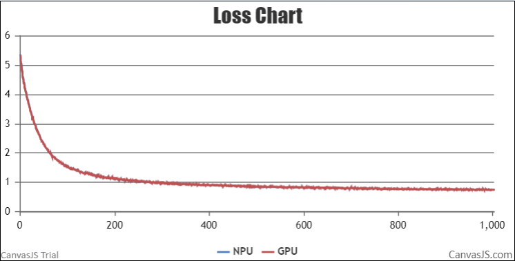
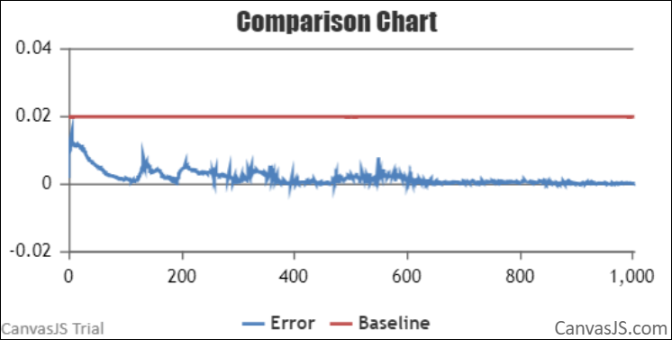

#  Contents

- [Baichuan-7B](#contents)
  - [Training](#pre-training)
  - [Datasets](#datasets)
  - [Script](#script)
  - [Performance](#performance)
    - [Machine performance](#machine-performance)
    - [Accuracy of the loss](#accuracy-of-the-loss)

- [Baichuan-13B](#contents)
  - [Training](#pre-training)
  - [Datasets](#datasets)
  - [Model weights](#Model) 
  - [Script](#script)
  - [Performance](#performance)
    - [Machine performance](#machine-performance)
    - [Accuracy of the loss](#accuracy-of-the-loss)

# Baichuan-7B

## Training

Here's a quick summary of training Baichuan-7B:

|          |                                               |
| -------- | --------------------------------------------- |
| Hardware | 1x8 Ascend 910B NPUs                          |
| Software | AscendSpeed                                   |
| Dataset  | train-00000-of-00001-a09b74b3ef9c3b56.parquet |

### Datasets

Download the Baichuan-7B datasets from [here](https://huggingface.co/baichuan-inc/Baichuan-7B/tree/main) 

```
1、download tokenizer
	https://huggingface.co/baichuan-inc/Baichuan-7B/tree/main
2、download datasets
	wget https://huggingface.co/datasets/tatsu-lab/alpaca/resolve/main/data/train-00000-of-00001-a09b74b3ef9c3b56.parquet
3、process datasets
mkdir dataset                               
python tools/preprocess_data.py \
    --input train-00000-of-00001-a09b74b3ef9c3b56.parquet \
    --tokenizer-name-or-path ./tokenizer \
    --output-prefix ./dataset/alpaca \
    --workers 4 \
    --log-interval 1000 \
    --tokenizer-type PretrainedFromHF
```

### Script

1. Clone the repository to your local server:
```shell
git clone https://gitee.com/ascend/AscendSpeed.git 
cd AscendSpeed 
mkdir logs
mkdir ckpt
```

2. Build environment

```bash
# python3.7
conda create -n test python=3.7
conda activate test

# install torch and torch_npu
pip install torch-1.11.0-cp37-cp37m-linux_aarch64.whl
pip install torch_npu-1.11.0.post4_XXXXXX-cp37-cp37m-linux_aarch64.whl
pip install apex-0.1_ascend_XXXXXX-cp37-cp37m-linux_aarch64.whl

# install deepspeed and deepspeed_npu
pip install deepspeed==0.9.2
git clone https://gitee.com/ascend/DeepSpeed.git -b v0.9.2 deepspeed_npu
cd deepspeed_npu
pip3 install -e ./

# install other packages
pip install -r requirements.txt -i https://pypi.tuna.tsinghua.edu.cn/simple
```

3. Config Baichuan-7B pre-training script : examples/baichuan/pretrain_baichuan_zero_7B.sh 

```
# modify the script according to your own  ascend-toolkit path
source /usr/local/Ascend/ascend-toolkit/set_env.sh 

# modify script orign dataset path according to your own dataset path
TOKENIZER_PATH=./tokenizer/  #tokenizer path
DATA_PATH=./dataset/alpaca/alpaca_text_document  #processed data set
```

4. Launch Baichuan-7B  pre-training script :examples/baichuan/pretrain_baichuan_zero_7B.sh 

```
bash examples/baichuan/pretrain_baichuan_zero_7B.sh 
```


### Performance

#### Machine performance

The performance of the NPUs in **Ascend910B 64GB** :

| Device | Model       | total Iterations | throughput rate (samples/s/p) | throughput rate (tokens/s/p) | single-step time (s/step) | floating point operation (TFLOPs/s) |
| ------ | ----------- | ---------------- | ----------------------------- | ---------------------------- | ------------------------- | ----------------------------------- |
| NPUs   | Baichuan-7B | 1024             | 3.250                         | 1914                         | 2.14                      | 102.69                              |
| GPUs   | Baichuan-7B | 1024             | 3.978                         | 2068                         | 1.98                      | 125.66                              |

Notes:

- Baichuan-7B model trained on alpaca-data-conversation on a single machine with 8 NPUs


#### Accuracy of the loss

NPU vs GPU loss.

The NPU runs smoothly, the resource usage is stable, no errors are reported in the middle of the process, the Loss is on a decreasing trend, and the convergence speed is as expected. The relative error of the average loss is 0.01093, less than 2%, the maximum relative error is 0.1243, and the maximum absolute error is 0.4859. The precision meets the requirements.


NPU vs GPU loss relative error.


# Baichuan-13B

## Training
Here's a quick summary of training baichuan-13B:

|          |                          |
| :------: | :----------------------: |
| Hardware |   1x8 Ascend 910B NPUs   |
| Software |       AscendSpeed        |
| Dataset  | alpaca-data-conversation |

### Datasets

Download the Baichuan-13B datasets from [here](https://github.com/lm-sys/FastChat/blob/v0.1.10/playground/data/alpaca-data-conversation.json) 

```shell
#!/bin/bash

SCRIPT_PATH=./tools/ckpt_convert/preprocess_data.py
python $SCRIPT_PATH \
    --llama-json-data-path "your alpaca-data-conversation.json download path" \
    --tokenizer-model-path "your tokenizer output path" \
    --output-prefix internlm_eos_text \
    --workers 4 \
    --log-interval 1000 
```

### Model weights

Download the Baichuan-13B checkpoint from [here](https://huggingface.co/baichuan-inc/Baichuan-13B-Chat/tree/main) 

```shell
#!/bin/bash

SCRIPT_PATH=./tools/ckpt_convert/llama/convert_weights_from_huggingface.py
python $SCRIPT_PATH \
    --input-model-dir "your huggingface checkpoint path" \
    --output-model-dir "your ascendspeed checkpoint path" \
    --tensor-model-parallel-size 8 \
    --pipeline-model-parallel-size 1 \
    --type 13B 
```

### Script
1. Clone the repository to your local server:
```shell
git clone https://gitee.com/ascend/AscendSpeed.git 
cd AscendSpeed 
mkdir logs
mkdir ckpt
```
2. Build environment

```bash
# python3.7
conda create -n test python=3.7
conda activate test

# install torch and torch_npu
pip install torch-1.11.0-cp37-cp37m-linux_aarch64.whl
pip install torch_npu-1.11.0.post4_XXXXXX-cp37-cp37m-linux_aarch64.whl
pip install apex-0.1_ascend_XXXXXX-cp37-cp37m-linux_aarch64.whl

# install deepspeed and deepspeed_npu
pip install deepspeed==0.9.2
git clone https://gitee.com/ascend/DeepSpeed.git -b v0.9.2 deepspeed_npu
cd deepspeed_npu
pip3 install -e ./

# install other packages
pip install -r requirements.txt -i https://pypi.tuna.tsinghua.edu.cn/simple
```

3.Config Baichuan-13B pre-training script: /examples/baichuan/pretrain_baichuan_ptd_13B.sh

```bash
# This is an example: training llama using PTD/

# The number of parameters is not aligned
export LD_LIBRARY_PATH=/usr/local/lib:/root/miniconda3/lib:$LD_LIBRARY_PATH
export HCCL_CONNECT_TIMEOUT=1200


# Change for multinode config
MASTER_ADDR=localhost
MASTER_PORT=12892
NNODES=1
NODE_RANK=0
NPUS_PER_NODE=8
WORLD_SIZE=$(($NPUS_PER_NODE*$NNODES))
GLOBAL_BATCH=32
MICRO_BATCH=1

DATA_PATH=./data/baichuan_text
TOKENIZER_PATH=./tokenizer
 
CHECKPOINT_PATH=./ckpt
LOAD_PATH=./weight

DISTRIBUTED_ARGS="--nproc_per_node $NPUS_PER_NODE --nnodes $NNODES --node_rank $NODE_RANK --master_addr $MASTER_ADDR --master_port $MASTER_PORT"

logfile=$(date +%Y%m%d)_$(date +%H%M%S)
rm -rf kernel_meta*

# Main script
python -m torch.distributed.launch $DISTRIBUTED_ARGS \
       pretrain_baichuan.py \
       --DDP-impl local \
       --tensor-model-parallel-size 8 \
       --pipeline-model-parallel-size 1 \
       --sequence-parallel \
       --num-layers 40 \
       --hidden-size 5120 \
       --ffn-hidden-size 13696 \
       --num-attention-heads 40 \
       --micro-batch-size $MICRO_BATCH \
       --global-batch-size $GLOBAL_BATCH \
       --seq-length 4096 \
       --max-position-embeddings 4096 \
       --train-iters 100000 \
       --save $CHECKPOINT_PATH \
       --load $LOAD_PATH \
       --data-path $DATA_PATH \
       --tokenizer-name-or-path $TOKENIZER_PATH \
       --tokenizer-not-use-fast \
       --data-impl mmap \
       --split 949,50,1 \
       --make-vocab-size-divisible-by 8 \
       --distributed-backend nccl \
       --lr 1e-6 \
       --lr-decay-style cosine \
       --min-lr 1e-8 \
       --weight-decay 1e-1 \
       --position-embedding-type alibi \
       --clip-grad 1.0 \
       --initial-loss-scale 8188.0 \
       --seed 1234 \
       --adam-beta1 0.9 \
       --adam-beta2 0.95 \
       --adam-eps 1.0e-5 \
       --log-interval 1 \
       --save-interval 1000 \
       --eval-interval 1000 \
       --eval-iters 10 \
       --fp16 | tee logs/loss_${logfile}.log

```

4.Launch Baichuan-13B pre-training script: /examples/baichuan/pretrain_baichuan_ptd_13B.sh

```bash
bash examples/baichuan/pretrain_baichuan_ptd_13B.sh
```

There is an hourly pulse checking script running that checks that the training is either running or scheduled.

The Training log will look like these:

```Shell
TODO
```

### Performance

#### Machine performance

The performance of the NPUs in **Ascend910 B1 64GB** and GPUs is **A800**:

| Device |    Model     | total Iterations | throughput rate (samples/s/p) | throughput rate (tokens/s/p) | single-step time (s/step) | floating point operation (TFLOPs/s) |
| :----: | :----------: | :--------------: | :---------------------------: | :--------------------------: | :-----------------------: | :---------------------------------: |
|  GPUs  | Baichuan-13B |       1000       |             1.535             |             785              |          20.852           |                68.39                |
|  NPUs  | Baichuan-13B |       1000       |             1.928             |             1024             |          16.067           |                89.37                |


Notes: 

- Baichuan-13B model trained on alpaca-data-conversation on a single machine with 8 NPUs


#### Accuracy of the loss

NPU vs GPU loss.

The NPU runs smoothly, the resource usage is stable, no errors are reported in the middle of the process, the Loss is on a decreasing trend, and the convergence speed is as expected.



NPU vs GPU loss relative error.

The relative error between NPU and GPU Loss is less than 0.02 throughout, as expected.




