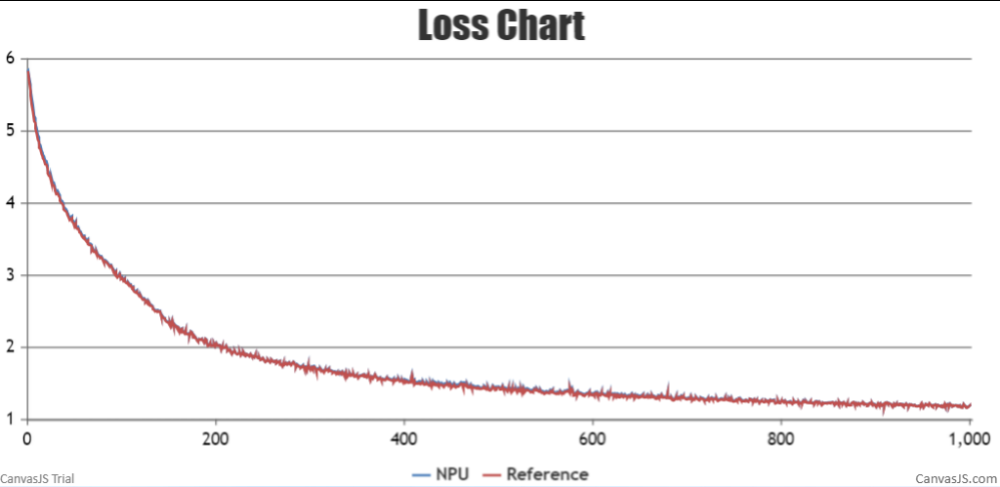
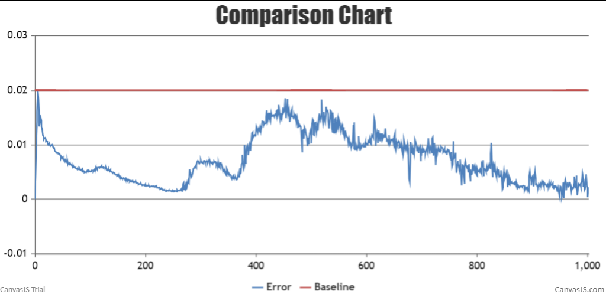
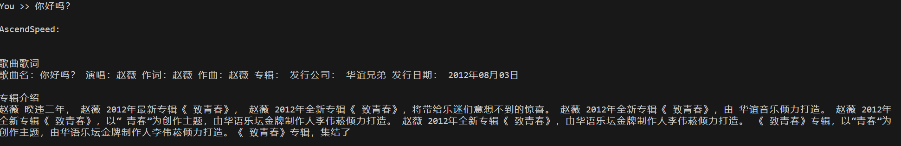
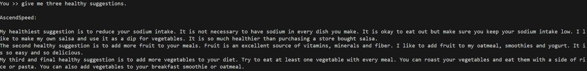

# BaiChuan
<p align="left">
        <b><a href="https://gitee.com/ascend/AscendSpeed/blob/master/examples/baichuan/README.md">简体中文</a></b> |
        <b>English</b> 
    </p>
</p>


#  Contents

- [Baichuan-7B](#contents)
  - [Training](#pre-training)
  - [Script](#script)
  - [Performance](#performance)
    - [Machine performance](#machine-performance)
    - [Accuracy of the loss](#accuracy-of-the-loss)

- [Baichuan-13B](#contents)
  - [Training](#pre-training)
  - [Script](#script)
  - [Performance](#performance)
    - [Machine performance](#machine-performance)
    - [Accuracy of the loss](#accuracy-of-the-loss)
  - [Inference](#inference)
  - [Lora](#lora)
  - [Evaluation](#evaluation)

# Baichuan-7B

## Training

Here's a hardware summary of pre-training Baichuan-7B:

| Hardware |                      Value                      |
| :------: | :---------------------------------------------: |
|   NPU    |               8 x Ascend NPUs                   |

Here's a software summary of pre-training Baichuan-7B: 


|         Software          |   Version   |
| :-----------------------: |:-----------:|
|          Python           |   3.8.18    |
|          driver           | [package](https://support.huawei.com/enterprise/zh/ascend-computing/atlas-900-pod-a2-pid-254184911/software) |
|         firmware          | [package](https://support.huawei.com/enterprise/zh/ascend-computing/atlas-900-pod-a2-pid-254184911/software) |
|           CANN            |       [package](https://support.huawei.com/enterprise/zh/ascend-computing/cann-pid-251168373/software)       |
| binary arithmetic package |       [package](https://support.huawei.com/enterprise/zh/ascend-computing/cann-pid-251168373/software)       |
|           torch           |                                                    2.1.0                                                    |
|         torch_npu         |                             [package](https://gitee.com/ascend/pytorch/releases)                             |
|           apex            |       [package](https://pytorch-package.obs.cn-north-4.myhuaweicloud.com/pta/Daily/v1.11.0/20230915.2/pytorch_v1.11.0_py37.tar.gz)       |


### Script

1. Clone the repository to your local server:
```shell
git clone https://gitee.com/ascend/AscendSpeed.git 
cd AscendSpeed 
mkdir logs
mkdir ckpt
```

2. Build environment

```bash
# python3.8
conda create -n test python=3.8
conda activate test

# install torch and torch_npu 
pip install torch-2.1.0-cp38-cp38m-linux_aarch64.whl
pip install torch_npu-2.1.0.XXX-cp38-cp38m-linux_aarch64.whl
pip install apex-0.1_ascend*-cp38-cp38m-linux_aarch64.whl

# install megatron-core
pip3 install --no-use-pep517 -e git+https://github.com/NVIDIA/Megatron-LM.git@23.05#egg=megatron-core

# install deepspeed and deepspeed_npu
pip install deepspeed==0.9.2
git clone https://gitee.com/ascend/DeepSpeed.git -b v0.9.2 deepspeed_npu
cd deepspeed_npu
pip3 install -e ./
cd ..


# install other packages
pip install -r requirements.txt 
```

*Note that if you want to train with the weight from huggingface, please run fix a deepspeed loading checkpointing bug by modified `if zero_sd_list is None` as `if zero_sd_list is None or len(zero_sd_list) == 0` in the `_load_zero_checkpoint` function of `<deepspeed-installed-path>/runtime/engine.py`*
     
```text
# original deepspeed/runtime/engine.py, about #Lines2746-2748
zero_sd_list = self._get_all_zero_checkpoints(load_dir, tag)
if zero_sd_list is None:
    return False

# modified
zero_sd_list = self._get_all_zero_checkpoints(load_dir, tag)
if zero_sd_list is None or len(zero_sd_list) == 0:
    return False
```
3. Prepare pretrained weights
Download the Baichuan-7B checkpoint from [here](https://huggingface.co/baichuan-inc/Baichuan-7B/tree/main) 

```shell
mkdir baichuan-7B-hf
cd ./baichuan-7B-hf
wget https://huggingface.co/baichuan-inc/Baichuan-7B/resolve/main/config.json
wget https://huggingface.co/baichuan-inc/Baichuan-7B/resolve/main/configuration_baichuan.py
wget https://huggingface.co/baichuan-inc/Baichuan-7B/resolve/main/generation_config.json
wget https://huggingface.co/baichuan-inc/Baichuan-7B/resolve/main/handler.py
wget https://huggingface.co/baichuan-inc/Baichuan-7B/resolve/main/modeling_baichuan.py
wget https://huggingface.co/baichuan-inc/Baichuan-7B/resolve/main/pytorch_model.bin
wget https://huggingface.co/baichuan-inc/Baichuan-7B/resolve/main/special_tokens_map.json
wget https://huggingface.co/baichuan-inc/Baichuan-7B/resolve/main/tokenization_baichuan.py
wget https://huggingface.co/baichuan-inc/Baichuan-7B/resolve/main/tokenizer.model
wget https://huggingface.co/baichuan-inc/Baichuan-7B/resolve/main/tokenizer_config.json
cd ..
```
In order to adapt to the baichuan-7B model, the following script is used to convert the model pre-training weights.
```shell
mkdir weight

SCRIPT_PATH=./tools/ckpt_convert/llama/convert_weights_from_huggingface.py
python $SCRIPT_PATH \
    --input-model-dir ./baichuan-7B-hf \
    --output-model-dir ./weight \
    --tensor-model-parallel-size 1 \
    --pipeline-model-parallel-size 1 \
    --type 7B \
    --pse \
    --deepspeed \
    --use_wpack_rotray \
    --load_weight_map   
```


4. Prepare dataset

Download the Baichuan-7B datasets from [here](https://huggingface.co/datasets/tatsu-lab/alpaca/resolve/main/data/train-00000-of-00001-a09b74b3ef9c3b56.parquet) 

```shell
# download datasets
mkdir dataset_baichuan7B
cd ./dataset_baichuan7B
wget https://huggingface.co/datasets/tatsu-lab/alpaca/resolve/main/data/train-00000-of-00001-a09b74b3ef9c3b56.parquet
cd ..

# process datasets                              
python ./tools/preprocess_data.py \
--input ./dataset_baichuan7B/train-00000-of-00001-a09b74b3ef9c3b56.parquet \
--tokenizer-name-or-path ./baichuan-7B-hf \
--output-prefix ./dataset_baichuan7B/alpaca \
--workers 4 \
--log-interval 1000 \
--tokenizer-type PretrainedFromHF
```


5. Config Baichuan-7B pre-training script : examples/baichuan/pretrain_baichuan_zero_7B.sh 

```shell
# modify the script according to your own  ascend-toolkit path
source /usr/local/Ascend/ascend-toolkit/set_env.sh 

# modify script orign dataset path according to your own dataset path
TOKENIZER_PATH=./baichuan-7B-hf/  #tokenizer path
DATA_PATH=./dataset_baichuan7B/alpaca_text_document  #processed dataset
```

6. Launch Baichuan-7B  pre-training script: examples/baichuan/pretrain_baichuan_zero_7B.sh 

```shell
bash examples/baichuan/pretrain_baichuan_zero_7B.sh 
```
*Note that if you want to train with weights from the huggingface, please add a parameter to the script  `pretrain_baichuan_zero_7B.sh` by inserting `--load ./weight` at lines 74 - 107 and rerun it.*


### Performance

#### Machine performance

The performance of Baichuan-7B in **Ascend NPU** and **Reference**:

| Device | Model       | total Iterations | throughput rate (samples/s/p) | throughput rate (tokens/s/p) | single-step time (s/step) | floating point operation (TFLOPs/s) |
| ------ | ----------- | ---------------- | ----------------------------- | ---------------------------- | ------------------------- | ----------------------------------- |
| NPUs   | Baichuan-7B | 1024      | 4.590                      | 2350                         | 1.74                      | 144.95                              |
| Reference   | Baichuan-7B | 1024             | 3.978                         | 2036                         | 1.98                      | 125.66                              |


#### Accuracy of the loss

NPU vs Reference loss.

The NPU runs smoothly, the resource usage is stable, no errors are reported in the middle of the process, the Loss is on a decreasing trend, and the convergence speed is as expected. The relative error of the average loss is 0.01093, less than 2%, the maximum relative error is 0.1243, and the maximum absolute error is 0.4859. The precision meets the requirements.


NPU vs Reference loss relative error.


# Baichuan-13B

## Training

Here's a hardware summary of pre-training Baichuan-13B:

| Hardware |                      Value                      |
| :------: | :---------------------------------------------: |
|   NPU    |               8 x Ascend NPUs               |

Here's a software summary of pre-training Baichuan-13B:


|         Software          |   Version   |
| :-----------------------: |:-----------:|
|          Python           |   3.8.18    |
|          driver           | [package](https://support.huawei.com/enterprise/zh/ascend-computing/atlas-900-pod-a2-pid-254184911/software) |
|         firmware          | [package](https://support.huawei.com/enterprise/zh/ascend-computing/atlas-900-pod-a2-pid-254184911/software) |
|           CANN            |       [package](https://support.huawei.com/enterprise/zh/ascend-computing/cann-pid-251168373/software)       |
| binary arithmetic package |       [package](https://support.huawei.com/enterprise/zh/ascend-computing/cann-pid-251168373/software)       |
|           torch           |                                                    2.1.0                                                    |
|         torch_npu         |                             [package](https://gitee.com/ascend/pytorch/releases)                             |


### Script
1. Clone the repository to your local server:
```shell
git clone https://gitee.com/ascend/AscendSpeed.git 
cd AscendSpeed 
mkdir logs
mkdir ckpt
```
2. Build environment

```bash
# python3.8
conda create -n test python=3.8
conda activate test

# install torch and torch_npu
pip install torch-2.1.0-cp37-cp37m-linux_aarch64.whl
pip install torch_npu-2.1.0.XXX-cp37-cp37m-linux_aarch64.whl
pip install apex-0.1_ascend*-cp38-cp38m-linux_aarch64.whl

#install megatron
git clone https://github.com/NVIDIA/Megatron-LM.git -b 23.05
cd Megatron-LM
pip3 install -e ./
cd ..

# install deepspeed and deepspeed_npu
pip install deepspeed==0.9.2
git clone https://gitee.com/ascend/DeepSpeed.git -b v0.9.2 deepspeed_npu
cd deepspeed_npu
pip3 install -e ./
cd ..

# install other packages
pip install -r requirements.txt -i https://pypi.tuna.tsinghua.edu.cn/simple
```

3. Prepare pretrained weights


Download the Baichuan-13B checkpoint from [here](https://huggingface.co/baichuan-inc/Baichuan-13B-Base/tree/main) 
```shell
mkdir baichuan-13B-hf
cd ./baichuan-13B-hf
wget https://huggingface.co/baichuan-inc/Baichuan-13B-Base/resolve/main/config.json
wget https://huggingface.co/baichuan-inc/Baichuan-13B-Base/resolve/main/configuration_baichuan.py
wget https://huggingface.co/baichuan-inc/Baichuan-13B-Base/resolve/main/generation_config.json
wget https://huggingface.co/baichuan-inc/Baichuan-13B-Base/resolve/main/modeling_baichuan.py
wget https://huggingface.co/baichuan-inc/Baichuan-13B-Base/resolve/main/pytorch_model-00001-of-00003.bin
wget https://huggingface.co/baichuan-inc/Baichuan-13B-Base/resolve/main/pytorch_model-00002-of-00003.bin
wget https://huggingface.co/baichuan-inc/Baichuan-13B-Base/resolve/main/pytorch_model-00003-of-00003.bin
wget https://huggingface.co/baichuan-inc/Baichuan-13B-Base/resolve/main/pytorch_model.bin.index.json
wget https://huggingface.co/baichuan-inc/Baichuan-13B-Base/resolve/main/quantizer.py
wget https://huggingface.co/baichuan-inc/Baichuan-13B-Base/resolve/main/special_tokens_map.json
wget https://huggingface.co/baichuan-inc/Baichuan-13B-Base/resolve/main/tokenization_baichuan.py
wget https://huggingface.co/baichuan-inc/Baichuan-13B-Base/resolve/main/tokenizer_config.json
wget https://huggingface.co/baichuan-inc/Baichuan-13B-Base/resolve/main/tokenizer.model
cd ..
```

In order to adapt to the baichuan-13B model, the following script is used to convert the model pre-training weights.
```shell
mkdir weight

SCRIPT_PATH=./tools/ckpt_convert/llama/convert_weights_from_huggingface.py
python $SCRIPT_PATH \
    --input-model-dir ./baichuan-13B-hf \
    --output-model-dir ./weight \
    --tensor-model-parallel-size 8 \
    --pipeline-model-parallel-size 1 \
    --type 13B \
    --pse     
```

4. Prepare dataset
Download the Baichuan-13B datasets from [here](https://huggingface.co/datasets/tatsu-lab/alpaca/resolve/main/data/train-00000-of-00001-a09b74b3ef9c3b56.parquet) 

```shell
mkdir dataset_baichuan13B
cd ./dataset_baichuan13B
wget https://huggingface.co/datasets/tatsu-lab/alpaca/resolve/main/data/train-00000-of-00001-a09b74b3ef9c3b56.parquet
cd ..


python ./tools/preprocess_data.py \
    --input ./dataset_baichuan13B/train-00000-of-00001-a09b74b3ef9c3b56.parquet \
    --tokenizer-name-or-path ./baichuan-13B-hf \
    --output-prefix ./dataset_baichuan13B/alpaca \
    --workers 4 \
    --log-interval 1000 \
    --tokenizer-type PretrainedFromHF 
```


5. Config Baichuan-13B pre-training script: /examples/baichuan/pretrain_baichuan_ptd_13B.sh


```shell
# modify the script according to your own  ascend-toolkit path
source /usr/local/Ascend/ascend-toolkit/set_env.sh 

# modify script orign dataset path according to your own dataset path
TOKENIZER_PATH=./baichuan-13B-hf  
DATA_PATH=./dataset_baichuan13B/aplaca_text_document  
```

6. Launch Baichuan-13B pre-training script: /examples/baichuan/pretrain_baichuan_ptd_13B.sh

```bash
bash examples/baichuan/pretrain_baichuan_ptd_13B.sh
```

```text
When enable the FA, add '--use-flash-attn' and '--square-alibion-mask' to the script, and do not 
use '--is-instruction-dataset'.
```


### Performance

#### Machine performance

The performance of the Baichuan-13B in **Ascend NPU** and **Reference**:

| Device |    Model     | total Iterations | throughput rate (samples/s/p) | throughput rate (tokens/s/p) | single-step time (s/step) | floating point operation (TFLOPs/s) |
| :----: | :----------: | :--------------: | :---------------------------: | :--------------------------: | :-----------------------: | :---------------------------------: |
|  NPUs  | Baichuan-13B |       1000       |             1.985             |             1016             |          16.121           |                88.47                |
|  Reference  | Baichuan-13B |       1000       |             1.535             |             862              |          19.852           |                72.39                |


#### Accuracy of the loss

NPU vs Reference loss.

The NPU runs smoothly, the resource usage is stable, no errors are reported in the middle of the process, the Loss is on a decreasing trend, and the convergence speed is as expected. The relative error of the average loss is 0.00725, less than 2%, the maximum relative error is 0.01978, and the maximum absolute error is 0.10811. The precision meets the requirements.



NPU vs Reference loss relative error.

The relative error between NPU and Reference Loss is less than 0.02 throughout, as expected.


\
\
<font size=1>If the download of the file fails using 'wget' , you can download it manually while ensuring website security.</font>


### Inference
We support AscendSpeed Inference for text generation with LLaMA-33B.
Inference different from pre-training, such as we need to Load pre-training checkpoint and the length of the output samples:

Config Baichuan-13B inference script `examples/baichuan/generate_baichuan_13B_tp8_pp1.sh`.

```shell
# config the model weight path and tokenizer path
CHECKPOINT=<checkpoint-path>
VOCAB_FILE=<vocabfile-path>
```

Baichuan-13B:
```shell
bash ./examples/baichuan/generate_baichuan_13B_tp8_pp1.sh
```

Some inference samples are as follows:


 If the program raises the problem that "'BaichuanTokenizer' object has no attribute 'sp_model'" ，please refer to[huggingface link to solve](https://huggingface.co/baichuan-inc/Baichuan2-13B-Base/discussions)，or you can update the version of transformers under torch==2.1.


### Lora
We support AscendSpeed Lora fine-tuning with Baichuan-13B.
When Fine-tuning using `instruction fine-tuning data set`, the production process is as follows, 
pay attention to add ` --handler-name GeneralInstructionHandler `

```shell
mkdir alpaca_preprocessed
python tools/preprocess_data.py \
    --input ./dataset_baichuan13B/train-00000-of-00001-a09b74b3ef9c3b56.parquet \
    --output-prefix ./alpaca_preprocessed/alpaca \
    --tokenizer-type PretrainedFromHF \
    --tokenizer-name-or-path ./baichuan-13B-hf \
    --tokenizer-not-use-fast \
    --handler-name GeneralInstructionHandler \
    --append-eod
```
Configure Baichuan-13B lora script `examples/baichuan/tune_baichuan_ptd_13B.sh`

```shell
# configure the dataset path, initial megatron weight, tokenizer path and the path to save the lora weights
DATA_PATH=<data-path>
LOAD_CHECKPOINT_PATH=<origin-ckpt-path>
SAVE_CHECKPOINT_PATH=<ckpt-path>
TOKENIZER_PATH=<tokenizer-path>
```

Baichuan-13B:
```shell
bash ./examples/baichuan/tune_baichuan_ptd_13B.sh
```

```shell
# Then use the fine-tuned weights for inference
CHECKPOINT=<origin-ckpt-path>
LORA_CHECKPOINT=<tune-weight-path>
VOCAB_FILE=<tokenizer-path>
```

Baichuan-13B:
```shell
bash ./examples/baichuan/generate_baichuan_lora_13B.sh
```

FineTune with lora and operate inference



### Evaluation
We use the boolq benchmark to evaluate our model. Benchmark[Download](https://huggingface.co/datasets/boolq).

```shell
# config origin weight and vocab file path
CHECKPOINT=<origin-ckpt-path>
VOCAB_FILE=<tokenizer-path>
# config tasks and dataset path
DATA_PATH="./boolq/test/"
TASK="boolq"
```

```shell
bash ./tasks/evaluation/eval_baichuan_13B.sh
```

<table>
  <thead>
    <tr>
      <th>Task</th>
      <th>Subset</th>
      <th>Model</th>
      <th>NPU</th>
      <th>OpenSource</th>
    </tr>
  </thead>
  <tbody>
    <tr>
      <td><a href="https://huggingface.co/datasets/boolq">Boolq</a></td>
      <td>Test</td>
      <th>Baichuan 13B</th>
      <td>0.747</td>
      <td><a href="https://opencompass.org.cn/dataset-detail/BoolQ">0.736</a></td>
    </tr>
  </tbody>
</table>
