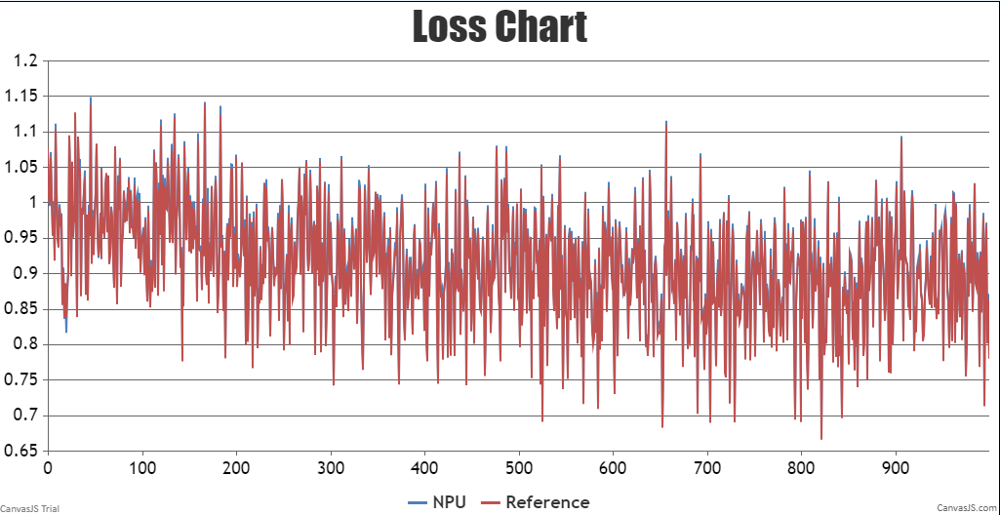
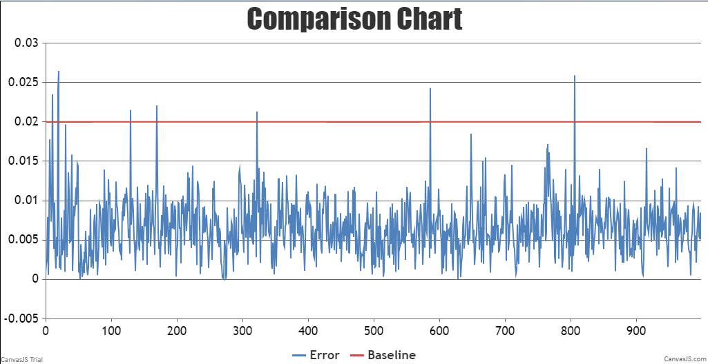

# BaiChuan2
<p align="left">
        <b>简体中文</b> |
        <b><a href="https://gitee.com/ascend/AscendSpeed/blob/master/examples/baichuan2/README_en.md">English</a> </b> 
    </p>
</p>


#  目录
- [BaiChuan2](#baichuan2)
- [目录](#目录)
- [Baichuan2-13B](#baichuan2-13b)
  - [训练](#训练)
    - [脚本](#脚本)
    - [性能](#性能)
      - [吞吐](#吞吐)
      - [精度](#精度)

# Baichuan2-13B

## 训练
Baichuan2-13B 训练的硬件配置如下:

|  硬件 |        配置        |
|:---:|:----------------:|
| NPU | 16 x Ascend NPUs |

Baichuan2-13B 训练的软件配置如下:

|            软件             |                                                      配置                                                      |
|:-------------------------:|:------------------------------------------------------------------------------------------------------------:|
|          python           |                                                    3.8.18                                                    |
|          driver           | [package](https://support.huawei.com/enterprise/zh/ascend-computing/atlas-900-pod-a2-pid-254184911/software) |
|         firmware          | [package](https://support.huawei.com/enterprise/zh/ascend-computing/atlas-900-pod-a2-pid-254184911/software) |
|           CANN            |       [package](https://support.huawei.com/enterprise/zh/ascend-computing/cann-pid-251168373/software)       |
| binary arithmetic package |       [package](https://support.huawei.com/enterprise/zh/ascend-computing/cann-pid-251168373/software)       |
|           torch           |                                                    2.1.0                                                    |
|         torch_npu         |                             [package](https://gitee.com/ascend/pytorch/releases)                             |

### 脚本
1. 将仓库拷贝到你的个人服务器:
```shell
git clone https://gitee.com/ascend/AscendSpeed.git 
cd AscendSpeed 
mkdir logs
mkdir ckpt
```
2. 搭建环境

```bash
# python3.8
conda create -n test python=3.8
conda activate test

# 安装 torch 和 torch_npu
pip install torch-2.1.0-cp38-cp38m-linux_aarch64.whl
pip install torch_npu-2.1.0.XXX-cp38-cp38m-linux_aarch64.whl
pip install apex-0.1_ascend*-cp38-cp38m-linux_aarch64.whl

# 安装 megatron
pip3 install --no-use-pep517 -e git+https://github.com/NVIDIA/Megatron-LM.git@23.05#egg=megatron-core

# 安装 deepspeed 和 deepspeed_npu
pip install deepspeed==0.9.2
git clone https://gitee.com/ascend/DeepSpeed.git -b v0.9.2 deepspeed_npu
cd deepspeed_npu
pip3 install -e ./
cd ..

# 安装其余依赖库
# 请注意trasformers==4.29.2
pip install -r requirements.txt -i https://pypi.tuna.tsinghua.edu.cn/simple
```

3. （可选的）准备预训练权重

从 [huggingface](https://huggingface.co/baichuan-inc/Baichuan2-13B-Base/tree/main) 下载预训练权重
```shell
mkdir Baichuan2-13B-Base
cd ./Baichuan2-13B-Base
wget https://huggingface.co/baichuan-inc/Baichuan2-13B-Base/blob/main/config.json
wget https://huggingface.co/baichuan-inc/Baichuan2-13B-Base/blob/main/configuration_baichuan.py
wget https://huggingface.co/baichuan-inc/Baichuan2-13B-Base/blob/main/generation_config.json
wget https://huggingface.co/baichuan-inc/Baichuan2-13B-Base/blob/main/modeling_baichuan.py
wget https://huggingface.co/baichuan-inc/Baichuan2-13B-Base/blob/main/pytorch_model-00001-of-00003.bin
wget https://huggingface.co/baichuan-inc/Baichuan2-13B-Base/blob/main/pytorch_model-00002-of-00003.bin
wget https://huggingface.co/baichuan-inc/Baichuan2-13B-Base/blob/main/pytorch_model-00003-of-00003.bin
wget https://huggingface.co/baichuan-inc/Baichuan2-13B-Base/blob/main/pytorch_model.bin.index.json
wget https://huggingface.co/baichuan-inc/Baichuan2-13B-Base/blob/main/quantizer.py
wget https://huggingface.co/baichuan-inc/Baichuan2-13B-Base/blob/main/special_tokens_map.json
wget https://huggingface.co/baichuan-inc/Baichuan2-13B-Base/blob/main/tokenization_baichuan.py
wget https://huggingface.co/baichuan-inc/Baichuan2-13B-Base/blob/main/tokenizer_config.json
wget https://huggingface.co/baichuan-inc/Baichuan2-13B-Base/blob/main/tokenizer.model
cd ..
```

将 BaiChuan2-13B 模型权重从 huggingface 格式转换为 AscendSpeed 格式
```shell
mkdir baichuan2-13b-merge

SCRIPT_PATH=./tools/ckpt_convert/llama/convert_weights_from_huggingface.py
python $SCRIPT_PATH \
    --input-model-dir ./Baichuan2-13B-Base \
    --output-model-dir ./baichuan2-13b-merge \
    --tensor-model-parallel-size 8 \
    --pipeline-model-parallel-size 1 \
    --make-vocab-size-divisible-by 8 \
    --merge-mlp \
    --type 13B \
    --pse     
```

4. 准备数据集

下载 Baichuan2-13B [数据集](https://huggingface.co/datasets/fnlp/moss-003-sft-data) 

```shell
mkdir processed_data_of_moss
cd ./processed_data_of_moss
wget https://huggingface.co/datasets/fnlp/moss-003-sft-data/blob/main/moss-003-sft-no-tools.jsonl.zip
unzip moss-003-sft-no-tools.jsonl.zip
cd ..

python ./tools/preprocess_data.py \
    --input ./processed_data_of_moss/moss-003-sft-no-tools.jsonl \
    --tokenizer-name-or-path ./Baichuan2-13B-Base \
    --output-prefix ./processed_data_of_moss/processed_data \
    --workers 4 \
    --log-interval 1000 \
    --tokenizer-type PretrainedFromHF \
    --handler-name MOSSMultiTurnHandler
```


5. 配置 Baichuan2-13B 训练脚本: /examples/baichuan2/pretrain_baichuan2_ptd_13B.sh

```shell
# 修改 ascend-toolkit 路径
source /usr/local/Ascend/ascend-toolkit/set_env.sh 

# 修改词表，数据集, 权重等路径等路径
TOKENIZER_PATH=./Baichuan2-13B-Base 
DATA_PATH=./processed_data_of_moss/processed_data_packed_input_ids_document
LOAD_PATH=./baichuan2-13b-merge

# 修正双机运行配置
# MASTER_ADDR=xx.xx.x.xxx配置为主服务器ip
# NODE_RANK主服务器脚本里设置为0，另一台服务器脚本里设置为1
```

如果需要微调训练模型，需要首先关闭FA并增加以下参数，因为目前FA算子无法处理微调训练时alibi适配的attention_mask
```shell
# 修改 ascend-toolkit 路径
source /usr/local/Ascend/ascend-toolkit/set_env.sh 

# 修改词表，数据集, 权重等路径等路径
TOKENIZER_PATH=./Baichuan2-13B-Base 
DATA_PATH=./processed_data_of_moss/processed_data
LOAD_PATH=./baichuan2-13b-merge

# 修正双机运行配置
# MASTER_ADDR=xx.xx.x.xxx配置为主服务器ip
# NODE_RANK主服务器脚本里设置为0，另一台服务器脚本里设置为1

# 删除--use-flash-attn
# 增加微调数据集参数
--is-instruction-dataset
# 调整attention_mask为padding格式，增加以下参数
--padding-attention-mask
```

6. 启动 Baichuan2-13B 训练脚本: /examples/baichuan2/pretrain_baichuan2_ptd_13B.sh

```bash
# 请在双机上分别运行该命令，双机会自动同步通信，开始进程运行
bash examples/baichuan2/pretrain_baichuan_ptd_13B.sh
```

### 性能

#### 吞吐

开启FA情况下，Baichuan2-13B 在 **昇腾芯片** 和 **参考芯片** 上的性能对比:

|  设备  |            模型             | 迭代数  | 样本吞吐 (samples/p/s) | token吞吐 (tokens/p/s) | 单步迭代时间 (s/step) | 浮点计算数 (TFLOPs/s) |
|:----:|:-------------------------:|:----:|:------------------:|:--------------------:|:---------------:|:----------------:|
| NPUs | Baichuan2-13B | 1000 |        5.149        |         1318         |     49.716      |      116.61      |
|  参考  |               |      |                    |         2062         |                 |                  |


#### 精度

NPU vs 参考 loss.



NPU vs 参考 loss 相对误差.


