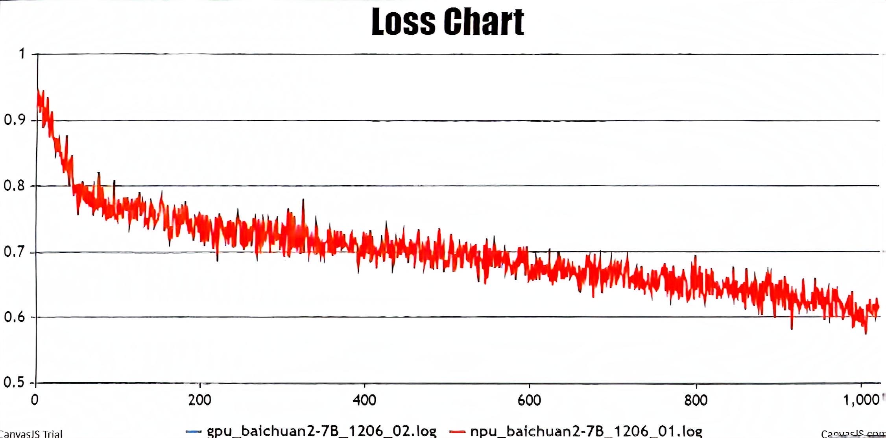
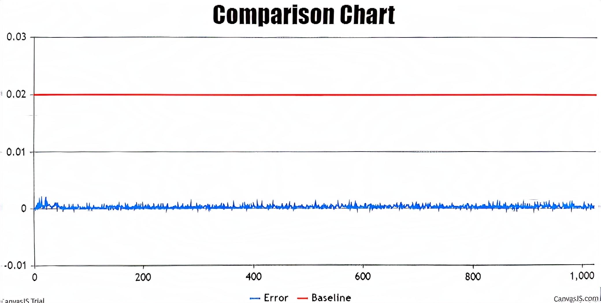
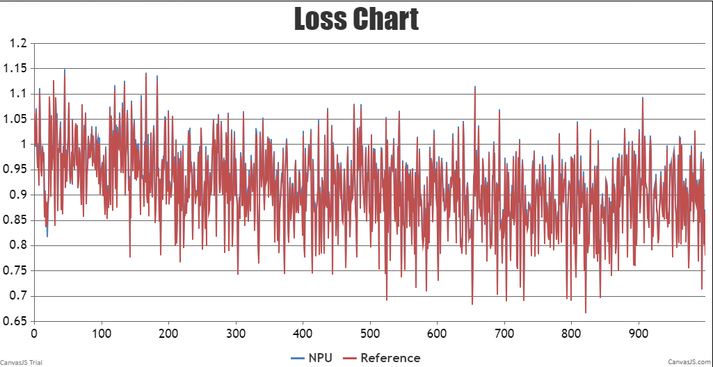
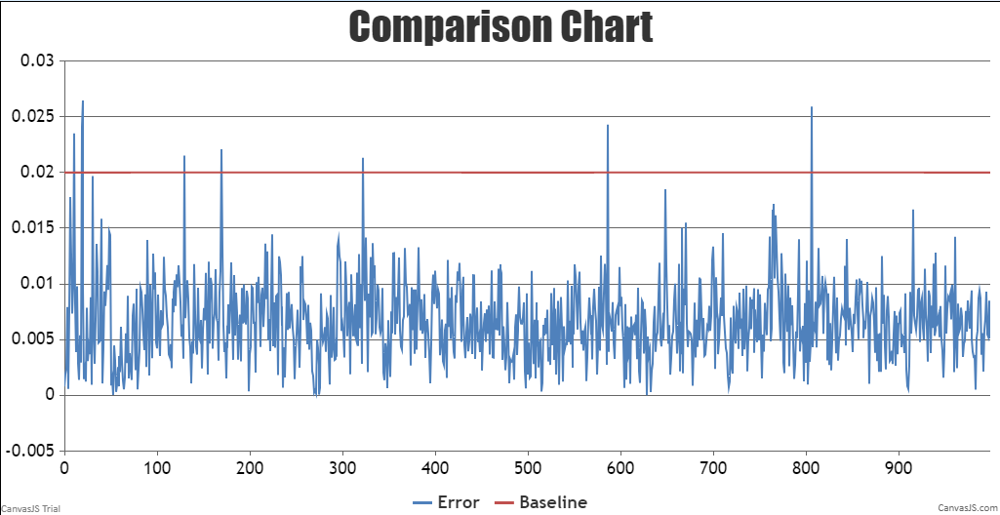

# BaiChuan2
<p align="left">
        <b><a href="https://gitee.com/ascend/AscendSpeed/blob/master/examples/baichuan2/README.md">简体中文</a></b> |
        <b>English</b> 
    </p>
</p>


#  Contents
- [Baichuan2-7B](#contents)
  - [Training](#pre-training)
  - [Script](#script)
  - [Performance](#performance)
    - [Machine performance](#machine-performance)
    - [Accuracy of the loss](#accuracy-of-the-loss)
- [Baichuan2-13B](#baichuan2-13b)
  - [Training](#training)
  - [Script](#script)
  - [Performance](#performance)
    - [Machine performance](#machine-performance)
    - [Accuracy of the loss](#accuracy-of-the-loss)

# Baichuan2-7B

## Training

Here's a hardware summary of pre-training Baichuan2-7B:

| Hardware |                      Value                      |
| :------: | :---------------------------------------------: |
|   NPU    |               8 x Ascend NPUs                   |

Here's a software summary of pre-training Baichuan2-7B: 


|         Software          |                                                           Version                                                            |
| :-----------------------: |:----------------------------------------------------------------------------------------------------------------------------:|
|          Python           |                                                            3.8.18                                                            |
|          driver           | [package](https://support.huawei.com/enterprise/zh/ascend-computing/atlas-900-pod-a2-pid-254184911/software) |
|         firmware          | [package](https://support.huawei.com/enterprise/zh/ascend-computing/atlas-900-pod-a2-pid-254184911/software) |
|           CANN            |       [package](https://support.huawei.com/enterprise/zh/ascend-computing/cann-pid-251168373/software)       |
| binary arithmetic package |       [package](https://support.huawei.com/enterprise/zh/ascend-computing/cann-pid-251168373/software)       |
|           torch           |                                                    2.1.0                                                     |
|         torch_npu         |                             [package](https://gitee.com/ascend/pytorch/releases)                             |


### Script

1. Clone the repository to your local server:
```shell
git clone https://gitee.com/ascend/AscendSpeed.git 
cd AscendSpeed 
mkdir logs
mkdir ckpt
```

2. Build environment

```bash
# python3.10
conda create -n test python=3.8
conda activate test

# install torch and torch_npu 
pip install torch-2.1.0-cp38-cp38m-linux_aarch64.whl
pip install torch_npu-2.1.0.XXX-cp38-cp38m-linux_XXX.whl

# install megatron-core
pip3 install --no-use-pep517 -e git+https://github.com/NVIDIA/Megatron-LM.git@23.05#egg=megatron-core

# install deepspeed and deepspeed_npu
pip install deepspeed==0.9.2
git clone https://gitee.com/ascend/DeepSpeed.git -b v0.9.2 deepspeed_npu
cd deepspeed_npu
pip3 install -e ./
cd ..


# install other packages
pip install -r requirements.txt 
```


3. Prepare pretrained weights
Download the Baichuan2-7B checkpoint from [here](https://huggingface.co/baichuan-inc/Baichuan2-7B-Base/tree/main)


```shell
mkdir baichuan2-7B-hf
cd ./baichuan2-7B-hf
wget https://huggingface.co/baichuan-inc/Baichuan2-7B-Base/resolve/main/config.json
wget https://huggingface.co/baichuan-inc/Baichuan2-7B-Base/resolve/main/configuration_baichuan.py
wget https://huggingface.co/baichuan-inc/Baichuan2-7B-Base/resolve/main/generation_utils.py
wget https://huggingface.co/baichuan-inc/Baichuan2-7B-Base/resolve/main/modeling_baichuan.py
wget https://huggingface.co/baichuan-inc/Baichuan2-7B-Base/resolve/main/pytorch_model-00001-of-00002.bin
wget https://huggingface.co/baichuan-inc/Baichuan2-7B-Base/resolve/main/pytorch_model-00002-of-00002.bin
wget https://huggingface.co/baichuan-inc/Baichuan2-7B-Base/resolve/main/pytorch_model.bin.index.json
wget https://huggingface.co/baichuan-inc/Baichuan2-7B-Base/resolve/main/quantizer.py
wget https://huggingface.co/baichuan-inc/Baichuan2-7B-Base/resolve/main/special_tokens_map.json
wget https://huggingface.co/baichuan-inc/Baichuan2-7B-Base/resolve/main/tokenization_baichuan.py
wget https://huggingface.co/baichuan-inc/Baichuan2-7B-Base/resolve/main/tokenizer.model
wget https://huggingface.co/baichuan-inc/Baichuan2-7B-Base/resolve/main/tokenizer_config.json
cd ..
```

In order to adapt to the baichuan2-7B model, the following script is used to convert the model pre-training weights.
```shell
mkdir weight

SCRIPT_PATH=./tools/ckpt_convert/llama/convert_weights_from_huggingface.py
# for ptd
python $SCRIPT_PATH \
    --input-model-dir ./baichuan2-7B-hf \
    --output-model-dir ./weight-tp8 \
    --tensor-model-parallel-size 8 \
    --pipeline-model-parallel-size 1 \
    --type 7B \
    --merge-mlp \
    --pse  
```


4. Prepare dataset

Download the Baichuan2-7B-Base datasets from [here](https://huggingface.co/datasets/tatsu-lab/alpaca/resolve/main/data/train-00000-of-00001-a09b74b3ef9c3b56.parquet) 

```shell
# download datasets
mkdir dataset_baichuan2-7B
cd ./dataset_baichuan2-7B
wget https://huggingface.co/datasets/tatsu-lab/alpaca/resolve/main/data/train-00000-of-00001-a09b74b3ef9c3b56.parquet
cd ..

# process datasets                              
python ./tools/preprocess_data.py \
--input ./dataset_baichuan2-7B/train-00000-of-00001-a09b74b3ef9c3b56.parquet \
--tokenizer-name-or-path ./baichuan2-7B-hf \
--output-prefix ./dataset_baichuan2-7B/alpaca \
--workers 4 \
--log-interval 1000 \
--tokenizer-type PretrainedFromHF
```


5. Config Baichuan2-7B pre-training script : examples/baichuan/pretrain_baichuan2_ptd_7B.sh 

```shell
# modify the script according to your own  ascend-toolkit path
source /usr/local/Ascend/ascend-toolkit/set_env.sh 

# modify script orign dataset path according to your own dataset path
TOKENIZER_PATH=./baichuan2-7B-hf/  #tokenizer path
DATA_PATH=./dataset_baichuan2-7B/alpaca_text_document  #processed dataset
```
*Note that if you want to train with weights from the huggingface, please add a parameter to the script  `pretrain_baichuan2_ptd_7B.sh` by inserting `--load ./weight` *
 
6. Launch Baichuan2-7B  pre-training script: examples/baichuan2/pretrain_baichuan2_ptd_7B.sh 

```shell
bash examples/baichuan2/pretrain_baichuan2_ptd_7B.sh 
```


### Performance

#### Machine performance

The performance of Baichuan2-7B in **Ascend NPU** and **Reference**:

| Device | Model        | total Iterations | throughput rate (samples/s) | throughput rate (tokens/s/p) | single-step time (s/step) | floating point operation (TFLOPs/s) |
| ------ |--------------| ---------------- | --------------------------- |------------------------------| ------------------------- | ----------------------------------- |
| NPUs | Baichuan2-7B | 1024 | 5.125            | 2607                         | 24.97           | 124              |
| Reference    | Baichuan2-7B | 1024 | --               | 3969                         | --              | --               |


#### Accuracy of the loss

NPU vs Reference loss.



NPU vs Reference loss relative error.




# Baichuan2-13B

## Training

Here's a hardware summary of pre-training Baichuan2-13B:

| Hardware |      Value       |
| :------: |:----------------:|
|   NPU    | 16 x Ascend NPUs |

Here's a software summary of pre-training Baichuan2-13B:


|         Software          |   Version   |
| :-----------------------: |:-----------:|
|          Python           |   3.8.18    |
|          driver           | [package](https://support.huawei.com/enterprise/zh/ascend-computing/atlas-900-pod-a2-pid-254184911/software) |
|         firmware          | [package](https://support.huawei.com/enterprise/zh/ascend-computing/atlas-900-pod-a2-pid-254184911/software) |
|           CANN            |       [package](https://support.huawei.com/enterprise/zh/ascend-computing/cann-pid-251168373/software)       |
| binary arithmetic package |       [package](https://support.huawei.com/enterprise/zh/ascend-computing/cann-pid-251168373/software)       |
|           torch           |                                                    2.1.0                                                    |
|         torch_npu         |                             [package](https://gitee.com/ascend/pytorch/releases)                             |


### Script
1. Clone the repository to your local server:
```shell
git clone https://gitee.com/ascend/AscendSpeed.git 
cd AscendSpeed 
mkdir logs
mkdir ckpt
```
2. Build environment

```bash
# python3.8
conda create -n test python=3.8
conda activate test

# install torch and torch_npu
pip install torch-2.1.0-cp37-cp37m-linux_aarch64.whl
pip install torch_npu-2.1.0.XXX-cp37-cp37m-linux_aarch64.whl
pip install apex-0.1_ascend*-cp38-cp38m-linux_aarch64.whl

#install megatron
pip3 install --no-use-pep517 -e git+https://github.com/NVIDIA/Megatron-LM.git@23.05#egg=megatron-core

# install deepspeed and deepspeed_npu
pip install deepspeed==0.9.2
git clone https://gitee.com/ascend/DeepSpeed.git -b v0.9.2 deepspeed_npu
cd deepspeed_npu
pip3 install -e ./
cd ..

# install other packages
# set trasformers==4.29.2
pip install -r requirements.txt -i https://pypi.tuna.tsinghua.edu.cn/simple
```

3. Prepare pretrained weights


Download the Baichuan2-13B checkpoint from [here](https://huggingface.co/baichuan-inc/Baichuan2-13B-Base/tree/main) 
```shell
mkdir Baichuan2-13B-Base
cd ./Baichuan2-13B-Base
wget https://huggingface.co/baichuan-inc/Baichuan2-13B-Base/blob/main/config.json
wget https://huggingface.co/baichuan-inc/Baichuan2-13B-Base/blob/main/configuration_baichuan.py
wget https://huggingface.co/baichuan-inc/Baichuan2-13B-Base/blob/main/generation_config.json
wget https://huggingface.co/baichuan-inc/Baichuan2-13B-Base/blob/main/modeling_baichuan.py
wget https://huggingface.co/baichuan-inc/Baichuan2-13B-Base/blob/main/pytorch_model-00001-of-00003.bin
wget https://huggingface.co/baichuan-inc/Baichuan2-13B-Base/blob/main/pytorch_model-00002-of-00003.bin
wget https://huggingface.co/baichuan-inc/Baichuan2-13B-Base/blob/main/pytorch_model-00003-of-00003.bin
wget https://huggingface.co/baichuan-inc/Baichuan2-13B-Base/blob/main/pytorch_model.bin.index.json
wget https://huggingface.co/baichuan-inc/Baichuan2-13B-Base/blob/main/quantizer.py
wget https://huggingface.co/baichuan-inc/Baichuan2-13B-Base/blob/main/special_tokens_map.json
wget https://huggingface.co/baichuan-inc/Baichuan2-13B-Base/blob/main/tokenization_baichuan.py
wget https://huggingface.co/baichuan-inc/Baichuan2-13B-Base/blob/main/tokenizer_config.json
wget https://huggingface.co/baichuan-inc/Baichuan2-13B-Base/blob/main/tokenizer.model
cd ..
```

In order to adapt to the baichuan2-13B model, the following script is used to convert the model pre-training weights.
```shell
mkdir baichuan2-13b-merge

SCRIPT_PATH=./tools/ckpt_convert/llama/convert_weights_from_huggingface.py
python $SCRIPT_PATH \
    --input-model-dir ./Baichuan2-13B-Base \
    --output-model-dir ./baichuan2-13b-merge \
    --tensor-model-parallel-size 8 \
    --pipeline-model-parallel-size 1 \
    --make-vocab-size-divisible-by 8 \
    --merge-mlp \
    --type 13B \
    --pse      
```

4. Prepare dataset
Download the Baichuan2-13B datasets from [here](https://huggingface.co/datasets/fnlp/moss-003-sft-data) 

```shell
mkdir processed_data_of_moss
cd ./processed_data_of_moss
wget https://huggingface.co/datasets/fnlp/moss-003-sft-data/blob/main/moss-003-sft-no-tools.jsonl.zip
unzip moss-003-sft-no-tools.jsonl.zip
cd ..

python ./tools/preprocess_data.py \
    --input ./processed_data_of_moss/moss-003-sft-no-tools.jsonl \
    --tokenizer-name-or-path ./Baichuan2-13B-Base \
    --output-prefix ./processed_data_of_moss/processed_data \
    --workers 4 \
    --log-interval 1000 \
    --tokenizer-type PretrainedFromHF \
    --handler-name MOSSMultiTurnHandler
```


5. Config Baichuan2-13B pre-training script: /examples/baichuan2/pretrain_baichuan2_ptd_13B.sh

```shell
# modify the script according to your own  ascend-toolkit path
source /usr/local/Ascend/ascend-toolkit/set_env.sh 

# modify script orign dataset path according to your own dataset path
TOKENIZER_PATH=./Baichuan2-13B-Base 
DATA_PATH=./processed_data_of_moss/processed_data_packed_input_ids_document
LOAD_PATH=./baichuan2-13b-merge

# set config for two-node parallelism
# modify MASTER_ADDR=xx.xx.x.xxx to master node IP
# NODE_RANK is set to 0 in the master node script and to 1 in another.
```

If you need to fine-tune the training model, you need to first turn off FA and append following arguments, as FA operators cannot currently handle the attention_mask for alibi of fine-tuning training.

```shell
# modify the script according to your own  ascend-toolkit path
source /usr/local/Ascend/ascend-toolkit/set_env.sh 

# modify script orign dataset path according to your own dataset path
TOKENIZER_PATH=./Baichuan2-13B-Base 
DATA_PATH=./processed_data_of_moss/processed_data
LOAD_PATH=./baichuan2-13b-merge

# set config for two-node parallelism
# modify MASTER_ADDR=xx.xx.x.xxx to master node IP
# NODE_RANK is set to 0 in the master node script and to 1 in another.

# remove --use-flash-attn
# add dataset argument for SFT training
--is-instruction-dataset
# add following argument to adjust padding attention_mask
--padding-attention-mask
```

6. Launch Baichuan2-13B pre-training script: /examples/baichuan2/pretrain_baichuan2_ptd_13B.sh

```bash
bash examples/baichuan2/pretrain_baichuan2_ptd_13B.sh
```

There is an hourly pulse checking script running that checks that the training is either running or scheduled.


### Performance

#### Machine performance

With FA operator, the performance of the Baichuan2-13B in **Ascend NPU** and **Reference**:

| Device |     Model     | total Iterations | throughput rate (samples/s/p) | throughput rate (tokens/s/p) | single-step time (s/step) | floating point operation (TFLOPs/s) |
|:----:|:-------------------------:|:----:|:------------------:|:--------------------:|:---------------:|:----------------:|
| NPUs | Baichuan2-13B | 1000 |        5.149        |         1350         |     49.716      |      116.61      |
|  Reference  |               |      |                    |         2062         |                 |                  |


#### Accuracy of the loss

NPU vs Reference loss.

The NPU runs smoothly, the resource usage is stable, no errors are reported in the middle of the process, the Loss is on a decreasing trend, and the convergence speed is as expected. The maximum relative error is 0.0266, and the maximum absolute error is 0.0228. The precision meets the requirements.



NPU vs Reference loss relative error.

\
\
The relative error between NPU and Reference Loss is less than 0.02 throughout, as expected.

