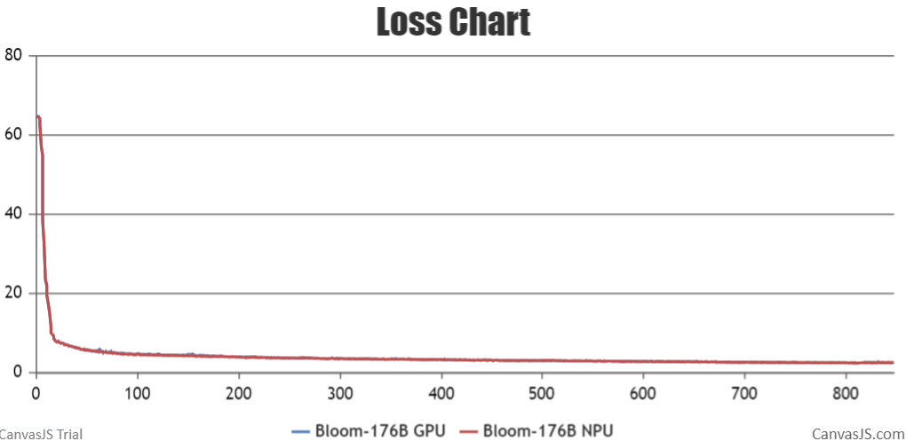
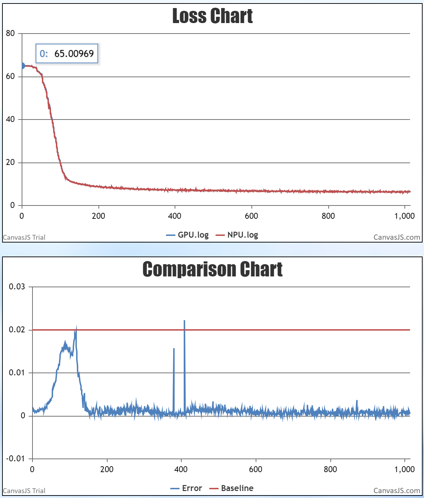

# Contents

- [Bloom-7B1](#contents)
  - [Training](#pre-training)
  - [Script](#script)
  - [Performance](#performance)
    - [Machine performance](#machine-performance)
    - [Accuracy of the loss](#accuracy-of-the-loss)

- [Bloom-176B](#contents)
  - [Training](#pre-training)
  - [Script](#script)
  - [Performance](#performance)
    - [Machine performance](#machine-performance)
    - [Accuracy of the loss](#accuracy-of-the-loss)
  - [Inference](#inference)

# Bloom-7B1

# Bloom-176B

## Training

BLOOM model is from: [A 176B-Parameter Open-Access Multilingual Language Model](https://arxiv.org/abs/2211.05100).

> Scao, Teven Le, et al. "Bloom: A 176b-parameter open-access multilingual language model." arXiv preprint arXiv:2211.05100 (2022).

Here's a hardware summary of pre-training Bloom-176B:

| **Hardware** | **Value** |
| ------------ | --------- |
| NPU          | 12x8 Ascend 910B | 

Here's a software summary of pre-training Bloom-176B:

| **Software** | **Version**                                             | **Link**                                                                                                                                                                        |
| ---------------------- |---------------------------------------------------------|---------------------------------------------------------------------------------------------------------------------------------------------------------------------------------|
| Python                 | 3.8.0                                                   | <center>-</center>                                                                                                                                                              |
| Driver                 | Ascend-hdk-910b-npu-driver_23.0.rc2.3_linux-aarch64.run | [link](https://support.huawei.com/enterprise/zh/ascend-computing/ascend-hdk-pid-252764743/software/261129105?idAbsPath=fixnode01%7C23710424%7C251366513%7C22892968%7C252764743) |
| Fireware               | Ascend-hdk-910b-npu-firmware_6.4.0.3.220.run            | [link](https://support.huawei.com/enterprise/zh/ascend-computing/ascend-hdk-pid-252764743/software/261129105?idAbsPath=fixnode01%7C23710424%7C251366513%7C22892968%7C252764743) |
| CANN                   | Ascend-cann-toolkit_6.3.RC3.1_linux-aarch64.run         | [link](https://support.huawei.com/enterprise/zh/ascend-computing/cann-pid-251168373/software/261213460?idAbsPath=fixnode01%7C23710424%7C251366513%7C22892968%7C251168373)       |
| CANN-kernels           | Ascend-cann-kernels-910b_6.3.RC3.1_linux.run            | [link](https://support.huawei.com/enterprise/zh/ascend-computing/cann-pid-251168373/software/261213460?idAbsPath=fixnode01%7C23710424%7C251366513%7C22892968%7C251168373)       |
| torch                  | 2.0.1                                                   | <center>-</center>                                                                                                                                                              |
| torch_npu              | 2.0.1                                                   | [link](https://gitee.com/ascend/pytorch/releases/tag/v5.0.rc2-pytorch2.0.1)                                                                                                     |

## Script

1. Clone the repository to your local server

```shell
git clone https://gitee.com/ascend/AscendSpeed.git
cd AscendSpeed
```

2. Build enviroment

```shell
# python3.8
conda create -n bloom176b python=3.8
conda activate bloom176b

# install torch and torch_npu and apex
pip install torch-2.0.1-cp38-cp38-manylinux2014_aarch64.whl
pip install torch_npu-2.0.1rc1.postxxxxxxxx-cp38-cp38-linux_aarch64.whl
pip install apex-0.1_ascend_xxxxxxxx-cp38-cp38-linux_aarch64.whl

# install megatron-core
pip3 install -e git+https://github.com/NVIDIA/Megatron-LM.git@23.05#egg=megatron-core

# install deepspeed and deepspeed_npu
pip install deepspeed==0.9.2
git clone https://gitee.com/ascend/DeepSpeed.git -b v0.9.2 deepspeed_npu
cd deepspeed_npu
pip3 install -e ./
cd ..

# install other packages
pip install -r requirements.txt
```

3. Prepare pretrained weights

Download the Bloom-176B tokensizer from [here](https://huggingface.co/bigscience/bloom/tree/main).

```shell
mkdir tokenizer
cd tokenizer
wget https://huggingface.co/bigscience/bloom/resolve/main/special_tokens_map.json
wget https://huggingface.co/bigscience/bloom/resolve/main/tokenizer.json
wget https://huggingface.co/bigscience/bloom/resolve/main/tokenizer_config.json
cd ..
```

4. Prepare dataset

Download the Bloom-176B datasets from [here](https://huggingface.co/datasets/teven/enwiki_100k). The downloaded dataset is in the parquet format by default.
You need to convert the dataset to the loose json format and preprocess the dataset.

```shell
# download datasets
mkdir enwiki_100k_datasets
cd enwiki_100k_datasets
wget https://huggingface.co/datasets/teven/enwiki_100k/resolve/main/data/train-00000-of-00006-67bcc7d401923db0.parquet
wget https://huggingface.co/datasets/teven/enwiki_100k/resolve/main/data/train-00001-of-00006-6b8562cbb05789a4.parquet
wget https://huggingface.co/datasets/teven/enwiki_100k/resolve/main/data/train-00002-of-00006-62d2b426a93b0912.parquet
wget https://huggingface.co/datasets/teven/enwiki_100k/resolve/main/data/train-00003-of-00006-36c3d6da04c724b6.parquet
wget https://huggingface.co/datasets/teven/enwiki_100k/resolve/main/data/train-00004-of-00006-48bdf99256dcfa5d.parquet
wget https://huggingface.co/datasets/teven/enwiki_100k/resolve/main/data/train-00005-of-00006-bcb3b3af8d7a4140.parquet
cd ..

# preprocess datasets
python ./tools/preprocess_data.py \
  --input ./enwiki_100k_datasets/ \
  --tokenizer-name-or-path ./tokenizer \
  --output-prefix ./enwiki_100k_datasets/enwiki-100k \
  --worker 4 \
  --log-interval 1000 \
  --tokenizer-type PretrainedFromHF
```

5. Config Bloom-176B pre-training script: examples/bloom/pretrain_bloom_176b.sh

```shell
# modify MASTER_ADDR to the IP address of the master node in the cluster.
# the master node is localhost, and the other nodes are the IP address of the master node, for example, 90.90.2.166
MASTER_ADDR=localhost

# modify the rank number of a node. The rank number of the master node is 0, and the rank number of other nodes increases in ascending order.
NODE_RANK=0

# modify the datasets path and tokenizer path
TOKENIZER_NAME_OR_PATH=/home/bloom_data/vocab_file/
DATA_PATH=/home/bloom_data/enwiki_100k/enwiki-100k_text_document
```

6. Launch Bloom-176B pre-training script: examples/bloom/pretrain_bloom_176b.sh

Run the examples/bloom/pretrain_bloom_176b.sh on all nodes in the cluster.

```shell
bash examples/bloom/pretrain_bloom_176b.sh
```

## Performance

### Machine Performance

The performance of Bloom-176B in **Ascend NPU** and **Reference**:

| Devices | Model | total iterations | throughput rate (tokens/s/p) |
| ------- | ----- |-----------------| ---------------------------- |
| NPUs    | Bloom-176B | 1000            | 100                          |
| Reference | Bloom-176B | NA              | 107                          |

### Accuracy of the loss

NPU vs GPU loss. The loss curves of GPUs and NPUs basically coincide.



We reduce the number of layers of the model to six, the following figure shows the loss comparsion between the NPU 
and GPU on a single-node system. The average relative error is 0.1%, less than 2%, and the proportion of relative error less than 2% reaches 99.9%. The average absolute error is 0.04. The precision meets the requirements.



