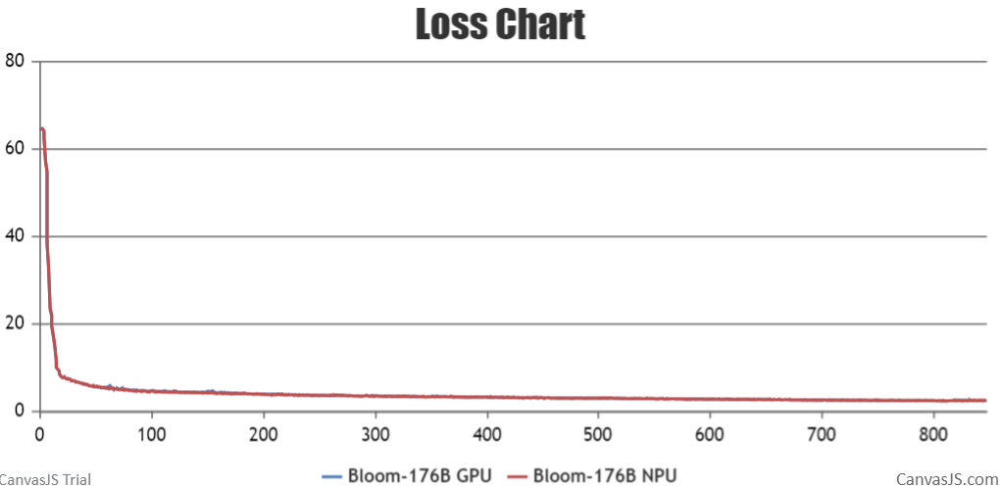

# Contents

- [Bloom-7B](#contents)
  - [Training](#pre-training)
    - [Script](#script)
    - [Performance](#performance)
      - [Machine performance](#machine-performance)
      - [Accuracy of the loss](#accuracy-of-the-loss)
  - [Inference](#Inference)
    - [Script](#script)
- [Bloom-176B](#contents)
  - [Training](#pre-training)
    - [Script](#script)
    - [Performance](#performance)
      - [Machine performance](#machine-performance)
      - [Accuracy of the loss](#accuracy-of-the-loss)
  - [Inference](#Inference)
    - [Script](#script)

# Bloom-7B

## Training


Here's a hardware summary of pre-training Bloom-7B:

| **Hardware** | **Value** |
| ------------ | --------- |
| NPU          | 1x8 Ascend 910 | 

Here's a software summary of pre-training Bloom-7B:

|         Software          |                Version                 |                                                                                      link                                                                                       |
| :-----------------------: |:--------------------------------------:|:-------------------------------------------------------------------------------------------------------------------------------------------------------------------------------:|
|          Python           |                 3.8.18                 |                                                                                        -                                                                                        |
|          driver           |             23.0.RC3.B070              | [link](https://support.huawei.com/enterprise/zh/ascend-computing/ascend-hdk-pid-252764743/software/261159048?idAbsPath=fixnode01%7C23710424%7C251366513%7C22892968%7C252764743) |
|         firmware          |              6.4.0.3.220               | [link](https://support.huawei.com/enterprise/zh/ascend-computing/ascend-hdk-pid-252764743/software/261159048?idAbsPath=fixnode01%7C23710424%7C251366513%7C22892968%7C252764743) |
|           CANN            |              7.0.RC1.B070              |    [link](https://support.huawei.com/enterprise/zh/ascend-computing/cann-pid-251168373/software/261305467?idAbsPath=fixnode01%7C23710424%7C251366513%7C22892968%7C251168373)    |
| binary arithmetic package | Ascend-cann-kernels-XXXX_7.0.RC1_linux |    [link](https://support.huawei.com/enterprise/zh/ascend-computing/cann-pid-251168373/software/261305467?idAbsPath=fixnode01%7C23710424%7C251366513%7C22892968%7C251168373)    |
|           torch           |                 2.0.1                  |                                                                                        -                                                                                        |
|         torch_npu         |                 2.0.1                  |                                                   [link](https://gitee.com/ascend/pytorch/releases/tag/v5.0.rc3-pytorch2.0.1)                                                   | 

## Script

1. Clone the repository to your local server

```shell
git clone https://gitee.com/ascend/AscendSpeed.git
cd AscendSpeed
```

2. Build enviroment

```shell
# python3.8
conda create -n bloom7b python=3.8
conda activate bloom7b

# install torch and torch_npu and apex
pip install torch-2.0.1-cp38-cp38-manylinux2014_aarch64.whl
pip install torch_npu-2.0.1rc1.postxxxxxxxx-cp38-cp38-linux_aarch64.whl

# install megatron-core
pip3 install -e git+https://github.com/NVIDIA/Megatron-LM.git@23.05#egg=megatron-core

# install deepspeed and deepspeed_npu
pip install deepspeed==0.9.2
git clone https://gitee.com/ascend/DeepSpeed.git -b v0.9.2 deepspeed_npu
cd deepspeed_npu
pip3 install -e ./
cd ..

# install other packages
pip install -r requirements.txt
```

3. Prepare pretrained weights

Download the Bloom-7B tokensizer from [here](https://huggingface.co/bigscience/bloom-7b1/tree/main).

```shell
mkdir tokenizer
cd tokenizer
wget https://huggingface.co/bigscience/bloom/resolve/main/special_tokens_map.json
wget https://huggingface.co/bigscience/bloom/resolve/main/tokenizer.json
wget https://huggingface.co/bigscience/bloom/resolve/main/tokenizer_config.json
cd ..
```

We provide scripts that support converting pretrained weights into weights that AscendSpeed can load and used for train and inference. 

```shell
#!/bin/bash

SCRIPT_PATH=./tasks/ckpt_convert/bloom/convert_weights_from_huggingface.py
python $SCRIPT_PATH \
    --input-model-dir "your huggingface checkpoint path" \
    --output-model-dir "your ascendspeed checkpoint path" \
    --tensor-model-parallel-size 8 \
    --pipeline-model-parallel-size 1 \
    --type 7B \
    --deepspeed
```

4. Prepare dataset

Download the Bloom-7B datasets from [here](https://huggingface.co/datasets/teven/enwiki_100k). The downloaded dataset is in the parquet format by default.
You need to convert the dataset to the loose json format and preprocess the dataset.

```shell
# download datasets
mkdir enwiki_100k_datasets
cd enwiki_100k_datasets
wget https://huggingface.co/datasets/teven/enwiki_100k/resolve/main/data/train-00000-of-00006-67bcc7d401923db0.parquet
wget https://huggingface.co/datasets/teven/enwiki_100k/resolve/main/data/train-00001-of-00006-6b8562cbb05789a4.parquet
wget https://huggingface.co/datasets/teven/enwiki_100k/resolve/main/data/train-00002-of-00006-62d2b426a93b0912.parquet
wget https://huggingface.co/datasets/teven/enwiki_100k/resolve/main/data/train-00003-of-00006-36c3d6da04c724b6.parquet
wget https://huggingface.co/datasets/teven/enwiki_100k/resolve/main/data/train-00004-of-00006-48bdf99256dcfa5d.parquet
wget https://huggingface.co/datasets/teven/enwiki_100k/resolve/main/data/train-00005-of-00006-bcb3b3af8d7a4140.parquet
cd ..

# preprocess datasets
python ./tools/preprocess_data.py \
  --input ./enwiki_100k_datasets/ \
  --tokenizer-name-or-path ./tokenizer \
  --output-prefix ./enwiki_100k_datasets/enwiki-100k \
  --worker 4 \
  --log-interval 1000 \
  --tokenizer-type PretrainedFromHF
```

5. Config Bloom-7B pre-training script: examples/bloom/pretrain_bloom_7b1.sh

```shell
# modify the datasets path and tokenizer path
TOKENIZER_NAME_OR_PATH=/home/bloom_data/vocab_file/
DATA_PATH=/home/bloom_data/enwiki_100k/enwiki-100k_text_document
```

6. Launch Bloom-7B pre-training script: examples/bloom/pretrain_bloom_7b1.sh

Run the examples/bloom/pretrain_bloom_7b1.sh on all nodes in the cluster.

```shell
bash examples/bloom/pretrain_bloom_7b1.sh
```

## Performance

### Machine Performance

The performance of Bloom-7B in **Ascend NPU** and **Reference**:

| Device | Model    | total Iterations | throughput rate (samples/s/p) | throughput rate (tokens/s/p) | single-step time (s/step) | floating point operation (TFLOPs/s) |
| ------ |----------|------------------|-------------------------------|------------------------------|---------------------------|-------------------------------------|
| NPUs   | Bloom-7B | 1000             | 10.289                        | 2603                         | 18.67                     | 115.55                              |
| Reference   | Bloom-7B | 1000             | 9.894                         | 2525                         | 19.40                     | 111.19                              |


#### Accuracy of the loss

NPU vs GPU loss.

The NPU runs smoothly, the resource usage is stable, no errors are reported in the middle of the process, the Loss is on a decreasing trend, and the convergence speed is as expected. 


NPU vs GPU loss relative error.


## Inference

We support AscendSpeed Inference for text generation with BLOOM 7B.

Use [convert_weights_from_gptmodelpipe_to_gptmodel.sh](../../tools/ckpt_convert/bloom/convert_weights_from_gptmodelpipe_to_gptmodel.sh), converting deep speed checkpoints to megatron.Convert the checkpoint of deepspeed to megtron.

```bash
SCRIPT_PATH=./tools/ckpt_convert/bloom/convert_weights_from_gptmodelpipe_to_gptmodel_v2.py
python $SCRIPT_PATH \
    --input-model-dir ${INPUT_PATH} \
    --output-model-dir ${OUTPUT_PATH} \
    --tensor-model-parallel-size 8 \
    --pipeline-model-parallel-size 1 \
    --type 7B
```
### Script

We generate text samples using the `generate_bloom` script. Inference different from pre-training, such as we need to Load pre training checkpoint and the length of the output samples:

Config Bloom-7B inference script: examples/bloom/generate_bloom_7B_tp8_pp1.sh

```shell
# modify the model weight path and tokenizer path
CHECKPOINT=/home/bloom_data/enwiki_100k/enwiki-100k_text_document
VOCAB_FILE=/home/bloom_data/vocab_file/
```

```shell
bash ./examples/bloom/generate_bloom_7B_tp8_pp1.sh
```

# Bloom-176B

## Training

BLOOM model is from: [A 176B-Parameter Open-Access Multilingual Language Model](https://arxiv.org/abs/2211.05100).

> Scao, Teven Le, et al. "Bloom: A 176b-parameter open-access multilingual language model." arXiv preprint arXiv:2211.05100 (2022).

Here's a hardware summary of pre-training Bloom-176B:

| **Hardware** | **Value** |
| ------------ | --------- |
| NPU          | 12x8 Ascend 910 | 

Here's a software summary of pre-training Bloom-176B:

| **Software** | **Version**                                             | **Link**                                                                                                                                                                        |
| ---------------------- |---------------------------------------------------------|---------------------------------------------------------------------------------------------------------------------------------------------------------------------------------|
| Python                 | 3.8.0                                                   | <center>-</center>                                                                                                                                                              |
| Driver                 | Ascend-hdk-910b-npu-driver_23.0.rc2.3_linux-aarch64.run | [link](https://support.huawei.com/enterprise/zh/ascend-computing/ascend-hdk-pid-252764743/software/261129105?idAbsPath=fixnode01%7C23710424%7C251366513%7C22892968%7C252764743) |
| Fireware               | Ascend-hdk-910b-npu-firmware_6.4.0.3.220.run            | [link](https://support.huawei.com/enterprise/zh/ascend-computing/ascend-hdk-pid-252764743/software/261129105?idAbsPath=fixnode01%7C23710424%7C251366513%7C22892968%7C252764743) |
| CANN                   | Ascend-cann-toolkit_6.3.RC3.1_linux-aarch64.run         | [link](https://support.huawei.com/enterprise/zh/ascend-computing/cann-pid-251168373/software/261213460?idAbsPath=fixnode01%7C23710424%7C251366513%7C22892968%7C251168373)       |
| CANN-kernels           | Ascend-cann-kernels-910b_6.3.RC3.1_linux.run            | [link](https://support.huawei.com/enterprise/zh/ascend-computing/cann-pid-251168373/software/261213460?idAbsPath=fixnode01%7C23710424%7C251366513%7C22892968%7C251168373)       |
| torch                  | 2.0.1                                                   | <center>-</center>                                                                                                                                                              |
| torch_npu              | 2.0.1                                                   | [link](https://gitee.com/ascend/pytorch/releases/tag/v5.0.rc3-pytorch2.0.1)                                                                                                     |

## Script

1. Clone the repository to your local server

```shell
git clone https://gitee.com/ascend/AscendSpeed.git
cd AscendSpeed
```

2. Build enviroment

```shell
# python3.8
conda create -n bloom176b python=3.8
conda activate bloom176b

# install torch and torch_npu and apex
pip install torch-2.0.1-cp38-cp38-manylinux2014_aarch64.whl
pip install torch_npu-2.0.1rc1.postxxxxxxxx-cp38-cp38-linux_aarch64.whl
pip install apex-0.1_ascend_xxxxxxxx-cp38-cp38-linux_aarch64.whl

# install megatron-core
pip3 install -e git+https://github.com/NVIDIA/Megatron-LM.git@23.05#egg=megatron-core

# install deepspeed and deepspeed_npu
pip install deepspeed==0.9.2
git clone https://gitee.com/ascend/DeepSpeed.git -b v0.9.2 deepspeed_npu
cd deepspeed_npu
pip3 install -e ./
cd ..

# install other packages
pip install -r requirements.txt
```

3. Prepare pretrained weights

Download the Bloom-176B tokensizer from [here](https://huggingface.co/bigscience/bloom/tree/main).

```shell
mkdir tokenizer
cd tokenizer
wget https://huggingface.co/bigscience/bloom/resolve/main/special_tokens_map.json
wget https://huggingface.co/bigscience/bloom/resolve/main/tokenizer.json
wget https://huggingface.co/bigscience/bloom/resolve/main/tokenizer_config.json
cd ..
```
We provide scripts that support converting pretrained weights into weights that AscendSpeed can load and used for train and inference. `--partition-layers` specifies the partitioning strategy under the pipeline parallel strategy, you can also modify it to a different strategy, but the sum of all elements of `--partition layers` should be equal to 70 and the number of elements in `--partition-layers` should be equal to `--pipeline-model-parallel-size`.

```shell
#!/bin/bash

SCRIPT_PATH=./tasks/ckpt_convert/bloom/convert_weights_from_huggingface.py
python $SCRIPT_PATH \
    --input-model-dir "your huggingface checkpoint path" \
    --output-model-dir "your ascendspeed checkpoint path" \
    --tensor-model-parallel-size 8 \
    --pipeline-model-parallel-size 12 \
    --type 176B \
    --deepspeed \
    --partition-layers 6,6,6,6,6,6,6,6,6,6,6,4
```
4. Prepare dataset

Download the Bloom-176B datasets from [here](https://huggingface.co/datasets/teven/enwiki_100k). The downloaded dataset is in the parquet format by default.
You need to convert the dataset to the loose json format and preprocess the dataset.

```shell
# download datasets
mkdir enwiki_100k_datasets
cd enwiki_100k_datasets
wget https://huggingface.co/datasets/teven/enwiki_100k/resolve/main/data/train-00000-of-00006-67bcc7d401923db0.parquet
wget https://huggingface.co/datasets/teven/enwiki_100k/resolve/main/data/train-00001-of-00006-6b8562cbb05789a4.parquet
wget https://huggingface.co/datasets/teven/enwiki_100k/resolve/main/data/train-00002-of-00006-62d2b426a93b0912.parquet
wget https://huggingface.co/datasets/teven/enwiki_100k/resolve/main/data/train-00003-of-00006-36c3d6da04c724b6.parquet
wget https://huggingface.co/datasets/teven/enwiki_100k/resolve/main/data/train-00004-of-00006-48bdf99256dcfa5d.parquet
wget https://huggingface.co/datasets/teven/enwiki_100k/resolve/main/data/train-00005-of-00006-bcb3b3af8d7a4140.parquet
cd ..

# preprocess datasets
python ./tools/preprocess_data.py \
  --input ./enwiki_100k_datasets/ \
  --tokenizer-name-or-path ./tokenizer \
  --output-prefix ./enwiki_100k_datasets/enwiki-100k \
  --worker 4 \
  --log-interval 1000 \
  --tokenizer-type PretrainedFromHF
```

5. Config Bloom-176B pre-training script: examples/bloom/pretrain_bloom_176b.sh

```shell
# modify MASTER_ADDR to the IP address of the master node in the cluster.
# the master node is localhost, and the other nodes are the IP address of the master node, for example, 90.90.2.166
MASTER_ADDR=localhost

# modify the rank number of a node. The rank number of the master node is 0, and the rank number of other nodes increases in ascending order.
NODE_RANK=0

# modify the datasets path and tokenizer path
TOKENIZER_NAME_OR_PATH=/home/bloom_data/vocab_file/
DATA_PATH=/home/bloom_data/enwiki_100k/enwiki-100k_text_document
```

6. Launch Bloom-176B pre-training script: examples/bloom/pretrain_bloom_176b.sh

Run the examples/bloom/pretrain_bloom_176b.sh on all nodes in the cluster.

```shell
bash examples/bloom/pretrain_bloom_176b.sh
```

## Performance

### Machine Performance

The performance of Bloom-176B in **Ascend NPU** and **Reference**:

| Devices | Model | total iterations | throughput rate (tokens/s/p) |
| ------- | ----- |-----------------| ---------------------------- |
| NPUs    | Bloom-176B | 1000            | 100                          |
| Reference | Bloom-176B | NA              | 107                          |

### Accuracy of the loss

NPU vs GPU loss. The loss curves of GPUs and NPUs basically coincide.



We reduce the number of layers of the model to six, the following figure shows the loss comparsion between the NPU 
and GPU on a single-node system. The average relative error is 0.1%, less than 2%, and the proportion of relative error less than 2% reaches 99.9%. The average absolute error is 0.04. The precision meets the requirements.


## Inference

We support AscendSpeed Inference for text generation with BLOOM 176B.

Use [convert_weights_from_gptmodelpipe_to_gptmodel.sh](../../tools/ckpt_convert/bloom/convert_weights_from_gptmodelpipe_to_gptmodel.sh), converting deep speed checkpoints to megatron.Convert the checkpoint of deepspeed to megtron.

We use two-machine reasoning. First of all, we need to manually move the pre-trained ckpt to the two machines, node 0 requires layer 1-37, node 1 requires layer 38-74, move the conversion script configuration directory and related parameters, and execute the conversion.
```bash
SCRIPT_PATH=./tools/ckpt_convert/bloom/convert_weights_from_gptmodelpipe_to_gptmodel_v2.py
python $SCRIPT_PATH \
    --input-model-dir ${INPUT_PATH} \
    --output-model-dir ${OUTPUT_PATH} \
    --tensor-model-parallel-size 8 \
    --pipeline-model-parallel-size 2 \
    --type 176B
```
### Script
We generate text samples using the `generate_bloom` script. Inference different from pre-training, such as we need to Load pre training checkpoint and the length of the output samples:

Config Bloom-176B inference script: examples/bloom/generate_bloom_176b_2nodes.sh

```shell
# modify MASTER_ADDR to the IP address of the master node in the cluster.
# the master node is localhost, and the other nodes are the IP address of the master node, for example, 90.90.2.166
MASTER_ADDR=localhost

# modify the rank number of a node. The rank number of the master node is 0, and the rank number of other nodes increases in ascending order.
NODE_RANK=0

# modify the model weight path and tokenizer path
CHECKPOINT=/home/bloom_data/enwiki_100k/enwiki-100k_text_document
VOCAB_FILE=/home/bloom_data/vocab_file/
```

```shell
bash ./examples/bloom/generate_bloom_176b_2nodes.sh
```

## Example
1. bloom 7b

2. bloom 176b


All the provided scripts are tested on 910 64GB NPUs for BLOOM 7B and BLOOM 176B (fp16). These scripts might not work for other models or a different number of NPUs.

> Note: Sometimes NPUs memory is not freed when inference deployment crashes. You can free this memory by running kill all python in terminal.

## Citation

You may also consider original work in your reference:

@article{scao2022bloom,
  title={Bloom: A 176b-parameter open-access multilingual language model},
  author={Scao, Teven Le and Fan, Angela and Akiki, Christopher and Pavlick, Ellie and Ili{\'c}, Suzana and Hesslow, Daniel and Castagn{\'e}, Roman and Luccioni, Alexandra Sasha and Yvon, Fran{\c{c}}ois and Gall{\'e}, Matthias and others},
  journal={arXiv preprint arXiv:2211.05100},
  year={2022}
}
\
\
<font size=1>If the download of the file fails using 'wget' , you can download it manually while ensuring network security.</font>