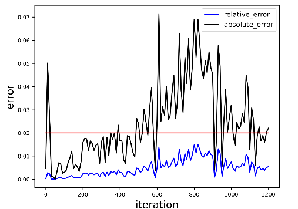

# BLOOM

This directory contains some of the scripts that were used to produce the results in the AscendSpeed. These scripts is to show the example how to run BLOOM in terminal.

BLOOM model is from: [A 176B-Parameter Open-Access Multilingual Language Model](https://arxiv.org/abs/2211.05100)

> Scao, Teven Le, et al. "Bloom: A 176b-parameter open-access multilingual language model." arXiv preprint arXiv:2211.05100 (2022).

# Contents

- [Contents](#contents)

- [Pre-Training](#pre-training)
  - [Datasets](#datasets)
  
  - [Script](#script)
  
  - [Performance](#performance)
  	- [Machine performance](#machine-performance)
  	- [Accuracy of the loss](#accuracy-of-the-loss)
  
- [Fine-tune and Evaluation](#fine-tune-and-evaluation)

- [Inference](#inference)
  - [Model weights](#model-weights)
  - [Script](#script)
  - [Samples](#samples)
  
- [Citation](#citation)


## Pre-Training

BLOOM's architecture is very similar to GPT3 with a few added improvements as will be discussed later in this article.

Here's a quick summary of training bloom:

|              |                         |
| :----------: | :---------------------: |
|   Hardware   | 96 64GB Altas 910B NPUs |
|   Software   |       AscendSpeed       |
| Architecture |     GPT3 w/ extras      |
|   Dataset    |        Oscar-1GB        |

### Datasets

**OSCAR** or Open Super-large Crawled ALMAnaCH coRpus is a huge multilingual corpus obtained by language classification and filtering of the Common Crawl corpus using the goclassy architecture. The dataset used for training multilingual models such as BART incorporates 138 GB of text.The Oscar-1GB dataset was used for this Bloom-7B1 pre-training, and the data was processed into FastChat dialog format.

### Script

1.Install AscendSpeed requirement environment.

2.Download Oscar-1GB dataset:https://www.huggingface.co/bigscience/misc-test-data/resolve/main/stas/oscar-1GB.jsonl.xz

3.Config Bloom-7B1 pre-training script : AscendSpeed/examples/bloom/pretrain_bloom_7b1.sh

```bash
# add HCCL_OP_BASE_FFTS_MODE_ENABLE
export HCCL_OP_BASE_FFTS_MODE_ENABLE=TRUE

# modify the script according to your own conda and ascend-toolkit path
export LD_LIBRARY_PATH=/usr/local/lib:/root/miniconda3/lib:$LD_LIBRARY_PATH # line 3
source /usr/local/Ascend/ascend-toolkit/set_env.sh # line 5

# modify script orign dataset path according to your own dataset path
TOKENIZER_NAME_OR_PATH=./dataset/bloom_vocab/vocab_file/ # line 34
DATA_PATH=./dataset/oscar_data_1g/my-gpt2_text_document # line 35

# Bloom-7B1 configuration parameters are consistent with the original script configuration
# PP=1, TP=8, micro_bs=4
MICRO_BATCH_SIZE=4 # micro_bs in Line 19
--tensor-model-parallel-size 8 # TP in Line 77
--pipeline-model-parallel-size 1 # PP in Line 78

# DeepSpeed config in Line 40 ~ Line59
cat <<EOT > $config_json
{
  "train_micro_batch_size_per_gpu": $MICRO_BATCH_SIZE,
  "train_batch_size": $GLOBAL_BATCH_SIZE,
  "gradient_clipping": 1.0,
  "zero_optimization": {
    "stage": $ZERO_STAGE
  },
  "fp16": {
    "enabled": true,
    "loss_scale": 0,
    "loss_scale_window": 500,
    "hysteresis": 2,
    "min_loss_scale": 1,
    "initial_scale_power": 12
  },
  "steps_per_print": 2000,
  "wall_clock_breakdown": false
}
EOT

```

4.Launch Bloom-7B1 pre-training script : AscendSpeed/examples/bloom/pretrain_bloom_7b1.sh

```bash
bash examples/bloom/pretrain_bloom_7b1.sh
```

There is an hourly pulse checking script running that checks that the training is either running or scheduled.

The Training log will look like these:

```Shell
TODO
```

### Performance

#### Machine performance

The performance of the NPUs in **Ascend910 B1 64GB** and GPUs is **A100**:

|  Device  |   Model   | total Iterations | throughput rate (samples/s/p) | throughput rate (tokens/s/p) | single-step time (s/step) | floating point operation (TFLOPs/s) |
| :------: | :-------: | :--------------: | :---------------------------: | :--------------------------: | :-----------------------: | :---------------------------------: |
|   GPUs   | Bloom-7B1 |       995        |             1.23              |           2540.23            |           19.44           |                5.68                 |
|   NPUs   | Bloom-7B1 |       995        |             1.26              |           2588.03            |           19.07           |                5.91                 |

Notes: 

- Bloom-7B1 model trained on oscar-1GB on a single machine with 8 NPUs

Here's a hardware summary of pre-training Bloom-7B:

| Hardware |                      Value                      |
| :------: | :---------------------------------------------: |
|   CPU    | 4xKunPeng920@3.0GHz，64 Core Pre Socket 256CPUS |
|   RAM    |                  32x32 GB DDR4                  |
|   NPU    |               8 x Ascend910B1 64G               |

Here's a software summary of pre-training Bloom-7B:

|         Software          |                 Version                 |
| :-----------------------: | :-------------------------------------: |
|            OS             |       Euler OS release 2.0(SP10)        |
|           uname           |                 aarch64                 |
|          Python           |                  3.7.5                  |
|          driver           |              23.0.RC2.b130              |
|         firmware          |              23.0.RC2.b130              |
|           CANN            |                 6.3.RC2                 |
| binary arithmetic package | Ascend-ccann-kernels-910b_6.3.RC2_linux |
|           torch           |                 1.11.0                  |
|         torch_npu         |           1.11.0.dev20230713            |
|         deepspeed         |                  0.9.2                  |
|       deepspeed-npu       |                   0.1                   |
|       transformers        |                 4.30.2                  |
|        Ascendspeed        |                2023-7-21                |


#### Accuracy of the loss

NPU vs GPU loss.

The NPU runs smoothly, the resource usage is stable, no errors are reported in the middle of the process, the Loss is on a decreasing trend, and the convergence speed is as expected.


NPU vs GPU loss relative error.

The relative error between NPU and GPU Loss is less than 0.02 throughout, as expected.



## Fine-tune and Evaluation

TODO：提供微调的方式，先加载权重，再微调脚本，跟预训练格式一样；后面需要提供task的验证结果（待开发）。

## Inference

We support AscendSpeed Inference for text generation with BLOOM 7B1.

### Model weights

We provide scripts that support converting pretrained weights into weights that AscendSpeed can load and used for inference. Download the BLOOM-176B checkpoint from [here](https://huggingface.co/bigscience/bloom/tree/main), make sure all chunks are downloaded completely, then use the following command to convert them into checkpoints that AscendSpeed can load. `--partition-layers` specifies the partitioning strategy under the pipeline parallel strategy, you can also modify it to a different strategy, but the sum of all elements of `--partition layers` should be equal to 70 and the number of elements in `--partition-layers` should be equal to `--pipeline-model-parallel-size`.

```shell
#!/bin/bash

SCRIPT_PATH=./tasks/ckpt_convert/bloom/convert_weights_from_huggingface.py
python $SCRIPT_PATH \
    --input-model-dir "your huggingface checkpoint path" \
    --output-model-dir "your ascendspeed checkpoint path" \
    --tensor-model-parallel-size 8 \
    --pipeline-model-parallel-size 12 \
    --type 176B \
    --deepspeed \
    --partition-layers 6,6,6,6,6,6,6,6,6,6,6,4
```

Download the BLOOM model checkpoint from [here](TODO: XXXXX), make sure all chunks are downloaded completely, then use the following command to merge them into a single archive file and extract it:

```bash
cat bloom-7b1.tar.part_* > gbloom-7b1.tar
tar xvf bloom-7b1.tar
```

Set `CHECKPOINT_PATH` in `/generate_bloom.sh` to the path of the extracted folder. Since the checkpoint file is large, it is recommended to use the SSD or RAM disk to reduce the checkpoint loading time. Since the checkpoint we distribute is in 8-way tensor parallel, a conversion scripts is also provided if you need to change the tensor parallel dimension.

```bash
TODO: add convert_tp tools.

python tools/convert_tp.py \
    --input-folder <SRC_CKPT_PATH>  \
    --output-folder <DST_CKPT_PATH> \
    --target-tp <TARGET_TP>
```

### Script

We generate text samples using the `generate_bloom` script. Inference different from pre-training, such as we need to Load pre training checkpoint and the length of the output samples:

```shell
bash ./generate_bloom_7b1.sh
```

Alternatively you can also use DeepSpeed from source:

```Shell
TODO: XXXX
```

### Samples

<details>
<summary><b>Left-To-Right Generation Examples</b></summary>

#### Example 1
Input: Who is the greatest artist? The greatest artist is ?

Output: TODO: XXXX.

#### Example 2 (Chinese)
Input: 问题：冬天，中国哪座城市最适合避寒？问题描述：能推荐一些国内适合冬天避寒的城市吗？回答用户：旅游爱好者 回答：?

Output: 问题: XXXX.
</details>

All the provided scripts are tested on 8 910B 64GB GPUs for BLOOM 7B1 (fp16). These scripts might not work for other models or a different number of NPUs.

> Note: Sometimes NPUs memory is not freed when inference deployment crashes. You can free this memory by running kill all python in terminal.

## Citation

You may also consider original work in your reference:

@article{scao2022bloom,
  title={Bloom: A 176b-parameter open-access multilingual language model},
  author={Scao, Teven Le and Fan, Angela and Akiki, Christopher and Pavlick, Ellie and Ili{\'c}, Suzana and Hesslow, Daniel and Castagn{\'e}, Roman and Luccioni, Alexandra Sasha and Yvon, Fran{\c{c}}ois and Gall{\'e}, Matthias and others},
  journal={arXiv preprint arXiv:2211.05100},
  year={2022}
}