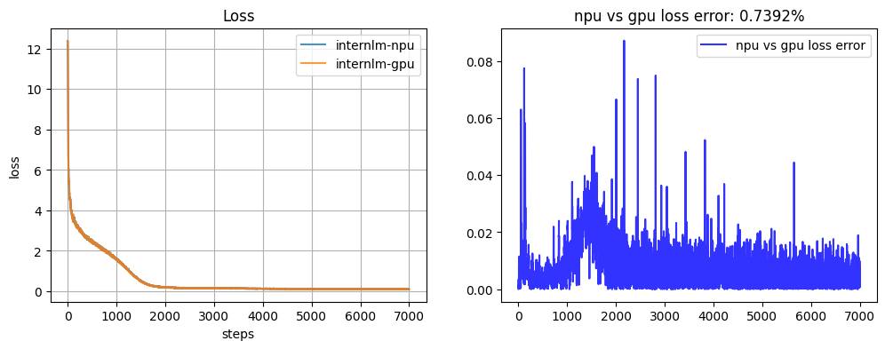
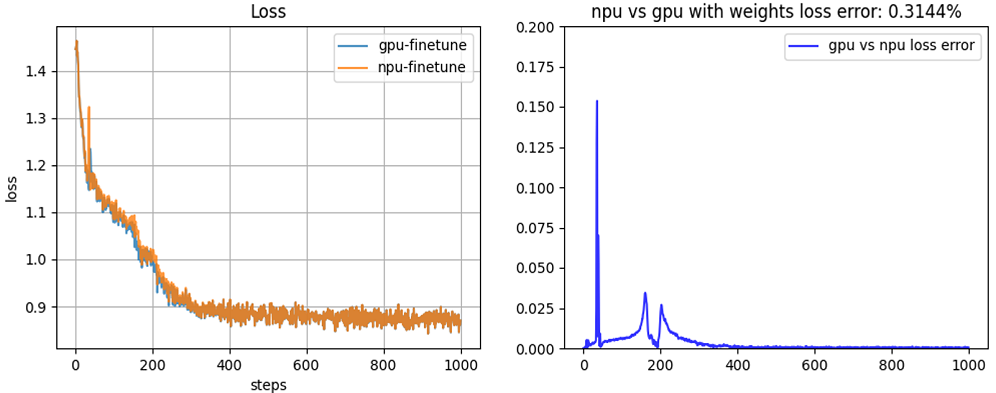

#  Contents

- [Contents](#contents)
- [Internlm-7B](#internlm-7b)
  - [Training](#training)
    - [Script](#script)
    - [Performance](#performance)
      - [Machine performance](#machine-performance)
      - [Accuracy of the loss](#accuracy-of-the-loss)

# Internlm-7B

## Training

Here's a hardware summary of pre-training InternLM-7B:

| Hardware |                      Value                      |
| :------: | :---------------------------------------------: |
|   NPU    |               8 x Ascend NPUs                   |

Here's a software summary of pre-training InternLM-7B:


|         Software          |   Version   |
| :-----------------------: |:-----------:|
|          Python           |   3.7.16    |
|          driver           | [package](https://support.huawei.com/enterprise/zh/ascend-computing/atlas-900-pod-a2-pid-254184911/software) |
|         firmware          | [package](https://support.huawei.com/enterprise/zh/ascend-computing/atlas-900-pod-a2-pid-254184911/software) |
|           CANN            |       [package](https://support.huawei.com/enterprise/zh/ascend-computing/cann-pid-251168373/software)       |
| binary arithmetic package |       [package](https://support.huawei.com/enterprise/zh/ascend-computing/cann-pid-251168373/software)       |
|           torch           |                                                    1.11.0                                                    |
|         torch_npu         |                             [package](https://gitee.com/ascend/pytorch/releases)                             |

### Script

1. Clone the repository to your local server:
```shell
git clone https://gitee.com/ascend/AscendSpeed.git 
cd AscendSpeed 
mkdir logs
mkdir ckpt
```

2. Build environment

```bash
# python3.7
conda create -n test python=3.7
conda activate test
# install torch and torch_npu
pip install torch-1.11.0-cp37-cp37m-linux_aarch64.whl
pip install torch_npu-1.11.0.post4_XXXXXX-cp37-cp37m-linux_aarch64.whl
# install megatron-core
pip3 install --no-use-pep517 -e git+https://github.com/NVIDIA/Megatron-LM.git@23.05#egg=megatron-core
# install deepspeed and deepspeed_npu
pip install deepspeed==0.9.2
git clone https://gitee.com/ascend/DeepSpeed.git -b v0.9.2 deepspeed_npu
cd deepspeed_npu
pip3 install -e ./
cd ..
# install other packages
pip install -r requirements.txt 
```
*Note that if you want to train with the weight from huggingface, please run fix a deepspeed loading checkpointing bug by modified `if zero_sd_list is None` as `if zero_sd_list is None or len(zero_sd_list) == 0` in the `_load_zero_checkpoint` function of `<deepspeed-installed-path>/runtime/engine.py`*

```python
    # original deepspeed/runtime/engine.py, about #Lines2746-2748
    zero_sd_list = self._get_all_zero_checkpoints(load_dir, tag)
    if zero_sd_list is None:
        return False
    
    # modified
    zero_sd_list = self._get_all_zero_checkpoints(load_dir, tag)
    if zero_sd_list is None or len(zero_sd_list) == 0:
        return False
```
3. Download the Internlm-7B tokenizer model and file from [here](https://huggingface.co/internlm/internlm-7b/tree/main) 

```shell
#!/bin/bash
mkdir -p dataset/internlm
cd ./dataset/internlm
wget https://huggingface.co/internlm/internlm-7b/resolve/main/config.json
wget https://huggingface.co/internlm/internlm-7b/resolve/main/generation_config.json
wget https://huggingface.co/internlm/internlm-7b/resolve/main/special_tokens_map.json
wget https://huggingface.co/internlm/internlm-7b/resolve/main/tokenization_internlm.py
wget https://huggingface.co/internlm/internlm-7b/resolve/main/tokenizer.model
wget https://huggingface.co/internlm/internlm-7b/resolve/main/tokenizer_config.json
cd ../..
```

4. Prepare dataset. Download the Internlm-7B datasets from [here](https://huggingface.co/datasets/tatsu-lab/alpaca/resolve/main/data/train-00000-of-00001-a09b74b3ef9c3b56.parquet) 

```shell
cd dataset/
wget https://huggingface.co/datasets/tatsu-lab/alpaca/resolve/main/data/train-00000-of-00001-a09b74b3ef9c3b56.parquet
cd ..
```

```shell
#!/bin/bash
source /usr/local/Ascend/ascend-toolkit/set_env.sh 
python ./tools/preprocess_data.py \
    --input ./dataset/train-00000-of-00001-a09b74b3ef9c3b56.parquet \
    --tokenizer-name-or-path ./dataset/internlm \
    --output-prefix ./dataset/alpaca \
    --workers 4 \
    --log-interval 1000  \
    --tokenizer-type PretrainedFromHF  \
    --handler-name AlpacaPretrainHandler  \
    --tokenizer-not-use-fast \
    --append-eod
```

5. Weights convert

Download the Internlm-7B checkpoint from [here](https://huggingface.co/internlm/internlm-7b/tree/main) 
```shell
mkdir model_from_hf
cd ./model_from_hf
# you must install git-lfs
git clone https://huggingface.co/internlm/internlm-7b
cd ..
```

In order to adapt to the internlm-7B model, the following script is used to convert the model pre-training weights.
```shell
mkdir model_weights
SCRIPT_PATH=./tools/ckpt_convert/llama/convert_weights_from_huggingface.py
python $SCRIPT_PATH \
    --input-model-dir ./model_from_hf/internlm-7b/ \
    --output-model-dir ./model_weights \
    --tensor-model-parallel-size 1 \
    --pipeline-model-parallel-size 1 \
    --type 7B \
    --bias \
    --deepspeed \
```

6. Config Internlm-7B pre-training script.

```shell
# modify the script according to your own  ascend-toolkit path
source /usr/local/Ascend/ascend-toolkit/set_env.sh 
# modify script orign dataset path according to your own dataset path
TOKENIZER_PATH=./dataset/internlm  #tokenizer path
DATA=./dataset/alpaca_text_document  #processed dataset
CHECKPOINT=./model_weights/
```

7. Launch Internlm-7B pre-training script.

```shell
bash examples/intern/pretrain_internlm_7b_zero.sh 
```


### Performance

#### Machine performance

The performance of Internlm-7B in **Ascend NPU** and **Reference**:

| Device | Model       | total Iterations | throughput rate (samples/s/p) | throughput rate (tokens/s/p) | single-step time (s/step) | floating point operation (TFLOPs/s) |
| ------ | ----------- | ---------------- | ----------------------------- | ---------------------------- | ------------------------- | ----------------------------------- |
| NPUs   | Internlm-7B | 2048             | 1.355                         | 2777                         | 5.90                      | 161.22                              |
| Reference   | Internlm-7B | 2048             | 1.344                         | 2753                        | 5.95                      | 158.60                             |


#### Accuracy of the loss

NPU vs GPU loss.

The NPU runs smoothly, the resource usage is stable, no errors are reported in the middle of the process, the Loss is on a decreasing trend, and the convergence speed is as expected. The relative error of the average loss is 0.007, less than 2%, the maximum relative error is 0.09, and the maximum absolute error is 0.4859. The precision meets the requirements.

NPU vs GPU without weights loss and relative error.


NPU vs GPU with weights loss and relative error.

\
\
<font size=1>If the download of the file fails using 'wget' , you can download it manually while ensuring website security.</font>
