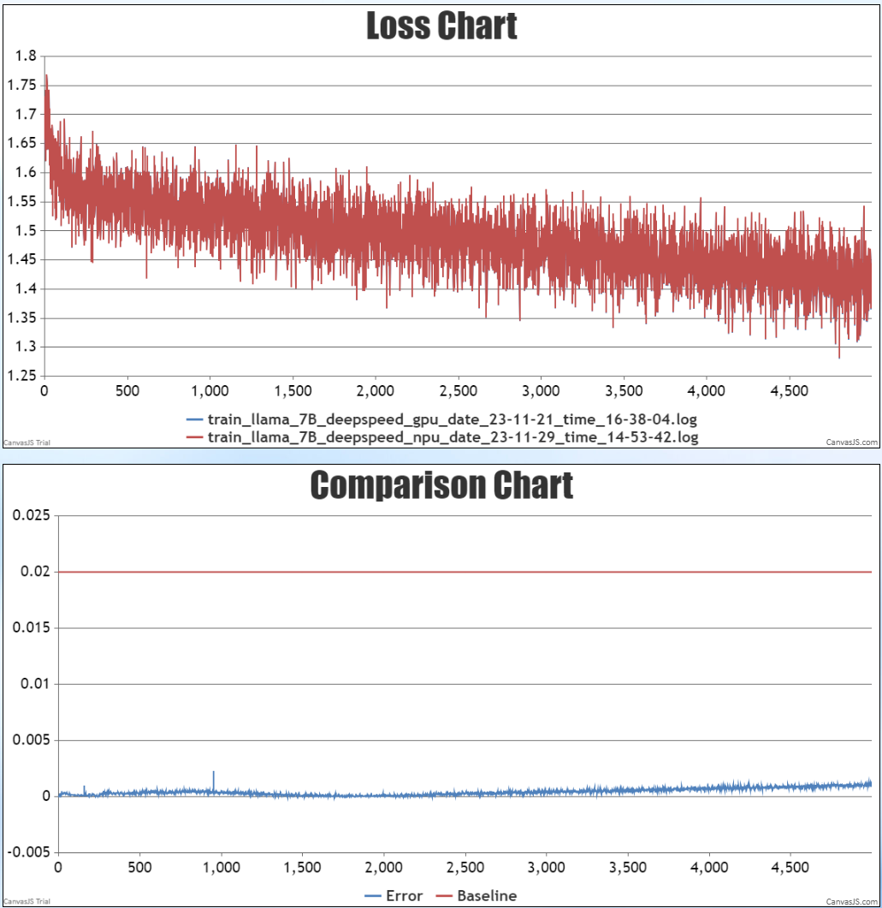
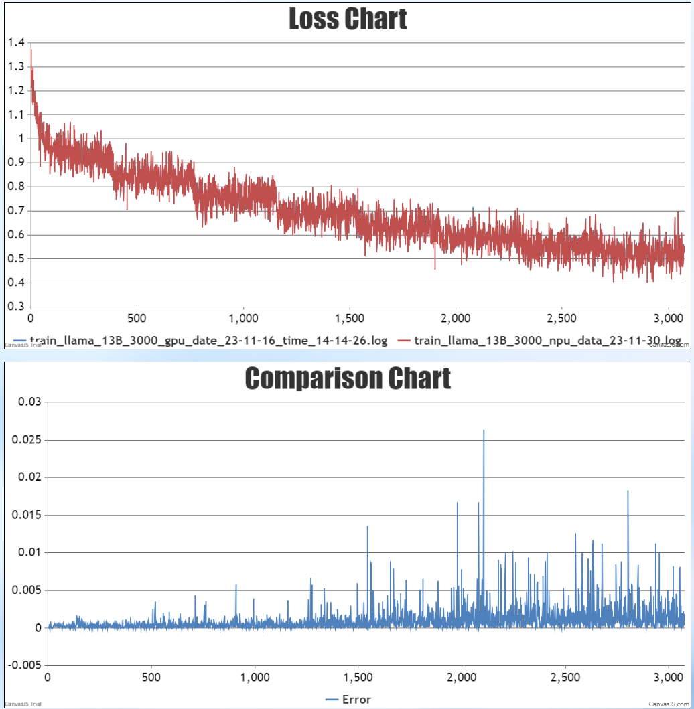
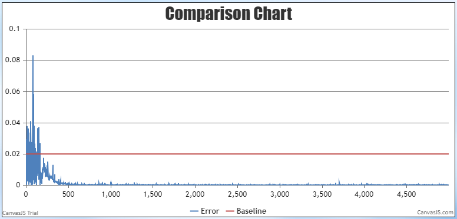
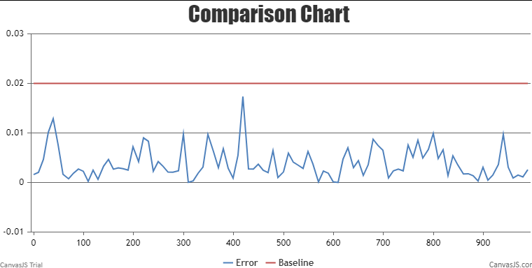

# LLaMA-7B/13B

- [LLaMA-7B/13B](#llama-7b13b)
  - [Training](#training)
    - [Script](#script)
    - [Performance](#performance)
      - [Machine performance](#machine-performance)
      - [Accuracy of the loss](#accuracy-of-the-loss)
- [LLaMA-33B/65B](#llama-65b)
  - [Pre-Training](#pre-training)
    - [Datasets](#datasets)
    - [Script](#script-1)
    - [Performance](#performance-1)
      - [Machine performance](#machine-performance-1)
      - [Accuracy of the loss](#accuracy-of-the-loss-1)
  - [Citation](#citation)

## Training

Here's a hardware summary of pre-training LLaMA-7B/13B:

| Hardware |                      Value                      |
| :------: | :---------------------------------------------: |
|   NPU    |               8 x Ascend NPUs                   |

Here's a software summary of pre-training LLaMA-7B/13B:


|         Software          |   Version   |
| :-----------------------: |:-----------:|
|          Python           |   3.7.16    |
|          driver           | [package](https://support.huawei.com/enterprise/zh/ascend-computing/atlas-900-pod-a2-pid-254184911/software) |
|         firmware          | [package](https://support.huawei.com/enterprise/zh/ascend-computing/atlas-900-pod-a2-pid-254184911/software) |
|           CANN            |       [package](https://support.huawei.com/enterprise/zh/ascend-computing/cann-pid-251168373/software)       |
| binary arithmetic package |       [package](https://support.huawei.com/enterprise/zh/ascend-computing/cann-pid-251168373/software)       |
|           torch           |                                                    1.11.0                                                    |
|         torch_npu         |                             [package](https://gitee.com/ascend/pytorch/releases)                             |

### Script

1. Clone the repository to your local server:
```shell
git clone https://gitee.com/ascend/AscendSpeed.git 
cd AscendSpeed 
mkdir logs
mkdir ckpt
```

2. Build environment

```bash
# python3.7
conda create -n test python=3.7
conda activate test
# install torch and torch_npu
pip install torch-1.11.0-cp37-cp37m-linux_aarch64.whl
pip install torch_npu-1.11.0.post4_XXXXXX-cp37-cp37m-linux_aarch64.whl
# install megatron-core
pip3 install --no-use-pep517 -e git+https://github.com/NVIDIA/Megatron-LM.git@23.05#egg=megatron-core
# install deepspeed and deepspeed_npu
pip install deepspeed==0.9.2
git clone https://gitee.com/ascend/DeepSpeed.git -b v0.9.2 deepspeed_npu
cd deepspeed_npu
pip3 install -e ./
cd ..
# install other packages
pip install -r requirements.txt 
```
*Note that if you want to train with the weight from huggingface, please run fix a deepspeed loading checkpointing bug by modified `if zero_sd_list is None` as `if zero_sd_list is None or len(zero_sd_list) == 0` in the `_load_zero_checkpoint` function of `<deepspeed-installed-path>/runtime/engine.py`*

```python
    # original deepspeed/runtime/engine.py, about #Lines2746-2748
    zero_sd_list = self._get_all_zero_checkpoints(load_dir, tag)
    if zero_sd_list is None:
        return False
    
    # modified
    zero_sd_list = self._get_all_zero_checkpoints(load_dir, tag)
    if zero_sd_list is None or len(zero_sd_list) == 0:
        return False
```
3. Download the LLaMA-7B/13B tokenizer model and file from [here](https://huggingface.co/yahma/llama-7b-hf/tree/main) 


```shell
  #!/bin/bash
  mkdir -p dataset/llama
  cd ./dataset/llama
  wget https://huggingface.co/yahma/llama-7b-hf/tree/main/config.json
  wget https://huggingface.co/yahma/llama-7b-hf/tree/main/generation_config.json
  wget https://huggingface.co/yahma/llama-7b-hf/tree/main/special_tokens_map.json
  wget https://huggingface.co/yahma/llama-7b-hf/tree/main/tokenizer.model
  wget https://huggingface.co/yahma/llama-7b-hf/tree/main/tokenizer_config.json
  cd ..
```


4. Prepare dataset. Download the Internlm-7B datasets from [here](https://huggingface.co/datasets/tatsu-lab/alpaca/resolve/main/data/train-00000-of-00001-a09b74b3ef9c3b56.parquet) 

```shell
cd dataset/
wget https://huggingface.co/datasets/tatsu-lab/alpaca/resolve/main/data/train-00000-of-00001-a09b74b3ef9c3b56.parquet
cd ..
```

```shell
#!/bin/bash
source /usr/local/Ascend/ascend-toolkit/set_env.sh 
python ./tools/preprocess_data.py \
    --input ./dataset/train-00000-of-00001-a09b74b3ef9c3b56.parquet \
    --tokenizer-name-or-path ./dataset/llama \
    --output-prefix ./dataset/llama \
    --workers 4 \
    --log-interval 1000  \
    --tokenizer-type PretrainedFromHF  \
    --handler-name AlpacaPretrainHandler  \
    --tokenizer-not-use-fast \
    --append-eod
```

5. Weights convert

Download the LLaMA-7B checkpoint from [here](https://huggingface.co/yahma/llama-7b-hf/tree/main) 
```shell
  mkdir model_from_hf
  cd ./model_from_hf
  # you must install git-lfs
  git clone https://huggingface.co/yahma/llama-7b-hf
  cd ..
```

Download the LLaMA-13B checkpoint from [here](https://huggingface.co/yahma/llama-13b-hf/tree/main) 
```shell
  mkdir model_from_hf
  cd ./model_from_hf
  # you must install git-lfs
  git clone https://huggingface.co/yahma/llama-13b-hf
  cd ..
```

In order to adapt to the LLaMA-7B/13B model, the following script is used to convert the model pre-training weights.

LLaMA-7B
```shell
mkdir model_weights
SCRIPT_PATH=./tools/ckpt_convert/llama/convert_weights_from_huggingface.py
python $SCRIPT_PATH \
    --input-model-dir ./model_from_hf/llama-7b/ \
    --output-model-dir ./model_weights/llama-7b \
    --tensor-model-parallel-size 1 \
    --pipeline-model-parallel-size 1 \
    --type 7B \
    --deepspeed
```

LLaMA-13B
```shell
mkdir model_weights
SCRIPT_PATH=./tools/ckpt_convert/llama/convert_weights_from_huggingface.py
python $SCRIPT_PATH \
    --input-model-dir ./model_from_hf/llama-13b/ \
    --output-model-dir ./model_weights/llama-13b \
    --tensor-model-parallel-size 1 \
    --pipeline-model-parallel-size 8 \
    --type 13B
```

6. Config LLaMA-7B/13B pre-training script.

```shell
# modify the script according to your own  ascend-toolkit path
source /usr/local/Ascend/ascend-toolkit/set_env.sh 
# modify script orign dataset path according to your own dataset path
TOKENIZER_PATH=./dataset/llama  #tokenizer path
DATA=./dataset/llama_text_document  #processed dataset
CHECKPOINT=./model_weights/
```
*Note that if you do not load weights for pre-training, remove the `--load` parameter from the training script*

7. Launch LLaMA-7B/13B pre-training script.

LLaMA-7B
```shell
bash examples/intern/pretrain_llama_7B_zero_8p.sh
```

LLaMA-13B
```shell
bash examples/intern/pretrain_llama_13B_ptd_8p.sh 
```

### Performance

#### Machine performance

The performance of LLaMA-7B/13B in **Ascend NPU** and **Reference**:

| Device | Model        | total Iterations | throughput rate (samples/s/p) | throughput rate (tokens/s/p) | single-step time (s/step) | floating point operation (TFLOPs/s) |
| ------ |--------------| ---------------- |-------------------------------|------------------------------|---------------------------|-------------------------------------|
| NPUs   | LLaMA-7B     | 2048             | 1.398                         | 2862                         | 5.725                     | 162.2                               |
| Reference   | LLaMA-7B  | 2048             | 1.395                         | 2859                         | 5.73                      | 161.8                               |
| NPUs   | LLaMA-13B | 2048             | 0.879                         | 1800                         | 18.20                     | 146.1                               |
| Reference   | LLaMA-13B | 2048             | 0.847                         | 1734                         | 18.89                     | 141.0                               |


#### Accuracy of the loss

LLama-7b with huggingface weights NPU vs GPU loss.

LLama-13b with huggingface weights NPU vs GPU loss.



# LLaMA-33B/65B

This directory contains some of the scripts that were used to produce the results in the AscendSpeed. These scripts is to show the example how to run llama-65B in terminal.

LLaMA model is from: [LLaMA: OPen and Efficient Foundation Language Models](https://arxiv.org/pdf/2302.13971v1.pdf)

>Touvron, Hugo, et al. "LLaMA: OPen and Efficient Foundation Language Models." arXiv preprint arXiv:2302.13971 (2023).

## Pre-Training

LLaMA's model performace is better than GPT3 with less parameters. The 33B/65B LLaMA model is comparable to Google's Chinchilla-70B and Palm-540B.

Here's a hardware summary of training llama:

| Hardware |                      Value                      |
| :------: | :---------------------------------------------: |
|   NPU    |               8 x Ascend NPUs                   |


Here's a software summary of training llama:
                                                   |
|         Software          |   Version   |
| :-----------------------: |:-----------:|
|          Python           |   3.7    |
|          driver           | [package](https://support.huawei.com/enterprise/zh/ascend-computing/atlas-900-pod-a2-pid-254184911/software) |
|         firmware          | [package](https://support.huawei.com/enterprise/zh/ascend-computing/atlas-900-pod-a2-pid-254184911/software) |
|           CANN            |       [package](https://support.huawei.com/enterprise/zh/ascend-computing/cann-pid-251168373/software)       |
| binary arithmetic package |       [package](https://support.huawei.com/enterprise/zh/ascend-computing/cann-pid-251168373/software)       |
|           torch           |                                                    1.11.0                                                    |
|         torch_npu         |                             [package](https://gitee.com/ascend/pytorch/releases)                             |

### Datasets
The model was trained using alpaca datasets.

### Script
1.Clone the repository to your local server
```shell
git clone https://gitee.com/ascend.AscendSpeed.git
cd AscendSpeed
mkdir logs
mkdir ckpt
```
2.Install AscendSpeed requirement environment.
```shell
# python3.7
conda create -n test python=3.7
conda activate test

# install torch and torch_npu
# ARM
wget https://download.pytorch.org/whl/torch-1.11.0-cp37-cp37m-manylinux2014_aarch64.whl
pip install torch-1.11.0-cp37-cp37m-linux_aarch64.whl
pip install torch_npu-1.11.0.post4_XXXXXX-cp37-cp37m-linux_aarch64.whl

# X86
#pip install torch ==1.11 -i https://pypi.tuna.tsinghua.edu.cn/simple
#pip install torch_npu-1.11.0.post4_XXXXXX-cp37-cp37m-linux_aarch64.whl

# install megatron-core
pip3 install --no-use-pep517 -e git+https://github.com/NVIDIA/Megatron-LM.git@23.05#egg=megatron-core

# install deepspeed and deepspeed_npu
pip install deepspeed==0.9.2
git clone https://gitee.com/ascend/DeepSpeed.git -b v0.9.2 deepspeed_npu
cd deepspeed_npu
pip3 install -e ./
cd ..

# install other packages
pip install -r requirements.txt
```
3.Download checkpoint

llama-33B checkpoint
```shell
mkdir tokenizer
cd ./tokenizer

# make sure you have git-lfs installed (https://git-lfs.com)
git lfs install
git clone https://huggingface.co/pinkmanlove/llama-33b-hf
cd ..
```

llama-65B checkpoint
```shell
mkdir tokenizer
cd ./tokenizer

# make sure you have git-lfs installed (https://git-lfs.com)
git lfs install
git clone https://huggingface.co/pinkmanlove/llama-65b-hf
cd ..
```
4.In order to adapt to llama-33B/65B model, the following script is used to convert the model pre-training weights

llama-33B
```shell
mkdir model_weights

SCRIPT_PATH=./tools/ckpt_convert/llama/convert_weights_from_huggingface.py
python $SCRIPT_PATH \
      --input-model-dir ./tokenizer \
      --output-model-dir ./model_weights \
      --tensor-model-parallel-size 8 \
      --pipeline-model-parallel-size 4 \
      --type 33B
```

llama-65B
```shell
mkdir model_weights

SCRIPT_PATH=./tools/ckpt_convert/llama/convert_weights_from_huggingface.py
python $SCRIPT_PATH \
      --input-model-dir ./tokenizer \
      --output-model-dir ./model_weights \
      --tensor-model-parallel-size 8 \
      --pipeline-model-parallel-size 4 \
      --type 65B
```

5.Download dataset
```shell
# for llama, dowload alpaca dataset, like
wget http://github.com/tatsu-lab/stanford_alpaca/blob/main/alpaca_data.jason

# download tokenizer configs nad (selective) weights from
# http://huggingface.co/pinkmanlove/llama-33b-hf
# http://huggingface.co/pinkmanlove/llama-65b-hf
# revise "LLaMATokenizer" as "LLaMTokenizer" in tokenizer_config.json
mkdir dataset
python tools/preprocess_data.py --input alpaca_data.json\
                                --output-prefix dataset/alpaca\
                                --tokenizer-type PretrainedFromHF\
                                --tokenizer-name-or-path llama-33b-hf
                               #--tokenizer-name-or-path llama-65b-hf
                                --tokenizer-not-use-fast
                                --handler-name GeneralInstructionHandler
```

6.Config llama-33B/65B pre-training script :
AscendSpeed/examples/llama/pretrain_llama_33B_zero_32p.sh
AscendSpeed/examples/llama/pretrain_llama_65B_ptd_32p.sh

```bash
# modify the script according to your own conda and ascend-toolkit path
export LD_LIBRARY_PATH=/usr/local/lib:/usr/local/lib:/root/miniconda3/lib:$LD_LIBRARY_PATH
export HEEL_CONNECT_TIMEOUT=1200
export COMBINED_ENABLE=1

# modify script orign dataset path according to your own dataset path
TOKENIZER_PATH=./dataset/llama_tokenizer # line 16
DATA_PATH=./dataset/llama_text_document # line 17
```

7.Launch  pre-training script:

Launch llama-33B pre-training script : AscendSpeed/examples/llama/pretrain_llama_33B_zero_32p.sh
```bash
bash examples/llama/pretrain_llama_33B_zero_32p.sh
```

Launch llama-65B pre-training script : AscendSpeed/examples/llama/pretrain_llama_65B_ptd_32p.sh
```bash
bash examples/llama/pretrain_llama_65B_ptd_32p.sh
```
Config llama-33B/65B pre-training script for multinode (Launch llama-65B pre-training script on each machine):

```shell
MASTER_ADDR=localhost
MASTER_PORT=6001
NNODES=4
NODE_RANK=0
```
The Training log will look like these:

```Shell
 iteration  3/50000 | consumed samples: 768 | consumed tokens:  1572864 | elapsed time per iteration (ms):  33818.0 | learning rate:    1.406E-07 | gloabl batch size:  256 | lm loss:  1.200820E+01 | loss scale:  1.0 | grad norm:    9.216 | actual seqlen:  2048 | number of skipped
iterations: 0 | number of nan iterations:   0 | samples per second: 7.570 | TFLOPs: 107.09 |
time (ms)
```

### Performance

#### Machine performance

The performance of the NPUs in **Ascend** and Reference:

|  Device   |   Model   | throughput rate (tokens/s/p) |
|:---------:|:---------:|:----------------------------:|
| Reference | llama-33B |             520              |
|   NPUs    | llama-33B |             621              |
| Reference | llama-65B |             260              |
|   NPUs    | llama-65B |             234              |


#### Accuracy of the loss

NPU vs GPU loss and relative error:

LLaMa-33B

The NPU runs smoothly, the resource usage is stable, no errors are reported in the middle of the process, the Loss is on a decreasing trend, and the convergence speed is as expected.


The relative error between NPU and GPU Loss is less than 0.03 throughout, as expected.




LLaMa-65B

The NPU runs smoothly, the resource usage is stable, no errors are reported in the middle of the process, the Loss is on a decreasing trend, and the convergence speed is as expected.


The relative error between NPU and GPU Loss is less than 0.02 throughout, as expected.




## Citation

You may also consider original work in your reference:

```shell
@article{Touvron2023llama,
  title={LLaMA: OPen and Efficient Foundation Language Models},
  author={Hugo Touvron*, Thibaut Lavril*, Gautier Izacard*, Xavier Martinet, Marie-Anne Lachaux, Timothee Lacroix, Baptiste Roziere, Naman Goyal,
  Eric Hambro, Faisal Azhar, Aurelien Rodriguez, Armand Joulin, Edouard Grave*, Guillaume Lample*},
  journal={arXiv preprint arXiv:2302.13971},
  year={2023}}
```
\
\
<font size=1>If the download of the file fails using 'wget' , you can download it manually while ensuring website security.</font>