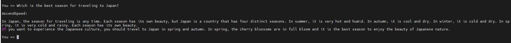
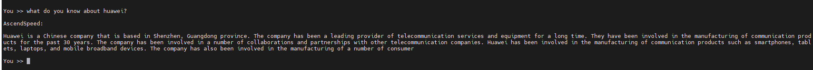
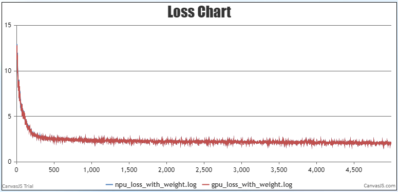
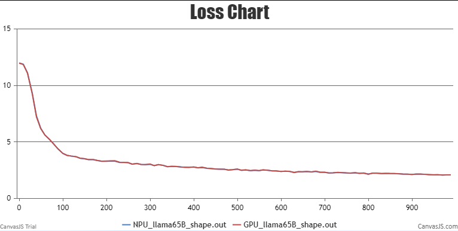

# LLaMA-7B/13B
<p align="left">
        <b>简体中文</b> |
        <b><a href="https://gitee.com/ascend/AscendSpeed/blob/master/examples/llama/README_en.md">English</a></b> 
    </p>
</p>


- [LLaMA-7B/13B](#LLaMA-7B/13B)
  - [训练](#训练)
    - [脚本](#脚本)
    - [性能](#性能)
      - [吞吐](#吞吐)
      - [精度](#精度)
    - [推理](#推理)
      - [脚本](#脚本)
    - [使用基线数据集进行评估](#使用基线数据集进行评估)
- [LLaMA-33B/65B](#LLaMA-33B/65B)
  - [训练](#训练)
    - [数据集](#数据集)
    - [脚本](#脚本)
    - [性能](#性能)
      - [吞吐](#吞吐)
      - [精度](#精度)
- [引用](#引用)

## 训练

LLaMA-7B/13B 训练的硬件配置如下:

|  硬件  |   设备   |      配置          |
|:----:|:------:|:----------------:|
| NPU  |  A+K   | 8 x Ascend NPUs  |
| NPU  |  A+X   | 16 x Ascend NPUs |

LLaMA-7B/13B 训练的软件配置如下:

|            软件             |                                                      配置                                                      |
|:-------------------------:|:------------------------------------------------------------------------------------------------------------:|
|          python           |                                                    3.7.5                                                     |
|          driver           | [package](https://support.huawei.com/enterprise/zh/ascend-computing/atlas-900-pod-a2-pid-254184911/software) |
|         firmware          | [package](https://support.huawei.com/enterprise/zh/ascend-computing/atlas-900-pod-a2-pid-254184911/software) |
|           CANN            |       [package](https://support.huawei.com/enterprise/zh/ascend-computing/cann-pid-251168373/software)       |
| binary arithmetic package |       [package](https://support.huawei.com/enterprise/zh/ascend-computing/cann-pid-251168373/software)       |
|           torch           |                                                    1.11.0                                                    |
|         torch_npu         |                             [package](https://gitee.com/ascend/pytorch/releases)                             |

### 脚本

1. 拷贝仓库到个人服务器
```shell
git clone https://gitee.com/ascend/AscendSpeed.git 
cd AscendSpeed 
mkdir logs
mkdir ckpt
```

2. 搭建环境

```bash
# python3.7
conda create -n test python=3.7
conda activate test
# 安装 torch 和 torch_npu
pip install torch-1.11.0-cp37-cp37m-linux_aarch64.whl
pip install torch_npu-1.11.0.post4_XXXXXX-cp37-cp37m-linux_aarch64.whl
# 安装 megatron-core
pip3 install --no-use-pep517 -e git+https://github.com/NVIDIA/Megatron-LM.git@23.05#egg=megatron-core
# 安装 deepspeed 和 deepspeed_npu
pip install deepspeed==0.9.2
git clone https://gitee.com/ascend/DeepSpeed.git -b v0.9.2 deepspeed_npu
cd deepspeed_npu
pip3 install -e ./
cd ..
# 安装其余依赖包
pip install -r requirements.txt 
```

3. 下载 LLaMA-7B/13B [词表文件](https://huggingface.co/yahma/llama-7b-hf/tree/main) 


```shell
  #!/bin/bash
  mkdir -p dataset/llama
  cd ./dataset/llama
  wget https://huggingface.co/yahma/llama-7b-hf/tree/main/config.json
  wget https://huggingface.co/yahma/llama-7b-hf/tree/main/generation_config.json
  wget https://huggingface.co/yahma/llama-7b-hf/tree/main/special_tokens_map.json
  wget https://huggingface.co/yahma/llama-7b-hf/tree/main/tokenizer.model
  wget https://huggingface.co/yahma/llama-7b-hf/tree/main/tokenizer_config.json
  cd ..
```


4. 下载 LLaMA-7B/13B [数据集](https://huggingface.co/datasets/tatsu-lab/alpaca/resolve/main/data/train-00000-of-00001-a09b74b3ef9c3b56.parquet) 

```shell
cd dataset/
wget https://huggingface.co/datasets/tatsu-lab/alpaca/resolve/main/data/train-00000-of-00001-a09b74b3ef9c3b56.parquet
cd ..
```

```shell
#!/bin/bash
source /usr/local/Ascend/ascend-toolkit/set_env.sh 
python ./tools/preprocess_data.py \
    --input ./dataset/train-00000-of-00001-a09b74b3ef9c3b56.parquet \
    --tokenizer-name-or-path ./dataset/llama \
    --output-prefix ./dataset/llama \
    --workers 4 \
    --log-interval 1000  \
    --tokenizer-type PretrainedFromHF  \
    --handler-name AlpacaPretrainHandler  \
    --tokenizer-not-use-fast \
    --append-eod
```

5. 权重转换

```text
# 请注意，如果要加载huggingface的预训练权重，需要修改一个deepspeed关于加载权重的bug：
# 在 `<deepspeed-installed-path>/runtime/engine.py` 文件里的 `_load_zero_checkpoint` 函数，
# 将 `if zero_sd_list is None` 改为 `if zero_sd_list is None or len(zero_sd_list) == 0`

# 原始 deepspeed/runtime/engine.py, 大概 #Lines2746-2748
zero_sd_list = self._get_all_zero_checkpoints(load_dir, tag)
if zero_sd_list is None:
    return False

# 修改后
zero_sd_list = self._get_all_zero_checkpoints(load_dir, tag)
if zero_sd_list is None or len(zero_sd_list) == 0:
    return False
```


下载 LLaMA-7B [权重](https://huggingface.co/yahma/llama-7b-hf/tree/main) 或 LLaMA-13B [权重](https://huggingface.co/yahma/llama-13b-hf/tree/main)
```shell
  mkdir model_from_hf
  cd ./model_from_hf
  # 需要安装 git-lfs
  git clone https://huggingface.co/yahma/llama-7b-hf
  cd ..
```

将模型权重文件从 huggingface 格式转化为 AscendSpeed 格式

LLaMA-7B
```shell
mkdir model_weights
SCRIPT_PATH=./tools/ckpt_convert/llama/convert_weights_from_huggingface.py
python $SCRIPT_PATH \
    --input-model-dir ./model_from_hf/llama-7b/ \
    --output-model-dir ./model_weights/llama-7b \
    --tensor-model-parallel-size 1 \
    --pipeline-model-parallel-size 1 \
    --type 7B \
    --deepspeed
```

LLaMA-13B
```shell
# 单机八卡
mkdir model_weights
SCRIPT_PATH=./tools/ckpt_convert/llama/convert_weights_from_huggingface.py
python $SCRIPT_PATH \
    --input-model-dir ./model_from_hf/llama-13b/ \
    --output-model-dir ./model_weights/llama-13b \
    --tensor-model-parallel-size 1 \
    --pipeline-model-parallel-size 8 \
    --type 13B
    
# 单机16卡
mkdir model_weights
SCRIPT_PATH=./tools/ckpt_convert/llama/convert_weights_from_huggingface.py
python $SCRIPT_PATH \
    --input-model-dir ./model_from_hf/llama-13b/ \
    --output-model-dir ./model_weights/llama-13b \
    --tensor-model-parallel-size 1 \
    --pipeline-model-parallel-size 2 \
    --type 13B
```

6. 配置 LLaMA-7B/13B 预训练脚本

```shell
# 设置 ascend-toolkit 路径
source /usr/local/Ascend/ascend-toolkit/set_env.sh 
# 修改数据集路径，权重路径，词表路径等
TOKENIZER_PATH=./dataset/llama  #tokenizer 路径
DATA=./dataset/llama_text_document  #数据集 路径
CHECKPOINT=./model_weights/

# 如果不需要加载权重，就移除 `--load` 参数
```

7. 启动 LLaMA-7B/13B 预训练脚本

LLaMA-7B
```shell
bash examples/llama/pretrain_llama_7B_zero_8p.sh
```

LLaMA-13B
```shell
# 单机8卡
bash examples/llama/pretrain_llama_13B_ptd_8p.sh 
# 单机16卡
bash examples/llama/pretrain_llama_13B_ptd_16p.sh
```

### 性能

#### 吞吐

LLaMA-7B/13B 在 **昇腾芯片** 和 **参考芯片** 上的性能对比：

| 设备   | 硬件        | 模型        | 迭代数  | 样本吞吐 (samples/p/s) | token吞吐 (tokens/p/s) | 单步迭代时间 (s/step) | 浮点计算数 (TFLOPs/s) |
|------|-----------|-----------|------|------------------|----------------------|-----------------|------------------|
| NPUs      | 910 1*8p  | LLaMA-7B  | 2048             | 1.80                          | 3686                         | 4.44                      | 156.5                               |
| 参考 | -        | LLaMA-7B  | 2048             | 1.85                          | 3788                         | 4.31                      | 161.1                               |
| NPUs      | 910 1*8p  | LLaMA-13B | 2048             | 0.956                         | 1958                         | 16.70                     | 212.25                              |
| NPUs      | 910 1*16p | LLaMA-13B | 2048             | 0.88                          | 1800                         | 36.32                     | 195.58                              |
| 参考 | -        | LLaMA-13B | 2048             | 0.98                          | 2012                         | 16.33                     | 217.37                              |


#### 精度

LLama-7b NPU vs 参考 loss.


LLama-13b NPU vs 参考 loss.


## 推理

我们支持使用 LLaMA-7B 和 LLaMA-13B 进行文本生成的推理。
推理与预训练不同，比如我们需要加载预训练权重和输出样本的长度：

配置LLaMA-7B推理脚本`examples/llama/generate_llama_7B_deepspeed.sh`和LLaMA-13B推理脚本`examples/llama/generate_llama_13B_tp8_pp1.sh`。

```shell
# 修改模型权重路径和分词器路径
CHECKPOINT=<checkpoint-path>
VOCAB_FILE=<vocabfile-path>
```

LLaMA-7B:
```shell
bash ./examples/llama/generate_llama_7B_deepspeed.sh
```

LLaMA-13B:
```shell
bash ./examples/llama/generate_llama_13B_tp8_pp1.sh
```

部分推理样本如下：

LLaMA-7B:



LLaMA-13B:




## 使用基线数据集进行评估

我们使用 BBH benchmark 来评估我们的模型。Benchmark下载[此处](https://huggingface.co/datasets/lukaemon/bbh)。

配置LLaMA-7B评估脚本：

```shell
    CHECKPOINT=./llama-7b-tp4-pp2/
    VOCAB_FILE=./llama-7b-hf/
    # 配置任务和数据路径
    DATA_PATH="./bbh/data/test/"
    TASK="bbh"
    # 配置生成参数
    python -m torch.distributed.launch $DISTRIBUTED_ARGS ./tasks/evaluation/evaluation_llama.py   \
           --task-data-path $DATA_PATH \
           --task $TASK\
           --seq-length 2048 \
           --max-new-tokens 32 \
           --max-position-embeddings 2048 \
           --tensor-model-parallel-size 4  \
           --pipeline-model-parallel-size 2  \
           --num-layers 32  \
           --hidden-size 4096  \
           --ffn-hidden-size 11008 \
           --load ${CHECKPOINT}  \
           --num-attention-heads 32 \
           --tokenizer-type PretrainedFromHF  \
           --tokenizer-name-or-path $VOCAB_FILE \
           --tokenizer-not-use-fast \
           --fp16  \
           --micro-batch-size 1  \
           --seed 42 | tee logs/evaluation.log
```

配置LLaMA-13B评估脚本：

```shell
    CHECKPOINT=./llama-13b-tp1-pp8/
    VOCAB_FILE=./llama-13b-hf/
    # 配置任务和数据路径
    DATA_PATH="./bbh/data/test/"
    TASK="bbh"
    # 配置参数
    python -m torch.distributed.launch $DISTRIBUTED_ARGS ./tasks/evaluation/evaluation_llama.py   \
           --task-data-path $DATA_PATH \
           --task $TASK\
           --seq-length 2048 \
           --max-new-tokens 32 \
           --max-position-embeddings 2048 \
           --tensor-model-parallel-size 1  \
           --pipeline-model-parallel-size 8  \
           --num-layers 40  \
           --hidden-size 5120  \
           --ffn-hidden-size 13824 \
           --load ${CHECKPOINT}  \
           --num-attention-heads 40 \
           --tokenizer-type PretrainedFromHF  \
           --tokenizer-name-or-path $VOCAB_FILE \
           --tokenizer-not-use-fast \
           --fp16  \
           --micro-batch-size 1  \
           --seed 42 | tee logs/evaluation.log
```

```shell
# 开始评估
bash tasks/evaluation/eval.sh
```

LLaMA-7B/13B在**Ascend NPU**中的评测表现：

| 任务                                                  | 模型        | 昇腾值  | 社区值  |
|-----------------------------------------------------|-----------|------|------|
| [BBH](https://huggingface.co/datasets/lukaemon/bbh) | LLaMA-7B  | 33.7 | [33.5](https://opencompass.org.cn/dataset-detail/BBH) | 
| [BBH](https://huggingface.co/datasets/lukaemon/bbh) | LLaMA-13B | 38.7 | [37.9](https://opencompass.org.cn/dataset-detail/BBH) |

# LLaMA-33B/65B

LLaMA 模型源于: [LLaMA: OPen and Efficient Foundation Language Models](https://arxiv.org/pdf/2302.13971v1.pdf)

>Touvron, Hugo, et al. "LLaMA: OPen and Efficient Foundation Language Models." arXiv preprint arXiv:2302.13971 (2023).

## 训练

LLaMA-33B/65B 训练的硬件配置:

|  硬件 |       配置        |
|:---:|:---------------:|
| NPU | 8 x Ascend NPUs |


LLaMA-33B/65B 训练的软件配置:
                                                   
|            软件             |                                                      配置                                                      |
|:-------------------------:|:------------------------------------------------------------------------------------------------------------:|
|          python           |                                                     3.7                                                      |
|          driver           | [package](https://support.huawei.com/enterprise/zh/ascend-computing/atlas-900-pod-a2-pid-254184911/software) |
|         firmware          | [package](https://support.huawei.com/enterprise/zh/ascend-computing/atlas-900-pod-a2-pid-254184911/software) |
|           CANN            |       [package](https://support.huawei.com/enterprise/zh/ascend-computing/cann-pid-251168373/software)       |
| binary arithmetic package |       [package](https://support.huawei.com/enterprise/zh/ascend-computing/cann-pid-251168373/software)       |
|           torch           |                                                    1.11.0                                                    |
|         torch_npu         |                             [package](https://gitee.com/ascend/pytorch/releases)                             |

### 数据集
模型使用 alpaca 数据集训练

### 脚本
1. 拷贝仓库到个人服务器
```shell
git clone https://gitee.com/ascend.AscendSpeed.git
cd AscendSpeed
mkdir logs
mkdir ckpt
```
2. 搭建环境
```shell
# python3.7
conda create -n test python=3.7
conda activate test

# 安装 torch 和 torch_npu
# ARM
wget https://download.pytorch.org/whl/torch-1.11.0-cp37-cp37m-manylinux2014_aarch64.whl
pip install torch-1.11.0-cp37-cp37m-linux_aarch64.whl
pip install torch_npu-1.11.0.post4_XXXXXX-cp37-cp37m-linux_aarch64.whl

# X86
#pip install torch ==1.11 -i https://pypi.tuna.tsinghua.edu.cn/simple
#pip install torch_npu-1.11.0.post4_XXXXXX-cp37-cp37m-linux_aarch64.whl

# 安装 megatron-core
pip3 install --no-use-pep517 -e git+https://github.com/NVIDIA/Megatron-LM.git@23.05#egg=megatron-core

# 安装 deepspeed 和 deepspeed_npu
pip install deepspeed==0.9.2
git clone https://gitee.com/ascend/DeepSpeed.git -b v0.9.2 deepspeed_npu
cd deepspeed_npu
pip3 install -e ./
cd ..

# 安装其他包
pip install -r requirements.txt
```

3. 下载权重

llama-33B 权重
```shell
mkdir tokenizer
cd ./tokenizer

# 需要安装 git-lfs
git lfs install
git clone https://huggingface.co/pinkmanlove/llama-33b-hf
cd ..
```

llama-65B 权重
```shell
mkdir tokenizer
cd ./tokenizer

# 需要安装 git-lfs
git lfs install
git clone https://huggingface.co/pinkmanlove/llama-65b-hf
cd ..
```

4. 预训练权重从 huggingface 格式转换为 AscendSpeed 格式

llama-33B
```shell
mkdir model_weights

SCRIPT_PATH=./tools/ckpt_convert/llama/convert_weights_from_huggingface.py
python $SCRIPT_PATH \
      --input-model-dir ./tokenizer \
      --output-model-dir ./model_weights \
      --tensor-model-parallel-size 8 \
      --pipeline-model-parallel-size 4 \
      --type 33B
```

llama-65B
```shell
mkdir model_weights

SCRIPT_PATH=./tools/ckpt_convert/llama/convert_weights_from_huggingface.py
python $SCRIPT_PATH \
      --input-model-dir ./tokenizer \
      --output-model-dir ./model_weights \
      --tensor-model-parallel-size 8 \
      --pipeline-model-parallel-size 4 \
      --type 65B
```

5. 下载数据集
```shell
# 下载 alpaca 数据集
wget http://github.com/tatsu-lab/stanford_alpaca/blob/main/alpaca_data.jason

# 下载 tokenizer 配置 和 (可选择的) 权重:
# http://huggingface.co/pinkmanlove/llama-33b-hf
# http://huggingface.co/pinkmanlove/llama-65b-hf
# 将 tokenizer_config.json 中的 "LLaMATokenizer" 修改为 "LLaMTokenizer" （这是hf的一个bug）
mkdir dataset
python tools/preprocess_data.py --input alpaca_data.json\
                                --output-prefix dataset/alpaca\
                                --tokenizer-type PretrainedFromHF\
                                --tokenizer-name-or-path llama-33b-hf
                               #--tokenizer-name-or-path llama-65b-hf
                                --tokenizer-not-use-fast
                                --handler-name GeneralInstructionHandler
```

6. 配置 llama-33B/65B 预训练脚本:

AscendSpeed/examples/llama/pretrain_llama_33B_zero_32p.sh

AscendSpeed/examples/llama/pretrain_llama_65B_ptd_32p.sh

```bash
# 修改 ascend-toolkit 路径
export LD_LIBRARY_PATH=/usr/local/lib:/usr/local/lib:/root/miniconda3/lib:$LD_LIBRARY_PATH
export HEEL_CONNECT_TIMEOUT=1200
export COMBINED_ENABLE=1

# 配置词表和数据路径等
TOKENIZER_PATH=./dataset/llama_tokenizer # line 16
DATA_PATH=./dataset/llama_text_document # line 17
```

7. 启动预训练脚本:

启动 llama-33B 预训练脚本 : AscendSpeed/examples/llama/pretrain_llama_33B_zero_32p.sh
```bash
bash examples/llama/pretrain_llama_33B_zero_32p.sh
```

启动 llama-65B 预训练脚本 : AscendSpeed/examples/llama/pretrain_llama_65B_ptd_32p.sh
```bash
bash examples/llama/pretrain_llama_65B_ptd_32p.sh
```

为多节点配置 llama-33B/65B 预训练脚本 (在集群的每个节点上启动脚本):

```shell
MASTER_ADDR=localhost
MASTER_PORT=6001
NNODES=4
NODE_RANK=0
```

训练log如下:

```Shell
 iteration  3/50000 | consumed samples: 768 | consumed tokens:  1572864 | elapsed time per iteration (ms):  33818.0 | learning rate:    1.406E-07 | gloabl batch size:  256 | lm loss:  1.200820E+01 | loss scale:  1.0 | grad norm:    9.216 | actual seqlen:  2048 | number of skipped
iterations: 0 | number of nan iterations:   0 | samples per second: 7.570 | TFLOPs: 107.09 |
time (ms)
```

### 性能

#### 吞吐

LLaMA-33B/65B在 **昇腾芯片** 和 **参考芯片** 上的性能对比:

|  设备  |    模型     | tokens吞吐 (tokens/s/p) |
|:----:|:---------:|:---------------------:|
|  参考  | llama-33B |          520          |
| NPUs | llama-33B |          621          |
|  参考  | llama-65B |          260          |
| NPUs | llama-65B |          234          |


#### 精度

NPU vs 参考 loss 和相对误差：

LLaMa-33B




LLaMa-65B




## 引用


```shell
@article{Touvron2023llama,
  title={LLaMA: OPen and Efficient Foundation Language Models},
  author={Hugo Touvron*, Thibaut Lavril*, Gautier Izacard*, Xavier Martinet, Marie-Anne Lachaux, Timothee Lacroix, Baptiste Roziere, Naman Goyal,
  Eric Hambro, Faisal Azhar, Aurelien Rodriguez, Armand Joulin, Edouard Grave*, Guillaume Lample*},
  journal={arXiv preprint arXiv:2302.13971},
  year={2023}}
```