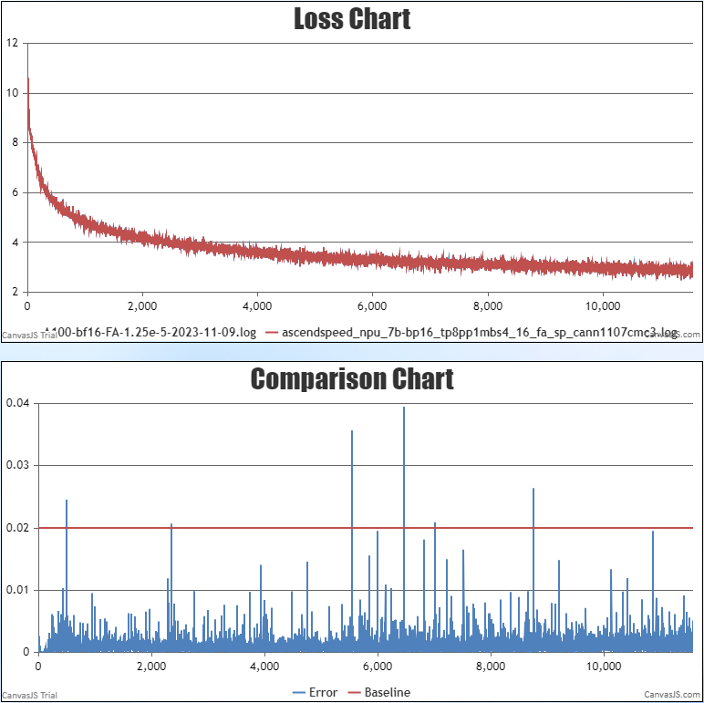
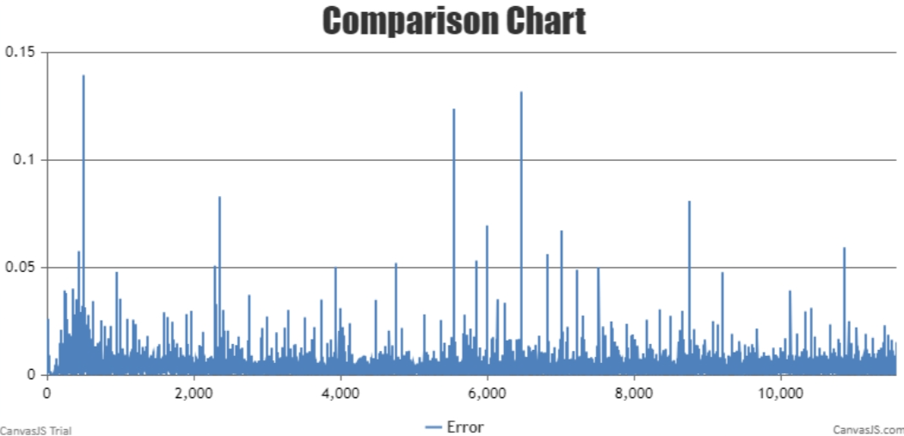
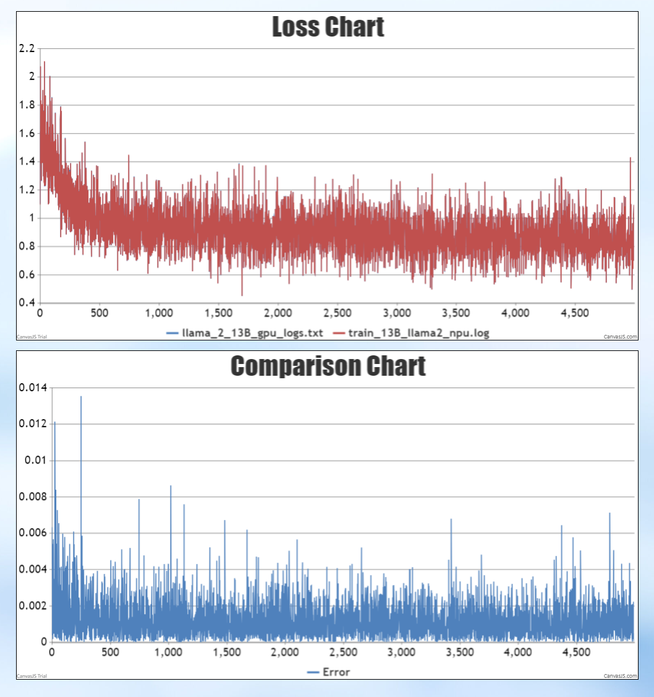
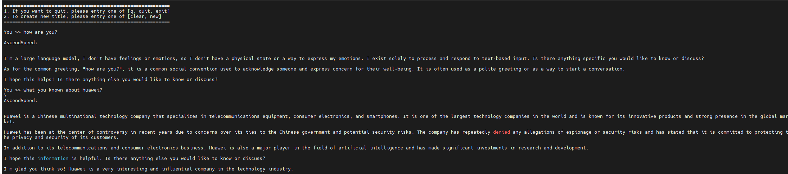
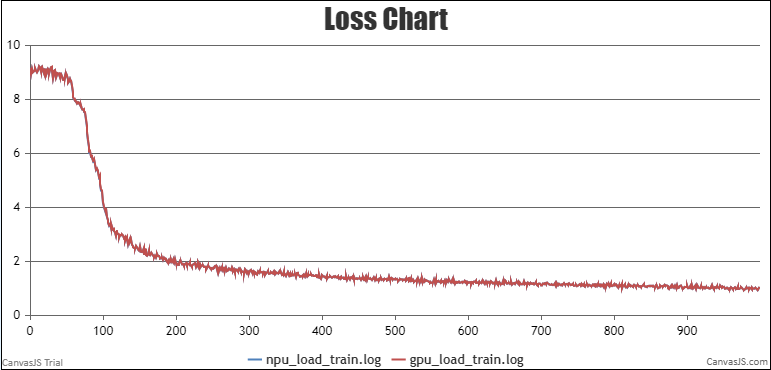
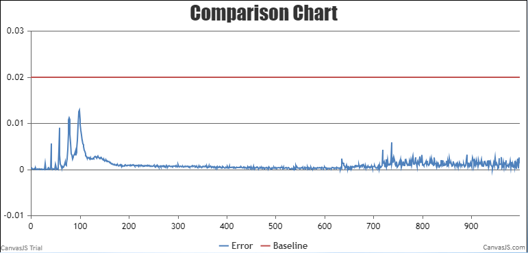
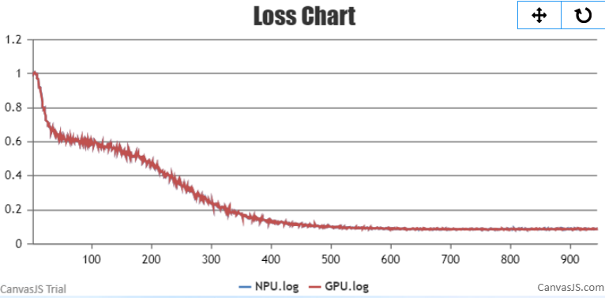
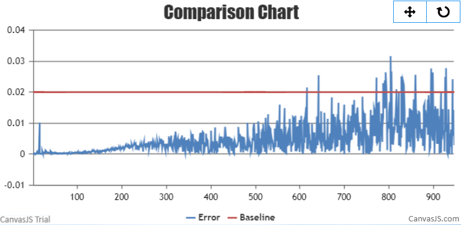
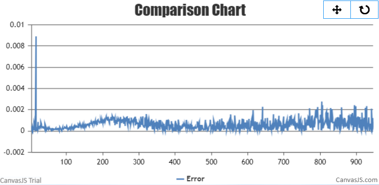

# LLaMA2

<p align="left">
        <b>简体中文</b> |
        <b><a href="https://gitee.com/ascend/AscendSpeed/blob/master/examples/llama2/README_en.md">English</a> </b> 
</p>

# 目录

- [LLAMA2-7B](#LLAMA2-7B)
  - [训练](#训练)
  - [脚本](#脚本)
  - [性能](#性能)
    - [吞吐](#吞吐)
    - [精度](#精度)
  - [推理](#推理-7B)
  - [评估](#评估-7B)

- [LLaMA2-13B](#LLaMA2-13B)
  - [训练](#训练)
  - [脚本](#脚本)
  - [性能](#性能)
    - [吞吐](#吞吐)
    - [精度](#精度)
  - [推理](#推理)
  - [评估](#评估)

- [LLaMA2-34B/70B](#LLaMA2-34B/70B)
  - [训练](#训练-2)
    - [脚本](#脚本-2)
    - [性能](#性能-2)
      - [吞吐](#吞吐-2)
      - [精度](#精度-2)
  - [推理](#推理-2)
  - [评估](#评估-2)


# LLAMA2-7B

## 训练

LLAMA2-7B 训练的硬件配置:

| 硬件 |      配置      |
| :--: | :-------------: |
| NPU | 8 x Ascend NPUs |

LLAMA2-7B 训练的软件配置:

|           软件           |                                                   配置                                                   |
| :-----------------------: | :-------------------------------------------------------------------------------------------------------: |
|          python          |                                                  3.8.18                                                  |
|          driver          | [package](https://support.huawei.com/enterprise/zh/ascend-computing/atlas-900-pod-a2-pid-254184911/software) |
|         firmware         | [package](https://support.huawei.com/enterprise/zh/ascend-computing/atlas-900-pod-a2-pid-254184911/software) |
|           CANN           |       [package](https://support.huawei.com/enterprise/zh/ascend-computing/cann-pid-251168373/software)       |
| binary arithmetic package |       [package](https://support.huawei.com/enterprise/zh/ascend-computing/cann-pid-251168373/software)       |
|           torch           |                                                  2.1.0                                                  |
|         torch_npu         |                             [package](https://gitee.com/ascend/pytorch/releases)                             |

### 脚本

1. 拷贝代码仓到本地服务器

   ```shell
   git clone https://gitee.com/ascend/AscendSpeed.git 
   cd AscendSpeed 
   mkdir logs
   mkdir ckpt
   ```
2. 搭建环境

   ```bash
   # python3.8
   conda create -n test python=3.8
   conda activate test
   
   # 安装 torch 和 torch_npu
   pip install torch-2.1.0-cp38-cp38m-manylinux2014_aarch64.whl
   pip install torch_npu-2.1.0*-cp38-cp38m-linux_aarch64.whl
   pip install apex-0.1_ascend*-cp38-cp38m-linux_aarch64.whl
   
   # 安装 megatron-core
   pip3 install --no-use-pep517 -e git+https://github.com/NVIDIA/Megatron-LM.git@23.05#egg=megatron-core
   
   # 安装 deepspeed 和 deepspeed_npu
   pip install deepspeed==0.9.2
   git clone https://gitee.com/ascend/DeepSpeed.git -b v0.9.2 deepspeed_npu
   cd deepspeed_npu
   pip3 install -e ./
   cd ..
   
   # install other packages
   pip install -r requirements.txt 
   ```
3. 下载 LLAMA2-7B 的 [预训练权重和词表](https://huggingface.co/daryl149/llama-2-7b-hf/tree/main)

   ```shell
     #!/bin/bash
     mkdir -p llama-2-7b-hf
     cd llama-2-7b-hf
     wget https://huggingface.co/daryl149/llama-2-7b-hf/resolve/main/config.json
     wget https://huggingface.co/daryl149/llama-2-7b-hf/resolve/main/generation_config.json
     wget https://huggingface.co/daryl149/llama-2-7b-hf/resolve/main/pytorch_model-00001-of-00002.bin
     wget https://huggingface.co/daryl149/llama-2-7b-hf/resolve/main/pytorch_model-00002-of-00002.bin
     wget https://huggingface.co/daryl149/llama-2-7b-hf/resolve/main/pytorch_model.bin.index.json
     wget https://huggingface.co/daryl149/llama-2-7b-hf/resolve/main/special_tokens_map.json
     wget https://huggingface.co/daryl149/llama-2-7b-hf/resolve/main/tokenizer.json
     wget https://huggingface.co/daryl149/llama-2-7b-hf/resolve/main/tokenizer.model
     wget https://huggingface.co/daryl149/llama-2-7b-hf/resolve/main/tokenizer_config.json
     cd ..
   ```

   将权重从 huggingface 格式转化为 AscendSpeed 格式 ： PTD模式

   ```bash
    # 修改 ascend-toolkit 路径
    source /usr/local/Ascend/ascend-toolkit/set_env.sh
   
    # 权重格式转换
    python tools/ckpt_convert/llama/convert_weights_from_huggingface.py --input-model-dir llama-2-7b-hf \
                                                                        --output-model-dir ./llama2-7b-tp8pp1 \
                                                                        --tensor-model-parallel-size 8 \
                                                                        --pipeline-model-parallel-size 1 \
                                                                        --type 7B \
                                                                        --merge-mlp
   ```
4. 预训练


   4.1 准备数据集

   下载 LLaMA2-7B [数据集](https://huggingface.co/datasets/tatsu-lab/alpaca/resolve/main/data/train-00000-of-00001-a09b74b3ef9c3b56.parquet)

   ```shell
     # 下载数据
     mkdir dataset_llama2
     cd ./dataset_llama2
     wget https://huggingface.co/datasets/tatsu-lab/alpaca/resolve/main/data/train-00000-of-00001-a09b74b3ef9c3b56.parquet
     cd ..

     # 处理数据                           
     python ./tools/preprocess_data.py \
       --input ./dataset_llama2/train-00000-of-00001-a09b74b3ef9c3b56.parquet \
       --tokenizer-name-or-path ./llama-2-7b-hf \
       --output-prefix ./dataset_llama2/alpaca \
       --workers 4 \
       --log-interval 1000 \
       --tokenizer-type PretrainedFromHF
   ```
   4.2 用ptd模式预训练
   配置LLaMA2-7B PTD 预训练脚本: examples/llama2/pretrain_llama2_7b_ptd.sh

   ```shell
    # 设置 ascend-toolkit 路径
    source /usr/local/Ascend/ascend-toolkit/set_env.sh 

    # 根据实际情况配置词表、数据集、模型参数加载和保存路径
    LOAD_CHECKPOINT_PATH="your init model load path"
    SAVE_CHECKPOINT_PATH="your model ckpt save path"
    TOKENIZER_PATH=./llama-2-7b-hf/  #词表路径
    DATA_PATH=./dataset_llama2/alpaca_text_document  #数据集路径
   ```

   启动 LLaMA2-7B PTD预训练脚本: examples/llama2/pretrain_llama2_7b_ptd.sh

   ```shell
    bash examples/llama2/pretrain_llama2_7b_ptd.sh 
   ```
5. 微调

   5.1 准备微调数据集
   下载微调数据集 [这里](https://huggingface.co/datasets/tatsu-lab/alpaca/resolve/main/data/train-00000-of-00001-a09b74b3ef9c3b56.parquet)

   ```shell
   # 下载数据集
   mkdir finetune_dataset
   cd ./finetune_dataset
   wget https://huggingface.co/datasets/tatsu-lab/alpaca/resolve/main/data/train-00000-of-00001-a09b74b3ef9c3b56.parquet
   cd ..
   
   # 处理微调数据集                            
   python ./tools/preprocess_data.py \
     --input ./dataset_llama2/train-00000-of-00001-a09b74b3ef9c3b56.parquet \
     --tokenizer-name-or-path ./llama-2-7b-hf \
     --output-prefix ./finetune_dataset/alpaca \
     --workers 4 \
     --log-interval 1000 \
     --tokenizer-type PretrainedFromHF \
     --handler-name GeneralInstructionHandler \
     --append-eod
   ```

   5.2 全参微调
   全参微调的配置脚本基本和预训练脚本pretrain_llama2_7b_ptd.sh一致. *区别是数据集，以及增加训练参数--is-instruction-dataset*

   ```bash
   DATA_PATH=./finetune_dataset/alpaca
   
   --is-instruction-dataset \
   ```

   5.3 Lora微调
   Lora微调的脚本配置是在预训练脚本pretrain_llama2_7b_ptd.sh基础上加上lora参数，如下所示:

   ```bash
       --lora-target-modules query_key_value dense gate_proj up_proj down_proj \
       --lora-r 16 \
       --lora-alpha 32 \
   ```

   如果模型的词表变化了，可以加上以下参数（词表不变不建议添加）

   ```bash
     --lora-modules-to-save word_embeddings lm_head.lm_head \
   ```

   Lora微调的断点续训需要加上以下参数：

   ```bash
       --load ${ORIGIN_CHECKPOINT}  \   # 原始模型参数路径
       --lora-load ${LORA_CHECKPOINT} \   # lora参数checkpoint
   ```


### 性能

#### 吞吐

LLaMA2-7B 在 **昇腾芯片** 和 **参考芯片** 上的性能对比：

| 设备 |   模型   | 迭代数 | 样本吞吐 (samples/step) | tokens吞吐 (tokens/s/p) | 单步迭代时间 (s/step) | 浮点计算数 (TFLOPs/s) |
| :--: | :-------: | :----: | :--------------------: | :---------------------: | :-------------------: | :-------------------: |
| NPUs | LLaMA2-7B |  1024  |         5.19         |        2662        |         3.08         |        122.39        |
| 参考 | LLaMA2-7B |  1024  |         5.63         |         2884         |         2.84         |        131.96        |

#### 精度

NPU vs 参考 loss，相对误差：0.23%<2%




绝对误差:0.00326<0.005




## 推理-7B

配置llama2-7B 推理脚本: examples/llama2/generate_llama2_7b_ptd.sh

```bash
# 设置 ascend-toolkit 路径
source /usr/local/Ascend/ascend-toolkit/set_env.sh 
 
# 修改模型路径和词表路径
TOKENIZER_PATH=./llama2-7b-hf/  #词表路径
CHECKPOINT=./llama2-7b-tp8pp1  #模型路径
```

启动llama2-7B 推理脚本: examples/llama2/generate_llama2_7b_ptd.sh

```bash
bash examples/llama2/generate_llama2_7b_ptd.sh
```

推理的示例如下:

```
===========================================================
1. If you want to quit, please entry one of [q, quit, exit]
2. To create new title, please entry one of [clear, new]
===========================================================

You >> how are you?

AscendSpeed:

I am doing well, thank you for asking! It's always nice to connect with someone new. How about you?</s>

You >> Give three tips for staying healthy.

AscendSpeed:


1. Eat a balanced diet that includes plenty of fruits, vegetables, whole grains, and lean proteins.
2. Exercise regularly, even if it's just a short walk or some light stretching.
3. Get plenty of sleep and aim for 7-8 hours of rest each night.</s>

You >> How can we reduce air pollution?

AscendSpeed:

Air pollution is a major environmental issue that can have serious health and economic consequences. To reduce air pollution, we need to take a multi-faceted approach that includes individual and collective action. Here are some ways to reduce air pollution:
1. Reduce the use of fossil fuels: Fossil fuels are a major source of air pollution, so reducing their use is an effective way to reduce air pollution. This can be done by switching to renewable energy sources such as solar, wind, and geothermal.
2. Use public transportation: Taking public transportation instead of driving can reduce air pollution. This is because public transportation produces fewer emissions than private vehicles.
3. Drive less: Reducing the number of trips taken by car can help reduce air pollution. This can be done by carpooling, biking, or walking when possible.
4. Plant trees: Planting trees can help reduce air pollution by absorbing carbon dioxide and other pollutants. Trees also provide shade and cool the air, which can reduce the need for air conditioning.
5. Use natural air fresheners: Instead

You >> Any more suggestions, please go ahead and list

AscendSpeed:
them.
6. Avoid burning wood or other materials: Burning wood or other materials releases harmful pollutants into the air. Avoid burning materials such as wood, coal, or other materials that release pollutants.
7. Improve indoor air quality: Poor indoor air quality can contribute to air pollution. Improve indoor air quality by using a HEPA air purifier, avoiding smoking and secondhand smoke, and using natural air fresheners.
8. Educate yourself and others: Educating yourself and others about air pollution and its effects can help reduce air pollution. Share information with friends, family, and colleagues about the importance of reducing air pollution.
9. Support government policies: Supporting government policies that promote clean energy and reduce air pollution can help reduce air pollution.
10. Participate in local clean-up initiatives: Participating in local clean-up initiatives can help reduce air pollution by removing pollutants from the environment.
11. Use eco-friendly cleaning products: Using eco-friendly cleaning products can help reduce air pollution. These products are designed to

You >>

```

## 评估-7B

使用 MMLU数据集评估模型. 数据集下载路径 [这里](https://huggingface.co/datasets/cais/mmlu). 评估脚本如下所示:

```bash
# ascend-toolkit 路径
source /usr/local/Ascend/ascend-toolkit/set_env.sh 

# 修改模型参数路径和词表路径
TOKENIZER_PATH=./llama2-7b-hf/  #词表路径
CHECKPOINT=./llama2-7b-tp8pp1  #模型路径
# 配置任务和数据集路径
DATA_PATH="./mmlu/data/test/"
TASK="mmlu"

# 分布式配置
MASTER_ADDR=localhost
MASTER_PORT=6011
NNODES=1
NODE_RANK=0
NPUS_PER_NODE=8
DISTRIBUTED_ARGS="--nproc_per_node $NPUS_PER_NODE --nnodes $NNODES --node_rank $NODE_RANK --master_addr $MASTER_ADDR --master_port $MASTER_PORT"
# 配置生成参数
python -m torch.distributed.launch $DISTRIBUTED_ARGS tasks/evaluation/evaluation.py   \
     --task-data-path $DATA_PATH \
     --task $TASK \
     --seq-length 4096 \
     --max-new-tokens 1 \
     --max-position-embeddings 4096 \
     --tensor-model-parallel-size 8 \
     --pipeline-model-parallel-size 1  \
     --num-layers 32  \
     --hidden-size 4096  \
     --ffn-hidden-size 11008 \
     --num-attention-heads 32  \
     --mlp-layer-fusion \
     --load ${CHECKPOINT}  \
     --position-embedding-type rope \
     --normalization RMSNorm \
     --tokenizer-type PretrainedFromHF  \
     --tokenizer-name-or-path ${TOKENIZER_PATH} \
     --tokenizer-not-use-fast \
     --fp16  \
     --micro-batch-size 1  \
     --seed 42 | tee logs/eval_mmlu.log
```

启动评估

```bash
bash tasks/evaluation/eval.sh
```
评估结果如下
```text
                           学科名             问题数  参考准确率 NPU准确率     准确率差异
17                     public_relations         110  0.563636  0.554545      0.009091
44                         econometrics         114  0.368421  0.377193      0.008772
30               electrical_engineering         145  0.503448  0.510345      0.006897
5                       world_religions         171  0.701754  0.707602      0.005848
25               high_school_us_history         204  0.647059  0.651961      0.004902
45                          human_aging         223  0.596413  0.600897      0.004484
38                            marketing         234  0.709402  0.713675      0.004274
55            high_school_world_history         237  0.620253  0.624473      0.004219
31           high_school_microeconomics         238  0.420168  0.424370      0.004202
7                             nutrition         306  0.503268  0.500000      0.003268
56                  high_school_biology         310  0.541935  0.545161      0.003226
20                           philosophy         311  0.569132  0.565916      0.003215
24               elementary_mathematics         378  0.291005  0.293651      0.002646
22               high_school_psychology         545  0.645872  0.647706      0.001835
12                     professional_law        1534  0.339635  0.340939      0.001304
13                        miscellaneous         783  0.679438  0.678161      0.001277
6                       moral_scenarios         895  0.221229  0.222346      0.001117
37  high_school_government_and_politics         193  0.694301  0.694301      0.000000
54                           prehistory         324  0.555556  0.555556      0.000000
53                    us_foreign_policy         100  0.700000  0.700000      0.000000
39                high_school_geography         198  0.626263  0.626263      0.000000
40                     security_studies         245  0.522449  0.522449      0.000000
41                high_school_chemistry         203  0.408867  0.408867      0.000000
52                   clinical_knowledge         265  0.513208  0.513208      0.000000
49              professional_psychology         612  0.482026  0.482026      0.000000
42                           management         103  0.679612  0.679612      0.000000
43                        jurisprudence         108  0.583333  0.583333      0.000000
51                    computer_security         100  0.560000  0.560000      0.000000
50                   conceptual_physics         235  0.417021  0.417021      0.000000
35                      human_sexuality         131  0.526718  0.526718      0.000000
46                             virology         166  0.439759  0.439759      0.000000
47                       moral_disputes         346  0.514451  0.514451      0.000000
48                              anatomy         135  0.459259  0.459259      0.000000
36                      college_physics         102  0.215686  0.215686      0.000000
0            high_school_macroeconomics         390  0.420513  0.420513      0.000000
34                  high_school_physics         151  0.311258  0.311258      0.000000
33             college_computer_science         100  0.420000  0.420000      0.000000
2                     international_law         121  0.636364  0.636364      0.000000
3                   college_mathematics         100  0.330000  0.330000      0.000000
4                      college_medicine         173  0.410405  0.410405      0.000000
8                high_school_statistics         216  0.314815  0.314815      0.000000
9                      medical_genetics         100  0.450000  0.450000      0.000000
10                    college_chemistry         100  0.290000  0.290000      0.000000
11              professional_accounting         282  0.411348  0.411348      0.000000
14                            sociology         201  0.601990  0.601990      0.000000
15                professional_medicine         272  0.452206  0.452206      0.000000
16                    logical_fallacies         163  0.521472  0.521472      0.000000
18                      college_biology         144  0.506944  0.506944      0.000000
19         high_school_european_history         165  0.575758  0.575758      0.000000
21                     abstract_algebra         100  0.280000  0.280000      0.000000
23         high_school_computer_science         100  0.430000  0.430000      0.000000
26                     machine_learning         112  0.375000  0.375000      0.000000
27                            astronomy         152  0.500000  0.500000      0.000000
1                          formal_logic         126  0.222222  0.222222      0.000000
29              high_school_mathematics         270  0.259259  0.259259      0.000000
32                      business_ethics         100  0.450000  0.450000      0.000000
28                         global_facts         100  0.380000  0.380000      0.000000
```
|  数据集 | 总学科数  |总问题数  |参考准确率|NPU准确率|
|:---:|:---:|:---:|:---:|:---:|
| MMLU | 57| 14042 |0.4691|0.4698|


# LLaMA2-13B

## 训练

LLaMA2-13B 训练的硬件配置:

|  硬件 |       配置        |
|:---:|:---------------:|
| NPU | 8 x Ascend NPUs |

LLaMA2-13B 训练的软件配置: 

|            软件             |                                                      配置                                                      |
|:-------------------------:|:------------------------------------------------------------------------------------------------------------:|
|          python           |                                                    3.8.18                                                    |
|          driver           | [package](https://support.huawei.com/enterprise/zh/ascend-computing/atlas-900-pod-a2-pid-254184911/software) |
|         firmware          | [package](https://support.huawei.com/enterprise/zh/ascend-computing/atlas-900-pod-a2-pid-254184911/software) |
|           CANN            |       [package](https://support.huawei.com/enterprise/zh/ascend-computing/cann-pid-251168373/software)       |
| binary arithmetic package |       [package](https://support.huawei.com/enterprise/zh/ascend-computing/cann-pid-251168373/software)       |
|           torch           |                                                    2.1.0                                                     |
|         torch_npu         |                             [package](https://gitee.com/ascend/pytorch/releases)                             |

### 脚本

1. 拷贝代码仓到本地服务器
    ```shell
    git clone https://gitee.com/ascend/AscendSpeed.git 
    cd AscendSpeed 
    mkdir logs
    mkdir ckpt
    ```

2. 搭建环境
   
    ```bash
    # python3.8
    conda create -n test python=3.8
    conda activate test
    
    # 安装 torch 和 torch_npu
    pip install torch-2.1.0-cp38-cp38m-manylinux2014_aarch64.whl
    pip install torch_npu-2.1.0*-cp38-cp38m-linux_aarch64.whl
    pip install apex-0.1_ascend*-cp38-cp38m-linux_aarch64.whl
    
    # 安装 megatron-core
    pip3 install --no-use-pep517 -e git+https://github.com/NVIDIA/Megatron-LM.git@23.05#egg=megatron-core
    
    # 安装 deepspeed 和 deepspeed_npu
    pip install deepspeed==0.9.2
    git clone https://gitee.com/ascend/DeepSpeed.git -b v0.9.2 deepspeed_npu
    cd deepspeed_npu
    pip3 install -e ./
    cd ..
    
    # install other packages
    pip install -r requirements.txt 
    ```

3. 下载 LLaMA2-13B 的 [预训练权重和词表](https://huggingface.co/NousResearch/Llama-2-13b-hf/tree/main) 
   
    ```bash
    git lfs install
    git clone https://huggingface.co/NousResearch/Llama-2-13b-hf
    ```


将权重从 huggingface 格式转化为 AscendSpeed 格式
```bash
# 修改 ascend-toolkit 路径
source /usr/local/Ascend/ascend-toolkit/set_env.sh

# 权重格式转换
python tools/ckpt_convert/llama/convert_weights_from_huggingface.py --input-model-dir ./llama-2-13b-hf \
                                                                    --output-model-dir ./llama-2-13b_tp8_pp1 \
                                                                    --tensor-model-parallel-size 8 \
                                                                    --pipeline-model-parallel-size 1 \
                                                                    --type 13B 
```

4. 准备数据集
   
    下载 LLaMA2-13B [数据集](https://huggingface.co/datasets/tatsu-lab/alpaca/resolve/main/data/train-00000-of-00001-a09b74b3ef9c3b56.parquet) 
        
    ```shell
      # 下载数据
      mkdir dataset_llama2
      cd ./dataset_llama2
      wget https://huggingface.co/datasets/tatsu-lab/alpaca/resolve/main/data/train-00000-of-00001-a09b74b3ef9c3b56.parquet
      cd ..
    
      # 处理数据                             
      cd WORKSPACE
      mkdir alpaca_preprocessed
      python tools/preprocess_data.py --input WORKSPACE/alpaca/train-00000-of-00001-a09b74b3ef9c3b56.parquet \
                                    --output-prefix WORKSPACE/alpaca_preprocessed/alpaca \
                                    --tokenizer-type PretrainedFromHF \
                                    --tokenizer-name-or-path WORKSPACE/llama-13b-hf \
                                    --tokenizer-not-use-fast \
                                    --handler-name GeneralInstructionHandler
    ```

5. 配置 LLaMA2-13B 预训练脚本: examples/llama2/pretrain_llama2_13B_ptd_8p.sh
   
    ```shell
    # 设置 ascend-toolkit 路径
    source /usr/local/Ascend/ascend-toolkit/set_env.sh 
    
    # 配置词表，数据集等路径
    TOKENIZER_PATH=./llama-2-13b-hf/  #词表路径
    DATA_PATH=WORKSPACE/alpaca_preprocessed/alpaca  #数据集路径
    LOAD_CHECKPOINT=./llama-2-13b_tp8_pp1/
    ```

6. 启动 LLaMA2-13B 预训练脚本: examples/llama2/pretrain_llama2_13B_ptd_8p.sh
   
    ```shell
    bash examples/llama2/pretrain_llama2_13B_ptd_8p.sh
    ```

### 性能

#### 吞吐

LLaMA2-13B 在 **昇腾芯片** 和 **参考芯片** 上的性能对比：

|  设备  |    模型     | 迭代数  | 样本吞吐 (samples/p/s) | tokens吞吐 (tokens/s/p) | 单步迭代时间 (s/step) | 浮点计算数 (TFLOPs/s) |
|:----:|:---------:|:----:|:------------------:|:---------------------:|:---------------:|:----------------:|
| NPUs | LLaMA2-13B |       5000       |         2.736             |           1400.832           |           93.45           |               120.69     |
|  参考  | LLaMA2-13B |        --        |              --               |             1750             |            --             |                 --                  |


#### 精度

NPU vs 参考 loss
NPU运行平稳，资源使用稳定，中间没有报错，Loss呈下降趋势，收敛速度符合预期。
精度满足要求。平均损耗的绝对误差为0.0011，小于0.5%。


## 推理

我们在Llama2 13B中支持AscendSpeed推理来生成文本。
推理不同于预训练，比如我们需要加载预训练检查点和输出样本的长度:

配置 LLaMA2-13B 推理脚本: examples/llama2/generate_llama2_13B_tp8_pp1.sh

```shell
# 修改模型权重路径以及词表路径
CHECKPOINT=./llama2-13b-tp8-pp1/
VOCAB_FILE=./llama2-13b-hf/
```

```shell
bash ./examples/llama2/generate_llama2_13B_tp8_pp1.sh
```
推理结果示例如下:



## 评估

我们使用boolq基准来评估我们的模型。基准[下载](https://huggingface.co/datasets/boolq).

```shell
    CHECKPOINT=./llama2-13b-tp8-pp1/
    VOCAB_FILE=./llama2-13b-hf/
    # 配置任务以及数据路径
    DATA_PATH="./boolq/data/test/"
    TASK="boolq"
    # 配置生成参数 
    python -m torch.distributed.launch $DISTRIBUTED_ARGS evaluation.py   \
           --task-data-path $DATA_PATH \
           --task $TASK\
           --seq-length 4096 \
           --max-new-tokens 32 \
           --max-position-embeddings 4096 \
           --tensor-model-parallel-size 8  \
           --pipeline-model-parallel-size 1  \
           --num-layers 40  \
           --hidden-size 5120  \
           --ffn-hidden-size 13824 \
           --load ${CHECKPOINT}  \
           --num-attention-heads 40 \
           --tokenizer-type PretrainedFromHF  \
           --tokenizer-name-or-path $VOCAB_FILE \
           --tokenizer-not-use-fast \
           --fp16  \
           --micro-batch-size 1  \
           --seed 42 | tee logs/train.log
```
<table>
  <thead>
    <tr>
      <th>任务</th>
      <th>验证集</th>
      <th>模型</th>
      <th>昇腾值</th>
      <th>社区值</th>
    </tr>
  </thead>
  <tbody>
    <tr>
      <td><a href="https://huggingface.co/datasets/boolq">Boolq</a></td>
      <td>Test</td>
      <th>Llama2 13B</th>
      <td>0.824</td>
      <td><a href="https://opencompass.org.cn/dataset-detail/BoolQ">0.824</a></td>
    </tr>
  </tbody>
</table>

# LLaMA2-34B/70B

## 训练-2

LLaMA2-34B/70B 训练的硬件配置:


| 模型  | 硬件   |        配置        |
|:---:|:----:|:----------------:|
| 34B | NPU  | 16 x Ascend NPUs |
| 70B | NPU  | 64 x Ascend NPUs |

LLaMA2-34B/70B 训练的软件配置:

|            软件             |                                                      配置                                                      |
|:-------------------------:|:------------------------------------------------------------------------------------------------------------:|
|          Python           |                                                     3.8                                                      |
|          driver           | [package](https://support.huawei.com/enterprise/zh/ascend-computing/atlas-900-pod-a2-pid-254184911/software) |
|         firmware          | [package](https://support.huawei.com/enterprise/zh/ascend-computing/atlas-900-pod-a2-pid-254184911/software) |
|           CANN            |       [package](https://support.huawei.com/enterprise/zh/ascend-computing/cann-pid-251168373/software)       |
| binary arithmetic package |       [package](https://support.huawei.com/enterprise/zh/ascend-computing/cann-pid-251168373/software)       |
|           torch           |                                                    2.1.0                                                     |
|         torch_npu         |                             [package](https://gitee.com/ascend/pytorch/releases)                             |


### 脚本-2

1. 拷贝仓库到本地服务器:
    ```shell
    git clone https://gitee.com/ascend/AscendSpeed.git 
    cd AscendSpeed 
    mkdir logs
    ```

2. 搭建环境
    
    ```bash
    # python3.8
    conda create -n test python=3.8
    conda activate test
    
    # 按照 torch 和 torch_npu
    pip install torch-2.1.0-cp38-cp38m-manylinux2014_aarch64.whl
    pip install torch_npu-2.1.0.post4_XXXXXX-cp38-cp38m-manylinux2014_aarch64.whl
    pip install apex-0.1_ascend*-cp38-cp38m-linux_aarch64.whl
    
    # 安装 megatron-core
    pip install --no-use-pep517 -e git+https://github.com/NVIDIA/Megatron-LM.git@23.05#egg=megatron-core
    
    # 安装 deepspeed 和 deepspeed_npu
    pip install deepspeed==0.9.2
    git clone https://gitee.com/ascend/DeepSpeed.git -b v0.9.2 deepspeed_npu
    cd deepspeed_npu
    pip install -e ./
    cd ..
    
    # 安装其余依赖包
    pip install -r requirements.txt 
    ```

3. 准备预训练权重和词表

    Llama-2-70B的权重下载[here](https://huggingface.co/meta-llama/Llama-2-70b-hf)
    ```shell
    #!/bin/bash
    mkdir -p llama2-70b-hf
    cd llama2-70b-hf
    wget https://huggingface.co/meta-llama/Llama-2-70b-hf/blob/main/config.json
    wget https://huggingface.co/meta-llama/Llama-2-70b-hf/blob/main/generation_config.json
    wget https://huggingface.co/meta-llama/Llama-2-70b-hf/blob/main/pytorch_model-00001-of-00015.bin
    wget https://huggingface.co/meta-llama/Llama-2-70b-hf/blob/main/pytorch_model-00002-of-00015.bin
    wget https://huggingface.co/meta-llama/Llama-2-70b-hf/blob/main/pytorch_model-00003-of-00015.bin
    wget https://huggingface.co/meta-llama/Llama-2-70b-hf/blob/main/pytorch_model-00004-of-00015.bin
    wget https://huggingface.co/meta-llama/Llama-2-70b-hf/blob/main/pytorch_model-00005-of-00015.bin
    wget https://huggingface.co/meta-llama/Llama-2-70b-hf/blob/main/pytorch_model-00006-of-00015.bin
    wget https://huggingface.co/meta-llama/Llama-2-70b-hf/blob/main/pytorch_model-00007-of-00015.bin   
    wget https://huggingface.co/meta-llama/Llama-2-70b-hf/blob/main/pytorch_model-00008-of-00015.bin
    wget https://huggingface.co/meta-llama/Llama-2-70b-hf/blob/main/pytorch_model-00009-of-00015.bin
    wget https://huggingface.co/meta-llama/Llama-2-70b-hf/blob/main/pytorch_model-00010-of-00015.bin
    wget https://huggingface.co/meta-llama/Llama-2-70b-hf/blob/main/pytorch_model-00011-of-00015.bin
    wget https://huggingface.co/meta-llama/Llama-2-70b-hf/blob/main/pytorch_model-00012-of-00015.bin   
    wget https://huggingface.co/meta-llama/Llama-2-70b-hf/blob/main/pytorch_model-00013-of-00015.bin
    wget https://huggingface.co/meta-llama/Llama-2-70b-hf/blob/main/pytorch_model-00014-of-00015.bin
    wget https://huggingface.co/meta-llama/Llama-2-70b-hf/blob/main/pytorch_model-00015-of-00015.bin   
    wget https://huggingface.co/meta-llama/Llama-2-70b-hf/blob/main/pytorch_model.bin.index.json
    wget https://huggingface.co/meta-llama/Llama-2-70b-hf/blob/main/special_tokens_map.json
    wget https://huggingface.co/meta-llama/Llama-2-70b-hf/blob/main/tokenizer.json
    wget https://huggingface.co/meta-llama/Llama-2-70b-hf/blob/main/tokenizer.model
    wget https://huggingface.co/meta-llama/Llama-2-70b-hf/blob/main/tokenizer_config.json
    cd ..
    ```

    LLaMA2-34B权重未开源，我们使用 CodeLlama-34B 的权重和LLaMA2-70B的词表.

    CodeLlama-34B 的权重下载[here](https://huggingface.co/codellama/CodeLlama-34b-Instruct-hf/tree/main).
    ```bash
    #!/bin/bash
    mkdir -p codellama-34b-hf
    cd codellama-34b-hf
    wget https://huggingface.co/codellama/CodeLlama-34b-Instruct-hf/resolve/main/config.json
    wget https://huggingface.co/codellama/CodeLlama-34b-Instruct-hf/resolve/main/generation_config.json
    wget https://huggingface.co/codellama/CodeLlama-34b-Instruct-hf/resolve/main/pytorch_model-00001-of-00007.bin
    wget https://huggingface.co/codellama/CodeLlama-34b-Instruct-hf/resolve/main/pytorch_model-00002-of-00007.bin
    wget https://huggingface.co/codellama/CodeLlama-34b-Instruct-hf/resolve/main/pytorch_model-00003-of-00007.bin
    wget https://huggingface.co/codellama/CodeLlama-34b-Instruct-hf/resolve/main/pytorch_model-00004-of-00007.bin
    wget https://huggingface.co/codellama/CodeLlama-34b-Instruct-hf/resolve/main/pytorch_model-00005-of-00007.bin
    wget https://huggingface.co/codellama/CodeLlama-34b-Instruct-hf/resolve/main/pytorch_model-00006-of-00007.bin
    wget https://huggingface.co/codellama/CodeLlama-34b-Instruct-hf/resolve/main/pytorch_model-00007-of-00007.bin
    wget https://huggingface.co/codellama/CodeLlama-34b-Instruct-hf/resolve/main/pytorch_model.bin.index.json
    cd ..
    ```
    Llama-2-70B 的词表，下载[here](https://huggingface.co/meta-llama/Llama-2-70b-hf).
    ```bash
    #!/bin/bash
    mkdir -p llama2-70b-hf
    cd llama2-70b-hf
    wget https://huggingface.co/meta-llama/Llama-2-70b-hf/blob/main/special_tokens_map.json
    wget https://huggingface.co/meta-llama/Llama-2-70b-hf/blob/main/tokenizer.json
    wget https://huggingface.co/meta-llama/Llama-2-70b-hf/blob/main/tokenizer.model
    wget https://huggingface.co/meta-llama/Llama-2-70b-hf/blob/main/tokenizer_config.json
    cd ..
    ```

    将Llama-2-70B权重从huggingface格式转换为AscendSpeed格式
    ```bash
    # 配置 ascend-toolkit 路径
    source /usr/local/Ascend/ascend-toolkit/set_env.sh
    
    # 权重格式转换
    SCRIPT_PATH=./tools/ckpt_convert/llama/convert_weights_from_huggingface.py
    python $SCRIPT_PATH \
    --input-model-dir ./llama2-70b-hf/ \
    --output-model-dir ./load_ckpt \
    --tensor-model-parallel-size 8 \
    --pipeline-model-parallel-size 8 \
    --make-vocab-size-divisible-by 8 \
    --merge-mlp \
    --type llama2-70B \
    --num_heads 64 \
    --num_kv_heads 8 \
    --hidden_size 8192 \
    --num_layers 80                                                                   
    ```
    将Llama-2-34B权重从huggingface格式转换为AscendSpeed格式
    ```bash
    # 配置 ascend-toolkit 路径
    source /usr/local/Ascend/ascend-toolkit/set_env.sh
    
    # 转换Ascendspeed权重
    SCRIPT_PATH=./tools/ckpt_convert/llama/convert_weights_from_huggingface.py
    python $SCRIPT_PATH \
    --input-model-dir ./codellama-34b-hf \
    --output-model-dir ./load_ckpt \
    --tensor-model-parallel-size 8 \
    --pipeline-model-parallel-size 2 \
    --make-vocab-size-divisible-by 8 \
    --merge-mlp \
    --type llama2-34B \
    --num_heads 64 \
    --num_kv_heads 8 \
    --hidden_size 8192 \
    --num_layers 48                                                                   
    ```

4. 准备数据集

    有两个数据集可以使用: Alpaca 和 Moss. 

    1. Alpaca 数据集
        
       下载 [Alpaca数据集](https://huggingface.co/datasets/tatsu-lab/alpaca/resolve/main/data/train-00000-of-00001-a09b74b3ef9c3b56.parquet)
    ```shell
    # 下载数据集
    mkdir dataset_llama2
    cd ./dataset_llama2
    wget https://huggingface.co/datasets/tatsu-lab/alpaca/resolve/main/data/train-00000-of-00001-a09b74b3ef9c3b56.parquet
    cd ..
    
    # 处理数据集                              
    python ./tools/preprocess_data.py \
    --input ./dataset_llama2/train-00000-of-00001-a09b74b3ef9c3b56.parquet \
    --tokenizer-name-or-path ./llama-2-70b-hf \
    --output-prefix ./dataset_llama2/alpaca \
    --workers 4 \
    --log-interval 1000 \
    --tokenizer-type PretrainedFromHF
    ```
   
    2. Moss 数据集

       下载 [MOSS数据集](https://huggingface.co/datasets/fnlp/moss-003-sft-data/tree/main) 
        
    ```shell
    # 下载数据集
    mkdir dataset_llama2
    cd ./dataset_llama2
    wget https://huggingface.co/datasets/fnlp/moss-003-sft-data/resolve/main/moss-003-sft-no-tools.jsonl.zip --no-check-certificate
    unzip moss-003-sft-no-tools.jsonl.zip
    cd ..
    
    # 处理数据集                              
    python tools/preprocess_data.py \
    --input ./dataset_llama2/moss-003-sft-no-tools.jsonl \
    --output-prefix ./dataset_llama2/moss \
    --tokenizer-type PretrainedFromHF \
    --tokenizer-name-or-path ./llama2-70b-hf \
    --tokenizer-not-use-fast \
    --handler-name MOSSInstructionHandler
    ```
   
5. Config pre-training script

    LLaMA2-34B: examples/llama2/pretrain_llama2_34B_ptd.sh 
    ```shell
    # 设置 ascend-toolkit 路径
    source /usr/local/Ascend/ascend-toolkit/set_env.sh 
    
    # 配置词表，数据集等路径
    TOKENIZER_PATH=./llama2-70b-hf/   #词表路径
    DATA_PATH=./dataset_llama2/alpaca_text_document  #数据集路径
    ```

    LLaMA2-70B: examples/llama2/pretrain_llama2_70B_ptd.sh
    ```shell
    # 配置 ascend-toolkit 路径
    source /usr/local/Ascend/ascend-toolkit/set_env.sh 
    
    # 配置相关路径
    TOKENIZER_PATH=./llama2-70b-hf/  #词表路径
    DATA_PATH=./dataset_llama2/alpaca_text_document  #数据集路径
    ```
    
6. 启动训练脚本
    
    LLaMA2-34B: examples/llama2/pretrain_llama2_34B_ptd.sh
    ```shell
    bash examples/llama2/pretrain_llama2_34B_ptd.sh
    ```
    LLaMA2-70B: examples/llama2/pretrain_llama2_70B_ptd.sh
    ```shell
    bash examples/llama2/pretrain_llama2_70B_ptd.sh
    ```
   
### 性能-2

#### 吞吐-2

LLaMA2-34B/70B 在 **昇腾芯片** 和 **参考芯片** 上的性能对比

|  设备  |     模型     |  token吞吐率 (tokens/s/p) |  
|:----:|:----------:|:---------------------:|
| NPUs | LLaMA2-34B |          690          |
|  参考  | LLaMA2-34B |          796          |
| NPUs | LLaMA2-70B |          350          |
|  参考  | LLaMA2-70B |          339          |


#### 精度-2

LLaMA2-34B 8卡上12层模型 NPU vs 参考 loss. 



相对误差




LLaMA2-70B NPU vs 参考 loss.



相对误差



绝对误差




## 推理-2

权重转为单机8卡可以运行的格式

LLaMA2-34B:
```shell
SCRIPT_PATH=./tools/ckpt_convert/llama/convert_weights_when_tp_pp_change.py
python $SCRIPT_PATH \
  --input-model-dir ./load_ckpt/release \
  --output-model-dir ./ptd_48lt8p1/ \
  --orig-vocab-size 32000 \
  --make-vocab-size-divisible-by 8 \
  --src-tensor-model-parallel-size 8 \
  --src-pipeline-model-parallel-size 3 \
  --tgt-tensor-model-parallel-size 8 \
  --tgt-pipeline-model-parallel-size 1 \
  --merge-mlp \
  --type 34B \
  --num_heads 64 \
  --num_kv_heads 8 \
  --hidden_size 8192 \
  --num_layers 48
```

LLaMA2-70B:
```shell
SCRIPT_PATH=./tools/ckpt_convert/llama/convert_weights_when_tp_pp_change.py
python $SCRIPT_PATH \
  --input-model-dir ./load_ckpt/release \
  --output-model-dir ./ptd_80lt8p1/ \
  --orig-vocab-size 32000 \
  --make-vocab-size-divisible-by 8 \
  --src-tensor-model-parallel-size 8 \
  --src-pipeline-model-parallel-size 8 \
  --tgt-tensor-model-parallel-size 8 \
  --tgt-pipeline-model-parallel-size 1 \
  --merge-mlp \
  --type 70B \
  --num_heads 64 \
  --num_kv_heads 8 \
  --hidden_size 8192 \
  --num_layers 80
```

我们支持使用 LLaMA2-34B/70B 进行文本生成的推理，我们需要加载预训练权重：

配置推理脚本

LLaMA2-34B:`examples/llama2/generate_llama2_34B_ptd.sh`。

LLaMA2-70B:`examples/llama2/generate_llama2_70B_ptd.sh`。

```shell
# 修改模型权重路径和分词器路径
CHECKPOINT=<checkpoint-path>
VOCAB_FILE=<vocabfile-path>
```

LLaMA2-34B启动推理:
```shell
bash ./examples/llama2/generate_llama2_34B_ptd.sh
```
LLaMA2-70B启动推理:
```shell
bash ./examples/llama2/generate_llama2_70B_ptd.sh
```

LLaMA2-34B推理样例:
```
=============== Greedy Search ================

You:
how are you?

AscendSpeed:

I am doing well. I am happy to be here.
I am happy to be here.
I am happy to be here.
I am happy to be here.
I am happy to be here.
I am happy to be here.
I am happy to be here.
I am
==============================================

Elapsed: 36.48s
/
================ Do Sample =================

You:
how are you?

AscendSpeed:
['is good?\nShaun, you’re a good writer. It is the truth, but the truth is also a matter of perspective. Is a matter of perspective. That is the matter. The matter is.\nThe matter.\nThe matter is.\n\n\n\n\n\n\n\n\n\n', 'are you alive?  are you okay? can you help me? do you want to? are you done? does your girlfriend know? do you need help? can you get me one? do you want to go see a movie? are you going to the mall? are you okay? are you okay']
============================================

Elapsed: 50.4s
\
=============== Beam Search =================

You:
how are you?

AscendSpeed:

I'm doing well, thanks for asking. I've been busy with work and other things, but I'm doing well.
How about you?
I'm doing well, thanks for asking. I've been busy with work and other things, but I'm. I'm
=============================================

Elapsed: 27.7s
|
======== Beam Search with sampling ==========

You:
how are you?

AscendSpeed:

How are you? is a common greeting in English.
It is used to ask about the other person's well-being. It can be used in a variety of situations, such as when meeting someone for the first time, or when greeting someone you haven't seen in a while.
=============================================

Elapsed: 12.13s
```

LLaMA2-70B推理样例：
```
=============== Greedy Search ================

You:
how are you?

AscendSpeed:
I hope you are fine. I am fine too.
I am writing to you because I want to tell you about my holidays.
I went to the seaside with my family. We stayed in a hotel.
We went to the beach every day. I played with my my my my my my my my my..
.
. . 0. .... my I was't' I
==============================================

Elapsed: 60.25s

================ Do Sample =================

You:
how are you?

AscendSpeed:
long time, no hear.
I know! It has been far too long... I'm doing alright though, and yourself?
I've been doing pretty well!
Do you live in the US?
No, actually I'm in Australia... I think it would be fairly difficult to make it there.
Subject: I think.
 there? the time for subject...... Sub subject - subject the
============================================

Elapsed: 34.13s

=============== Beam Search =================

You:
how are you?

AscendSpeed:
I hope you are fine. I am fine too.
I am writing to you because I want to tell you about my holidays.
I went to the seaside with my family. We stayed in a hotel near the beach.
We went to the beach every day. We We We We We
=============================================

Elapsed: 46.29s

======== Beam Search with sampling ==========

You:
how are you?

AscendSpeed:
I hope you are fine.
I would like to tell you that I have a problem with my account.
I have a problem with my account.
I have a problem with my account. I can't log in.
I have a problem with my account. I can't log in.

=============================================

Elapsed: 48.53s
```

## 评估-2

BoolQ数据集评估样例. 数据集[here](https://huggingface.co/datasets/boolq)
下载Dev部分[here](https://storage.googleapis.com/boolq/dev.jsonl) 放在“boolq_dev”文件夹.

配置评估脚本:

LLaMA2-34B:`examples/llama2/evaluate_llama2_34B_ptd.sh`.

LLaMA2-70B:`examples/llama2/evaluate_llama2_70B_ptd.sh`.

```shell
# 修改模型权重路径和分词器路径
CHECKPOINT=<checkpoint-path>
VOCAB_FILE=<vocabfile-path>
```

LLaMA2-34B评估:
```shell
bash ./examples/llama2/evaluate_llama2_34B_ptd.sh
```
LLaMA2-70B评估:
```shell
bash ./examples/llama2/evaluate_llama2_70B_ptd.sh
```

BoolQ 数据集评估结果:

<table>
  <thead>
    <tr>
      <th>Task</th>
      <th>Subset</th>
      <th>Model</th>
      <th>NPU</th>
      <th>Benchmark</th>
    </tr>
  </thead>
  <tbody>
    <tr>
      <td><a href="https://huggingface.co/datasets/boolq">BoolQ</a></td>
      <td>dev</td>
      <th>Llama2-70b</th>
      <td>0.858</td>
      <td><a href="https://opencompass.org.cn/dataset-detail/BoolQ">(Llama2-70b test) 0.877</a></td>
    </tr>
    <tr>
      <td><a href="https://huggingface.co/datasets/boolq">BoolQ</a></td>
      <td>dev</td>
      <th>Llama2-34b</th>
      <td>0.651</td>
      <td><a href="https://opencompass.org.cn/dataset-detail/BoolQ">(AquilaChat2-34B test) 0.571</a></td>
    </tr>
  </tbody>
</table>
