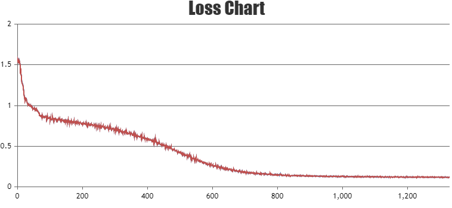
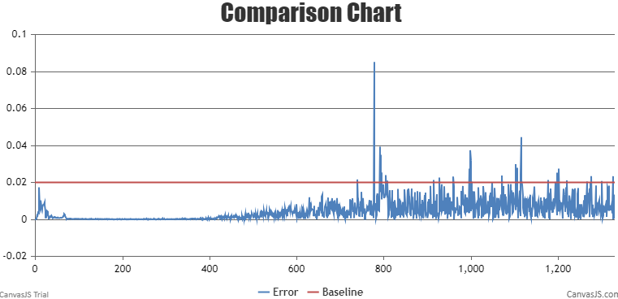
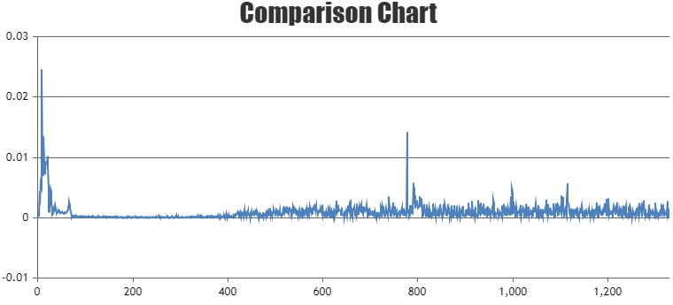

#  Contents

- [LLaMA2-7B](#contents)
  - [Training](#pre-training)
    - [Script](#script)
    - [Performance](#performance)
      - [Machine performance](#machine-performance)
      - [Accuracy of the loss](#accuracy-of-the-loss)

- [LLaMA2-70B](#contents)
  - [Training](#training-70b)
    - [Script](#script-70b)
    - [Performance](#performance-70b)
      - [Machine performance](#machine-performance-70b)
      - [Accuracy of the loss](#accuracy-of-the-loss-70b)
  - [Inference](#inference-70b)
  - [Evaluation](#Evaluation-70b)

# LLaMA2-7B

## Training

Here's a hardware summary of pre-training  LLaMA2-7B:

| Hardware |                      Value                      |
| :------: | :---------------------------------------------: |
|   NPU    |               8 x Ascend NPUs                   |

Here's a software summary of pre-training  LLaMA2-7B: 


|         Software          |   Version   |
| :-----------------------: |:-----------:|
|          Python           |   3.7.16    |
|          driver           | [package](https://support.huawei.com/enterprise/zh/ascend-computing/atlas-900-pod-a2-pid-254184911/software) |
|         firmware          | [package](https://support.huawei.com/enterprise/zh/ascend-computing/atlas-900-pod-a2-pid-254184911/software) |
|           CANN            |       [package](https://support.huawei.com/enterprise/zh/ascend-computing/cann-pid-251168373/software)       |
| binary arithmetic package |       [package](https://support.huawei.com/enterprise/zh/ascend-computing/cann-pid-251168373/software)       |
|           torch           |                                                    1.11.0                                                    |
|         torch_npu         |                             [package](https://gitee.com/ascend/pytorch/releases)                             |

### Script

1. Clone the repository to your local server:
    ```shell
    git clone https://gitee.com/ascend/AscendSpeed.git 
    cd AscendSpeed 
    mkdir logs
    mkdir ckpt
    ```

2. Build environment
    
    ```bash
    # python3.7
    conda create -n test python=3.7
    conda activate test
    
    # install torch and torch_npu
    pip install torch-1.11.0-cp37-cp37m-manylinux2014_aarch64.whl
    pip install torch_npu-1.11.0*-cp37-cp37m-linux_aarch64.whl
    pip install apex-0.1_ascend*-cp37-cp37m-linux_aarch64.whl
    
    # install megatron-core
    pip3 install --no-use-pep517 -e git+https://github.com/NVIDIA/Megatron-LM.git@23.05#egg=megatron-core
    
    # install deepspeed and deepspeed_npu
    pip install deepspeed==0.9.2
    git clone https://gitee.com/ascend/DeepSpeed.git -b v0.9.2 deepspeed_npu
    cd deepspeed_npu
    pip3 install -e ./
    cd ..
    
    # install other packages
    pip install -r requirements.txt 
    ```
     *Note that if you want to train with the weight from huggingface, please run fix a deepspeed loading checkpointing bug by modified `if zero_sd_list is None` as `if zero_sd_list is None or len(zero_sd_list) == 0` in the `_load_zero_checkpoint` function of `<deepspeed-installed-path>/runtime/engine.py`*
     
    ```text
    # original deepspeed/runtime/engine.py, about #Lines2746-2748
    zero_sd_list = self._get_all_zero_checkpoints(load_dir, tag)
    if zero_sd_list is None:
        return False
    
    # modified
    zero_sd_list = self._get_all_zero_checkpoints(load_dir, tag)
    if zero_sd_list is None or len(zero_sd_list) == 0:
        return False
    ```
3. Prepare pretrained weights and tokenizer
    Download the LLaMA2-7B checkpoint from [here](https://huggingface.co/daryl149/llama-2-7b-hf/tree/main) 
    
    ```shell
      #!/bin/bash
      mkdir -p llama-2-7b-hf
      cd llama-2-7b-hf
      wget https://huggingface.co/daryl149/llama-2-7b-hf/resolve/main/config.json
      wget https://huggingface.co/daryl149/llama-2-7b-hf/resolve/main/generation_config.json
      wget https://huggingface.co/daryl149/llama-2-7b-hf/resolve/main/pytorch_model-00001-of-00002.bin
      wget https://huggingface.co/daryl149/llama-2-7b-hf/resolve/main/pytorch_model-00002-of-00002.bin
      wget https://huggingface.co/daryl149/llama-2-7b-hf/resolve/main/pytorch_model.bin.index.json
      wget https://huggingface.co/daryl149/llama-2-7b-hf/resolve/main/special_tokens_map.json
      wget https://huggingface.co/daryl149/llama-2-7b-hf/resolve/main/tokenizer.json
      wget https://huggingface.co/daryl149/llama-2-7b-hf/resolve/main/tokenizer.model
      wget https://huggingface.co/daryl149/llama-2-7b-hf/resolve/main/tokenizer_config.json
      cd ..
    ```
    
   *Note that if you want to use the weight from huggingface, please run the weight conversion script first. The following uses llama-2-7b model  weight conversion in deepspeed as an example.*
    ```bash
    # modify the script according to your own ascend-toolkit path
    source /usr/local/Ascend/ascend-toolkit/set_env.sh
    
    # convert to deepspeed weights
    python tools/ckpt_convert/llama/convert_weights_from_huggingface.py --input-model-dir llama-2-7b-hf \
                                                                        --output-model-dir ckpt \
                                                                        --tensor-model-parallel-size 1 \
                                                                        --pipeline-model-parallel-size 1 \
                                                                        --type 7B \
                                                                        --deepspeed
    ```

4. Prepare dataset
    
    Download the LLaMA2-7B datasets from [here](https://huggingface.co/datasets/tatsu-lab/alpaca/resolve/main/data/train-00000-of-00001-a09b74b3ef9c3b56.parquet) 
        
    ```shell
      # download datasets
      mkdir dataset_llama2
      cd ./dataset_llama2
      wget https://huggingface.co/datasets/tatsu-lab/alpaca/resolve/main/data/train-00000-of-00001-a09b74b3ef9c3b56.parquet
      cd ..
    
      # process datasets                              
      python ./tools/preprocess_data.py \
        --input ./dataset_llama2/train-00000-of-00001-a09b74b3ef9c3b56.parquet \
        --tokenizer-name-or-path ./llama-2-7b-hf \
        --output-prefix ./dataset_llama2/alpaca \
        --workers 4 \
        --log-interval 1000 \
        --tokenizer-type PretrainedFromHF
    ```

5. Config LLaMA2-7B pre-training script: examples/llama2/pretrain_llama2_7b_zero_8p.sh
    
    ```shell
    # modify the script according to your own ascend-toolkit path
    source /usr/local/Ascend/ascend-toolkit/set_env.sh 
    
    # modify script orign dataset path according to your own dataset path
    TOKENIZER_PATH=./llama-2-7b-hf/  #tokenizer path
    DATA_PATH=./dataset_llama2/alpaca_text_document  #processed dataset
    ```

6. Launch LLaMA2-7B  pre-training script: examples/llama2/pretrain_llama2_7b_zero_8p.sh
    
    ```shell
    bash examples/llama2/pretrain_llama2_7b_zero_8p.sh 
    ```

### Performance

#### Machine performance

The performance of LLaMA2-7B in **Ascend NPU** and **Reference**:

| Device | Model       | total Iterations | throughput rate (samples/s/p) | throughput rate (tokens/s/p) | single-step time (s/step) | floating point operation (TFLOPs/s) |
| :------: | :-----------: | :----------------: | :-----------------------------: | :----------------------------: | :-------------------------: | :-----------------------------------: |
| NPUs   | LLaMA2-7B | 1024             | 4.804                         | 2459.648                         | 6.66                      | 147.42                              |
| Reference   | LLaMA2-7B | 1024             | 4.585                         | 2347.63                         | 6.99                      | 143.01                              |


#### Accuracy of the loss

NPU vs Reference loss.

The NPU runs smoothly, the resource usage is stable, no errors are reported in the middle of the process, the Loss is on a decreasing trend, and the convergence speed is as expected. 
The precision meets the requirements.



The relative error of the average loss is 0.0046, less than 2%, the maximum relative error is 0.0852.



The absolute error of the average loss is 0.0009, less than 2%, the maximum absolute error is 0.0246. 




# LLaMA2-70B

## Training-70B

Here's a hardware summary of pre-training  LLaMA2-70B:

| Hardware |      Value       |
| :------: |:----------------:|
|   NPU    | 64 x Ascend NPUs |

Here's a software summary of pre-training  LLaMA2-70B: 


|         Software          |                 Version                 |                                                                                      link                                                                                       |
|:-------------------------:|:---------------------------------------:|:-------------------------------------------------------------------------------------------------------------------------------------------------------------------------------:|
|          Python           |                  3.8.0                  |                                                                                        -                                                                                        |
|          driver           |              23.0.RC3.B050              | [link](https://support.huawei.com/enterprise/zh/ascend-computing/ascend-hdk-pid-252764743/software/261159045?idAbsPath=fixnode01%7C23710424%7C251366513%7C22892968%7C252764743) |
|         firmware          |              7.0.t8.0.b214              | [link](https://support.huawei.com/enterprise/zh/ascend-computing/ascend-hdk-pid-252764743/software/261159045?idAbsPath=fixnode01%7C23710424%7C251366513%7C22892968%7C252764743) |
|           CANN            |   Ascend-cann-toolkit-7.0.0.T26-linux   |                                                [link](https://support.huawei.com/enterprise/zh/software/261305471-ESW2000887514)                                                |
| binary arithmetic package | Ascend-cann-kernels-XXX_7.0.0.T26_linux |                                                [link](https://support.huawei.com/enterprise/zh/software/261305471-ESW2000887523)                                                |
|           torch           |                  2.0.1                  |                                                   [link](https://gitee.com/ascend/pytorch/releases/tag/v5.0.rc3-pytorch2.0.1)                                                   |
|         torch_npu         |          2.0.1.post4-20231010           |                          [link](https://gitee.com/ascend/pytorch/releases/download/v5.0.rc3-pytorch2.0.1/torch_npu-2.0.1-cp38-cp38-linux_aarch64.whl)                           |
|           apex            |                   0.1                   |                                                                                        -                                                                                        |


### Script-70B

1. Clone the repository to your local server:
    ```shell
    git clone https://gitee.com/ascend/AscendSpeed.git 
    cd AscendSpeed 
    mkdir logs
    mkdir ckpt
    ```

2. Build environment
    
    ```bash
    # python3.8
    conda create -n test python=3.8
    conda activate test
    
    # install torch and torch_npu
    pip install torch-2.0.1-cp38-cp38m-manylinux2014_aarch64.whl
    pip install torch_npu-2.0.1-cp38-cp38m-linux_aarch64.whl
    pip install apex-0.1_ascend*-cp38-cp38m-linux_aarch64.whl
    
    # install megatron-core
    pip3 install --no-use-pep517 -e git+https://github.com/NVIDIA/Megatron-LM.git@23.05#egg=megatron-core
    
    # install deepspeed and deepspeed_npu
    pip install deepspeed==0.9.2
    git clone https://gitee.com/ascend/DeepSpeed.git -b v0.9.2 deepspeed_npu
    cd deepspeed_npu
    pip3 install -e ./
    cd ..
    
    # install other packages
    pip install -r requirements.txt 
    ```

3. Prepare pretrained weights and tokenizer
    Download the LLaMA2-70B checkpoint from [here](https://huggingface.co/meta-llama/Llama-2-70b-hf)

    ```shell
      #!/bin/bash
      mkdir -p llama2-70b-hf
      cd llama2-70b-hf
      wget https://huggingface.co/meta-llama/Llama-2-70b-hf/blob/main/config.json
      wget https://huggingface.co/meta-llama/Llama-2-70b-hf/blob/main/generation_config.json
      wget https://huggingface.co/meta-llama/Llama-2-70b-hf/blob/main/pytorch_model-00001-of-00015.bin
      wget https://huggingface.co/meta-llama/Llama-2-70b-hf/blob/main/pytorch_model-00002-of-00015.bin
      wget https://huggingface.co/meta-llama/Llama-2-70b-hf/blob/main/pytorch_model-00003-of-00015.bin
      wget https://huggingface.co/meta-llama/Llama-2-70b-hf/blob/main/pytorch_model-00004-of-00015.bin
      wget https://huggingface.co/meta-llama/Llama-2-70b-hf/blob/main/pytorch_model-00005-of-00015.bin
      wget https://huggingface.co/meta-llama/Llama-2-70b-hf/blob/main/pytorch_model-00006-of-00015.bin
      wget https://huggingface.co/meta-llama/Llama-2-70b-hf/blob/main/pytorch_model-00007-of-00015.bin   
      wget https://huggingface.co/meta-llama/Llama-2-70b-hf/blob/main/pytorch_model-00008-of-00015.bin
      wget https://huggingface.co/meta-llama/Llama-2-70b-hf/blob/main/pytorch_model-00009-of-00015.bin
      wget https://huggingface.co/meta-llama/Llama-2-70b-hf/blob/main/pytorch_model-00010-of-00015.bin
      wget https://huggingface.co/meta-llama/Llama-2-70b-hf/blob/main/pytorch_model-00011-of-00015.bin
      wget https://huggingface.co/meta-llama/Llama-2-70b-hf/blob/main/pytorch_model-00012-of-00015.bin   
      wget https://huggingface.co/meta-llama/Llama-2-70b-hf/blob/main/pytorch_model-00013-of-00015.bin
      wget https://huggingface.co/meta-llama/Llama-2-70b-hf/blob/main/pytorch_model-00014-of-00015.bin
      wget https://huggingface.co/meta-llama/Llama-2-70b-hf/blob/main/pytorch_model-00015-of-00015.bin   
      wget https://huggingface.co/meta-llama/Llama-2-70b-hf/blob/main/pytorch_model.bin.index.json
      wget https://huggingface.co/meta-llama/Llama-2-70b-hf/blob/main/special_tokens_map.json
      wget https://huggingface.co/meta-llama/Llama-2-70b-hf/blob/main/tokenizer.json
      wget https://huggingface.co/meta-llama/Llama-2-70b-hf/blob/main/tokenizer.model
      wget https://huggingface.co/meta-llama/Llama-2-70b-hf/blob/main/tokenizer_config.json
      cd ..
    ```

   *Note that if you want to use the weight from huggingface, please run the weight conversion script first. The following uses llama-2-70b model  weight conversion in deepspeed as an example.*
    ```bash
    # modify the script according to your own ascend-toolkit path
    source /usr/local/Ascend/ascend-toolkit/set_env.sh
    
    # convert to deepspeed weights
    SCRIPT_PATH=./tools/ckpt_convert/llama/convert_weights_from_huggingface.py
    python $SCRIPT_PATH \
      --input-model-dir ./llama2-70b-hf/ \
      --output-model-dir ./load_ckpt \
      --tensor-model-parallel-size 8 \
      --pipeline-model-parallel-size 8 \
      --make-vocab-size-divisible-by 8 \
      --merge-mlp \
      --type llama2-70B \
      --num_heads 64 \
      --num_kv_heads 8 \
      --hidden_size 8192 \
      --num_layers 80                                                                   
    ```

4. Prepare dataset

    There are two dataset examples: Alpaca and Moss. 

    1. Alpaca Dataset
        
       Download the Alpaca datasets from [here](https://huggingface.co/datasets/tatsu-lab/alpaca/resolve/main/data/train-00000-of-00001-a09b74b3ef9c3b56.parquet)
    ```shell
      # download datasets
      mkdir dataset_llama2
      cd ./dataset_llama2
      wget https://huggingface.co/datasets/tatsu-lab/alpaca/resolve/main/data/train-00000-of-00001-a09b74b3ef9c3b56.parquet
      cd ..
    
      # process datasets                              
      python ./tools/preprocess_data.py \
        --input ./dataset_llama2/train-00000-of-00001-a09b74b3ef9c3b56.parquet \
        --tokenizer-name-or-path ./llama-2-70b-hf \
        --output-prefix ./dataset_llama2/alpaca \
        --workers 4 \
        --log-interval 1000 \
        --tokenizer-type PretrainedFromHF
   ```
   
    2. Moss Dataset

       Download the Moss datasets from [here](https://huggingface.co/datasets/fnlp/moss-003-sft-data/tree/main) 
        
    ```shell
      # download datasets
      mkdir dataset_llama2
      cd ./dataset_llama2
      wget https://huggingface.co/datasets/fnlp/moss-003-sft-data/resolve/main/moss-003-sft-no-tools.jsonl.zip --no-check-certificate
      unzip moss-003-sft-no-tools.jsonl.zip
      cd ..
    
      # process datasets                              
      python tools/preprocess_data.py \
        --input ./dataset_llama2/moss-003-sft-no-tools.jsonl \
        --output-prefix ./dataset_llama2/moss \
        --tokenizer-type PretrainedFromHF \
        --tokenizer-name-or-path ./llama2-70b-hf \
        --tokenizer-not-use-fast \
        --handler-name MOSSInstructionHandler
    ```
   
5. Config LLaMA2-70B pre-training script: examples/llama2/pretrain_llama2_70B_ptd.sh
   ```shell
    # modify the script according to your own ascend-toolkit path
    source /usr/local/Ascend/ascend-toolkit/set_env.sh 
    
    # modify script orign dataset path according to your own dataset path
    TOKENIZER_PATH=./llama2-70b-hf/  #tokenizer path
    DATA_PATH=./dataset_llama2/alpaca_text_document  #processed dataset
    ```      
    
6. Launch LLaMA2-70B pre-training script: examples/llama2/pretrain_llama2_70B_ptd.sh
    
    ```shell
    bash examples/llama2/pretrain_llama2_70B_ptd.sh
    ```
   
### Performance-70B

#### Machine performance-70B

The performance of LLaMA2-70B in **Ascend NPU** and **Reference**

|  Device   |   Model    | total Iterations | throughput rate (samples/s/p) | throughput rate (tokens/s/p) | single-step time (s/step) | floating point operation (TFLOPs/s) |
|:---------:|:----------:|:----------------:|:-----------------------------:|:----------------------------:|:-------------------------:|:-----------------------------------:|
|   NPUs    | LLaMA2-70B |       1000       |             5.46              |             350              |            193            |                  -                  |
| Reference | LLaMA2-70B |       1000       |             5.29              |             339              |            214            |                  -                  |


#### Accuracy of the loss-70B


NPU vs Reference loss.

The NPU runs smoothly, the resource usage is stable, no errors are reported in the middle of the process, the Loss is on a decreasing trend, and the convergence speed is as expected. 
The precision meets the requirements.


The relative error of the average loss is less than 2%.


The maximum absolute error is 0.089. 


## inference-70B


The model weights of 64 NPUs can be converted to 8 NPUs with the follow shell.

```shell
SCRIPT_PATH=./tools/ckpt_convert/llama/convert_weights_when_tp_pp_change.py
python $SCRIPT_PATH \
  --input-model-dir ./load_ckpt/release \
  --output-model-dir ./ptd_80lt8p1/ \
  --orig-vocab-size 32000 \
  --make-vocab-size-divisible-by 8 \
  --src-tensor-model-parallel-size 8 \
  --src-pipeline-model-parallel-size 8 \
  --tgt-tensor-model-parallel-size 8 \
  --tgt-pipeline-model-parallel-size 1 \
  --merge-mlp \
  --type 70B \
  --num_heads 64 \
  --num_kv_heads 8 \
  --hidden_size 8192 \
  --num_layers 80
```

Llama2-70B model could generate with 8 NPUs, for example:

```shell
    source /usr/local/Ascend/ascend-toolkit/set_env.sh 
    MASTER_ADDR=localhost
    MASTER_PORT=6001
    NNODES=1
    NODE_RANK=0
    NPUS_PER_NODE=8
    
    DISTRIBUTED_ARGS="--nproc_per_node $NPUS_PER_NODE \
                      --nnodes $NNODES \
                      --node_rank $NODE_RANK \
                      --master_addr $MASTER_ADDR \
                      --master_port $MASTER_PORT"

    CHECKPOINT=./ptd_80lt8p1/
    VOCAB_FILE=./llama2-70b-hf/
    python -m torch.distributed.launch $DISTRIBUTED_ARGS ./tasks/inference/inference_llama.py \
           --no-contiguous-buffers-in-local-ddp \
           --tensor-model-parallel-size 8  \
           --pipeline-model-parallel-size 1  \
           --num-layers 80  \
           --hidden-size 8192  \
           --ffn-hidden-size 28672 \
           --load "${CHECKPOINT}"  \
           --num-attention-heads 64 \
           --position-embedding-type rotary \
           --group-query-attention \
           --num-query-groups 8 \
           --max-position-embeddings 4096 \
           --mlp-layer-fusion \
           --pad-vocab-size-to 32000 \
           --tokenizer-type PretrainedFromHF  \
           --tokenizer-name-or-path "$VOCAB_FILE" \
           --tokenizer-not-use-fast \
           --fp16 \
           --micro-batch-size 1 \
           --seq-length 4096 \
           --max-new-tokens 64 \
           --seed 42
```

Some inference samples are as follows:
```
=============== Greedy Search ================

You:
how are you?

AscendSpeed:
I hope you are fine. I am fine too.
I am writing to you because I want to tell you about my holidays.
I went to the seaside with my family. We stayed in a hotel.
We went to the beach every day. I played with my my my my my my my my my..
.
. . 0. .... my I was't' I
==============================================

Elapsed: 60.25s

================ Do Sample =================

You:
how are you?

AscendSpeed:
long time, no hear.
I know! It has been far too long... I'm doing alright though, and yourself?
I've been doing pretty well!
Do you live in the US?
No, actually I'm in Australia... I think it would be fairly difficult to make it there.
Subject: I think.
 there? the time for subject...... Sub subject - subject the
============================================

Elapsed: 34.13s

=============== Beam Search =================

You:
how are you?

AscendSpeed:
I hope you are fine. I am fine too.
I am writing to you because I want to tell you about my holidays.
I went to the seaside with my family. We stayed in a hotel near the beach.
We went to the beach every day. We We We We We
=============================================

Elapsed: 46.29s

======== Beam Search with sampling ==========

You:
how are you?

AscendSpeed:
I hope you are fine.
I would like to tell you that I have a problem with my account.
I have a problem with my account.
I have a problem with my account. I can't log in.
I have a problem with my account. I can't log in.

=============================================

Elapsed: 48.53s
```

## Evaluation-70B

We use MMLU benchmark to evaluate our model. Benchmark Download [here](https://huggingface.co/datasets/cais/mmlu).

```shell
    CHECKPOINT=./ptd_80lt8p1/
    VOCAB_FILE=./llama2-70b-hf/
    # configure task and data path
    DATA_PATH="./mmlu/data/test/"
    TASK="mmlu"
    # configure generation parameters 
    python -m torch.distributed.launch $DISTRIBUTED_ARGS evaluation.py   \
           --task-data-path $DATA_PATH \
           --task $TASK\
           --seq-length 2048 \
           --max-new-tokens 32 \
           --max-position-embeddings 2048 \
           --tensor-model-parallel-size 8  \
           --pipeline-model-parallel-size 1  \
           --num-layers 80  \
           --hidden-size 8192  \
           --ffn-hidden-size 28672 \
           --load ${CHECKPOINT}  \
           --num-attention-heads 64 \
           --position-embedding-type rotary \
           --group-query-attention \
           --num-query-groups 8 \
           --tokenizer-type PretrainedFromHF  \
           --tokenizer-name-or-path $VOCAB_FILE \
           --tokenizer-not-use-fast \
           --fp16  \
           --micro-batch-size 1  \
           --seed 42 | tee logs/train.log
    # start evaluation
    bash tasks/evaluation/eval.sh
```
