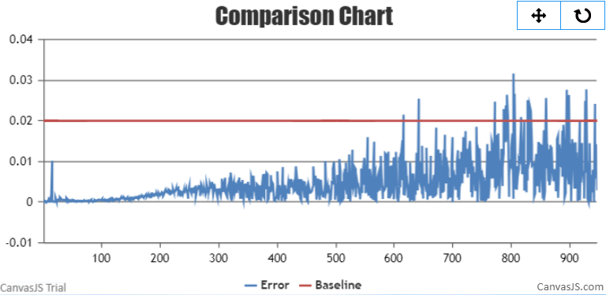

# LLaMA
<p align="left">
        <b><a href="https://gitee.com/ascend/AscendSpeed/blob/master/examples/llama2/README.md">简体中文</a></b> |
        <b>English</b> 
</p>

#  Contents

- [LLaMA2-7B](#contents)
  - [Training](#pre-training)
  - [Script](#script)
  - [Performance](#performance)
    - [Machine performance](#machine-performance)
    - [Accuracy of the loss](#accuracy-of-the-loss)
  - [Inference](#Inference-7B)
  - [Evaluation](#Evaluation-7B)

- [LLaMA2-13B](#contents)
  - [Training](#pre-training)
    - [Script](#script)
    - [Performance](#performance)
      - [Machine performance](#machine-performance)
      - [Accuracy of the loss](#accuracy-of-the-loss)
    - [Inference](#Inference)
    - [Evaluation](#Evaluation)

- [LLaMA2-70B](#contents)
  - [Training](#training-70b)
    - [Script](#script-70b)
    - [Performance](#performance-70b)
      - [Machine performance](#machine-performance-70b)
      - [Accuracy of the loss](#accuracy-of-the-loss-70b)
  - [Inference](#inference-70b)
  - [Evaluation](#Evaluation-70b)

# LLAMA2-7B

## Training

Here's a hardware summary of pre-training  LLAMA2-7B:

| Hardware |                      Value                      |
| :------: | :---------------------------------------------: |
|   NPU    |               8 x Ascend NPUs                   |

Here's a software summary of pre-training  LLAMA2-7B: 


|         Software          |   Version   |
| :-----------------------: |:-----------:|
|          Python           |   3.8.18    |
|          driver           | [package](https://support.huawei.com/enterprise/zh/ascend-computing/atlas-900-pod-a2-pid-254184911/software) |
|         firmware          | [package](https://support.huawei.com/enterprise/zh/ascend-computing/atlas-900-pod-a2-pid-254184911/software) |
|           CANN            |       [package](https://support.huawei.com/enterprise/zh/ascend-computing/cann-pid-251168373/software)       |
| binary arithmetic package |       [package](https://support.huawei.com/enterprise/zh/ascend-computing/cann-pid-251168373/software)       |
|           torch           |                                                    2.1.0                                                    |
|         torch_npu         |                             [package](https://gitee.com/ascend/pytorch/releases)                             |

### Script

1. Clone the repository to your local server:
    ```shell
    git clone https://gitee.com/ascend/AscendSpeed.git 
    cd AscendSpeed 
    mkdir logs
    mkdir ckpt
    ```

2. Build environment
   
    ```bash
    # python3.8
    conda create -n test python=3.8
    conda activate test
    
    # install torch and torch_npu
    pip install torch-2.1.0-cp38-cp38m-manylinux2014_aarch64.whl
    pip install torch_npu-2.1.0*-cp38-cp38m-linux_aarch64.whl
    pip install apex-0.1_ascend*-cp38-cp38m-linux_aarch64.whl
    
    # install megatron-core
    pip3 install --no-use-pep517 -e git+https://github.com/NVIDIA/Megatron-LM.git@23.05#egg=megatron-core
    
    # install deepspeed and deepspeed_npu
    pip install deepspeed==0.9.2
    git clone https://gitee.com/ascend/DeepSpeed.git -b v0.9.2 deepspeed_npu
    cd deepspeed_npu
    pip3 install -e ./
    cd ..
    
    # install other packages
    pip install -r requirements.txt 
    ```
     *Note that if you want to train with the weight from huggingface, please run fix a deepspeed loading checkpointing bug by modified `if zero_sd_list is None` as `if zero_sd_list is None or len(zero_sd_list) == 0` in the `_load_zero_checkpoint` function of `<deepspeed-installed-path>/runtime/engine.py`*
    
    ```text
    # original deepspeed/runtime/engine.py, about #Lines2746-2748
    zero_sd_list = self._get_all_zero_checkpoints(load_dir, tag)
    if zero_sd_list is None:
        return False
    
    # modified
    zero_sd_list = self._get_all_zero_checkpoints(load_dir, tag)
    if zero_sd_list is None or len(zero_sd_list) == 0:
        return False
    ```
3. Prepare pretrained weights and tokenizer
    Download the LLAMA2-7B checkpoint from [here](https://huggingface.co/daryl149/llama-2-7b-hf/tree/main) 
    
    ```shell
      #!/bin/bash
      mkdir -p llama-2-7b-hf
      cd llama-2-7b-hf
      wget https://huggingface.co/daryl149/llama-2-7b-hf/resolve/main/config.json
      wget https://huggingface.co/daryl149/llama-2-7b-hf/resolve/main/generation_config.json
      wget https://huggingface.co/daryl149/llama-2-7b-hf/resolve/main/pytorch_model-00001-of-00002.bin
      wget https://huggingface.co/daryl149/llama-2-7b-hf/resolve/main/pytorch_model-00002-of-00002.bin
      wget https://huggingface.co/daryl149/llama-2-7b-hf/resolve/main/pytorch_model.bin.index.json
      wget https://huggingface.co/daryl149/llama-2-7b-hf/resolve/main/special_tokens_map.json
      wget https://huggingface.co/daryl149/llama-2-7b-hf/resolve/main/tokenizer.json
      wget https://huggingface.co/daryl149/llama-2-7b-hf/resolve/main/tokenizer.model
      wget https://huggingface.co/daryl149/llama-2-7b-hf/resolve/main/tokenizer_config.json
      cd ..
    ```

   weight conversion in ptd mode
   *Note that if you want to use the weight from huggingface, please run the weight conversion script first. The following uses llama-2-7b model weight conversion in ptd as an example.*
   ```bash
    # modify the script according to your own ascend-toolkit path
    source /usr/local/Ascend/ascend-toolkit/set_env.sh
    
    # convert to ptd weights
    python tools/ckpt_convert/llama/convert_weights_from_huggingface.py --input-model-dir llama-2-7b-hf \
                                                                        --output-model-dir ./llama2-7b-tp8pp1 \
                                                                        --tensor-model-parallel-size 8 \
                                                                        --pipeline-model-parallel-size 1 \
                                                                        --type 7B \
                                                                        --merge-mlp
   ```
4. pre-training

	4.1 Prepare dataset

	Download the LLAMA2-7B datasets from [here](https://huggingface.co/datasets/tatsu-lab/alpaca/resolve/main/data/train-00000-of-00001-a09b74b3ef9c3b56.parquet)    
	```shell
	# download datasets
	mkdir dataset_llama2
	cd ./dataset_llama2
	wget https://huggingface.co/datasets/tatsu-lab/alpaca/resolve/main/data/train-00000-of-00001-a09b74b3ef9c3b56.parquet
	cd ..
	
	# process datasets                              
	python ./tools/preprocess_data.py \
		 --input ./dataset_llama2/train-00000-of-00001-a09b74b3ef9c3b56.parquet \
		 --tokenizer-name-or-path ./llama-2-7b-hf \
		 --output-prefix ./dataset_llama2/alpaca \
		 --workers 4 \
		 --log-interval 1000 \
		 --tokenizer-type PretrainedFromHF
	```

	4.2 pre-training using ptd mode
	Config LLAMA2-7B pre-training script: examples/llama2/pretrain_llama2_7b_ptd.sh 
   ```shell
    # modify the script according to your own ascend-toolkit path
    source /usr/local/Ascend/ascend-toolkit/set_env.sh 
    
    # modify config according to your own actual situation
    LOAD_CHECKPOINT_PATH="your init model load path"
    SAVE_CHECKPOINT_PATH="your model ckpt save path"
    TOKENIZER_PATH=./llama-2-7b-hf/  #tokenizer path
    DATA_PATH=./dataset_llama2/alpaca_text_document  #processed dataset
   ```

	Launch LLAMA2-7B  pre-training script: examples/llama2/pretrain_llama2_7b_ptd.sh
   
   ```shell
    bash examples/llama2/pretrain_llama2_7b_ptd.sh 
   ```
5. fine-tuning

	5.1 Prepare fine-tuning dataset 
	Download the LLAMA2-7B datasets from [here](https://huggingface.co/datasets/tatsu-lab/alpaca/resolve/main/data/train-00000-of-00001-a09b74b3ef9c3b56.parquet)    
    ```shell
	# download datasets
	mkdir finetune_dataset
	cd ./finetune_dataset
	wget https://huggingface.co/datasets/tatsu-lab/alpaca/resolve/main/data/train-00000-of-00001-a09b74b3ef9c3b56.parquet
	cd ..
	
	# process datasets                              
	python ./tools/preprocess_data.py \
		  --input ./dataset_llama2/train-00000-of-00001-a09b74b3ef9c3b56.parquet \
		  --tokenizer-name-or-path ./llama-2-7b-hf \
		  --output-prefix ./finetune_dataset/alpaca \
		  --workers 4 \
		  --log-interval 1000 \
		  --tokenizer-type PretrainedFromHF \
		  --handler-name GeneralInstructionHandler \
		  --append-eod
    ```
   5.2 Full Parameters Fine-Tuning
   The configuration script for full parameters fine-tuning  is basically the same as that for pretrain_llama2_7b_ptd.sh.*The difference is that the dataset and the training parameter is-instruction-dataset are added.*
   ```bash
   DATA_PATH=./finetune_dataset/alpaca
   
   --is-instruction-dataset \
   ```
   5.3 Lora Fine-Tuning
   The Lora fine-tuning script is configured by adding the following lora parameters to the pretrain_llama2_7b_ptd.sh script:
   ```bash
       --lora-target-modules query_key_value dense gate_proj up_proj down_proj \
       --lora-r 16 \
       --lora-alpha 32 \
   ```
   If the vocabulary is changed, add the following parameters:
   ```bash
     --lora-modules-to-save word_embeddings lm_head.lm_head \
   ```
   The following parameters are added to the resumable training capability of Lora:
   ```bash
       --load ${ORIGIN_CHECKPOINT}  \
       --lora-load ${LORA_CHECKPOINT} \
   ```

### Performance

#### Machine performance

The performance of LLaMA2-7B in **Ascend NPU** and **Reference**:

| Device | Model       | total Iterations | throughput rate (samples/s/p) | throughput rate (tokens/s/p) | single-step time (s/step) | floating point operation (TFLOPs/s) |
| :------: | :-----------: | :----------------: | :-----------------------------: | :----------------------------: | :-------------------------: | :-----------------------------------: |
| NPUs   | LLaMA2-7B | 1024             | 5.19                      | 2662                      | 3.08                   | 122.39                         |
| Reference   | LLaMA2-7B | 1024             | 5.63                      | 2884                       | 2.84                   | 131.96                         |


#### Accuracy of the loss

NPU vs Reference loss.

The NPU runs smoothly, the resource usage is stable, no errors are reported in the middle of the process, the Loss is on a decreasing trend, and the convergence speed is as expected. 
The precision meets the requirements.


The relative error ：0.23% < 2%


The absolute error: 0.00326<0.005


## Inference-7B
Config llama2-7B inference script: examples/llama2/generate_llama2_7b_ptd.sh
```bash
# modify the script according to your own ascend-toolkit path
source /usr/local/Ascend/ascend-toolkit/set_env.sh 
 
# modify script model path and tokenizer path
TOKENIZER_PATH=./llama2-7b-hf/  #tokenizer path
CHECKPOINT=./llama2-7b-tp8pp1  #model path
```
Launch llama2-7B inference script: examples/llama2/generate_llama2_7b_ptd.sh
```bash
bash examples/llama2/generate_llama2_7b_ptd.sh
```
Some inference samples are as follows:
```
===========================================================
1. If you want to quit, please entry one of [q, quit, exit]
2. To create new title, please entry one of [clear, new]
===========================================================

You >> how are you?

AscendSpeed:

I am doing well, thank you for asking! It's always nice to connect with someone new. How about you?</s>

You >> Give three tips for staying healthy.

AscendSpeed:


1. Eat a balanced diet that includes plenty of fruits, vegetables, whole grains, and lean proteins.
2. Exercise regularly, even if it's just a short walk or some light stretching.
3. Get plenty of sleep and aim for 7-8 hours of rest each night.</s>

You >> How can we reduce air pollution?

AscendSpeed:

Air pollution is a major environmental issue that can have serious health and economic consequences. To reduce air pollution, we need to take a multi-faceted approach that includes individual and collective action. Here are some ways to reduce air pollution:
1. Reduce the use of fossil fuels: Fossil fuels are a major source of air pollution, so reducing their use is an effective way to reduce air pollution. This can be done by switching to renewable energy sources such as solar, wind, and geothermal.
2. Use public transportation: Taking public transportation instead of driving can reduce air pollution. This is because public transportation produces fewer emissions than private vehicles.
3. Drive less: Reducing the number of trips taken by car can help reduce air pollution. This can be done by carpooling, biking, or walking when possible.
4. Plant trees: Planting trees can help reduce air pollution by absorbing carbon dioxide and other pollutants. Trees also provide shade and cool the air, which can reduce the need for air conditioning.
5. Use natural air fresheners: Instead

You >> Any more suggestions, please go ahead and list

AscendSpeed:
them.
6. Avoid burning wood or other materials: Burning wood or other materials releases harmful pollutants into the air. Avoid burning materials such as wood, coal, or other materials that release pollutants.
7. Improve indoor air quality: Poor indoor air quality can contribute to air pollution. Improve indoor air quality by using a HEPA air purifier, avoiding smoking and secondhand smoke, and using natural air fresheners.
8. Educate yourself and others: Educating yourself and others about air pollution and its effects can help reduce air pollution. Share information with friends, family, and colleagues about the importance of reducing air pollution.
9. Support government policies: Supporting government policies that promote clean energy and reduce air pollution can help reduce air pollution.
10. Participate in local clean-up initiatives: Participating in local clean-up initiatives can help reduce air pollution by removing pollutants from the environment.
11. Use eco-friendly cleaning products: Using eco-friendly cleaning products can help reduce air pollution. These products are designed to

You >>

```

## Evaluation-7B
We use MMLU benchmark to evaluate our model. Benchmark Download [here](https://huggingface.co/datasets/cais/mmlu). The evaluation script eval.sh is as follows:

```bash
source /usr/local/Ascend/ascend-toolkit/set_env.sh 

# modify script model path and tokenizer path
TOKENIZER_PATH=./llama2-7b-hf/  #tokenizer path
CHECKPOINT=./llama2-7b-tp8pp1  #model path
# configure task and data path
DATA_PATH="./mmlu/data/test/"
TASK="mmlu"

# distributed config
MASTER_ADDR=localhost
MASTER_PORT=6011
NNODES=1
NODE_RANK=0
NPUS_PER_NODE=8
DISTRIBUTED_ARGS="--nproc_per_node $NPUS_PER_NODE --nnodes $NNODES --node_rank $NODE_RANK --master_addr $MASTER_ADDR --master_port $MASTER_PORT"
# configure generation parameters 
python -m torch.distributed.launch $DISTRIBUTED_ARGS tasks/evaluation/evaluation.py   \
     --task-data-path $DATA_PATH \
     --task $TASK \
     --seq-length 4096 \
     --max-new-tokens 1 \
     --max-position-embeddings 4096 \
     --tensor-model-parallel-size 8 \
     --pipeline-model-parallel-size 1  \
     --num-layers 32  \
     --hidden-size 4096  \
     --ffn-hidden-size 11008 \
     --num-attention-heads 32  \
     --mlp-layer-fusion \
     --load ${CHECKPOINT}  \
     --position-embedding-type rope \
     --normalization RMSNorm \
     --tokenizer-type PretrainedFromHF  \
     --tokenizer-name-or-path ${TOKENIZER_PATH} \
     --tokenizer-not-use-fast \
     --fp16  \
     --micro-batch-size 1  \
     --seed 42 | tee logs/eval_mmlu.log
```
start evaluation
```bash
bash tasks/evaluation/eval.sh
```

Evaluation results
```text
                           subject_name  question_n   acc_ref   acc_npu  score_diff
17                     public_relations         110  0.563636  0.554545      0.009091
44                         econometrics         114  0.368421  0.377193      0.008772
30               electrical_engineering         145  0.503448  0.510345      0.006897
5                       world_religions         171  0.701754  0.707602      0.005848
25               high_school_us_history         204  0.647059  0.651961      0.004902
45                          human_aging         223  0.596413  0.600897      0.004484
38                            marketing         234  0.709402  0.713675      0.004274
55            high_school_world_history         237  0.620253  0.624473      0.004219
31           high_school_microeconomics         238  0.420168  0.424370      0.004202
7                             nutrition         306  0.503268  0.500000      0.003268
56                  high_school_biology         310  0.541935  0.545161      0.003226
20                           philosophy         311  0.569132  0.565916      0.003215
24               elementary_mathematics         378  0.291005  0.293651      0.002646
22               high_school_psychology         545  0.645872  0.647706      0.001835
12                     professional_law        1534  0.339635  0.340939      0.001304
13                        miscellaneous         783  0.679438  0.678161      0.001277
6                       moral_scenarios         895  0.221229  0.222346      0.001117
37  high_school_government_and_politics         193  0.694301  0.694301      0.000000
54                           prehistory         324  0.555556  0.555556      0.000000
53                    us_foreign_policy         100  0.700000  0.700000      0.000000
39                high_school_geography         198  0.626263  0.626263      0.000000
40                     security_studies         245  0.522449  0.522449      0.000000
41                high_school_chemistry         203  0.408867  0.408867      0.000000
52                   clinical_knowledge         265  0.513208  0.513208      0.000000
49              professional_psychology         612  0.482026  0.482026      0.000000
42                           management         103  0.679612  0.679612      0.000000
43                        jurisprudence         108  0.583333  0.583333      0.000000
51                    computer_security         100  0.560000  0.560000      0.000000
50                   conceptual_physics         235  0.417021  0.417021      0.000000
35                      human_sexuality         131  0.526718  0.526718      0.000000
46                             virology         166  0.439759  0.439759      0.000000
47                       moral_disputes         346  0.514451  0.514451      0.000000
48                              anatomy         135  0.459259  0.459259      0.000000
36                      college_physics         102  0.215686  0.215686      0.000000
0            high_school_macroeconomics         390  0.420513  0.420513      0.000000
34                  high_school_physics         151  0.311258  0.311258      0.000000
33             college_computer_science         100  0.420000  0.420000      0.000000
2                     international_law         121  0.636364  0.636364      0.000000
3                   college_mathematics         100  0.330000  0.330000      0.000000
4                      college_medicine         173  0.410405  0.410405      0.000000
8                high_school_statistics         216  0.314815  0.314815      0.000000
9                      medical_genetics         100  0.450000  0.450000      0.000000
10                    college_chemistry         100  0.290000  0.290000      0.000000
11              professional_accounting         282  0.411348  0.411348      0.000000
14                            sociology         201  0.601990  0.601990      0.000000
15                professional_medicine         272  0.452206  0.452206      0.000000
16                    logical_fallacies         163  0.521472  0.521472      0.000000
18                      college_biology         144  0.506944  0.506944      0.000000
19         high_school_european_history         165  0.575758  0.575758      0.000000
21                     abstract_algebra         100  0.280000  0.280000      0.000000
23         high_school_computer_science         100  0.430000  0.430000      0.000000
26                     machine_learning         112  0.375000  0.375000      0.000000
27                            astronomy         152  0.500000  0.500000      0.000000
1                          formal_logic         126  0.222222  0.222222      0.000000
29              high_school_mathematics         270  0.259259  0.259259      0.000000
32                      business_ethics         100  0.450000  0.450000      0.000000
28                         global_facts         100  0.380000  0.380000      0.000000
```
|  dataset | subject_num | question_num | reference_acc |NPU acc|
|:---:|:-----------:|:------------:|:-------------:|:---:|
| MMLU |     57      |    14042     |    0.4691     |0.4698|

# LLaMA2-13B

## Training

Here's a hardware summary of pre-training  LLaMA2-13B:

| Hardware |                      Value                      |
| :------: | :---------------------------------------------: |
|   NPU    |               8 x Ascend NPUs                   |

Here's a software summary of pre-training  LLaMA2-13B: 


|         Software          |                                                   Version                                                    |
| :-----------------------: |:------------------------------------------------------------------------------------------------------------:|
|          Python           |                                                    3.8.18                                                    |
|          driver           | [package](https://support.huawei.com/enterprise/zh/ascend-computing/atlas-900-pod-a2-pid-254184911/software) |
|         firmware          | [package](https://support.huawei.com/enterprise/zh/ascend-computing/atlas-900-pod-a2-pid-254184911/software) |
|           CANN            |       [package](https://support.huawei.com/enterprise/zh/ascend-computing/cann-pid-251168373/software)       |
| binary arithmetic package |       [package](https://support.huawei.com/enterprise/zh/ascend-computing/cann-pid-251168373/software)       |
|           torch           |                                                    2.1.0                                                     |
|         torch_npu         |                             [package](https://gitee.com/ascend/pytorch/releases)                             |

### Script

1. Clone the repository to your local server:
    ```shell
    git clone https://gitee.com/ascend/AscendSpeed.git 
    cd AscendSpeed 
    mkdir logs
    mkdir ckpt
    ```

2. Build environment
   
    ```bash
    # python3.8
    conda create -n test python=3.8
    conda activate test
    
    # 安装 torch 和 torch_npu
    pip install torch-2.1.0-cp38-cp38m-manylinux2014_aarch64.whl
    pip install torch_npu-2.1.0*-cp38-cp38m-linux_aarch64.whl
    pip install apex-0.1_ascend*-cp38-cp38m-linux_aarch64.whl
    
    # install megatron-core
    pip3 install --no-use-pep517 -e git+https://github.com/NVIDIA/Megatron-LM.git@23.05#egg=megatron-core
    
    # install deepspeed and deepspeed_npu
    pip install deepspeed==0.9.2
    git clone https://gitee.com/ascend/DeepSpeed.git -b v0.9.2 deepspeed_npu
    cd deepspeed_npu
    pip3 install -e ./
    cd ..
    
    # install other packages
    pip install -r requirements.txt 
    ```

3. Prepare pretrained weights and tokenizer
    Download the LLaMA2-13B checkpoint from [here](https://huggingface.co/NousResearch/Llama-2-13b-hf/tree/main) 
    
    ```bash
    git lfs install
    git clone https://huggingface.co/NousResearch/Llama-2-13b-hf
    ```
    
   *Note that if you want to use the weight from huggingface, please run the weight conversion script first. The following uses llama-2-13b model  weight conversion as an example.*
    ```bash
    # modify the script according to your own ascend-toolkit path
    source /usr/local/Ascend/ascend-toolkit/set_env.sh
    
    # convert to deepspeed weights
    python tools/ckpt_convert/llama/convert_weights_from_huggingface.py --input-model-dir ./llama-2-13b-hf \
                                                                        --output-model-dir ./llama-2-13b_tp8_pp1 \
                                                                        --tensor-model-parallel-size 8 \
                                                                        --pipeline-model-parallel-size 1 \
                                                                        --type 13B \
    ```

4. Prepare dataset
   
    Download the LLaMA2-13B datasets from [here](https://huggingface.co/datasets/tatsu-lab/alpaca/resolve/main/data/train-00000-of-00001-a09b74b3ef9c3b56.parquet) 
        
    ```bash
    # dataset：wget https://huggingface.co/datasets/tatsu-lab/alpaca/resolve/main/data/train-00000-of-00001-a09b74b3ef9c3b56.parquet
    
    cd WORKSPACE
    mkdir alpaca_preprocessed
    python tools/preprocess_data.py --input WORKSPACE/alpaca/train-00000-of-00001-a09b74b3ef9c3b56.parquet \
                                    --output-prefix WORKSPACE/alpaca_preprocessed/alpaca \
                                    --tokenizer-type PretrainedFromHF \
                                    --tokenizer-name-or-path WORKSPACE/llama-13b-hf \
                                    --tokenizer-not-use-fast \
                                    --handler-name GeneralInstructionHandler
    ```

5. Config LLaMA2-13B pre-training script: examples/llama2/pretrain_llama2_13B_ptd_8p.sh
   
    ```shell
    # modify the script according to your own ascend-toolkit path
    source /usr/local/Ascend/ascend-toolkit/set_env.sh 
    
    # modify script orign dataset path according to your own dataset path
    TOKENIZER_PATH=./llama-2-13b-hf/  #tokenizer path
    DATA_PATH=WORKSPACE/alpaca_preprocessed/alpaca   #processed dataset
    LOAD_CHECKPOINT=./llama-2-13b_tp8_pp1/
    ```

6. Launch LLaMA2-13B  pre-training script: examples/llama2/pretrain_llama2_13B_ptd_8p.sh
   
    ```shell
    bash examples/llama2/pretrain_llama2_13B_ptd_8p.sh
    ```

### Performance

#### Machine performance

The performance of LLaMA2-13B in **Ascend NPU** and **Reference**:

| Device |   Model    | total Iterations | throughput rate (samples/s/p) | throughput rate (tokens/s/p) | single-step time (s/step) | floating point operation (TFLOPs/s) |
| :------: |:----------:|:----------------:|:-----------------------------:|:----------------------------:|:-------------------------:|:-----------------------------------:|
| NPUs   | LLaMA2-13B |       5000       |             2.736             |           1400.832           |           93.45           |               120.69                |
| Reference   | LLaMA2-13B |        --        |              --               |             1750             |            --             |                 --                  |


#### Accuracy of the loss

NPU vs Reference loss.

The NPU runs smoothly, the resource usage is stable, no errors are reported in the middle of the process, the Loss is on a decreasing trend, and the convergence speed is as expected. 
The precision meets the requirements.The absolute error of the average loss is 0.0011, less than 0.5%. 


## Inference

We support AscendSpeed Inference for text generation with Llama2 13B.
Inference different from pre-training, such as we need to Load pre-training checkpoint and the length of the output samples:

Config Llama2-13B inference script: examples/llama2/generate_llama2_13B_tp8_pp1.sh

```shell
# modify the model weight path and tokenizer path
CHECKPOINT=./llama2-13b-tp8-pp1/
VOCAB_FILE=./llama2-13b-hf/
```

```shell
bash ./examples/llama2/generate_llama2_13B_tp8_pp1.sh
```
Some inference samples are as follows:


## Evaluation

We use boolq benchmark to evaluate our model. Benchmark Download [here](https://huggingface.co/datasets/boolq).

```shell
    CHECKPOINT=./llama2-13b-tp8-pp1/
    VOCAB_FILE=./llama2-13b-hf/
    # configure task and data path
    DATA_PATH="./boolq/data/test/"
    TASK="boolq"
    # configure generation parameters 
    python -m torch.distributed.launch $DISTRIBUTED_ARGS evaluation.py   \
           --task-data-path $DATA_PATH \
           --task $TASK\
           --seq-length 4096 \
           --max-new-tokens 32 \
           --max-position-embeddings 4096 \
           --tensor-model-parallel-size 8  \
           --pipeline-model-parallel-size 1  \
           --num-layers 40  \
           --hidden-size 5120  \
           --ffn-hidden-size 13824 \
           --load ${CHECKPOINT}  \
           --num-attention-heads 40 \
           --tokenizer-type PretrainedFromHF  \
           --tokenizer-name-or-path $VOCAB_FILE \
           --tokenizer-not-use-fast \
           --fp16  \
           --micro-batch-size 1  \
           --seed 42 | tee logs/train.log
```
<table>
  <thead>
    <tr>
      <th>Task</th>
      <th>Subset</th>
      <th>Model</th>
      <th>NPU</th>
      <th>OpenSource</th>
    </tr>
  </thead>
  <tbody>
    <tr>
      <td><a href="https://huggingface.co/datasets/boolq">Boolq</a></td>
      <td>Test</td>
      <th>Llama2 13B</th>
      <td>0.824</td>
      <td><a href="https://opencompass.org.cn/dataset-detail/BoolQ">0.824</a></td>
    </tr>
  </tbody>
</table>

# LLaMA2-70B

## Training-70B

Here's a hardware summary of pre-training  LLaMA2-70B:

| Hardware |      Value       |
| :------: |:----------------:|
|   NPU    | 64 x Ascend NPUs |

Here's a software summary of pre-training  LLaMA2-70B: 


|         Software          |                 Version                 |                                                                                      link                                                                                       |
|:-------------------------:|:---------------------------------------:|:-------------------------------------------------------------------------------------------------------------------------------------------------------------------------------:|
|          Python           |                  3.8.0                  |                                                                                        -                                                                                        |
|          driver           |              23.0.RC3.B050              | [link](https://support.huawei.com/enterprise/zh/ascend-computing/ascend-hdk-pid-252764743/software/261159045?idAbsPath=fixnode01%7C23710424%7C251366513%7C22892968%7C252764743) |
|         firmware          |              7.0.t8.0.b214              | [link](https://support.huawei.com/enterprise/zh/ascend-computing/ascend-hdk-pid-252764743/software/261159045?idAbsPath=fixnode01%7C23710424%7C251366513%7C22892968%7C252764743) |
|           CANN            |   Ascend-cann-toolkit-7.0.0.T26-linux   |                                                [link](https://support.huawei.com/enterprise/zh/software/261305471-ESW2000887514)                                                |
| binary arithmetic package | Ascend-cann-kernels-XXX_7.0.0.T26_linux |                                                [link](https://support.huawei.com/enterprise/zh/software/261305471-ESW2000887523)                                                |
|           torch           |                  2.0.1                  |                                                   [link](https://gitee.com/ascend/pytorch/releases/tag/v5.0.rc3-pytorch2.0.1)                                                   |
|         torch_npu         |          2.0.1.post4-20231010           |                          [link](https://gitee.com/ascend/pytorch/releases/download/v5.0.rc3-pytorch2.0.1/torch_npu-2.0.1-cp38-cp38-linux_aarch64.whl)                           |
|           apex            |                   0.1                   |                                                                                        -                                                                                        |


### Script-70B

1. Clone the repository to your local server:
    ```shell
    git clone https://gitee.com/ascend/AscendSpeed.git 
    cd AscendSpeed 
    mkdir logs
    mkdir ckpt
    ```

2. Build environment
    
    ```bash
    # python3.8
    conda create -n test python=3.8
    conda activate test
    
    # install torch and torch_npu
    pip install torch-2.0.1-cp38-cp38m-manylinux2014_aarch64.whl
    pip install torch_npu-2.0.1-cp38-cp38m-linux_aarch64.whl
    pip install apex-0.1_ascend*-cp38-cp38m-linux_aarch64.whl
    
    # install megatron-core
    pip3 install --no-use-pep517 -e git+https://github.com/NVIDIA/Megatron-LM.git@23.05#egg=megatron-core
    
    # install deepspeed and deepspeed_npu
    pip install deepspeed==0.9.2
    git clone https://gitee.com/ascend/DeepSpeed.git -b v0.9.2 deepspeed_npu
    cd deepspeed_npu
    pip3 install -e ./
    cd ..
    
    # install other packages
    pip install -r requirements.txt 
    ```

3. Prepare pretrained weights and tokenizer
    Download the LLaMA2-70B checkpoint from [here](https://huggingface.co/meta-llama/Llama-2-70b-hf)

    ```shell
      #!/bin/bash
      mkdir -p llama2-70b-hf
      cd llama2-70b-hf
      wget https://huggingface.co/meta-llama/Llama-2-70b-hf/blob/main/config.json
      wget https://huggingface.co/meta-llama/Llama-2-70b-hf/blob/main/generation_config.json
      wget https://huggingface.co/meta-llama/Llama-2-70b-hf/blob/main/pytorch_model-00001-of-00015.bin
      wget https://huggingface.co/meta-llama/Llama-2-70b-hf/blob/main/pytorch_model-00002-of-00015.bin
      wget https://huggingface.co/meta-llama/Llama-2-70b-hf/blob/main/pytorch_model-00003-of-00015.bin
      wget https://huggingface.co/meta-llama/Llama-2-70b-hf/blob/main/pytorch_model-00004-of-00015.bin
      wget https://huggingface.co/meta-llama/Llama-2-70b-hf/blob/main/pytorch_model-00005-of-00015.bin
      wget https://huggingface.co/meta-llama/Llama-2-70b-hf/blob/main/pytorch_model-00006-of-00015.bin
      wget https://huggingface.co/meta-llama/Llama-2-70b-hf/blob/main/pytorch_model-00007-of-00015.bin   
      wget https://huggingface.co/meta-llama/Llama-2-70b-hf/blob/main/pytorch_model-00008-of-00015.bin
      wget https://huggingface.co/meta-llama/Llama-2-70b-hf/blob/main/pytorch_model-00009-of-00015.bin
      wget https://huggingface.co/meta-llama/Llama-2-70b-hf/blob/main/pytorch_model-00010-of-00015.bin
      wget https://huggingface.co/meta-llama/Llama-2-70b-hf/blob/main/pytorch_model-00011-of-00015.bin
      wget https://huggingface.co/meta-llama/Llama-2-70b-hf/blob/main/pytorch_model-00012-of-00015.bin   
      wget https://huggingface.co/meta-llama/Llama-2-70b-hf/blob/main/pytorch_model-00013-of-00015.bin
      wget https://huggingface.co/meta-llama/Llama-2-70b-hf/blob/main/pytorch_model-00014-of-00015.bin
      wget https://huggingface.co/meta-llama/Llama-2-70b-hf/blob/main/pytorch_model-00015-of-00015.bin   
      wget https://huggingface.co/meta-llama/Llama-2-70b-hf/blob/main/pytorch_model.bin.index.json
      wget https://huggingface.co/meta-llama/Llama-2-70b-hf/blob/main/special_tokens_map.json
      wget https://huggingface.co/meta-llama/Llama-2-70b-hf/blob/main/tokenizer.json
      wget https://huggingface.co/meta-llama/Llama-2-70b-hf/blob/main/tokenizer.model
      wget https://huggingface.co/meta-llama/Llama-2-70b-hf/blob/main/tokenizer_config.json
      cd ..
    ```

   *Note that if you want to use the weight from huggingface, please run the weight conversion script first. The following uses llama-2-70b model  weight conversion in deepspeed as an example.*
    ```bash
    # modify the script according to your own ascend-toolkit path
    source /usr/local/Ascend/ascend-toolkit/set_env.sh
    
    # convert to deepspeed weights
    SCRIPT_PATH=./tools/ckpt_convert/llama/convert_weights_from_huggingface.py
    python $SCRIPT_PATH \
      --input-model-dir ./llama2-70b-hf/ \
      --output-model-dir ./load_ckpt \
      --tensor-model-parallel-size 8 \
      --pipeline-model-parallel-size 8 \
      --make-vocab-size-divisible-by 8 \
      --merge-mlp \
      --type llama2-70B \
      --num_heads 64 \
      --num_kv_heads 8 \
      --hidden_size 8192 \
      --num_layers 80                                                                   
    ```

4. Prepare dataset

    There are two dataset examples: Alpaca and Moss. 

    1. Alpaca Dataset
        
       Download the Alpaca datasets from [here](https://huggingface.co/datasets/tatsu-lab/alpaca/resolve/main/data/train-00000-of-00001-a09b74b3ef9c3b56.parquet)
    ```shell
      # download datasets
      mkdir dataset_llama2
      cd ./dataset_llama2
      wget https://huggingface.co/datasets/tatsu-lab/alpaca/resolve/main/data/train-00000-of-00001-a09b74b3ef9c3b56.parquet
      cd ..
    
      # process datasets                              
      python ./tools/preprocess_data.py \
        --input ./dataset_llama2/train-00000-of-00001-a09b74b3ef9c3b56.parquet \
        --tokenizer-name-or-path ./llama-2-70b-hf \
        --output-prefix ./dataset_llama2/alpaca \
        --workers 4 \
        --log-interval 1000 \
        --tokenizer-type PretrainedFromHF
   ```
   
    2. Moss Dataset

       Download the Moss datasets from [here](https://huggingface.co/datasets/fnlp/moss-003-sft-data/tree/main) 
        
    ```shell
      # download datasets
      mkdir dataset_llama2
      cd ./dataset_llama2
      wget https://huggingface.co/datasets/fnlp/moss-003-sft-data/resolve/main/moss-003-sft-no-tools.jsonl.zip --no-check-certificate
      unzip moss-003-sft-no-tools.jsonl.zip
      cd ..
    
      # process datasets                              
      python tools/preprocess_data.py \
        --input ./dataset_llama2/moss-003-sft-no-tools.jsonl \
        --output-prefix ./dataset_llama2/moss \
        --tokenizer-type PretrainedFromHF \
        --tokenizer-name-or-path ./llama2-70b-hf \
        --tokenizer-not-use-fast \
        --handler-name MOSSInstructionHandler
    ```
   
5. Config LLaMA2-70B pre-training script: examples/llama2/pretrain_llama2_70B_ptd.sh
   ```shell
    # modify the script according to your own ascend-toolkit path
    source /usr/local/Ascend/ascend-toolkit/set_env.sh 
    
    # modify script orign dataset path according to your own dataset path
    TOKENIZER_PATH=./llama2-70b-hf/  #tokenizer path
    DATA_PATH=./dataset_llama2/alpaca_text_document  #processed dataset
    ```      
    
6. Launch LLaMA2-70B pre-training script: examples/llama2/pretrain_llama2_70B_ptd.sh
    
    ```shell
    bash examples/llama2/pretrain_llama2_70B_ptd.sh
    ```
   
### Performance-70B

#### Machine performance-70B

The performance of LLaMA2-70B in **Ascend NPU** and **Reference**

|  Device   |   Model    | total Iterations | throughput rate (samples/s/p) | throughput rate (tokens/s/p) | single-step time (s/step) | floating point operation (TFLOPs/s) |
|:---------:|:----------:|:----------------:|:-----------------------------:|:----------------------------:|:-------------------------:|:-----------------------------------:|
|   NPUs    | LLaMA2-70B |       1000       |             5.46              |             350              |            193            |                  -                  |
| Reference | LLaMA2-70B |       1000       |             5.29              |             339              |            214            |                  -                  |


#### Accuracy of the loss-70B


NPU vs Reference loss.

The NPU runs smoothly, the resource usage is stable, no errors are reported in the middle of the process, the Loss is on a decreasing trend, and the convergence speed is as expected. 
The precision meets the requirements.


The relative error of the average loss is less than 2%.



The maximum absolute error is 0.089. 


## Inference-70B


The model weights of 64 NPUs can be converted to 8 NPUs with the follow shell.

```shell
SCRIPT_PATH=./tools/ckpt_convert/llama/convert_weights_when_tp_pp_change.py
python $SCRIPT_PATH \
  --input-model-dir ./load_ckpt/release \
  --output-model-dir ./ptd_80lt8p1/ \
  --orig-vocab-size 32000 \
  --make-vocab-size-divisible-by 8 \
  --src-tensor-model-parallel-size 8 \
  --src-pipeline-model-parallel-size 8 \
  --tgt-tensor-model-parallel-size 8 \
  --tgt-pipeline-model-parallel-size 1 \
  --merge-mlp \
  --type 70B \
  --num_heads 64 \
  --num_kv_heads 8 \
  --hidden_size 8192 \
  --num_layers 80
```

Llama2-70B model could generate with 8 NPUs, for example:

```shell
    source /usr/local/Ascend/ascend-toolkit/set_env.sh 
    MASTER_ADDR=localhost
    MASTER_PORT=6001
    NNODES=1
    NODE_RANK=0
    NPUS_PER_NODE=8
    
    DISTRIBUTED_ARGS="--nproc_per_node $NPUS_PER_NODE \
                      --nnodes $NNODES \
                      --node_rank $NODE_RANK \
                      --master_addr $MASTER_ADDR \
                      --master_port $MASTER_PORT"

    CHECKPOINT=./ptd_80lt8p1/
    VOCAB_FILE=./llama2-70b-hf/
    python -m torch.distributed.launch $DISTRIBUTED_ARGS ./tasks/inference/inference_llama.py \
           --no-contiguous-buffers-in-local-ddp \
           --tensor-model-parallel-size 8  \
           --pipeline-model-parallel-size 1  \
           --num-layers 80  \
           --hidden-size 8192  \
           --ffn-hidden-size 28672 \
           --load "${CHECKPOINT}"  \
           --num-attention-heads 64 \
           --position-embedding-type rope \
           --group-query-attention \
           --num-query-groups 8 \
           --max-position-embeddings 4096 \
           --mlp-layer-fusion \
           --pad-vocab-size-to 32000 \
           --tokenizer-type PretrainedFromHF  \
           --tokenizer-name-or-path "$VOCAB_FILE" \
           --tokenizer-not-use-fast \
           --fp16 \
           --micro-batch-size 1 \
           --seq-length 4096 \
           --max-new-tokens 64 \
           --seed 42
```

Some inference samples are as follows:
```
=============== Greedy Search ================

You:
how are you?

AscendSpeed:
I hope you are fine. I am fine too.
I am writing to you because I want to tell you about my holidays.
I went to the seaside with my family. We stayed in a hotel.
We went to the beach every day. I played with my my my my my my my my my..
.
. . 0. .... my I was't' I
==============================================

Elapsed: 60.25s

================ Do Sample =================

You:
how are you?

AscendSpeed:
long time, no hear.
I know! It has been far too long... I'm doing alright though, and yourself?
I've been doing pretty well!
Do you live in the US?
No, actually I'm in Australia... I think it would be fairly difficult to make it there.
Subject: I think.
 there? the time for subject...... Sub subject - subject the
============================================

Elapsed: 34.13s

=============== Beam Search =================

You:
how are you?

AscendSpeed:
I hope you are fine. I am fine too.
I am writing to you because I want to tell you about my holidays.
I went to the seaside with my family. We stayed in a hotel near the beach.
We went to the beach every day. We We We We We
=============================================

Elapsed: 46.29s

======== Beam Search with sampling ==========

You:
how are you?

AscendSpeed:
I hope you are fine.
I would like to tell you that I have a problem with my account.
I have a problem with my account.
I have a problem with my account. I can't log in.
I have a problem with my account. I can't log in.

=============================================

Elapsed: 48.53s
```

## Evaluation-70B

We use MMLU benchmark to evaluate our model. Benchmark Download [here](https://huggingface.co/datasets/cais/mmlu).

```shell
    CHECKPOINT=./ptd_80lt8p1/
    VOCAB_FILE=./llama2-70b-hf/
    # configure task and data path
    DATA_PATH="./mmlu/data/test/"
    TASK="mmlu"
    # configure generation parameters 
    python -m torch.distributed.launch $DISTRIBUTED_ARGS evaluation.py   \
           --task-data-path $DATA_PATH \
           --task $TASK\
           --seq-length 2048 \
           --max-new-tokens 32 \
           --max-position-embeddings 2048 \
           --tensor-model-parallel-size 8  \
           --pipeline-model-parallel-size 1  \
           --num-layers 80  \
           --hidden-size 8192  \
           --ffn-hidden-size 28672 \
           --load ${CHECKPOINT}  \
           --num-attention-heads 64 \
           --position-embedding-type rope \
           --group-query-attention \
           --num-query-groups 8 \
           --tokenizer-type PretrainedFromHF  \
           --tokenizer-name-or-path $VOCAB_FILE \
           --tokenizer-not-use-fast \
           --fp16  \
           --micro-batch-size 1  \
           --seed 42 | tee logs/train.log
    # start evaluation
    bash tasks/evaluation/eval.sh
```